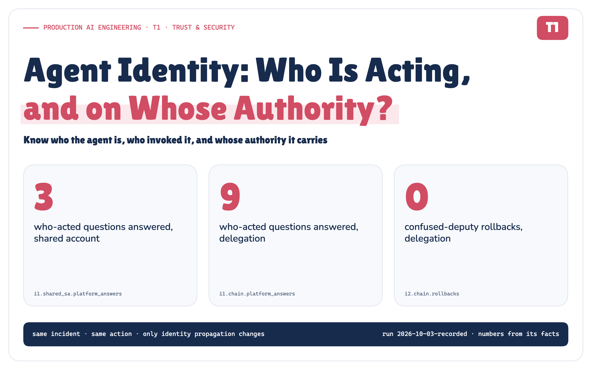

# Agent Identity: Who Is Acting, and on Whose Authority?

*Headless AI took the human out of the foreground. Before an agent can be trusted to act, the platform has to know who the agent is, who invoked it, whose authority it carries, and which identity finally reaches the tool.*

**Production AI Engineering · T1 · Trust & Security**

*Chapter 6 of 15. New here? Start with [Start Here: What It Takes to Run AI Agents in Production](https://eresh-gorantla.medium.com/start-here-a-hands-on-map-of-production-ai-engineering-5056549657db).*



## 14:09. Kubernetes receives the rollback

At 14:02 a Datadog monitor fires: **payment-service error rate 14%, against a 1% SLO**. Release `v4.18.0` shipped thirteen minutes earlier. Nobody has typed anything.

A headless runtime accepts the event, starts the incident agent, gathers evidence, opens an incident in Jira and posts a summary to Slack. Then it proposes the one change that matters:

```text
rollbackDeployment(service=payment-service, environment=production, to_version=v4.17.2)
```

At 14:09 the Kubernetes API server receives the rollback. **Who made that request?**


*Figure 1. Six plausible answers. Each is partly right; only the service account reaches the tool's own log.* · Architecture: concept figure; no measured values

- **Datadog** triggered the investigation.
- **The headless runtime** opened the connection.
- **The incident agent** chose the rollback: a model picked it among the actions available.
- **A Kubernetes service account** authenticated the request. It is the only name in the API server's audit log.
- **The on-call engineer** is accountable for payment-service tonight.
- **The incident commander** approved this exact call.

In most agent platforms today, the audit log settles the question in the least useful way possible:

```text
user.username: system:serviceaccount:platform:ai-automation
verb: patch   objectRef: deployments/payment-service   namespace: payments
```

Six parties contributed. The log records one of them, the one with the least to say about why it happened.

> **The identity behind an agent action is not a single principal. It is a chain, and the platform has to build it, carry it and record it.**

> Before an agent can be trusted to act, the platform must know who the agent is, who or what invoked it, whose authority it carries, what was delegated, which runtime executed it, which identity reached the tool, and how the action can be traced end to end.

## Headless moved the human out of the foreground

**Headless AI** let events, services, workflows and other agents invoke the same intelligence as a chat window. It ended on the question this note answers: once anything can invoke the agent, who is acting?

In a chat assistant, identity looks simple: Maya signs in, the session knows who she is, and every action has an obvious author. Headless AI changed the execution model:

```text
Human · Service · Event · Workflow · Agent
                    ↓
            Headless AI Runtime
                    ↓
            Enterprise Action
```


*Figure 2. In chat, identity comes with the session. In a headless runtime, each execution has to construct its own.* · Architecture: concept figure; no measured values

Three things break the idea that identity comes with the session:

- **The invoker may not be a person.** A monitor started this investigation. `on_behalf_of: none` is a fact to record, not a gap to fill with the on-call engineer's name.
- **Time separates invocation from action.** The event arrived at 14:02; the rollback ran after an approval pause. In real incidents that pause lasts hours.
- **Chains get deeper.** A release-guard agent asks the incident agent for an assessment; a workflow resumes a run for someone who asked yesterday. Every hop is a place where authority can silently widen.

In chat, identity was ambient. In a headless runtime it has to be **carried**, and anything carried can be dropped, swapped or inflated.

## Five words that are not synonyms

```text
Authentication  ≠  Identity  ≠  Delegation  ≠  Authorization  ≠  Approval
```


*Figure 3. Five questions, five owners. This note covers the first three.* · Architecture: concept figure; no measured values

With a human in the loop, one run touches all five. Maya signs in to the web console (**authentication**). The runtime records invoker `svc.web-portal`, subject `sre.maya`, and the agent as `agent.incident-intel@1.3.0`, its own identity, not Maya's (**identity**). Maya lends part of her authority, but she cannot lend a production rollback because she does not hold it (**delegation**). Policy allows the ticket update and holds the rollback (**authorization**). The incident commander approves that exact call, producing a one-call approval that policy then evaluates when it authorizes the rollback (**approval**).

Conflate any two and a known failure follows. Treat *delegation* as *identity* and you get impersonation: "the agent is Maya", and the audit trail can no longer tell her decisions from the agent's. Treat *invocation* as *authorization* and an alert becomes a licence to change production.

## One action, five identities

A single agent action involves up to five identities. Production systems have to model them separately, because they change separately.


*Figure 4. One action, five identities. Each changes on its own schedule; Kubernetes authenticates only the edge credential.* · Architecture + implemented: production shapes and the POC's identifiers; no measured values

- **Human identity** is the only one most teams model, and in a headless runtime it is often absent. When present, it is the identity provider's `(iss, sub)` pair, not an email address. Record `none` when there is no human.
- **Service and event identity** are two facts: the *sender* (the integration's authenticated webhook) and the *provenance* (which monitor, which event id). Whoever can edit that monitor's threshold is an invoker nobody sees.
- **Agent identity** is logical: name, version, owner and a ceiling on what the agent may ever hold. Versions matter, because a new prompt or model changes behaviour without a code change.
- **Runtime identity** is physical: which attested workload held the execution. One runtime hosts many agents; one agent runs on many runtimes.
- **The tool credential** is what the tool authenticates. In this architecture the tool authenticates the edge credential; richer provenance is retained by the platform, and may also be carried as claims where the resource understands them.

## Credentials are evidence, not the identity model


*Figure 5. A credential proves an identity. It is not the identity model.* · Architecture: concept figure; no measured values

> **Identity is the model. Credentials are its evidence. Never let the evidence become the model.**

## Four trust boundaries: where identity can disappear


*Figure 6. Four places identity crosses a boundary, and the rule that keeps it intact at each.* · Architecture: the four trust boundaries and the rule at each; no measured values

**User → agent: as the user, or for the user?** OAuth 2.0 Token Exchange ([RFC 8693](https://www.rfc-editor.org/rfc/rfc8693.html)) supports both impersonation and delegation, and can represent both the subject and the actor. When an agent acts for a user and you need the agent to remain attributable, prefer delegation over impersonation. The agent's authority is then an *intersection*: what Maya may delegate, what the head she came through may pass on, and what the agent may ever hold. In the POC, `deploy:rollback` never travels in a token at all.

**Event → agent: what authority does an event lend?** An event proves provenance and may trigger a workflow; it should not be treated as implicit authorization for a higher-impact action. Explicit policy must make that decision.

**Agent → agent: does authority grow at each hop?** Our production invariant is that delegated authority may only shrink at each hop. Carry the original subject through every hop, and narrow at each exchange. RFC 8693 says downstream access control considers only the current actor, with earlier actors informational only, so the narrowing has to happen when each token is issued, not at the tool.

**Agent → tool: what reaches the tool?** Not a shared account (attribution lost), and not the user's token passed through (the agent disappears, event-triggered runs have no user, and the [MCP authorization spec](https://modelcontextprotocol.io/specification/2026-07-28/basic/authorization) forbids servers from accepting tokens not issued for them). The production answer is a credential **minted per capability class**, bound to one audience, valid for minutes, and never shown to the agent. Kubernetes provides parts of this pattern: service-account tokens bound to an audience and an expiry, with requests under ten minutes rejected. Kubernetes provides short-lived, audience-scoped service-account credentials and workload-bound claims; capability separation remains a platform design choice, made with distinct service accounts and RBAC, or a credential broker.

## I built three identity models and ran the same rollback

I extended F3's POC with the identity chain and ran the same rollback under three identity models:

- **A · one shared service account.** Every agent executes as `system:serviceaccount:platform:ai-automation`.
- **B · a user token.** The agent is handed Maya's token and acts as her (impersonation).
- **C · the delegation chain.** Subject and actor chain carried separately, scopes intersected at every hop, an execution token bound to the attested runtime, one narrow credential minted per capability class, every hop recorded.


*Figure 7. One rollback, three identity models. Everything else is held constant.* · Implemented: the POC's components and the held-constant fixture; experiment list from the run · run 2026-10-03-recorded

It is a controlled comparison. Same incident, same agent, same action, same policy, same approver, same tools: only identity propagation changed. Before the final recorded run, every check was declared in a frozen file: the 30 experiment checks and 11 global assertions such as "delegation never widens authority" and "a replayed credential causes no privileged side effect". The identity code is real; the directory, workload attestation, Kubernetes, Jira and Slack are simulated and deterministic.

Attribution is scored against nine questions an incident review has to answer about the rollback. A question counts only when the record states the true value:

- **A1** · Which logical agent acted?
- **A2** · Who or what invoked it?
- **A3** · On whose behalf did it act?
- **A4** · With what delegated authority?
- **A5** · On which runtime workload?
- **A6** · Which edge credential reached the tool?
- **A7** · What exact action, on which resource?
- **A8** · Who approved it?
- **A9** · Can each part be revoked independently?


*Figure 8. The POC in numbers. Every value is read from the recorded run.* · Measured: I1–I7 headline results · run 2026-10-03-recorded

## Experiment 01 · Can the record say who acted?


*Figure 9. Same action. Same tool. Different identity architecture.* · Measured: I1, attribution under three identity models · run 2026-10-03-recorded

The nine questions, answered from each record:

- **A · Shared account** · Platform record: 3 / 9 · Tool's own log: 2 / 9 · Kubernetes saw: `system:serviceaccount:platform:ai-automation`
- **B · User token** · Platform record: 4 / 9 · Tool's own log: 3 / 9 · Kubernetes saw: `maya@company.com`
- **C · Delegation chain** · Platform record: 9 / 9 · Tool's own log: 2 / 9 · Kubernetes saw: `system:serviceaccount:payments:incident-remediator`

The tool's log never answers more than the identity it was shown. Kubernetes' audit proves the edge principal performed the operation; it cannot reconstruct the invoker, the logical agent or the delegated authority unless those facts are carried and understood. Only the platform record changes with the architecture. (Under the user token, Kubernetes recorded Maya's email as `user.username`, because the simulated cluster reads the email claim. That is display metadata, not her stable `(iss, sub)` identity.)

## Experiment 02 · The confused deputy


*Figure 10. A read-only agent borrows a rollback: the weak models lose the originator; the delegation chain carries it and denies.* · Measured: I2, the confused deputy · run 2026-10-03-recorded

Release-guard, a read-only agent, asks incident-intel to roll back production. Under the shared account and the user token, policy did its job and asked a human; the approver saw `agent.incident-intel` asking, approved, and the rollback ran. The real originator never appeared in the record. Under the delegation chain, release-guard's read-only authority survived the hop and the decision was **DENY** before any approval was requested. Rollbacks: 0.

> **Approval cannot compensate for a missing identity.**

## Anti-pattern: one shared service account


*Figure 11. A shared service account doesn't give your agents an identity. It gives all of them the same alibi.* · Architecture: concept figure; the permission list is illustrative

It starts as a sensible shortcut and ends like this:

1. **Attribution is lost.** Three agents took 5 actions; Kubernetes saw 1 principal, and the platform's record could attribute none of the three agents.
2. **Agents become indistinguishable.** The read-only agent holds the rollback agent's authority. That is [excessive agency](https://genai.owasp.org/llmrisk/llm062025-excessive-agency/) by construction.
3. **Privilege accumulates.** Derived from the POC's configuration: the shared account ends up with 20 permissions, 14 of them more than the platform needs, many granted for agents long since retired.
4. **Revocation is all or nothing.** Rotating it stopped 5 of 5 running executions, including the one resolving the incident.
5. **Audit stops at the edge.** Kubernetes' audit log proves the edge principal acted; it cannot attribute the action to the initiating agent or invoker, because nothing carried them.

Handing the agent Maya's token is not the fix. Kubernetes then saw `maya@company.com`, the agent's rollback was indistinguishable from Maya's own manual one, 13 identity fields vanished from the record, and every call ran with Maya's full permissions: 5 Kubernetes permissions behind the rollback against 3 for the chain.

## The better pattern: carry the chain, mint the credential

**Production identity invariants**

```text
Actor ≠ Subject
Agent ≠ Runtime
Identity ≠ Credential
Invocation ≠ Authorization
Approval ≠ Authorization
Delegated authority never widens
A pause requires re-evaluation
Tools never receive ambient platform credentials
```


*Figure 12. Establish identity once, narrow it at every hop, and turn it into a credential only at the edge.* · Architecture + implemented: the stages of the POC; no measured values

1. **Register every agent as a principal**, with a version, an owner and a ceiling.
2. **Authenticate every head at ingress**, and record the human subject separately, even when it is `none`.
3. **Exchange for a short-lived execution identity**: subject, actor chain, intersected scopes, 15 minutes.
4. **Sender-constrain it to the attested workload** with mTLS certificate-bound access tokens ([RFC 8705](https://www.rfc-editor.org/rfc/rfc8705.html)), DPoP ([RFC 9449](https://www.rfc-editor.org/rfc/rfc9449.html)) or an equivalent proof-of-possession binding, so a copied token is useless without the key.
5. **Keep credentials away from agents.** The gateway is the only path to tools, and a token broker mints one narrow credential per capability class, for minutes.
6. **Re-derive after a pause; never extend.**
7. **Record every hop** in a tamper-evident audit record.

Policy sits at the gateway, before anything is minted, and receives the whole chain as input. How to write those rules is the next note.

> **Standards are converging here**
>
> This isn't only an architectural thought experiment. The IETF WIMSE working group's September 2026 AIMS draft treats an AI agent as a workload that needs its own identifier and credentials. When the agent acts for a user or system, it calls for delegated authority, with that context preserved for authorization decisions and recorded in audit trails.
>
> [Read the IETF WIMSE AIMS draft](https://datatracker.ietf.org/doc/draft-ietf-wimse-aims/)

## Experiment 03 · Revoke one identity


*Figure 13. Pull one lever, count what stops. Identity granularity is an operational property, not a security taxonomy.* · Measured: I3, revocation drill · run 2026-10-03-recorded

Revocation is where separate identities pay off. With five executions running, the POC pulled one lever at a time:

- **Maya's delegation** · Executions stopped: 2 · Time to effect: ≤ 10 min, at the next re-exchange
- **The webhook's credential** · Executions stopped: 1 · Time to effect: ≤ 10 min; new starts refused at once
- **The agent (incident-intel 1.3.0)** · Executions stopped: 4 · Time to effect: at the next call
- **The runtime workload** · Executions stopped: 4 · Time to effect: at the next call
- **One tool identity** · Executions stopped: 1 · Time to effect: at the next call, for one capability only
- **The shared account** · Executions stopped: 5 · Time to effect: everything, at once

> **A credential's lifetime is its revocation deadline.**

For short-lived, self-contained credentials without an online revocation check, expiry is the upper bound on revocation latency. That is why the delegation and webhook levers took up to 10 minutes here, while the levers the gateway checks online, on every call, took effect at the next call.

## Experiment 04 · The 37-minute pause


*Figure 14. Resume by re-deriving authority. Never merely extend stale authority.* · Measured: I7, pause and re-exchange; I4, replay · run 2026-10-03-recorded

Maya's delegation was revoked at minute 10 of a 37-minute approval wait. The incident commander then approved. Re-exchanging the identity from the current directory gave **REJECTED**: no new execution identity could be minted for a revoked delegation. Keeping the old token alive instead let the rollback run (1 rollback). Resume by re-deriving authority; never merely extend stale authority. That is the bridge to the Human-in-the-Loop note.

## Three more things I tried to break

- **Replay.** Maya's approved rollback, its execution token and approval copied to a different workload: **REJECTED**, 0 rollbacks, because the token is sender-constrained to the runtime's attested identity; the real runtime then ran it (EXECUTED). A tool credential presented to a system it wasn't minted for: 401. The old shared secret, a day later, from anywhere: 200.
- **Impersonation.** With Maya's token, the agent's rollback was indistinguishable from Maya's own in Kubernetes' log, and 13 identity fields dropped out of the record. The human survived; the agent and its chain did not.
- **Privilege build-up** (derived from configuration, not measured). The shared account holds 20 permissions where the platform needs 6. No single tool identity in the chain holds more than 3.

## What the POC actually proved

![Two columns read from the recorded run. Supported: the chain keeps every actor attributable, stops the confused deputy before approval, revokes granularly, rejects a replay from the wrong workload, re-derives after a pause, detects tampering. Qualified: a stolen tool credential works at its one audience until it expires; revocation through issued tokens waits up to one token lifetime; the tool log holds only the edge; the hash chain is not an anchored ledger; privilege build-up is derived from configuration.](../diagrams/premium/png/findings.png)

*Figure 15. Supported, and qualified: what the run shows outright, and where it holds only within a bound.* · Measured: supported and qualified findings, contradicted count from the declared checks · run 2026-10-03-recorded

**Supported.** All 41 of 41 declared checks passed, including the 11 global assertions: delegation never widened authority, a replayed credential caused no privileged side effect, a revoked identity could not mint new authority, unrelated executions survived every targeted revocation, and the platform record rebuilt the whole chain. No check contradicted an expectation (0 failed).

> **Qualified, not hidden**
>
> - **A stolen tool credential still works, briefly.** It worked against its one audience until it expired (200 inside its 10 minutes, 401 after).
> - **Revocation waits up to one token lifetime.** Revoking Maya's delegation took up to 10 minutes to bite, because an execution token already issued stays valid until it is re-exchanged. A credential's lifetime is its revocation deadline.
> - **The tool still sees only the edge.** Kubernetes cannot reconstruct provenance it was never given; the chain lives in the platform record.
> - **Tamper-evident is not tamper-proof.** The hash chain detects an edit; it is not an independently anchored ledger.
> - **Privilege build-up is derived from configuration**, not measured at run time.
>
> [Open the Evidence Check](https://github.com/ereshzealous/ai_blogs_poc/blob/main/agent_identity_poc/results/agent-identity-evidence.md)

## Audit reconstruction


*Figure 16. The platform record rebuilds 14:09 end to end; Kubernetes' own log holds only the edge credential and the change.* · Recorded: the 14:09 event-triggered rollback, platform record and Kubernetes log · run 2026-10-03-recorded

The platform record answers every question from 26 fields per call. It is hash-chained: when the POC edited the approver in one record, verification failed at exactly that record.

> **Try it yourself**
>
> The POC is in `agent_identity_poc/`. `uv run aid demo` prints every identity in the chain for the rollback; `make verify` re-runs all seven experiments into a fresh copy and compares the result with the published run byte for byte (41/41 checks). The [Lab Console](https://github.com/ereshzealous/ai_blogs_poc/blob/main/agent_identity_poc/results/t1-results.md) steps through every scenario; the [run report](https://github.com/ereshzealous/ai_blogs_poc/blob/main/agent_identity_poc/results/agent-identity-report.md) lists every observed value and check; and the [Evidence Check](https://github.com/ereshzealous/ai_blogs_poc/blob/main/agent_identity_poc/results/agent-identity-evidence.md) traces each claim here to its evidence. The technical edition covers token shapes, the agent registry, sender-constrained tokens, the credential lifecycle, threats, the standards landscape and a migration path.
>
> [Read the technical deep dive](https://github.com/ereshzealous/ai_blogs_poc/blob/main/agent_identity_poc/technical/agent-identity-technical.pdf)

## Where this fits, and where it doesn't

A single read-only assistant that reads a user's own data with that user's own token needs none of this: ambient identity is fine with one principal, no autonomy and nothing to write. The pattern becomes necessary as soon as there are several invokers, several agents, any production writes, or any execution nobody is watching.

## What comes next


*Figure 17. Identity tells us who is acting. The next note asks what they may do.* · Series map: learning-map.yaml; no results claimed

Before autonomous AI can be trusted to act, the platform has to understand identity end to end. Not just the user. Not just the token. Not just the service account. The whole chain:

```text
invoker → agent → runtime → tool → action
```

With that chain visible, the 14:09 question has an answer. The rollback was requested by `agent.incident-intel@1.3.0`, running on an attested runtime, invoked by the Datadog monitor on behalf of no human, using authority delegated at 14:02 and narrowed at every hop, approved for this one call by the incident commander, and presented to Kubernetes as `incident-remediator` with a 10-minute credential. Each of those facts can be revoked separately, and each is in the audit record.

Identity tells us **who** is acting. It does not tell us **what the agent may do**. Should incident-intel be allowed to roll back payment-service in production at 14:09, during a SEV1, with a change freeze starting at 15:00? Who decides, and on what inputs? That is the next note: **Authorization & Policy**.

```text
Who are you?       →  Agent Identity
What may you do?   →  Authorization & Policy
```

> **Identity answers "who are you?". Authorization answers "what may you do?". A production agent platform needs both, and they must never be the same check.**

---

## Sources

- IETF, [RFC 8693: OAuth 2.0 Token Exchange](https://www.rfc-editor.org/rfc/rfc8693.html) (delegation and impersonation, the actor claim, nested actors).
- IETF, [RFC 9700: OAuth 2.0 Security Best Current Practice](https://www.rfc-editor.org/rfc/rfc9700.html), [RFC 8705: certificate-bound access tokens](https://www.rfc-editor.org/rfc/rfc8705.html) and [RFC 9449: DPoP](https://www.rfc-editor.org/rfc/rfc9449.html) (audience restriction, sender-constrained tokens).
- IETF WIMSE WG, [AI Identity Management System (draft-ietf-wimse-aims-00)](https://datatracker.ietf.org/doc/draft-ietf-wimse-aims/), September 2026.
- OpenID Foundation, [OpenID Connect Core 1.0](https://openid.net/specs/openid-connect-core-1_0.html), §5.7 (the `(iss, sub)` pair is the stable end-user identifier; email is not a stable identifier).
- SPIFFE, [Concepts](https://spiffe.io/docs/latest/spiffe-about/spiffe-concepts/) (workload identity, short-lived SVIDs).
- Model Context Protocol, [Authorization](https://modelcontextprotocol.io/specification/2026-07-28/basic/authorization) and [Security best practices](https://modelcontextprotocol.io/docs/2026-07-28/tutorials/security/security_best_practices) (audience validation, no token passthrough).
- Kubernetes, [Projected volumes: serviceAccountToken](https://kubernetes.io/docs/concepts/storage/projected-volumes/) and [Auditing](https://kubernetes.io/docs/tasks/debug/debug-cluster/audit/).
- OWASP, [LLM06:2025 Excessive Agency](https://genai.owasp.org/llmrisk/llm062025-excessive-agency/) and the [Top 10 for Agentic Applications](https://genai.owasp.org/resource/owasp-top-10-for-agentic-applications-for-2026/) (ASI03, the attribution gap).
- Norm Hardy, *The Confused Deputy*, Operating Systems Review 22(4), 1988.

The full, annotated source list is in the technical edition.

---

**Next in Production AI Engineering:** T2 · Authorization & Policy

**Previously:** S2 · Enterprise Knowledge & RAG

**New to the series?** Start with the map of all fifteen chapters:

https://eresh-gorantla.medium.com/start-here-a-hands-on-map-of-production-ai-engineering-5056549657db

**Go deeper:** [Technical deep dive](https://github.com/ereshzealous/ai_blogs_poc/blob/main/agent_identity_poc/technical/agent-identity-technical.pdf) · [Results](https://github.com/ereshzealous/ai_blogs_poc/blob/main/agent_identity_poc/results/t1-results.md) · [Proof of concept on GitHub](https://github.com/ereshzealous/ai_blogs_poc/tree/main/agent_identity_poc)

*Every measured number is substituted from `agent_identity_poc/runs/2026-10-03-recorded/facts.json`.*
