# Agent Identity in Production: An Architecture Reference

*How a production agent platform models who is acting when nobody is typing: invoker, agent, runtime and tool identities, explicit delegation, minted credentials, end-to-end audit and revocation, tested as one rollback under three identity models.*


Production AI Engineering · T1 · Technical deep dive · 2026-10-03

## About this edition

The Medium edition makes one argument: before an agent can be trusted to act, the platform has to know the whole chain of identities behind the action, not just the token the tool sees. This edition is the reference behind that argument and the complete record of the experiment that tests it. It answers the questions the short version leaves out:

- What exactly is an agent identity, and how does it differ from the credential it carries?
- What does the execution token contain, and why is it an intersection rather than a copy of someone's permissions?
- How does authority behave when an agent calls another agent?
- What reaches Kubernetes, and what does Kubernetes actually authorize?
- What does the audit record need to prove, and what can be revoked, how fast?
- What did a controlled comparison of three identity models actually show, and what did it not show?

It is written for platform engineers, architects and security engineers who build or review an agent platform. It is long, and each section can be read on its own. Sections 1 to 19 are the model and the pattern; sections 20 to 41 are the POC and its evidence.

Statements in this document are of five kinds, and each claim says which:

| Kind | What it means | Examples in this edition |
|---|---|---|
| **Standard (RFC or final specification)** | Normative text from a published standard | Token exchange, the actor claim and nested actor chains [1]; sender-constrained and audience-restricted tokens [2]; certificate-bound tokens [3]; DPoP [4]; resource indicators [5]; `(iss, sub)` as the stable end-user identifier [37] |
| **Draft** | An Internet-Draft or proposal; it may change or expire | Transaction Tokens (IETF OAuth WG draft) [6]; AI Identity Management System (IETF WIMSE WG draft) [28]; On-Behalf-Of for AI agents (individual draft, expired) [29] |
| **Platform architecture choice** | A documented capability of a platform, or a design choice a platform team makes | Kubernetes bound service-account tokens [19]; SPIFFE workload identity [8]; one tool identity per capability class (this series) |
| **Our production invariant** | A rule this series adopts and tests; reasoned, not standardized | Delegated authority may only shrink at each hop; resume by re-deriving authority; tools never receive ambient platform credentials |
| **POC-specific implementation** | What the T1 POC does, measured from the recorded run | 15-minute execution tokens, 10-minute broker credentials, simulated SVIDs, a hash-chained application audit |

*Simulated · Implemented: the POC's enterprise systems, identity provider, workload attestation and clock are simulated; token exchange, delegation and narrowing, the token broker, the capability gateway, approvals, the audit chain and revocation are real code · recorded run 2026-10-03-recorded*

This is the first note in the Trust & Security track of *Production AI Engineering*. It builds on the Foundation track: F1 moved credentials out of agents into a capability layer, F2 gave the platform its layers, and F3 made the intelligence headless, so that events, services, workflows and other agents can invoke it. F3 ended with the question this note answers: **who is acting?** The next note asks a different question: what may they do?

The running example is the same incident as F3. At 14:02 UTC a Datadog monitor reports that **payment-service**, in production, is failing **14%** of requests against a 1% SLO. Release `v4.18.0` shipped thirteen minutes earlier. The headless runtime investigates, opens an incident, and proposes to roll back to `v4.17.2`. At 14:09 the rollback reaches Kubernetes.

## 1. Scope

*Our synthesis: what this note covers and what it leaves to the next ones*

This note covers **identity**: who the principals behind an agent action are, how their identities are established, carried across hops, narrowed, turned into credentials at the edge, recorded, and revoked. It includes delegation, because delegation is how one principal's authority reaches another.

It deliberately stops short of three neighbouring problems:

- **Authorization and policy.** Whether a given action may happen, under which rules and attributes, is the next note. Here, policy is kept minimal: a capability must be registered, the execution must hold its scope, and a high-risk production write needs an approval bound to the call. What matters in this note is what identity hands to policy.
- **Human approval as a protocol.** How an approval is requested, bound, expired and resumed is the Human-in-the-Loop note. Here approval appears only where it touches identity: an approval produces an artifact that policy evaluates, and it cannot compensate for a missing identity.
- **Model behaviour.** Whether a model can be talked into asking for more is not tested. The claims here are about who acts and with what authority, and those claims must hold whatever a model proposes.

The thesis, in one sentence: **the identity behind an agent action is not one principal. It is a chain**, and a production platform has to construct that chain, preserve it across hops, narrow authority at every delegation, mint narrow credentials only at the edge, bind execution to trusted workloads, and record the chain independently of what the final tool happens to log.

## 2. Threat and identity problem

*Our synthesis: the framing of the problem*

### 2.1 The question at 14:09

When the rollback reaches the Kubernetes API server, the request carries one identity. The action was caused by at least six parties:

| Candidate | Its claim to be "the one who acted" | Recorded where, by default |
|---|---|---|
| The Datadog monitor | It triggered the investigation | The runtime's ingress log, if anywhere |
| The headless runtime | It opened the connection and sent the request | Process logs and traces |
| The incident agent | A model chose the rollback among the actions available | Traces, prompts, model logs |
| A Kubernetes service account | It authenticated the request | The API server's audit log |
| The on-call engineer | They are accountable for payment-service tonight | A rota, somewhere else |
| The incident commander | They approved this exact call | An approval record, if one exists |

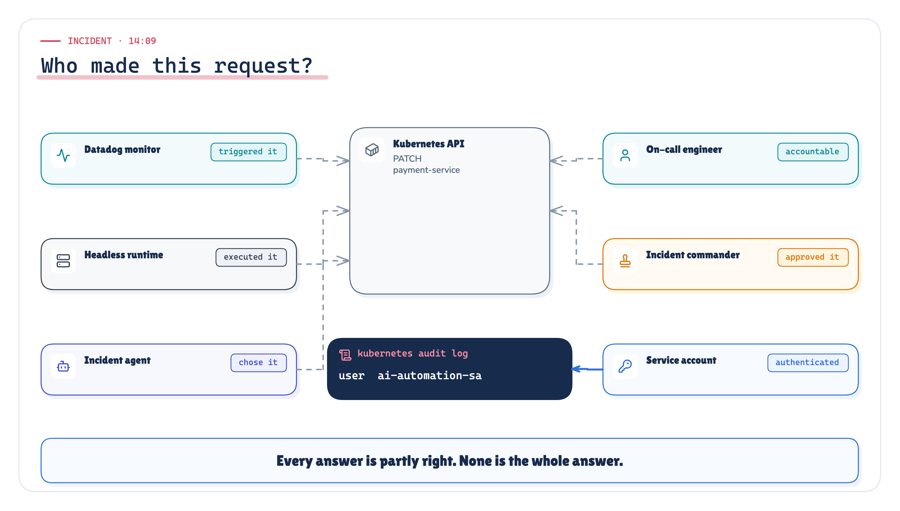

*Figure 1. Six plausible answers to "who made this request?" Each is partly right; only the service account reaches the tool's own log.* · Architecture: concept figure; no measured values

Every candidate is partly right. None of them alone is the identity chain.

### 2.2 Why headless AI turns identity into architecture

In a chat assistant, identity looks simple. Maya signs in; the session knows who she is; the agent acts "as Maya", and every action has an obvious author. Security people call this *ambient authority*: the authority is present in the environment of the call rather than carried explicitly with it. It works while there is exactly one principal, one session and one interface, and it was always partly an illusion. In F3's chat-centric baseline the assistant process held its own credentials for six systems and acted as whoever was typing.

F3 changed the shape of the system:

```text
Human · Service · Event · Workflow · Agent
                    ↓
            Headless AI Runtime
                    ↓
            Enterprise Action
```

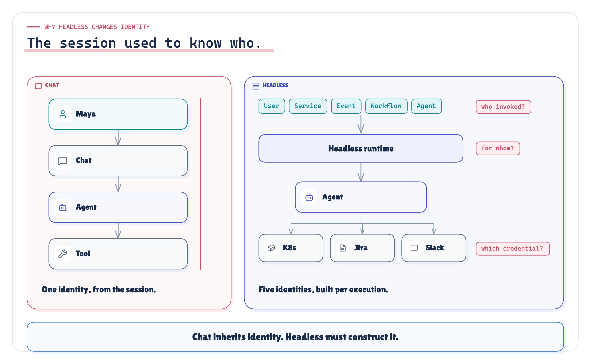

*Figure 2. In chat, identity comes with the session. In a headless runtime, each execution has to construct its own, and five questions appear.* · Architecture: concept figure; no measured values

Three properties of the headless model break ambient identity:

- **The invoker may not be a person.** A monitor started the payment-service investigation. There is no human subject. `on_behalf_of: none` is a fact to record, not a gap to fill with the on-call engineer's name.
- **Time separates invocation from action.** The event arrived at 14:02; the rollback ran at 14:09 after an approval pause. In real incidents that pause lasts hours, and in workflows it lasts days. Whatever authority existed at invocation has to still be valid, or be re-established, at the moment of action.
- **Chains get deeper.** A release-guard agent asks the incident agent for an assessment; the incident agent hands remediation to a sub-agent; a workflow engine resumes an execution for someone who asked yesterday. Every hop is a place where authority can silently widen.

> **In chat, identity is ambient. In a headless runtime it has to be carried, and anything carried can be dropped, swapped or inflated.**

### 2.3 The threats

NIST's zero trust architecture already names the agent case: an attacker may "induce or coerce" a non-person entity to perform a task the attacker is not privileged to perform, or steal a software agent's credentials and impersonate it [10]. OWASP lists excessive agency among LLM application risks [26], and its agentic top 10 names identity and privilege abuse, including the "attribution gap" of agents without a distinct identity [27]. In this note's terms, five failures follow when identity is not modelled as a chain:

| Failure | What it looks like at 14:09 | Where this edition tests it |
|---|---|---|
| Lost attribution | Kubernetes, and often the platform, cannot say which agent acted, for whom | I1 (§27) |
| Confused deputy | A read-only agent gets a rollback done by asking a privileged one | I2 (§28) |
| Coarse revocation | The only lever stops every agent, including the one fixing the incident | I3 (§29) |
| Replayed credentials | A copied token or credential works from somewhere else, or later | I4 (§30) |
| Accumulated privilege | A shared account ends up holding what every agent ever needed | I6 (§32) |

## 3. Terminology

*Sourced · Our synthesis: workload identity from [8]; delegation vocabulary from [1]; the definitions are ours*

- **Principal:** anything that can be named, held accountable and granted authority. Humans, services and agents are principals.
- **Invoker:** the principal that started an execution: a human through a head, a service, an event's sender, a workflow, or another agent.
- **Subject (on behalf of):** the principal whose authority the execution borrows, if any. It is recorded separately from the invoker; it can be `none`.
- **Agent:** a principal whose actions are chosen by a model at run time. That is why it needs its own identity: you can review a service's code and know what it will call; you cannot review an agent's code and know which tool it will pick next.
- **Actor and actor chain:** the agent currently acting, and the agents before it in a delegation chain (RFC 8693's nested `act` claims [1]).
- **Workload (runtime):** the running process that executes on a principal's behalf. It can be attested. It is not the agent.
- **Credential:** the proof a principal presents at a boundary: a token, a certificate, a key. Short-lived, replaceable, stealable.
- **Edge credential (tool-facing credential):** the credential the target system authenticates, minted for one audience and one capability class.
- **Authority:** what a principal may do, including authority borrowed through delegation. The credential carries the authority; the identity says whose it is.
- **Execution token:** the token that carries one execution's identity chain and scopes through the platform; never shown to a tool.
- **Revocation lever:** a control that withdraws one layer's identity or authority (a delegation, an invoker credential, an agent, a workload, a tool identity).

## 4. Authentication vs identity vs delegation vs authorization vs approval

*Sourced · Our synthesis: token exchange semantics from [1]; the five-way separation is our synthesis*

```text
Authentication  ≠  Identity  ≠  Delegation  ≠  Authorization  ≠  Approval
```

| Concern | Question | Produces | Owned by |
|---|---|---|---|
| Authentication | Can this principal prove the claim at this boundary, now? | A verified claim at one point in time | Identity provider, ingress |
| Identity | Who is the stable logical principal? | A principal: a name with an owner and a lifecycle | Directory, agent registry |
| Delegation | On whose behalf is the principal acting, and what authority was handed over? | A bounded grant from a subject to an actor | Trust layer (token exchange) |
| Authorization | May this exact action happen under current policy? | A decision per action | Policy decision and enforcement points |
| Approval | Has an accountable human accepted this particular action? | An approval artifact bound to one call | Workflow and a named approver |

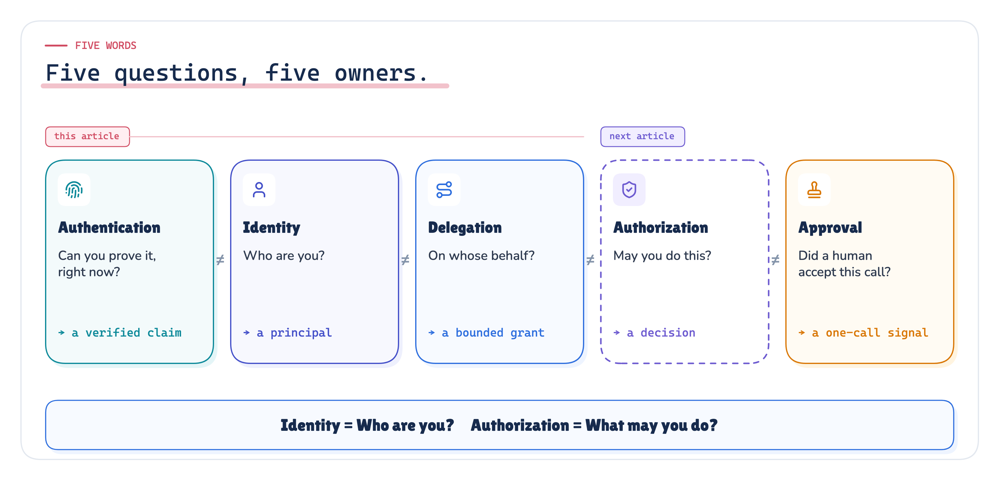

*Figure 3. Five questions, five owners. This note covers the first three; authorization is the next note; approval appears only where it touches identity.* · Architecture: concept figure; no measured values

Here they are in one run of the incident, with a human involved:

1. **Authentication.** Maya signs in to the web console with SSO. Separately, the runtime verifies that the request comes from the console workload.
2. **Identity.** The runtime records two principals: invoker `svc.web-portal`, subject `sre.maya`. The agent runs as `agent.incident-intel@1.3.0`, its own identity.
3. **Delegation.** Maya lends part of her authority: telemetry and deployment reads, ticket writes, channel posts. She cannot lend a production rollback: she does not hold it.
4. **Authorization.** Per action, policy decides. The ticket update is allowed; the rollback is held for approval.
5. **Approval.** The incident commander approves that exact call. Approval produces an approval artifact bound to the call; policy evaluates that signal when deciding whether the rollback may execute. The approval is evidence that a named human accepted this call; it is not, by itself, the authorization.

Each conflation has a known failure:

| Conflation | What goes wrong |
|---|---|
| Authentication taken as identity | "The webhook signature verified, so the event is trusted." The signature proves which integration delivered it, not who configured the monitor or what the event may cause. |
| Identity taken as delegation | "The agent is Maya." Impersonation: the audit trail can no longer tell her decisions from the agent's. |
| Delegation taken as authorization | "Maya invoked it, so it may do what Maya may do." Invocation is not authorization. |
| Approval taken as authorization | "A human said yes, so it is allowed." The approval artifact is an input to policy; it may narrow, and it must never widen what policy permits. |

## 5. Five identity layers

*Our synthesis · Implemented: the layering is our synthesis (a platform architecture choice); the POC implements each layer*

A single agent action involves up to five identities. They answer different questions, are issued by different systems, live for different lengths of time, and change for different reasons.

| Layer | Question | Production shape | POC identifier | Lifetime |
|---|---|---|---|---|
| 1 Human | Which person, if any, is this on behalf of? | The IdP's `(iss, sub)` pair [37] | `sre.maya`, or none | A session |
| 2 Service / event | What triggered this, and who delivered it? | Sender's workload identity + the event's `source` and `id` | `svc.monitoring-webhook` + provenance | One event |
| 3 Agent | Which reasoning component, which version, owned by whom? | `agent://incident-intelligence@1.3.0` | `agent.incident-intel@1.3.0` | One release |
| 4 Runtime / workload | Which process executed it? | `spiffe://prod.company.internal/agent-runtime` | the same SPIFFE-shaped id | Hours, rotated |
| 5 Tool-facing credential (edge principal) | What did the target system authenticate? | `system:serviceaccount:payments:incident-remediator` | minted per capability class | Minutes |

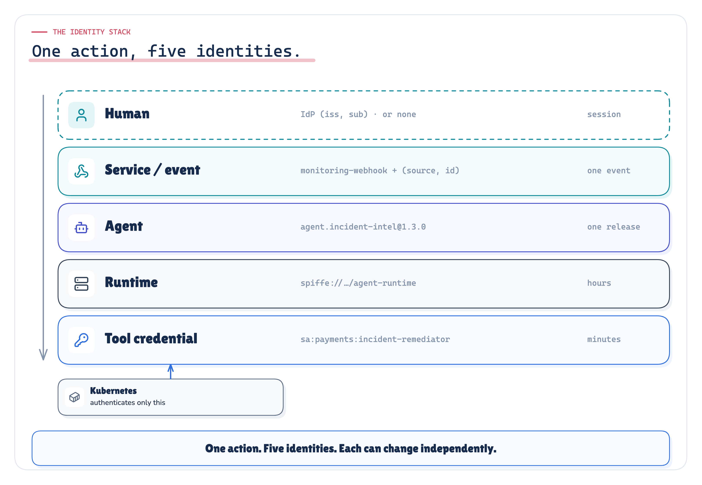

*Figure 4. One action, five identities. Each changes on its own schedule; Kubernetes authenticates only the edge credential.* · Architecture + implemented: production shapes and the POC's identifiers; no measured values

The tool-facing credential is **not** automatically the complete identity model. In this architecture the tool authenticates the edge credential. Richer provenance remains in the platform's audit record and, where supported, may also be carried as protected claims.

Why the layers must be modelled separately:

| Event | Identity that changes | If everything is one identity |
|---|---|---|
| Maya goes off call | Human | Her authority keeps flowing |
| Someone edits the monitor threshold | Event provenance | Invisible |
| incident-intel ships 1.4.0 on a new model | Agent version | Invisible |
| The runtime pod is rescheduled | Runtime | Unprovable |
| The Kubernetes token expires | Tool credential | Every agent breaks at once |

## 6. Principal model

*Sourced · Our synthesis: `(iss, sub)` from [37]; event identity from [36]; the model is ours*

Each layer is a principal type with its own identifier, issuer and lifecycle.

- **Humans** are identified by the identity provider's `(iss, sub)` pair. In OpenID Connect the `sub` and `iss` claims, used together, are the only claims a relying party can rely on as a stable identifier for the end-user; claims such as email must not be used as unique identifiers [37]. In this edition an email address appears only as display metadata, for example as the username a tool shows (section 16). When present, a human enters through a head: the web console, chat, an API client acting for a user. The runtime then records *two* principals, the head's workload and the human.
- **Services and events** are two different facts that are easy to merge: the **sender**, the workload that delivered the event, authenticated at ingress; and the **provenance**, what the event says about itself: its `source`, its `id`, the monitor rule that fired. CloudEvents makes `source` plus `id` the identity of an event [36]. The sender credential proves the first. Only the second tells you *which* monitor.
- **Agents** are registered logical principals (section 7).
- **Workloads** are attested runtime identities (section 8).
- **Tool identities** are the edge principals the target systems authenticate (section 9).

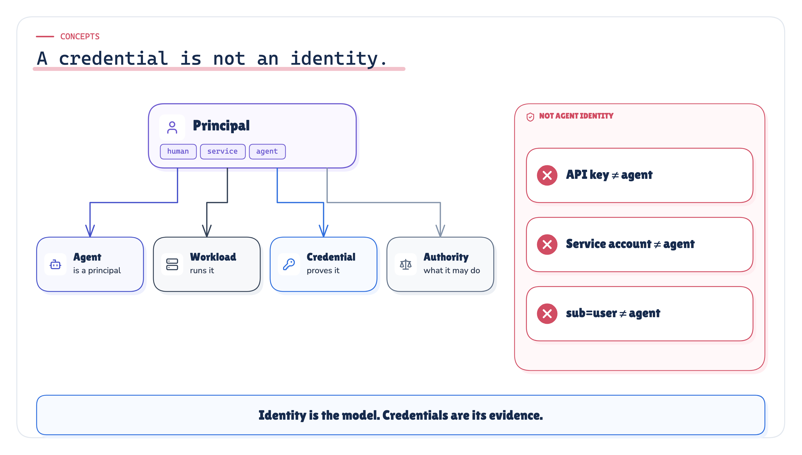

*Figure 5. A credential is not an identity. Principal, agent, workload, credential and authority are separate things with separate lifecycles.* · Architecture: concept figure; no measured values

Three statements come up in every agent platform review:

- **"Our agent has an identity: it has an API key."** It has a credential. Whose? Who owns it? Can you disable this one agent without rotating a key three other agents share?
- **"It runs as the pod's service account, so that's its identity."** That is the workload. Five agents in one runtime share it.
- **"The token says `sub=maya`, so Maya did it."** That token came from impersonation. The actor is lost.

> **Identity is the model. Credentials are its evidence. Never let the evidence become the model.**

## 7. Agent identity

*Our synthesis · Implemented: the record shape is ours; the POC's config/principals.yaml implements it*

An agent identity is a logical identity: the reasoning component, its version, its owning team, and a ceiling on what it may ever hold. It lets the platform say "incident-intel 1.3.0 did this, not release-guard". Versions matter more for agents than for services, because a new prompt or model changes behaviour without a code change.

An agent is registered as a principal before it runs. The record is deliberately boring:

```yaml
agents:
  agent.incident-intel:
    version: 1.3.0
    owner: team-sre-platform
    ceiling: [telemetry:read, deploy:read, itsm:read, itsm:write, chat:post]
    may_delegate_to: [agent.remediation]
    tool_identities: [k8s:incident-remediator, jira:incident-writer, slack:incident-poster]
```

| Field | Why it exists |
|---|---|
| Name | Stable identity for audit, policy and revocation, independent of any credential |
| Version | Behaviour changes with prompts and models; revocation and forensics need to target a version |
| Owner | Someone is accountable for the agent's behaviour and for approving changes to its ceiling |
| Ceiling | The most the agent may ever hold, whatever it is asked to do; the third term of every intersection |
| `may_delegate_to` | Which agents it may call, so recruitment is explicit |
| Tool identities | Which tool-facing identities the broker may mint for it |

**Lifecycle.** Registration with an owner and a ceiling is a reviewed change, like granting a service account a role. A new prompt, model or tool list is a new version; the registry keeps the old one so it can be revoked or pinned. Widening a ceiling is a privileged change; narrowing it takes effect at the next exchange. A retired agent's name stays in the registry, marked retired, so old audit records still resolve.

**Agent identity is not the model.** Two agents may use the same model; one agent may switch models. The identity is the reasoning component with its instructions, tools and ceiling. The model is an attribute of a version.

## 8. Runtime and workload identity

*Sourced · Implemented: [8] [9] [2] [3] [4]*

A runtime identity is a physical identity: which workload held the execution when the call was made. SPIFFE defines workload identities as URIs of the form `spiffe://trust-domain/path`, carried in short-lived, automatically rotated documents (SVIDs) issued after workload attestation [8] [9]. One runtime hosts many agents; one agent may run on many runtimes; so **agent and runtime identities must be separate**.

**Binding execution to the workload.** A bearer token works for whoever holds it. Putting a workload id inside a bearer JWT does not change that: a token with a `cnf` or workload claim can still be copied and replayed, unless the resource server demands proof that the presenter holds the key the token is bound to. RFC 9700 recommends sender-constrained tokens [2]; the two standard mechanisms are mutual-TLS certificate-bound access tokens (RFC 8705), where the token is bound to the client certificate used on the TLS connection [3], and DPoP (RFC 9449), where the client proves possession of a key on every request [4]. An attested workload identity such as a SPIFFE X.509-SVID [8] is a natural key to bind to; equivalent workload proof of possession serves the same purpose.

**In the POC.** The execution token carries a confirmation claim naming the runtime's SPIFFE-shaped workload id, and the gateway compares it with the attested identity of the workload presenting the call: the check an mTLS-bound deployment performs on the certificate. The attestation and the key material are simulated (section 25). Experiment I4 (§30) presents the same token, and a privileged write, from a second workload.

## 9. Tool-facing credentials

*Sourced · Implemented: Kubernetes service accounts and bound tokens [14] [17] [19]; audit event fields [23]*

The tool-facing credential is what the target system authenticates. Kubernetes RBAC authorizes users, groups and service accounts. A Kubernetes service account's username has the form `system:serviceaccount:<namespace>:<name>` [14], and the API server's audit events record the authenticated user of each request [23].

**What the tool can and cannot know.** In this architecture the tool authenticates the edge credential. Richer provenance remains in the platform record and may also be carried as claims where the resource understands them (RFC 8693 tokens can carry both subject and actor [1]). Kubernetes audit proves the edge principal performed the operation. It cannot reconstruct the initiating invoker, logical agent or delegated authority unless those facts are carried and understood. A tool can only audit what it is shown; every other layer is either recorded by the platform or lost.

**Kubernetes building blocks.** Kubernetes provides short-lived, audience-scoped service-account credentials and workload-bound claims: tokens bound to an audience, an expiry and optionally a bound object, issued through its TokenRequest API, which rejects requests for less than ten minutes [17] [19]. Capability separation remains a platform design choice: distinct service accounts and RBAC per capability class, or a credential broker that mints them.

**Granularity.** One identity per agent, per system, per environment multiplies quickly and still leaves each agent with every permission it might ever need. One per platform is the anti-pattern (section 15). The practical middle, and this series' platform architecture choice, is **one tool-facing identity per capability class and environment**: `incident-remediator` in production is a different principal from `release-reader` in production. Each is small enough to reason about and maps to a business action. Which agent, invoker and approval used it on a given call is the platform's record.

**Lifecycle.**

| Credential | Lifetime in the POC | Renewed by | Why that length |
|---|---|---|---|
| Head credential (ingress) | Per the identity provider | The head | Outside the platform's control |
| Execution token | 15 minutes | Re-exchange from the current directory | Longer than one step, shorter than an approval pause |
| Tool credential | 10 minutes | The broker, per call | The shortest lifetime Kubernetes accepts for a bound token; small blast radius |
| Approval artifact | One call | Never | Consumed by the call it names |

**Caching tool credentials.** The POC mints a credential per call. A production broker may reuse one for several calls of the same capability class within its lifetime, but never across executions or subjects: a cached credential is still tied to the chain that caused it.

## 10. Delegation model

*Sourced · Our synthesis · Implemented: delegation and impersonation from [1]; the scope intersection is our production invariant, implemented in the POC's trust layer*

Delegation is how one principal's authority reaches another. OAuth 2.0 Token Exchange names the two ways an agent can be given a user's authority [1]:

- **Impersonation.** The agent receives a token that says it *is* the user. From then on the two are indistinguishable to every downstream system.
- **Delegation.** The agent keeps its own identity and acts *for* the user. The token's subject is the user; an `act` (actor) claim records the agent, and nested `act` claims record earlier actors.

RFC 8693 supports both, and neither is wrong in itself. When an agent acts for a user and the agent must remain attributable, prefer delegation over impersonation: impersonation erases the one fact every reviewer will ask for, whether a human or an automated system made the decision.

**Scopes are an intersection.** The execution's authority is never a copy of the subject's permissions. It is the intersection of three sets:

```text
execution scopes  =  what the subject may delegate
                  ∩  what the head it came through may pass on
                  ∩  what the agent may ever hold (its ceiling)
```

If Maya is a cluster administrator, the agent must not become one because she clicked a button. If the head is a read-only dashboard, nothing that enters through it can write. If the agent's ceiling excludes secrets, no invoker can lend it secrets.

**Our production invariant is that delegated authority may only shrink at each hop.** Token exchange provides the vocabulary for subject and actor; it does not by itself guarantee that authority only shrinks. The narrowing is a property the trust layer enforces at every exchange: intersect, never merge.

**Non-delegable authority.** Some authority should never travel inside a token. In the POC, `deploy:rollback` is held by the incident commander but is in nobody's delegable set. An approval produces a one-call approval artifact, bound to the call's digest and consumed by it; policy evaluates that signal when it decides whether the rollback may execute. Approval and authorization stay distinct.

**Re-derive after a pause.** An execution waiting for approval outlives its token. When it resumes, the runtime exchanges again and the trust layer recomputes scopes from the current directory, so a delegation revoked during the pause stays revoked. Extending the old token would carry forward authority that may no longer exist. Experiment I7 (§33) tests this.

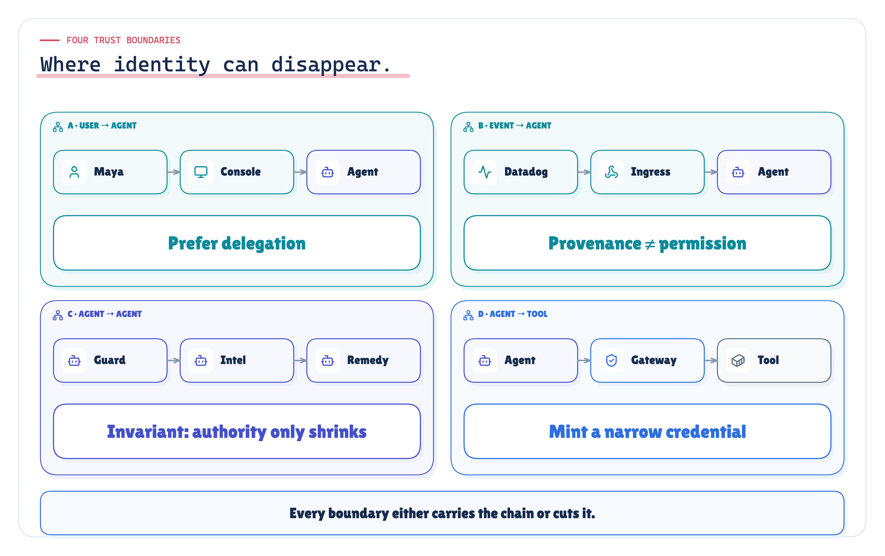

*Figure 6. Four trust boundaries: where identity can disappear, and the rule that keeps it intact at each.* · Architecture: the four trust boundaries and the rule at each; no measured values

## 11. User → Agent

*Sourced · Implemented: [1]; the token shape is the POC's*

When Maya invokes the agent from the web console, the trust layer exchanges her session for an execution token. The subject is Maya; the actor is the agent; the confirmation claim binds the token to the runtime:

```json
{
  "sub": "sre.maya",
  "act": { "sub": "agent.incident-intel@1.3.0" },
  "scope": "telemetry:read deploy:read itsm:read itsm:write chat:post",
  "aud": "capability-gateway",
  "exp": "14:17",
  "cnf": { "spiffe": "spiffe://prod.company.internal/agent-runtime" }
}
```

`sre.maya` here is the directory's stable principal name, standing in for the identity provider's `(iss, sub)` pair; an email address would be display metadata, not the subject.

What changes when a human is present: revoking that human's delegation must stop the execution at its next exchange, while an event-triggered execution of the same agent continues. That property only exists if the subject was recorded separately from the invoker and the agent. Experiment I3 (§29) measures it.

## 12. Event → Agent

*Sourced · Implemented: event provenance from [36]; invocation authority as implemented in F3 and the T1 POC*

**Invocation authority is not action authority.** An event proves provenance and may trigger execution, but must not be treated as implicit permission for a higher-impact action. Explicit policy decides that. An organisation may decide, in policy, that a specific alert on a specific service may trigger an automated rollback; what it must not do is let the ability to *start* an execution silently become the authority to *change production*.

F3 showed this with a recorded run: the monitor's principal held `incident:investigate`, which allowed it to start the execution; that scope disappeared from the execution's own scopes, and `deploy:rollback` was in none of the sets. The T1 run's event-triggered story (section 34) has the same shape: the execution token's subject is the monitoring webhook, `on_behalf_of` is none, and the rollback still needs an approval.

**Sender and provenance.** The ingress authenticates the *sender* (the integration's webhook credential). The event's *provenance* (source, id, monitor rule) is data the sender asserts. The platform records both, and uses the pair `(source, id)` as the event's identity for deduplication and audit [36]. The event *payload* (`service: payment-service, error_rate: 14%`) is untrusted input: a description of the world, not a claim about identity or authority.

**The invisible invoker.** Anyone who can edit a monitor's query or threshold can make the agent run, on whatever service the monitor names. That is acceptable as long as the monitor's authority is limited to *starting investigations* and the change history of monitors is itself audited. It becomes a problem when a monitor's invocation carries write authority.

**Bridging loses the invoker.** The alternative to direct event invocation is to bridge the alert through a chat bot. F3 measured what that does: the investigation's invoker was recorded as `bot.alerts`, and the monitor, its event id and its source disappeared from the record.

## 13. Agent → Agent

*Sourced · Implemented: nested actor claims from [1]; the confused deputy from [24] [25]; monotonic narrowing is our production invariant, implemented in the POC*

**Chains form quickly.** The release-guard agent asks incident-intel whether it is safe to ship. Incident-intel hands remediation to a sub-agent. Each hop is a new delegation:

```text
sub  svc.ci-pipeline                  the pipeline that started release-guard
act  agent.incident-intel@1.3.0       the current actor
  act  agent.release-guard@0.9.2      the previous actor (informational)
```

**Monotonic narrowing.** The new token's scopes are the intersection of the incoming token's scopes and the callee's ceiling. A hop may remove authority; it may never add any. The chain also needs a maximum depth, and an allow-list of which agent may delegate to which (`may_delegate_to` in the POC's registry), so that an arbitrary agent cannot recruit another.

**The confused deputy, in agent form.** The confused deputy problem is older than agents [24]: a program holding its own authority is tricked into using it on behalf of a caller that lacks that authority [25]. In an agent platform a low-privilege agent asks a high-privilege agent to "just roll this back". If the callee acts with its *own* authority, it has become a deputy for a caller that could never have done this itself. Prompt injection makes this worse, because the request can arrive inside data the callee reads. The fix is structural: carry the original subject through every hop and evaluate the effective authority of the chain, never the callee's own identity alone. Experiment I2 (§28) runs exactly this request.

**Enforce at the exchange, not at the tool.** RFC 8693 lets nested `act` claims record the whole chain, but for access control only the token's top-level claims and the current actor are to be considered; prior actors are informational only [1]. So a tool downstream cannot be expected to reason about the history. The narrowing has to happen at each exchange, in the trust layer that issues the next token. The chain is enforced when it is built, and only recorded when it is presented.

## 14. Agent → Tool

*Sourced · Implemented: token passthrough and audience validation from [11] [12] [13]; resource indicators [5]; bound service account tokens [19]; transaction tokens [6] (draft)*

Kubernetes, Jira and Slack do not understand agent chains. So what should cross the boundary?

| Option | What the tool authorizes | Consequence |
|---|---|---|
| A shared platform service account | "The platform" | Attribution lost (section 15) |
| The user's token, passed through | The user | The agent disappears; event-triggered runs have no user; the MCP specification forbids servers from accepting tokens not issued for them, and names token passthrough an anti-pattern [11] [13] |
| A credential minted per capability class, derived from the chain | A narrow grant for one audience, for minutes | The tool enforces what it understands; the platform records the rest |

**The token broker.** The third option is the production pattern. The capability gateway is the last place where the whole chain is visible, so it is where the chain is checked, where a narrow tool credential is minted, and where the audit record is written. The broker exchanges the execution identity for a credential that names one **audience** (the resource indicator [5]), carries the **minimum permissions** for one capability class in one environment, expires in **minutes**, and is **never shown to the agent**: agents hold no tool credentials at all. Tools never receive ambient platform credentials; that is our production invariant.

**Carrying context further.** Where a target can accept context, the chain can travel further than the platform's record: correlation ids in request metadata; Kubernetes user impersonation, whose audit events record both the authenticated user and the impersonated user [21] [23]; or transaction tokens, an IETF OAuth working-group draft for propagating identity and authorization context across workloads within a trust domain [6]. Where the target cannot accept context, the platform's audit record is the only record, which is why it has to be complete (section 18).

## 15. Shared-account anti-pattern

*Sourced · Measured: excessive agency [26] [27]; I1, I2, I3, I4 and I6 of the recorded run*

Nearly every agent platform passes through this stage. It starts as a sensible shortcut: one service account for "AI automation", one Jira API token for `automation@company.com`, one Slack bot token. The first agent works. The second needs one more permission, so it goes on the same account. By the sixth agent the account can do everything any of them ever needed, in every environment.

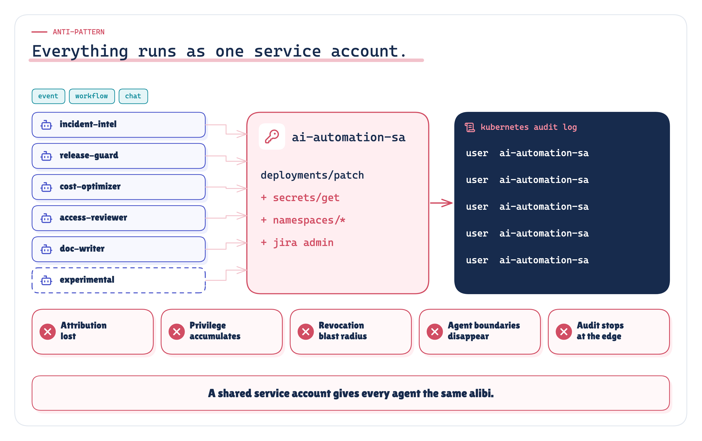

*Figure 7. A shared service account doesn't give your agents an identity. It gives all of them the same alibi.* · Architecture: concept figure; the permission list is illustrative

> **A shared service account doesn't give your agents an identity. It gives all of them the same alibi.**

The POC runs the same incident through three identity models: **A, a shared account** (everything as `system:serviceaccount:platform:ai-automation`), **B, impersonation** (the agent is handed the user's token) and **C, the delegation chain** (section 17). The shared account fails in five ways:

1. **Attribution is lost.** In I1, three agents took 5 actions against Kubernetes. Kubernetes saw **1** principal for all of them, and the platform's own record could attribute 0 of the three agents. Section 27 scores each model's record against the nine attribution questions of section 23.
2. **Agents become indistinguishable.** Release-guard is read-only by design; incident-intel may propose rollbacks. Through a shared account they hold the same authority. OWASP lists this as Excessive Agency: excessive functionality, permissions or autonomy [26]; its agentic top 10 names the resulting attribution gap under identity and privilege abuse [27]. In I2 (§28), release-guard got a rollback done through incident-intel: 1 rollback, with the originator not visible in the record.
3. **Privilege accumulates.** I6 (§32) derives, from configuration, that the shared account holds 20 permissions where the platform needs 6.
4. **Revocation is all or nothing.** Rotating the shared account in I3 (§29) stopped **5 of 5** running executions, including the one resolving the incident. More often nobody rotates it, *because* an incident is in progress. A lever nobody dares to pull protects nothing.
5. **A leaked secret keeps working.** In I4 (§30) the shared secret, used from anywhere a day later, returned HTTP 200.

**Audit stops at the edge.** Kubernetes audit proves the edge principal, the shared account, performed the operation. It cannot reconstruct the initiating invoker, logical agent or delegated authority, because none of them was carried. "The AI did it" is not an answer that a change review, an auditor or a post-incident review accepts.

**Relation to F1.** F1 moved credentials out of the agents into a capability gateway. That consolidation is necessary but not sufficient: a gateway that uses one all-powerful credential for every caller has turned the sprawl into a single identity. F1 fixed *where* credentials live. This note is about *whose* identity they express.

## 16. Impersonation trade-offs

*Sourced · Measured: [1] [21] [13]; I1, I2 and I5 of the recorded run*

Impersonation is not universally invalid. A read-only assistant using the user's own token to read the user's own data needs nothing more (section 40). The finding here is about provenance and policy semantics **in this architecture**, where an agent acts autonomously and must stay attributable.

The obvious correction to a shared account, handing the agent the user's token, trades one problem for another. In I1, Kubernetes recorded the user name `maya@company.com`: the user is visible, through the email claim the cluster uses as a display name, not through the identity provider's stable `(iss, sub)`. But:

- the platform could attribute 0 of the three agents' actions;
- event-triggered calls had no human to impersonate: 3 calls fell back to the shared account;
- in I5 (§31), the agent's rollback and Maya's own manual rollback looked identical in Kubernetes' log, and 13 identity fields were missing from the record;
- every call ran with Maya's full permissions: 5 Kubernetes permissions behind the rollback, against 3 under the delegation chain;
- in I2 (§28), the approver was asked to approve a request that appeared to come from `agent.incident-intel`; the real originator was not visible.

"The user is visible" is not the same as "the complete actor chain is attributable". Impersonation keeps the human and erases the agent, its version, its runtime and the delegated authority. The MCP specification goes further for its own boundary and forbids token passthrough outright [13]. Where a target supports it, Kubernetes user impersonation records both the authenticated and the impersonated user [21]; that names an impersonator, not an actor chain.

## 17. Production identity pattern

*Sourced · Our synthesis · Implemented: token exchange [1]; sender-constrained and audience-restricted tokens [2]; workload identity [8]; the composition is our synthesis and the POC implements it*

The pattern needs no particular vendor. It rests on a handful of invariants, and it is a set of platform responsibilities, each with one owner.

**Production identity invariants**

| Invariant | Kind |
|---|---|
| Actor ≠ Subject | Standard vocabulary: RFC 8693 distinguishes subject and actor [1] |
| Agent ≠ Runtime | Our production invariant (a platform architecture choice) |
| Identity ≠ Credential | Our production invariant |
| Invocation ≠ Authorization | Our production invariant |
| Approval ≠ Authorization | Our production invariant: approval produces an artifact that policy evaluates |
| Delegated authority never widens | Our production invariant: authority may only shrink at each hop |
| A durable pause requires re-evaluation | Our production invariant: resume by re-deriving authority |
| Tools never receive ambient platform credentials | Our production invariant; MCP forbids token passthrough at its boundary [13] |

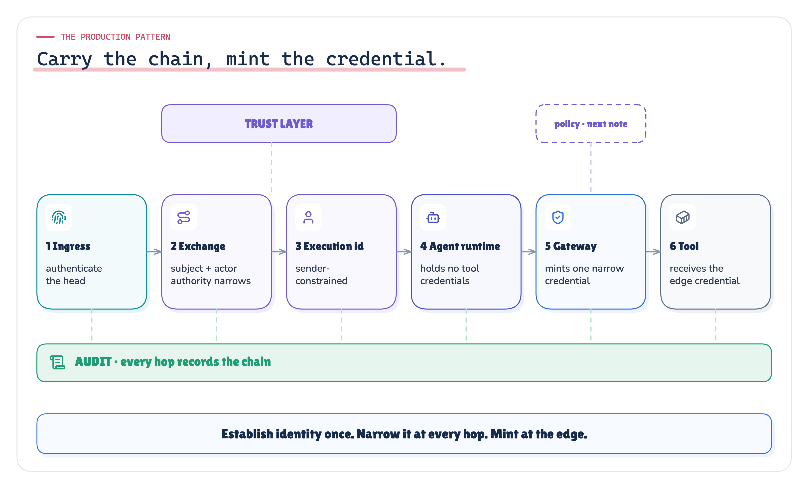

*Figure 8. Establish identity once, narrow it at every hop, and turn it into a credential only at the edge. Every hop writes to the audit record.* · Architecture + implemented: the stages of the POC; no measured values

| # | Responsibility | Owner | What it guarantees |
|---|---|---|---|
| 1 | Authenticate the head | Ingress | The invoker is who it claims; a human subject, if any, is recorded separately |
| 2 | Exchange for an execution identity | Trust layer | Scopes are an intersection; non-delegable scopes never enter a token; the chain is recorded |
| 3 | Sender-constrain the execution token | Trust layer + attestation | Through mTLS certificate-bound tokens, DPoP or equivalent proof of possession, a copied token is useless without the key |
| 4 | Reason without credentials | Agent runtime | The agent can propose calls; it cannot make them |
| 5 | Enforce, then mint | Capability gateway + token broker | Only this path reaches tools; each call gets its own narrow, short-lived credential |
| 6 | Record every hop | Audit | The chain as it stood at each moment can be rebuilt later |

**Delegation boundary rules.**

1. Prefer delegation over impersonation when the agent must remain attributable. The agent keeps its own name; the subject is recorded beside it.
2. Our production invariant is that delegated authority may only shrink at each hop. Intersect at every exchange and every hop; never merge sets.
3. Some authority is not delegable. An approval produces a one-call artifact; policy evaluates it when authorizing that call, and the artifact is consumed.
4. Chains are bounded: a maximum depth, and an explicit list of which agent may call which.
5. Re-derive after a pause. Exchange again from the current directory; never extend a token.

**Where policy fits.** The gateway asks the policy decision point before the broker mints anything. This note keeps policy minimal: registered capability, held scope, approval for high-risk production writes. What matters here is the *input*: policy receives the whole chain (invoker, subject, agent and version, workload, hop depth, approval artifact), not just the last credential. How to write and evaluate those rules is the next note.

**The landscape.** The pieces are established; their application to agents is still being written down. Standards: token exchange [1], the OAuth security BCP [2] with mTLS-bound tokens and DPoP [3] [4], SPIFFE workload identity [8]. Drafts: transaction tokens [6] and the WIMSE AI agent identity draft [28], which treats agents as workloads that must be uniquely identified and audited with their delegated subject; an individual on-behalf-of draft for agents has expired without adoption [29]; the OpenID Foundation describes agent identity as an open problem [30]. Platforms: Microsoft Entra agent identities, with tokens whose subject is the user and whose actor is the agent [31]; Google Cloud agent identities based on SPIFFE [32]; and workload identities for agents in Amazon Bedrock AgentCore [33] [34]. Two of these call their on-behalf-of flows "impersonation", which is what RFC 8693 calls delegation.

## 18. Audit architecture

*Sourced · Measured: audit fields for agents [28] (draft); Kubernetes audit event fields [23]; I1 and I5 of the recorded run*

Identity matters most after the event. At 09:00 the next morning, someone will ask what happened at 14:09. A production platform should answer that **from its audit record alone**, without traces, chat logs or anyone's memory. The WIMSE working group's AI agent identity draft makes the same point: audit records include the authenticated agent identifier and the delegated subject, when present [28].

The platform writes one record per capability call, at the gateway, with the chain as it stood at that moment. Its fields fall into five groups:

| Group | Fields |
|---|---|
| Origin | `event_source`, `event_id`, `event_rule`, `invoker`, `invoker_credential` |
| Agent | `agent` (with its version), `act_chain` |
| Authority | `on_behalf_of`, `grant_id`, `scopes`, `token_id`, `rule`, `authorized_by`, `approval_id` |
| Execution | `workload` |
| Tool and action | `tool_identity`, `tool_principal`, `credential_id`, `credential_exp`, `capability`, `arguments`, `effect`, `status` |

Plus the `revocation` handles for each layer. Section 23 turns these fields into the nine attribution questions the experiments score.

The chain-mode record for the I1 rollback (invoked through the web console, on Maya's behalf), from `agent_identity_poc/runs/2026-10-03-recorded/I1.json`, with ids shortened:

```json
{
  "capability": "rollbackDeployment", "system": "kubernetes", "kind": "write",
  "arguments": {"service": "payment-service", "environment": "production", "to_version": "v4.17.2"},
  "invoker": "svc.web-portal", "invoker_credential": "cred-web",
  "on_behalf_of": "sre.maya", "grant_id": "grant-e05c…",
  "agent": "agent.incident-intel@1.3.0", "act_chain": ["agent.incident-intel@1.3.0"],
  "workload": "spiffe://prod.company.internal/agent-runtime",
  "scopes": ["chat:post", "deploy:read", "incident:remediate", "itsm:read", "itsm:write", "telemetry:read"],
  "rule": "P2-high-risk-production", "authorized_by": "ic.dev", "approval_id": "apr-9c65…",
  "tool_identity": "incident-remediator@production",
  "tool_principal": "system:serviceaccount:payments:incident-remediator", "credential_id": "cred-7ec3…",
  "effect": {"verb": "deployments:patch", "object": {"service": "payment-service", "to_version": "v4.17.2"}},
  "revocation": {"delegation": "grant-e05c…", "invoker_credential": "cred-web", "agent": "agent.incident-intel@1.3.0",
                 "workload": "spiffe://prod.company.internal/agent-runtime", "tool_identity": "incident-remediator@production"}
}
```

The same call in Kubernetes' audit log:

```json
{"user.username": "system:serviceaccount:payments:incident-remediator", "verb": "patch",
 "objectRef": "deployments/payment-service", "namespace": "payments", "responseStatus": 200}
```

The platform record has 26 fields per call. `deploy:rollback` is not among the scopes: the token carried no rollback authority. The approval supplied a one-call artifact, and policy evaluated it when authorizing the rollback.

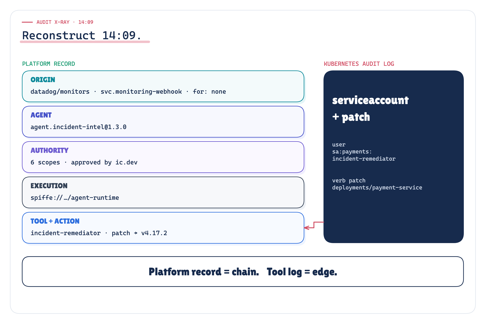

*Figure 9. The audit X-ray: the platform record rebuilds the 14:09 event-triggered rollback end to end; Kubernetes' own log holds only the edge credential and the change.* · Recorded: the 14:09 event-triggered rollback, platform record and Kubernetes log · run 2026-10-03-recorded

**Platform record = chain. Tool log = edge.** The tool's log is accurate about what it saw; it was never given the rest.

**Integrity.** The platform audit is hash-chained: each record carries the hash of the previous one, so a quiet rewrite is detectable (section 35). That makes the record tamper-evident; it is not an independently anchored ledger, and it does not by itself establish formal non-repudiation.

**Audit is not observability.** F3 drew this line and it applies here: traces explain *behaviour* (which step was slow, which call failed); audit proves *authority* (who acted, for whom, under what grant). Traces are sampled and short-lived; audit is complete, append-only and kept for as long as the business or regulation needs. Put identity attributes on spans for debugging, but never rely on traces as the audit record.

## 19. Revocation architecture

*Our synthesis · Implemented: the lever design is ours; the POC implements one lever per layer; I3 (§29) measures them*

With a shared account there is one lever, and it switches everything off. With a chain, each layer has its own lever, its own enforcement point and its own blast radius:

| Lever | What it withdraws | Where it is enforced in the POC | When it takes effect |
|---|---|---|---|
| Delegation | One subject's grant to one agent | The trust layer refuses the next re-exchange | At most the remaining execution-token lifetime |
| Invoker credential | One head's ability to start executions | Ingress refuses new starts; the trust layer refuses re-exchange | New starts at once; open runs at the next re-exchange |
| Agent (or agent version) | Every execution of that agent | The gateway checks the registry on every call | At the next call |
| Runtime workload | Every execution on that runtime | Attestation fails at the gateway | At the next call |
| Tool identity | One capability class | The broker refuses to mint it | At the next call |
| Shared account rotation | Everything that used the account | Every tool | At the next call, for everyone |

> **A credential's lifetime is its revocation deadline.**

For short-lived, self-contained credentials without online revocation or introspection, expiry is the upper bound on revocation latency. The design choice in this pattern is explicit: check cheap, high-impact state (agent, workload, tool identity) on every call; let token expiry bound everything else (delegation, invoker credential). Token introspection, or a revocation check consulted per call, removes the bound at the cost of an online dependency. Long-lived credentials make revocation depend on revocation lists, cache invalidation and hope.

The same rule bounds a leak: a stolen edge credential works for its remaining lifetime, at its one audience, for its one capability class. Sender-constrained tool credentials close that window where tools support them. I4 (§30) measures it.

## 20. POC: what we built

*Simulated · Implemented: recorded run 2026-10-03-recorded; 41 of 41 declared checks passed*

The POC answers one question: **if the same privileged rollback is executed through different identity models, what identity, authority, attribution, revocation and replay properties survive?** It is a thin, self-contained extension of F3's headless runtime. It keeps F3's scenario and principals, drops everything that is not about identity (reasoning, event durability, workflow recovery), and adds the identity chain. One composition root (`aid/platform.py`) builds the same simulated enterprise and the same agent platform in one of three identity models.


*Figure 10. The testbed: the same incident and the same rollback, an identity-model switch, then the trust layer, the agent, the policy gate, the credential broker, the tool simulators and the hash-chained audit. Everything but the identity model is held constant.* · Implemented: the POC's components and the held-constant fixture; experiment list from the run · run 2026-10-03-recorded

The three identity models:

- **A · Shared service account.** Every agent, head and runtime uses one automation account per system (`system:serviceaccount:platform:ai-automation` in Kubernetes); the tool and the platform both see that account. The anti-pattern and the control arm.
- **B · User impersonation.** The agent is handed Maya's own token (token passthrough); the tool attributes the action to the user; the agent is invisible. Event-triggered runs, which have no user, fall back to the shared account.
- **C · Delegation chain.** Subject plus actor chain, intersected scopes, an execution token bound to the attested runtime, a broker minting one narrow, short-lived, audience-bound credential per capability class, and a hash-chained audit record.

Where each concept lives:

| Concept | Where | Experiment |
|---|---|---|
| Invoker authenticated at ingress; event provenance recorded separately from the sender | `aid/directory.py`, `aid/contracts.py` | I1 |
| Delegation, not impersonation: subject plus nested actor chain | `aid/trust.py` | I1, I5 |
| Scopes as an intersection; narrowing at every hop; declared edges; depth limit | `aid/trust.py`, `config/principals.yaml` | I2 |
| Non-delegable `deploy:rollback`, reached only through an approval bound to one call | `aid/approvals.py`, `aid/gateway.py` | I1, I7 |
| Sender-constrained execution tokens; workload attestation | `aid/trust.py`, `aid/attestation.py` | I3, I4 |
| Re-exchange, never extend, after a pause | `aid/trust.py`, `aid/platform.py` | I7 |
| Token broker: per capability class, audience-bound, short-lived credentials | `aid/broker.py`, `config/tool_identities.yaml` | I1, I4 |
| Each tool keeps its own log of what it was shown | `aid/tools.py` | I1, I5 |
| Hash-chained platform audit with revocation handles | `aid/audit.py`, `aid/gateway.py` | I1 |
| A revocation lever per layer | `aid/directory.py`, `aid/platform.py` | I3 |
| The baselines: a shared account; the user's token | `aid/baselines.py`, `config/shared_sa.yaml` | I1–I7 |
| The experiments, the declared checks, the global assertions and the facts | `aid/experiments.py`, `aid/freeze.py` | all |

The evidence built from this run: the [Run Report](../results/agent-identity-report.html) (every observed value and every check), the [Evidence Check](../results/agent-identity-evidence.html) (each claim, its evidence and a status), [Real vs simulated](../results/agent-identity-real-vs-simulated.html) and the [Lab Console](../results/lab-console.html) (every scenario: input, output, recorded steps and whether identity held).

## 21. Experimental method

*Implemented: agent_identity_poc/proof/preregistration.toml, proof/FREEZE.json, proof/DEVIATIONS.md*

**A controlled comparison.** The same rollback, through the same agents, under the same policy, against the same simulated tools, in each of the three identity models; only identity propagation changes (section 22). Not every experiment needs all three models: I3 compares the chain's levers with rotating the shared account, I5 compares impersonation with delegation, and I6 is derived from configuration. Both baselines keep an approval step, so the comparison stays about identity rather than about whether a human was asked.

**The history, stated plainly.** The POC and its first 29 checks were written when T1 was built, and run 2026-09-29-recorded already showed their results. This standardization pass did not change those 29 checks: same wording, now with ids, kinds and arms. It added one I4 check (a privileged write replayed from the wrong workload), because the earlier replay test only replayed a read, and eleven global assertions, G01 to G11. All 41 checks were declared in `agent_identity_poc/proof/preregistration.toml`, extracted from the code without running it, and frozen with `uv run aid freeze` at 2026-10-03T18:25:33Z, before the final recorded run, together with every config file and the criteria code. `aid experiments` refuses to run if a frozen file changed, and refuses to publish if the checks it evaluates differ from the declared list. So the new checks were fixed before their first result; the original 29 were fixed long before this run, but not before anyone had seen them pass.

**Deviations.** One change was made after the freeze, recorded in `proof/DEVIATIONS.md`: the manifest's test count read pytest's output wrongly (it came out as -1) and was fixed before the recorded run. It is manifest metadata; no check reads it. The run's `recorded.json` lists the code changed since the freeze.

**Check kinds.** Each check has a kind and an arm. An *invariant* is a property the design must hold; a FAIL is a broken guarantee. A *control* predicts that a weak identity model loses a property; it passes when the weak model did lose it, which shows the experiment can tell the models apart. A *qualified* check holds only within a stated bound, such as a token lifetime. Arms: A shared account, B user token, C delegation chain.

**Determinism.** No model, no network, no randomness: a simulated clock, directory, attestation and tools, and fixed agent plans. Re-running the experiments into a fresh copy of the POC reproduces the run directory byte for byte, except `recorded.json`, which records when the run happened and under which freeze (`make verify`).

## 22. What stayed constant, what changed

*Implemented: proof/preregistration.toml → [design]; manifest.json*

| Held constant across the three models | |
|---|---|
| Incident | payment-service, production, 14% errors; Datadog event `dd-evt-771204` from monitor rule `monitor/payment-service-error-rate` |
| Proposed rollback | payment-service, production, to `v4.17.2` |
| Logical agents and their behaviour | `agent.incident-intel@1.3.0`, `agent.release-guard@0.9.2`, `agent.remediation`, with deterministic plans (`aid/agents.py`) |
| Policy fixture | `config/policies.yaml` (hashed in the manifest) |
| Approval fixture | the incident commander `ic.dev` approves the exact call |
| Tool simulators | Kubernetes, Jira, Slack and telemetry, with their own logs (`aid/tools.py`) |
| Run configuration | `config/*.yaml`, hashed in the manifest and the freeze |
| Evidence questions | the nine attribution questions (section 23) |
| Scenarios | the same scenario per model, one folder each under `scenarios/` |
| Randomness | none |

| Changed | |
|---|---|
| The only variable | identity propagation and credential architecture: A shared account · B user token · C delegation chain |

## 23. The nine attribution questions

*Implemented: aid/experiments.py QUESTIONS and platform_answers(); proof/preregistration.toml → [[questions]]*

Attribution is scored against nine questions an incident review has to answer about a privileged action. They are the POC's existing canonical definitions, kept unchanged and labelled A1 to A9. A question counts as answered only when the record states the true value; a field that is present but wrong scores nothing.

| Id | Key | Question | Answered when the record states… |
|---|---|---|---|
| A1 | `who_is_the_agent` | Which logical agent acted? | the agent identifier, which carries its version (`agent.incident-intel@1.3.0`) |
| A2 | `who_invoked` | Who or what invoked it: the trigger's head, the event webhook or the human's channel? | the authenticated invoker |
| A3 | `on_whose_behalf` | On whose behalf did it act: the accountable subject? | the human subject, or that there was none |
| A4 | `what_authority` | With what delegated authority? | the exact scopes the execution held |
| A5 | `which_runtime` | On which runtime workload did it execute? | the attested workload |
| A6 | `which_credential` | Which edge credential reached the tool? | the tool principal and the credential id |
| A7 | `what_action` | What exact action, with which arguments, on which resource? | the capability and its arguments |
| A8 | `who_approved` | Who approved it: the policy and approval context? | the approver of this call |
| A9 | `can_it_be_revoked` | Can each part of the chain be revoked independently? | a revocation handle for each layer |

How they cover a broader attribution checklist: the trigger and the invoker both sit in A2 (the event's source, id and rule are recorded beside the invoker); the policy and approval context sit in A8; the edge principal is A6 and the exact action on its resource is A7. **Agent version is not a separate question here**: it is part of A1, because the agent identifier carries the version, and a record that names the agent without the right version does not answer A1.

The same nine questions are asked of two records for every run: the **platform record** (the gateway's audit row) and the **tool's own log** (what Kubernetes recorded). A tool log answers A1 or A2 only if the agent or invoker happens to be its user name, A3 only if the human is, A4, A5 or A8 only if it happens to carry the scopes, the runtime or the approver, A6 for its own user name, A7 for the verb on the object, and never A9: an access log carries no revocation handles for the chain that reached it.

## 24. Fixed invariants and success criteria

*Implemented: 41 declared checks: 30 experiment checks and 11 global assertions*

**Success criterion.** Every declared check must pass; the run refuses to publish evidence documents for a run with a failing check. Of the 41 checks, 7 are controls (the weak model is predicted to lose the property) and 2 are qualified (I3-02 and I4-05: they hold within a token lifetime).

**The global assertions.** Eleven fixed identity invariants, each computed from the experiments' own results:

| Id | Assertion | Arm | Rests on |
|---|---|---|---|
| G01 | Delegation never widens authority: the callee's scopes are within the caller's after every hop | C | I2 |
| G02 | A delegated write whose originator lacks the authority is denied, not silently executed | C | I2 |
| G03 | A credential replayed from the wrong workload causes no privileged side effect | C | I4 |
| G04 | A revoked identity cannot mint new execution authority | C | I3, I7 |
| G05 | Unrelated executions survive every targeted revocation | C | I3 |
| G06 | Rotating the shared account stops more executions than any targeted lever | A vs C | I3 |
| G07 | Agent identity and runtime identity stay distinct in the record | C | I1 |
| G08 | Impersonation does not pass for delegation provenance | B vs C | I5 |
| G09 | No tool log is complete upstream provenance: every tool log answers fewer than nine questions | A, B, C | I1 |
| G10 | The platform record reconstructs the whole identity chain, nine of nine | C | I1 |
| G11 | Tampering with the platform audit is detected at the edited row | C | I1 |

The experiment checks are listed with their ids in sections 27 to 33 and, with observed values, in the [Run Report](../results/agent-identity-report.html).

## 25. Real vs simulated

*Implemented: manifest.json → real, simulated; the component split is in the Real vs simulated document*

| Real code and logic | Simulated |
|---|---|
| Identity chain representation (subject, actor chain, provenance); delegation derivation and scope intersection; execution token minting and validation; the workload-binding check; the token broker; the capability gateway; approvals bound to one call; replay and expiry checks; revocation logic per layer; the hash-chained audit; the three identity models; the checks and global assertions | Datadog (one fixed event); the enterprise identity provider and directory (`config/principals.yaml`); workload attestation and SVID issuance; Kubernetes, Jira, Slack and telemetry and their logs; the approval system (a function call); the clock and every pause; the agents' plans |

The agents' plans are fixed on purpose: the claims are about who acts and with what authority, and those claims must hold whatever a model proposes. No commercial IdP, authorization platform or cluster was integrated; the mechanisms are the ones such systems use, implemented as data structures and checks. The component-by-component split is in [Real vs simulated](../results/agent-identity-real-vs-simulated.html).

## 26. Overall POC scorecard

*Measured: recorded run 2026-10-03-recorded; checks.json, facts.json*


*Figure 11. The complete I1–I7 scorecard: the headline result of each experiment under each identity model, with its checks.* · Measured: I1–I7 per identity model, declared checks per experiment, G01–G11 · run 2026-10-03-recorded

| Experiment | Question | A · Shared account | B · User token | C · Delegation chain | Checks |
|---|---|---|---|---|---|
| I1 Attribution | Questions answered by the platform record (of 9) | 3 | 4 | 9 | I1-01 … I1-07 |
| I1 Attribution | Questions answered by the tool's own log (of 9) | 2 | 3 | 2 | I1-03, G09 |
| I2 Confused deputy | Rollbacks when a read-only agent asks | 1 | 1 | 0 (DENY) | I2-01 … I2-04, G01, G02 |
| I3 Revocation | Executions stopped by one lever (of 5) | 5 | n/a | 1 to 4 | I3-01 … I3-07, G05, G06 |
| I4 Replay | Approved write from another workload | n/a | n/a | REJECTED, 0 rollbacks | I4-01 … I4-06, G03 |
| I5 Impersonation | Identity fields lost against the chain | n/a | 13 | none | I5-01 … I5-03, G08 |
| I6 Accumulation (derived) | Permissions held | 20 | n/a | at most 3 per tool identity | I6-01 |
| I7 Pause | After a 37-minute wait with a revoked delegation | EXECUTED | n/a | REJECTED after re-exchange | I7-01, I7-02, G04 |

**41 of 41 checks passed; 0 failed**, including 11 of 11 global assertions.

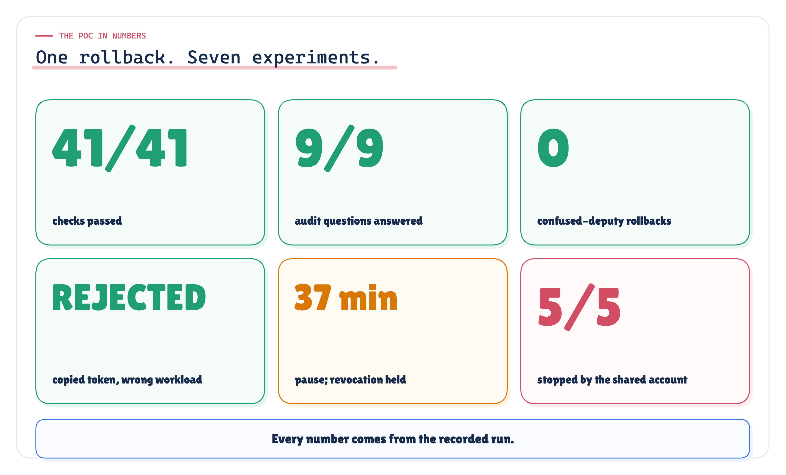

*Figure 12. The POC evidence summary: the headline result of each experiment, read from the recorded run.* · Measured: I1–I7 headline results · run 2026-10-03-recorded

Every experiment below follows the same template: question, setup, invariant, observed result, evidence, interpretation, limitation. Paths are relative to `agent_identity_poc/runs/2026-10-03-recorded/`.

## 27. I1 · Attribution completeness

*Measured: I1.json, audit.jsonl, tool-logs.json, scenarios/I1-**

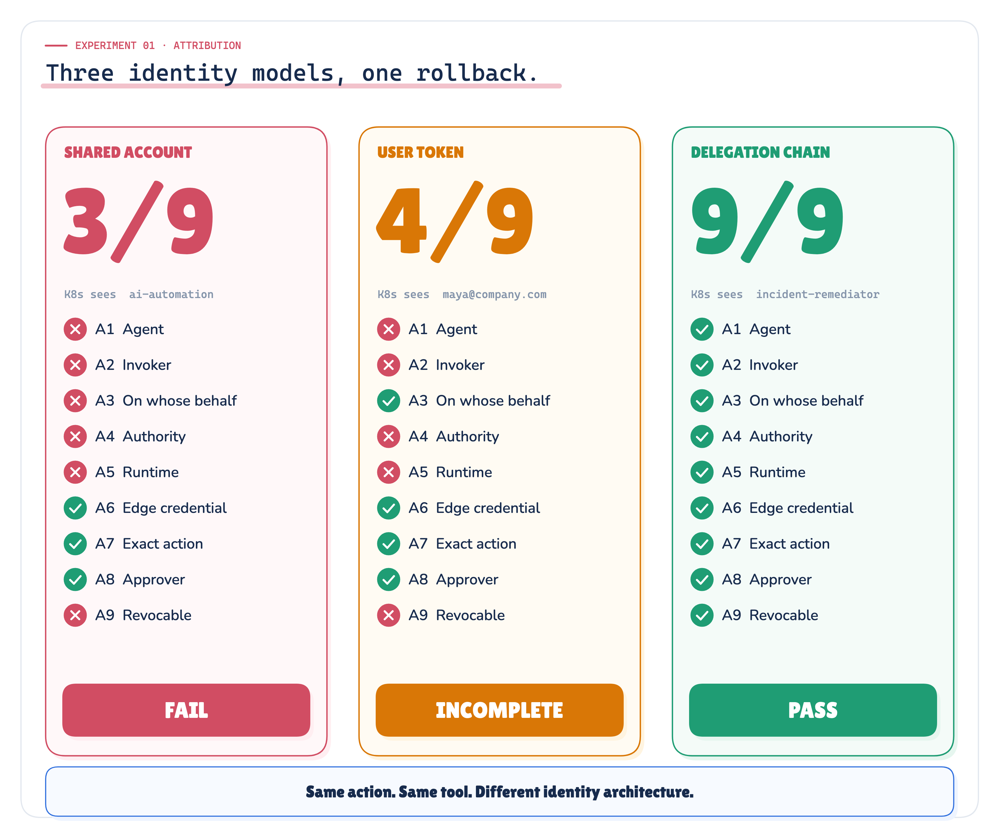

*Figure 13. Experiment 01: same action, same tool, different identity architecture. The rows are the nine attribution questions of section 23.* · Measured: I1, attribution under three identity models · run 2026-10-03-recorded

**Question.** How much of the identity chain can the platform record, and the tool's own log, reconstruct after the same rollback?

**Setup.** The same 14:09 rollback, invoked through the web console on Maya's behalf, under all three identity models; in a second scenario three agents act against Kubernetes. The nine questions (section 23) are asked separately of the platform record and of Kubernetes' own log. A tamper test edits the approver in one record of a copy of the chain-mode audit.

**Invariant.** Under the delegation chain the platform record answers all nine questions (G10); no tool log is complete upstream provenance (G09); agent and runtime identities stay distinct in the record (G07).

**Observed.** Platform record: shared account **3/9**, user token **4/9**, delegation chain **9/9**. Kubernetes' own log: 2, 3 and 2 of 9. Kubernetes saw `system:serviceaccount:platform:ai-automation`, `maya@company.com` and `system:serviceaccount:payments:incident-remediator`. With three agents acting (5 Kubernetes actions), the platform record could attribute 0 agents under the shared account, 0 under the user token and 3 under the chain; Kubernetes saw 1 principal under the shared account. Checks I1-01 to I1-07, G07, G09 and G10 passed.

**Evidence.** `I1.json` (per-question answers for each model and record), `audit.jsonl` (the chain-mode platform audit), `tool-logs.json`, `scenarios/I1-shared_sa-rollback/`, `scenarios/I1-impersonation-rollback/`, `scenarios/I1-chain-rollback/` and the three `scenarios/I1-*-three-agents/`.

**Interpretation.** Attribution is a property of the platform record, not of the tool's log. The tool's log never answers more than the identity it was shown, whatever the architecture; only the platform record changes with the architecture, which is why the platform, not the tool, has to own the chain. Better tool logging cannot recover what the architecture never carried.

**Limitation.** The tools' logs are simulated with the fields that matter here; real logs carry more fields, but not the chain. The scoring is binary per question and asks only for the true value.

## 28. I2 · Confused deputy

*Measured: I2.json, scenarios/I2-**

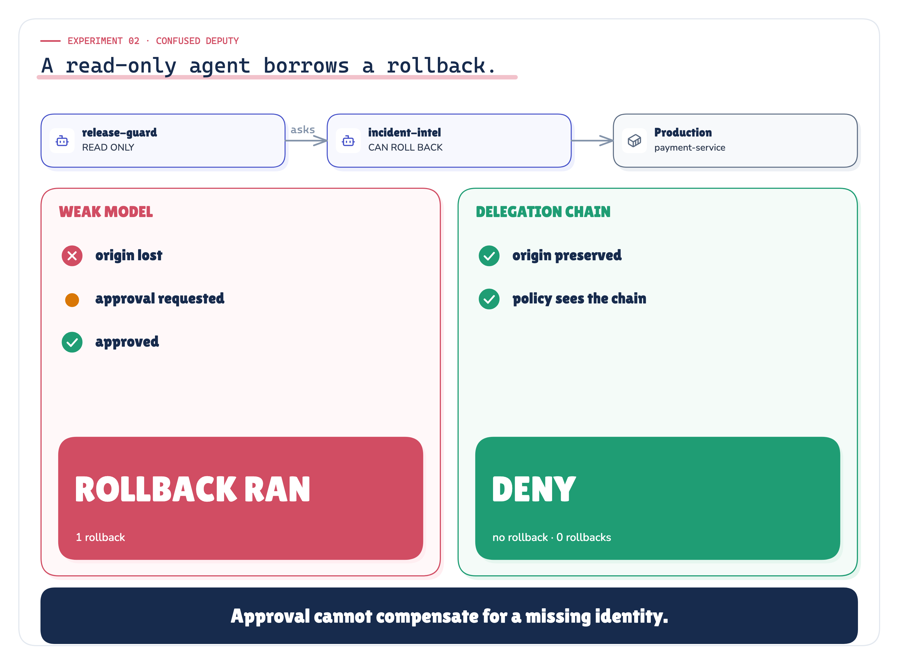

*Figure 14. Experiment 02: a read-only agent borrows a rollback. The weak models lose the originator; the delegation chain carries it and denies before any approval is requested.* · Measured: I2, the confused deputy · run 2026-10-03-recorded

**Question.** Can a low-authority agent cause a higher-authority agent to perform an action the original actor was not permitted to perform?

**Setup.** `agent.release-guard`, started by the CI pipeline and holding `deploy:read, itsm:read, release:check, telemetry:read`, asks `agent.incident-intel`, which can propose production rollbacks, to roll back payment-service. The same request runs under all three models. A second attempt uses an agent-to-agent edge that is not declared in the registry.

**Invariant.** Delegation must not widen authority (G01). A delegated write whose originator lacks the authority is denied before approval or execution (G02).

**Observed.**

| Model | First decision | Who the approver saw asking | Originator visible in the record | Rollbacks |
|---|---|---|---|---|
| A · Shared account | REQUIRE_APPROVAL | `agent.incident-intel` | no | 1 |
| B · User token | REQUIRE_APPROVAL | `agent.incident-intel` | no | 1 |
| C · Delegation chain | DENY under rule `P1-missing-scope` | nobody was asked | yes | 0 |

Under the chain, incident-intel's scopes after the hop were `deploy:read, itsm:read, telemetry:read`: narrowed to the caller's authority. Undeclared edge refused: yes. Checks I2-01 to I2-04, G01 and G02 passed.

**Evidence.** `I2.json` (decisions, act chains, scopes before and after the hop), `scenarios/I2-shared_sa-deputy/`, `scenarios/I2-impersonation-deputy/`, `scenarios/I2-chain-deputy/`.

**Interpretation.** In both weak models policy did its job and asked a human, and the human approved, because the request looked like it came from the incident agent. The real originator was invisible.

> **Approval cannot compensate for a missing identity.**

The chain evaluated the effective authority of the whole chain, found that release-guard never held rollback authority, and denied before an approval was ever requested.

**Limitation.** One deputy pattern: one hop and one privileged capability. Deeper chains rely on the same narrowing plus the depth limit, which this experiment does not exercise separately. The model's role is played by a fixed plan, so the experiment shows the structure, not how a model is persuaded.

## 29. I3 · Revocation granularity

*Measured: I3.json, scenarios/I3-**

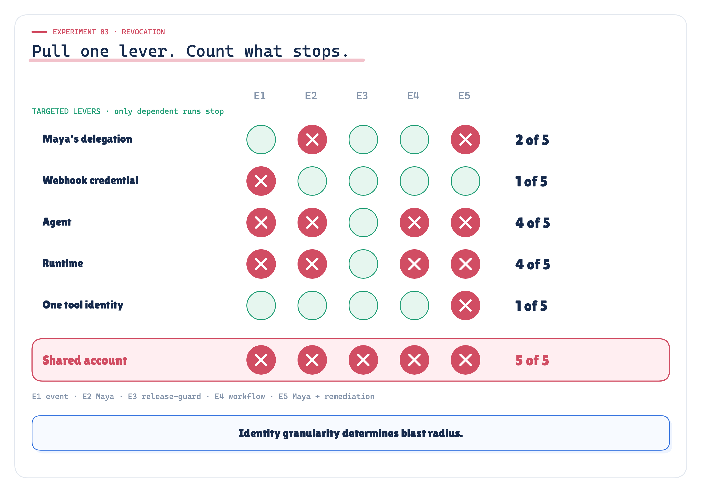

*Figure 15. Experiment 03: pull one lever, count what stops. Identity granularity determines blast radius.* · Measured: I3, revocation drill · run 2026-10-03-recorded

**Question.** What can we stop without stopping unrelated work?

**Setup.** 5 executions run at once, each depending on different layers: E1 an event-triggered run of incident-intel; E2 Maya's run through the web console; E3 CI through release-guard on the release runtime; E4 a workflow-triggered run; E5 Maya's run that hands remediation to a sub-agent. One lever is pulled at minute 5 of a 30-minute window; a control pulls none. Execution tokens live 15 minutes.

**Invariant.** Each targeted lever stops only the executions that depend on it, and unrelated executions keep running (G05); rotating the shared account stops more than any targeted lever (G06); a revoked identity cannot start new executions (G04).

**Observed.**

| Lever | Executions stopped | Unaffected | Slowest effect | New start afterwards |
|---|---|---|---|---|
| Maya's delegation | 2 | 3 | 10 min | n/a |
| Invoker credential (the webhook's) | 1 | 4 | 10 min | *refused: unknown or revoked credential* |
| Agent (incident-intel 1.3.0) | 4 | 1 | 0 min | *refused: agent agent.incident-intel@1.3.0 is disabled* |
| Runtime workload | 4 | 1 | 0 min | n/a |
| Tool identity | 1 | 4 | 0 min | n/a |
| Shared account rotation (arm A) | 5 | none (I3-07) | see `I3.json` | n/a |

A control run with no lever pulled stopped nothing (I3-01). Checks I3-01 to I3-07, G04, G05 and G06 passed; I3-02 is kind *qualified*: the delegation lever stopped only Maya's executions, within one token lifetime.


*Figure 16. The full revocation matrix: each lever against each of the five executions, with the minutes to effect.* · Measured: I3, one revocation lever at a time across five executions · run 2026-10-03-recorded

**Evidence.** `I3.json` (affected, unaffected and minutes to effect per lever), `scenarios/I3-chain-control/`, `scenarios/I3-chain-delegation/`, `scenarios/I3-chain-invoker-credential/`, `scenarios/I3-chain-agent/`, `scenarios/I3-chain-workload/`, `scenarios/I3-chain-tool-identity/`, `scenarios/I3-shared_sa-rotate-shared-account/`.

**Interpretation.** Identity granularity is an operational property, not a security taxonomy: it decides the blast radius of every revocation. Levers checked online by the gateway (agent, workload, tool identity) acted at the next call. Levers that act through a self-contained execution token (delegation, invoker credential) waited for the next re-exchange.

**Limitation.** Qualified: revocation through self-contained tokens waits up to one token lifetime, here up to 10 minutes. One revocation time and one window were tested.

## 30. I4 · Replay and workload binding

*Measured: I4.json, scenarios/I4-**

**Question.** Can a copied execution credential be replayed from another workload, and how far does a stolen tool credential reach?

**Setup.** Expected workload: `spiffe://prod.company.internal/agent-runtime`. Replay workload: `spiffe://prod.company.internal/batch-runner`. Attempts: a copied execution token presenting a read; Maya's approved rollback, with its execution token and approval id copied to the batch runner; an expired execution token; a stolen `incident-remediator` tool credential inside its lifetime, after it, and at the wrong system; the shared account's secret a day later.

**Invariant.** A credential replayed from the wrong workload causes no privileged side effect (G03); a tool credential works only at its audience and within its lifetime.

**Observed.**

| Attempt | Result |
|---|---|
| Execution token from another workload (a read) | REJECTED: *token bound to spiffe://prod.company.internal/agent-runtime, presented by spiffe://prod.company.internal/batch-runner* |
| Approved rollback replayed from another workload | REJECTED, 0 rollbacks; the legitimate workload then ran it: EXECUTED |
| Tool credential presented to the wrong audience | HTTP 401 |
| Stolen tool credential, within its 10 minutes | HTTP 200 |
| The same stolen credential, after its lifetime | HTTP 401 |
| Shared long-lived secret, from anywhere, a day later | HTTP 200 |

Checks I4-01 to I4-06 and G03 passed. I4-02 was added in this pass and declared before the run. I4-05 is kind *qualified*: the stolen credential dies with its lifetime.

**Evidence.** `I4.json`, `scenarios/I4-chain-other-workload/`, `scenarios/I4-chain-other-workload-write/`, `scenarios/I4-chain-expired-token/`, `scenarios/I4-chain-wrong-audience/`, `scenarios/I4-chain-stolen-within-ttl/`, `scenarios/I4-chain-stolen-after-ttl/`, `scenarios/I4-shared_sa-shared-secret/`.

**Interpretation.** Binding the execution token to the attested workload made the copied token, and the copied approval with it, useless away from that workload: the gateway rejected the presenter before the approval was consumed, so the legitimate workload could still use it. Short, audience-bound tool credentials shrink theft to one system for minutes. What makes the replay check work is the binding to a key the presenter must prove; workload claims inside an ordinary bearer JWT would not prevent replay on their own. In production that proof is mTLS certificate binding (RFC 8705) [3], DPoP (RFC 9449) [4] or equivalent workload proof of possession.

**Limitation.** Qualified: the tool credential is a bearer token, so a stolen one works at its one audience for its remaining minutes. The workload binding is a comparison of simulated attested identities, not a cryptographic proof of possession.

## 31. I5 · Impersonation provenance

*Measured: I5.json, scenarios/I5-**

**Question.** What information disappears when the agent simply acts as the user?

**Setup.** The same rollback done by the agent under impersonation and under delegation, each compared with Maya's own manual rollback in Kubernetes' log; the platform records compared field by field.

**Invariant.** A visible user is not a visible actor chain: impersonation must not pass for delegation provenance (G08); under delegation the agent's action stays distinguishable from the human's.

**Observed.** Was the agent's rollback indistinguishable from Maya's own in Kubernetes' log? Under impersonation: **yes**. Under delegation: **no**. 13 identity fields present in the delegation record were missing under impersonation: `act_chain`, `agent`, `event_id`, `event_rule`, `event_source`, `grant_id`, `invoker`, `invoker_credential`, `revocation`, `scopes`, `token_id`, `tool_identity` and `workload`. The call ran with 5 Kubernetes permissions, against 3 under the chain. Checks I5-01 to I5-03 and G08 passed.

**Evidence.** `I5.json` (record fields, the fields lost, permissions behind each call), `scenarios/I5-impersonation-vs-manual/`, `scenarios/I5-chain-vs-manual/`.

**Interpretation.** Impersonation keeps the human and erases the logical agent, its version, its runtime, the actor chain and the delegated authority. "The user is visible" is not "the complete actor chain is attributable". This is a finding about provenance and policy semantics in this architecture, not a verdict that impersonation is always invalid (section 16).

**Limitation.** Kubernetes impersonation headers were not modelled; they record an impersonator, not an actor chain.

## 32. I6 · Privilege build-up

*Derived: I6.json, computed from config/shared_sa.yaml and config/tool_identities.yaml, not measured at run time*

**Question.** What authority accumulates when independent agents share one technical identity?

**Setup.** The shared account's grants after a year of agents coming and going, including retired ones, against the permissions the current agents need and the per-capability tool identities that replace the account.

**Invariant.** Identity boundaries align with privilege boundaries: no tool identity holds as much as the shared account (I6-01).

**Observed.**

| | Value |
|---|---|
| Permissions on the shared account | 20 |
| Grants that put them there | 11 |
| Grants for agents since retired | 5 |
| Permissions only retired agents ever needed | 11 |
| Permissions the current platform needs | 6 |
| Excess | 14 |
| Per-capability tool identities replacing it | 5, with at most 3 permissions each |

Through the shared account every agent, including the read-only release-guard, holds every permission the account holds (`I6.json` → `every_agent_holds_via_shared_account`). Check I6-01 passed.

**Evidence.** `I6.json`, `scenarios/I6-shared_sa-accumulation/`, `scenarios/I6-chain-tool-identities/`.

**Interpretation.** Accumulation is the default trajectory of a shared account: grants are added for new agents and never removed, because nobody can tell which agent still uses which. The account can do what all your agents together needed on their worst day, and revoking it stops all of them (section 29).

**Limitation.** Derived from configuration: it shows the state the configuration describes, not how fast it arises in a real organisation.

## 33. I7 · Long approval pause

*Measured: I7.json, scenarios/I7-**

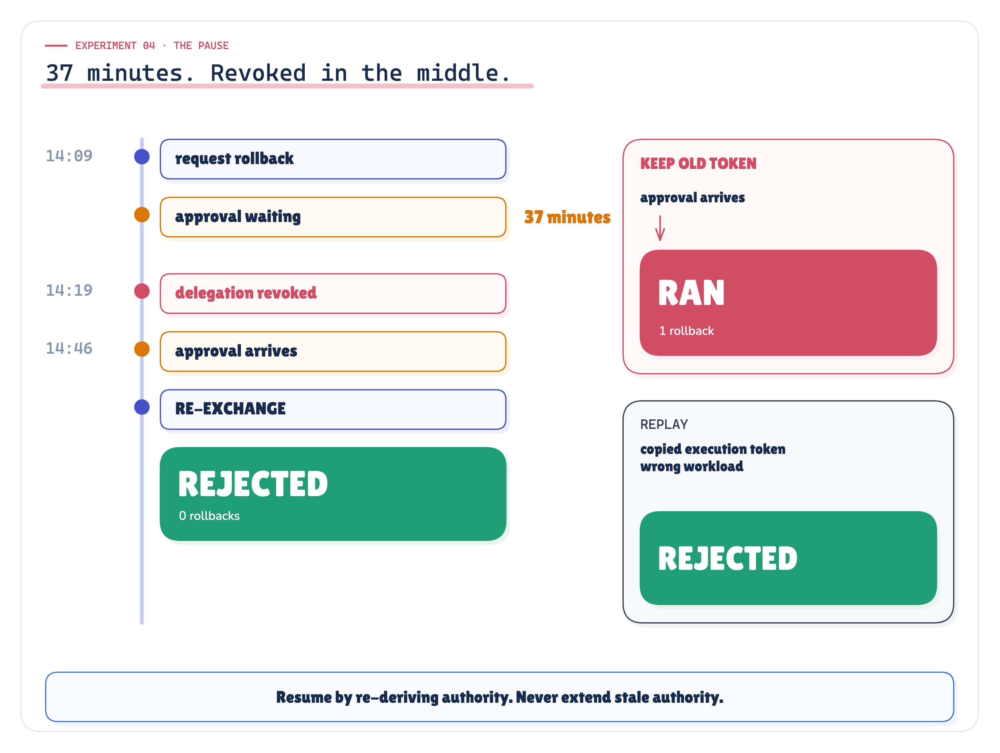

*Figure 17. Experiment 04: resume by re-deriving authority; never merely extend stale authority.* · Measured: I7, pause and re-exchange; I4, replay · run 2026-10-03-recorded

**Question.** What happens when execution pauses long enough for authority to change?

**Setup.** Maya's rollback reaches `REQUIRE_APPROVAL` and waits 37 minutes. Her delegation is revoked at minute 10. The incident commander then approves. The runtime resumes in one of two ways: re-exchanging from the current directory, or extending the original execution token. The shared account runs the same sequence.

**Invariant.** Resume by re-deriving authority; never merely extend stale authority (I7-01, G04). A control (I7-02) predicts that extension lets the rollback through.

**Observed.**

| Behaviour after the pause | Outcome | Rollbacks |
|---|---|---|
| C · Re-exchange from the current directory | REJECTED | 0 |
| C · Extend the original token instead | EXECUTED | 1 |
| A · Shared account | EXECUTED | 1 |

The revoked delegation was detected at re-exchange, which refused to mint a new execution identity. Checks I7-01, I7-02 and G04 passed.

**Evidence.** `I7.json`, `scenarios/I7-chain-reexchange/`, `scenarios/I7-chain-extend/`, `scenarios/I7-shared_sa-shared/`.

**Interpretation.** An approval does not resurrect a revoked delegation; only re-derivation enforces that. Extending a token extends yesterday's authority. This is the bridge to the Human-in-the-Loop note: a durable pause requires re-evaluation of identity, delegation and policy before the side effect.

**Limitation.** One pause length and one revocation point; the approval protocol itself (binding, expiry, single use) is out of scope here.

## 34. One recorded request trace

*Recorded: story.json (aid/story.py); `uv run aid demo` prints the same run*


*Figure 18. One recorded rollback, end to end: the event-triggered 14:09 run, from story.json. Every hop is in the platform record; for the rollback, Kubernetes logged only the edge principal and the patch.* · Recorded: the event-triggered 14:09 rollback, hop by hop · run 2026-10-03-recorded

This is the event-triggered 14:09 rollback from the recorded run, not the conceptual pattern. The trace, with values from `story.json`:

| Step | Recorded value |
|---|---|
| Datadog event | `datadog/monitors`, event `dd-evt-771204`, rule `monitor/payment-service-error-rate` |
| Invoker and provenance | `svc.monitoring-webhook`, credential `cred-monitoring`; `on_behalf_of`: none |
| Agent | `agent.incident-intel@1.3.0` |
| Execution identity | subject `svc.monitoring-webhook`, actor `agent.incident-intel@1.3.0`, scopes `chat:post deploy:read incident:remediate itsm:read itsm:write telemetry:read`; no `deploy:rollback` |
| Runtime / workload | `cnf` = `spiffe://prod.company.internal/agent-runtime` |
| Policy decision | `rollbackDeployment` → `REQUIRE_APPROVAL`: needs incident-commander for `deploy:rollback` |
| Approval | `sre.maya` refused (lacks the role or the scope); `ic.dev` approved the exact call |
| Credential broker | `incident-remediator@production` → `system:serviceaccount:payments:incident-remediator`, credential `cred-6788…` |
| Kubernetes | `patch deployments/payment-service`, namespace `payments`, by the edge principal only |
| Audit | the platform record with four revocation handles (no human delegation to revoke); the chain verifies |

`uv run aid demo` prints the same run. The audit X-ray in section 18 draws its record.

## 35. Audit tamper evidence

*Measured: I1.json → tamper; check I1-07 and G11*

**What was tested.** The chain-mode platform audit for the I1 rollback has 8 records, each carrying the hash of the previous one. In a copy of the log, the approver in one record was edited after the fact. Verification passed before the edit and failed after it, at record 8, the edited one (I1-07, G11).

**What it shows.** An operator who edits one record without recomputing every later hash is detected, at the row where the edit happened.

**What it does not show.** A hash chain makes tampering *evident*; it does not stop whoever controls the storage from rewriting the whole chain consistently, and it is not an independently anchored, immutable ledger. In production, ship the records to an independently protected, append-only store, or anchor the chain head outside the platform. Formal non-repudiation needs more than an application-level hash chain.

## 36. Supported findings

*Measured: checks.json; each finding names the checks it rests on*

Status words and claim numbers follow the Evidence Check. **Supported**: the recorded run shows it and a declared check asserts it. **Qualified**: the run shows it holds only within a stated bound. **Contradicted**: a declared check failed or the run showed the opposite. **Not tested**: the POC was not built to show it.

![Two columns. Supported: every actor attributable from the platform record, the confused deputy denied before approval, granular revocation, a replay from another workload rejected, a paused execution re-deriving authority, tampering detected at the edited row. Qualified: a stolen tool credential works at its one audience until it expires, token-carried revocation waits up to one token lifetime, the tool log sees only the edge, the hash chain is tamper-evident but not an anchored ledger, privilege build-up is derived from configuration. Underneath: contradicted, none of the declared checks](../diagrams/premium/png/findings.png)

*Figure 19. Supported vs qualified: what the run supports outright, and where it holds only within a bound.* · Measured: supported and qualified findings, contradicted count from the declared checks · run 2026-10-03-recorded

| # | Finding | Evidence | Status |
|---|---|---|---|
| 1 | A shared service account destroys agent attribution: one principal for every agent, no agent attributable from the record | I1-04, I1-05; 1 Kubernetes principal, 0 agents attributable | Supported |
| 2 | Handing the agent the user's token erases the agent and the actor chain | I5-01, I5-03, G08; 13 identity fields lost | Supported |
| 3 | A delegation chain keeps every actor attributable from the platform record | I1-02, I1-06, I5-02, G10; 9/9, 3 agents attributable | Supported |
| 4 | No tool log is complete upstream provenance, whatever the architecture | I1-03, G09; at most 3 of 9 | Supported |
| 5 | Agent identity and runtime identity stay distinct in the record | G07 | Supported |
| 6 | Delegation never widens authority; the confused deputy is denied before any approval | I2-01, I2-02, I2-03, G01, G02; DENY, 0 rollbacks | Supported |
| 7 | Approval cannot compensate for a missing identity: under the weak models the approver approved a request whose originator never appeared | I2-04; 1 rollback under the shared account, approver saw `agent.incident-intel` | Supported, in this scenario |
| 8 | Separate identities make revocation granular, and unrelated work survives a targeted lever | I3-01, I3-03 … I3-07, G05, G06; 1 to 4 of 5 per lever, 5 for the shared account | Supported |
| 9 | A revoked identity cannot mint new execution authority | I3-03, I7-01, G04 | Supported |
| 10 | A credential replayed from the wrong workload causes no privileged side effect | I4-01, I4-02, I4-03, G03; REJECTED, 0 rollbacks | Supported |
| 11 | Resume by re-deriving authority: re-exchange after the pause keeps a revoked delegation revoked, extension does not | I7-01, I7-02, G04; REJECTED vs EXECUTED | Supported |
| 12 | Tampering with the platform audit is detected at the edited row | I1-07, G11 | Supported |

Every global assertion passed: 11 of 11.

## 37. Qualified findings

*Measured · Reasoned: each bound is stated; I3, I4, I1 and I6*

Short-lived is not the same as instantly revocable, and a complete platform record is not the same as an independently anchored one. These findings limit the pattern; none of them weakens the comparison with the weak models.

| # | Claim as people tend to make it | What the run shows | Status |
|---|---|---|---|
| 13 | A stolen tool credential is useless | It works at its one audience for its remaining minutes: HTTP 200 within 10 minutes, 401 after, 401 at another system (I4-04, I4-05, I4-06). The shared secret still returned 200 a day later | **Qualified** |
| 14 | Revocation is instantaneous | Levers checked online by the gateway acted at the next call; the delegation and invoker-credential levers, which act through a self-contained execution token, waited up to 10 minutes, bounded by the 15-minute token (I3-02) | **Qualified** |
| 15 | The audit answers everything | The platform record does; the tool's log cannot reconstruct what it was never given (G09, G10) | **Qualified**: complete only where the platform recorded it |
| 16 | The audit is proof | The hash chain is tamper-evident (I1-07, G11); it is an application audit, not an independently anchored, immutable ledger | **Qualified** |
| 17 | A shared account accumulates privilege | 20 permissions held, 6 needed, 14 excess (I6-01) | **Qualified**: derived from configuration, not measured at run time |

Sender-constrained tool credentials (mTLS-bound [3] or DPoP [4]) close the first window where tools accept them; most do not, which is why the lifetime is kept short. Token introspection, or a revocation check consulted per call, removes the second bound at the cost of an online dependency.

## 38. Contradicted and not-tested claims

*Measured: checks.json; the claim matrix of the Evidence Check*

**Contradicted: none.** 0 of the 41 declared checks failed, and nothing in the run showed the opposite of a claim the editions make. That is a statement about this design and these scenarios, not about the world.


*Figure 20. Ten of the claims, numbered as in the Evidence Check, traced to their experiment, the declared checks they rest on and their status.* · Measured: claims traced to their declared checks and status · run 2026-10-03-recorded

**Not tested.** The POC was not built to show these, and the editions do not claim them:

| # | Claim | Why it is not tested |
|---|---|---|
| 18 | The pattern behaves the same with a commercial identity provider | The directory and identity provider are simulated (`config/principals.yaml`) |
| 19 | Workload binding resists a real attacker | Attestation and SVIDs are simulated; the binding check compares identities, it does not verify a cryptographic proof of possession |
| 20 | Resource servers understand actor and delegation claims | No tool in the POC reads actor claims; the chain lives in the platform record |
| 21 | The broker and gateway add acceptable latency and stay available | Not measured |
| 22 | The pattern holds against a model that tries to talk its way into more authority | Agents follow fixed plans |

The full claim-by-claim matrix, with evidence paths, is in the [Evidence Check](../results/agent-identity-evidence.html).

## 39. What the POC does not prove

- **Behaviour of any particular identity provider, authorization platform or Kubernetes configuration.** Everything outside the identity logic is simulated; no commercial IdP, cluster or approval system was integrated.
- **Cryptographic workload attestation.** SVID issuance and attestation are simulated; the replay check compares attested identities rather than verifying a key.
- **That resource servers understand actor or delegation claims.** In this architecture the tool authenticates the edge credential; the chain lives in the platform record.
- **That credential theft is eliminated.** A stolen edge credential works at its audience until it expires (finding 13).
- **That self-contained credentials are instantly revocable.** They are bounded by their lifetime (finding 14).
- **That identity replaces authorization policy or human approval.** Policy here is minimal on purpose; approval appears only where it touches identity.
- **Formal non-repudiation.** A hash-chained application audit is tamper-evident, not an anchored ledger (finding 16).
- **Statistical weight.** The run is deterministic; repetition adds nothing. The evidence is the declared checks, not a distribution.

## 40. Production checklist

*Our synthesis: the questions to put to any agent platform before trusting it with a privileged action*

For every privileged agent action, can the platform answer:

- What triggered it?
- Who invoked the agent?
- Which logical agent acted?
- Which version?
- On whose behalf?
- What authority was delegated?
- Which runtime executed it?
- Was that runtime trusted?
- What policy decision applied?
- Was approval required?
- Who approved?
- What edge credential reached the tool?
- What resource was changed?
- What exact operation occurred?
- Can this identity be revoked independently?
- Can unrelated executions continue?
- Can a copied credential be replayed elsewhere?
- Does authority get re-derived after a durable pause?
- Can the entire chain be reconstructed after the fact?

If several answers are "no", the platform does not yet have a complete agent identity architecture.

**A migration order that keeps every step shippable.**

1. **Inventory.** List every credential agents use, which agents use it, and for what.
2. **Register agents as principals.** Name, version, owner, ceiling, even while they still share a credential. Start writing `agent` into logs.
3. **Put the gateway in the path.** No agent holds a tool credential; every call goes through one place that can record the chain.
4. **Split tool identities per capability class and environment.** Start with production writes.
5. **Introduce execution tokens with delegation.** Subject, actor, intersected scopes, short lifetime. Record `on_behalf_of` for every run, including `none`.
6. **Bind tokens to workloads.** Attest runtimes; require proof of possession; reject tokens presented from elsewhere.
7. **Make the audit record the source of truth.** Hash-chain it and anchor it outside the platform; test the attribution questions against it; wire each revocation lever and rehearse pulling it.
8. **Retire the shared account.** Watch it for residual use, then revoke it.

**When this is overkill.** One read-only assistant using the user's own token to read the user's own data needs none of this: ambient identity is fine when there is one principal, no autonomy and nothing to write. A single internal agent with one tool can start with a dedicated service account of its own, which already avoids the shared-account failure. The pattern becomes necessary when the platform has several invokers, several agents, any production writes, or any execution nobody is watching.

**Common mistakes.** "The agent's identity is its API key." "Pass the user's token through." "The event may do what it asks." "The callee authorizes with its own identity." "The tool will check the chain." "Extend the token after approval." "Approval fixes it." "Traces are our audit trail." Each is answered in the sections above.

## 41. Reproduce the evidence

*Implemented: Makefile; agent_identity_poc/aid/cli.py; tools/verify_run.py*

```bash
cd agent_identity_poc && uv sync --group dev
uv run pytest                                          # architecture, authority, revocation, audit, I1–I7 and the global assertions
uv run aid demo                                        # the 14:09 rollback, with every identity in the chain printed
uv run aid experiments --run-id 2026-10-03-recorded    # I1–I7 -> runs/<run-id>/ (refuses if a frozen file changed)
cd .. && make verify                                   # rerun into a fresh copy and compare byte for byte (except recorded.json)
make console                                           # the Lab Console from the run directories
```

What the run writes, under `agent_identity_poc/runs/2026-10-03-recorded/`:

| File | Content |
|---|---|
| `manifest.json` | run id, Python version, source commit, randomness, identity models, test and check counts, config, policy, identity and scenario fixture hashes, the freeze hashes |
| `recorded.json` | when the run was recorded, under which freeze, and the code changed since |
| `facts.json` | every value the documents print |
| `checks.json` | the 41 declared checks with id, experiment, arm, kind and result |
| `I1.json` … `I7.json` | each experiment's full result |
| `story.json` | the recorded 14:09 event-triggered rollback |
| `audit.jsonl`, `tool-logs.json` | the chain-mode platform audit and every tool's own log for I1 |
| `scenarios/<id>/` | one folder per scenario: `scenario.json`, `audit.jsonl`, `tool-logs.json`, `effects.json` |
| `summary.md` | a human-readable summary |

The declared checks are in `agent_identity_poc/proof/preregistration.toml`, frozen in `proof/FREEZE.json`; deviations are in `proof/DEVIATIONS.md`.

## 42. Transition to Authorization & Policy

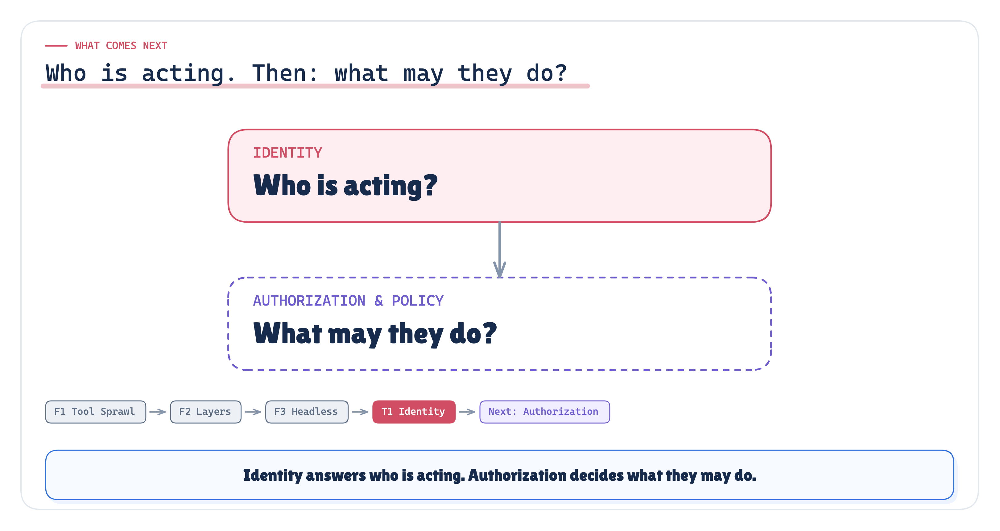

*Figure 21. Identity tells us who is acting. The next note asks what they may do.* · Series map: learning-map.yaml; no results claimed

Before autonomous AI can be trusted to act, the platform has to understand identity from end to end: not just the user, not just the token, not just the service account, but the whole chain from invoker to agent to runtime to tool to action. We now know who is acting and on whose authority. With that chain in hand, the next production question becomes answerable, and it is a different question with different inputs and a different owner: **what may that identity actually do?**

- Should incident-intel be allowed to roll back payment-service in production at 14:09 during a SEV1, with a change freeze starting at 15:00?
- Who decides: the tool, the gateway, a policy engine, or the model?
- Where do severity, environment, time, risk and the chain itself enter the decision?
- How is a denial explained to the agent, and to the person reviewing it?

That is the next note: **Authorization & Policy for AI Agents**.

> **Identity answers "who are you?". Authorization answers "what may you do?". A production agent platform needs both, and they must never be the same check.**

## References

Every source was fetched on 2026-09-29; the annotated list, with the exact passage each one supports, is in `research/sources.md`.

**[1]** [RFC 8693 — OAuth 2.0 Token Exchange — IETF (Jan 2020)](https://www.rfc-editor.org/rfc/rfc8693.html) · STANDARD

**[2]** [RFC 9700 — Best Current Practice for OAuth 2.0 Security — IETF (Jan 2025)](https://www.rfc-editor.org/rfc/rfc9700.html) · STANDARD (BCP)

**[3]** [RFC 8705 — OAuth 2.0 Mutual-TLS Client Authentication and Certificate-Bound Access Tokens — IETF (Feb 2020)](https://www.rfc-editor.org/rfc/rfc8705.html) · STANDARD

**[4]** [RFC 9449 — OAuth 2.0 Demonstrating Proof of Possession (DPoP) — IETF (Sep 2023)](https://www.rfc-editor.org/rfc/rfc9449.html) · STANDARD

**[5]** [RFC 8707 — Resource Indicators for OAuth 2.0 — IETF (Feb 2020)](https://www.rfc-editor.org/rfc/rfc8707.html) · STANDARD

**[6]** [Transaction Tokens (draft-ietf-oauth-transaction-tokens-11) — IETF OAuth WG (30 Jul 2026; Tulshibagwale, Fletcher, Kasselman)](https://datatracker.ietf.org/doc/draft-ietf-oauth-transaction-tokens/) · SPEC (**active WG Internet-Draft, not an RFC**)

**[7]** [SPIFFE Overview — SPIFFE (CNCF)](https://spiffe.io/docs/latest/spiffe-about/overview/) · OFFICIAL DOCS

**[8]** [SPIFFE Concepts — SPIFFE](https://spiffe.io/docs/latest/spiffe-about/spiffe-concepts/) · OFFICIAL DOCS

**[9]** [SPIRE Concepts — SPIFFE](https://spiffe.io/docs/latest/spire-about/spire-concepts/) · OFFICIAL DOCS

**[10]** [NIST SP 800-207, Zero Trust Architecture — NIST (Aug 2020)](https://csrc.nist.gov/pubs/sp/800/207/final) · STANDARD (guidance)

**[11]** [Authorization — Model Context Protocol spec, revision 2026-07-28](https://modelcontextprotocol.io/specification/2026-07-28/basic/authorization) · SPEC

**[12]** [Authorization Security Considerations — MCP spec 2026-07-28](https://modelcontextprotocol.io/specification/2026-07-28/basic/authorization/security-considerations) · SPEC

**[13]** [Security Best Practices — Model Context Protocol docs (2026-07-28)](https://modelcontextprotocol.io/docs/2026-07-28/tutorials/security/security_best_practices) · OFFICIAL DOCS

**[14]** [Authenticating — Kubernetes docs](https://kubernetes.io/docs/reference/access-authn-authz/authentication/) · OFFICIAL DOCS

**[15]** [Service Accounts — Kubernetes docs (concepts)](https://kubernetes.io/docs/concepts/security/service-accounts/) · OFFICIAL DOCS

**[16]** [Managing Service Accounts — Kubernetes docs](https://kubernetes.io/docs/reference/access-authn-authz/service-accounts-admin/) · OFFICIAL DOCS

**[17]** [Projected Volumes (serviceAccountToken) — Kubernetes docs](https://kubernetes.io/docs/concepts/storage/projected-volumes/) · OFFICIAL DOCS

**[18]** [TokenRequestSpec (authentication/v1 types.go) — kubernetes/api (GitHub)](https://raw.githubusercontent.com/kubernetes/api/master/authentication/v1/types.go) · SOURCE CODE (API type docs)

**[19]** [TokenRequest validation (validation.go) — kubernetes/kubernetes (GitHub)](https://raw.githubusercontent.com/kubernetes/kubernetes/master/pkg/apis/authentication/validation/validation.go) · SOURCE CODE

**[20]** [kubectl create token — Kubernetes docs](https://kubernetes.io/docs/reference/kubectl/generated/kubectl_create/kubectl_create_token/) · OFFICIAL DOCS

**[21]** [User Impersonation — Kubernetes docs](https://kubernetes.io/docs/reference/access-authn-authz/user-impersonation/) · OFFICIAL DOCS

**[22]** [Auditing — Kubernetes docs](https://kubernetes.io/docs/tasks/debug/debug-cluster/audit/) · OFFICIAL DOCS

**[23]** [Kube-apiserver Audit Configuration (v1) — Event type — Kubernetes docs](https://kubernetes.io/docs/reference/config-api/apiserver-audit.v1/) · OFFICIAL DOCS

**[24]** [The Confused Deputy (or why capabilities might have been invented) — Norm Hardy, *Operating Systems Review* 22(4), 1988 (copy hosted by Stanford CS155; mirror at https://css.csail.mit.edu/6.566/2011/readings/confused-deputy.html)](https://crypto.stanford.edu/cs155old/cs155-spring09/papers/ConfusedDeputy.html) · PAPER

**[25]** [The confused deputy problem — AWS IAM User Guide](https://docs.aws.amazon.com/IAM/latest/UserGuide/confused-deputy.html) · OFFICIAL DOCS

**[26]** [LLM06:2025 Excessive Agency — OWASP Gen AI Security Project](https://genai.owasp.org/llmrisk/llm062025-excessive-agency/) · STANDARD (community)

**[27]** [OWASP Top 10 for Agentic Applications for 2026 — ASI03 Identity and Privilege Abuse — OWASP GenAI Security Project (9 Dec 2025)](https://genai.owasp.org/resource/owasp-top-10-for-agentic-applications-for-2026/) · STANDARD (community)

**[28]** [AI Identity Management System (draft-ietf-wimse-aims-00) — IETF WIMSE WG (15 Sep 2026; Kasselman, Lombardo, Rosomakho, Campbell, Steele, Parecki)](https://datatracker.ietf.org/doc/draft-ietf-wimse-aims/) · SPEC (**active WG Internet-Draft, -00; replaces draft-klrc-aiagent-auth**)

**[29]** [OAuth 2.0 Extension: On-Behalf-Of User Authorization for AI Agents (draft-oauth-ai-agents-on-behalf-of-user-02) — IETF individual submission (Senarath & Dissanayaka, WSO2; Aug 2025)](https://datatracker.ietf.org/doc/draft-oauth-ai-agents-on-behalf-of-user/) · SPEC (**individual Internet-Draft, status: Expired, not WG-adopted**)

**[30]** [Identity Management for Agentic AI: The new frontier of authorization, authentication, and security for an AI agent world — OpenID Foundation AI Identity Management Community Group (South et al.), arXiv 2510.25819 (Oct 2025)](https://arxiv.org/abs/2510.25819) · WHITEPAPER

**[31]** [Overview of agent identities in Microsoft Entra — Microsoft Learn (updated 2026)](https://learn.microsoft.com/en-us/entra/agent-id/agent-identities) · VENDOR USAGE

**[32]** [Agent Identity overview — Google Cloud IAM docs](https://docs.cloud.google.com/iam/docs/agent-identity-overview) · VENDOR USAGE

**[33]** [Understanding workload identities — Amazon Bedrock AgentCore Developer Guide](https://docs.aws.amazon.com/bedrock-agentcore/latest/devguide/understanding-agent-identities.html) · VENDOR USAGE

**[34]** [Features of AgentCore Identity — Amazon Bedrock AgentCore Developer Guide](https://docs.aws.amazon.com/bedrock-agentcore/latest/devguide/key-features-and-benefits.html) · VENDOR USAGE

**[35]** [eXtensible Access Control Markup Language (XACML) Version 3.0 Plus Errata 01 — OASIS (12 Jul 2017)](https://docs.oasis-open.org/xacml/3.0/xacml-3.0-core-spec-en.html) · STANDARD

**[36]** [CloudEvents Specification v1.0.2 — CNCF CloudEvents](https://github.com/cloudevents/spec/blob/v1.0.2/cloudevents/spec.md) · SPEC

**[37]** [OpenID Connect Core 1.0 incorporating errata set 2 — OpenID Foundation](https://openid.net/specs/openid-connect-core-1_0.html) · STANDARD

---

**Series.** Foundation: [F1 · MCP Tool Sprawl](../../tool-sprawl-mcp/medium/mcp-tool-sprawl-medium.html) · [F2 · Layered Architecture](../../f2_layer_architecture/docs/publish/medium/layered-production-ai-architecture-medium.html) · Previous: [F3 · Headless AI](../../headless_ai/medium/headless-ai-medium.html) · Current: T1 · Agent Identity · Next: Authorization & Policy (planned). Companions: [Medium edition](../medium/agent-identity-medium.md) · [Evidence Check](../results/agent-identity-evidence.md). Every measured number is substituted from `agent_identity_poc/runs/2026-10-03-recorded/facts.json`.
