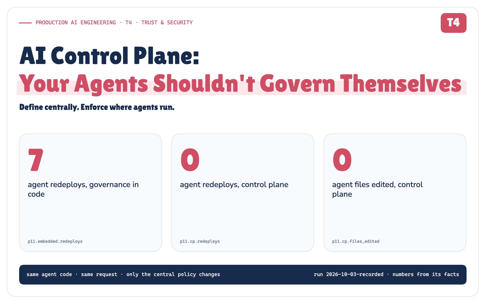

# AI Control Plane: Your Agents Shouldn't Govern Themselves

*Define centrally. Enforce where agents run. At one agent, governance can live inside the agent; at fifty, every policy change becomes a deployment problem. A small, runnable control plane tests the one property that matters.*

**Production AI Engineering · T4 · Trust & Security**

*Chapter 9 of 15. New here? Start with [Start Here: What It Takes to Run AI Agents in Production](https://eresh-gorantla.medium.com/start-here-a-hands-on-map-of-production-ai-engineering-5056549657db).*



At one agent, governance can live inside the agent. At fifty, the same model rules, tool permissions, approval gates, budgets and emergency controls are copied across dozens of codebases, and every policy change becomes a deployment problem.

An AI control plane changes the unit of governance from **the agent** to **the platform**. I built a small one to test the one property that matters:

> **Can I change one central policy and make the same running agents behave differently, without editing, restarting or redeploying them?**

The answer is yes. Same agent code. Same runtime process. Same request. Under policy v1, a production restart executed. Under policy v2, the same restart stopped for human approval.

The agent did not change. **Its operating boundary did.**

*How to read the figures.* Purple: the control plane and desired state · teal: runtime enforcement · indigo: agents · blue: tools, MCP and execution resources · orange: human approval and online governance · amber: qualified, stale, warning · green: allowed, executed, held · red: denied, unsafe, the negative control · grey: observed state and infrastructure. Badges: `ARCHITECTURE` conceptual design · `MEASURED` a recorded POC result · `SIMULATED` a simulated external system · `QUALIFIED` held only within a stated bound · `NEGATIVE CONTROL` the property broke by design, as intended.

## Four governance changes

The post-incident review for INC-4471, the payment-service incident this series has followed since Headless AI, ended with four action items:

1. **Production restarts need an incident commander.**
2. **Disable `observability-mcp` everywhere.** The vendor published an advisory.
3. **Suspend the incident agent** while we look at a suspected prompt injection.
4. **Move the standard model profile to `large-model`.**

None of them is about what an agent *does*. They're about the boundaries every agent operates within. So the first question is a platform question:

> **How many agent repositories do we need to edit?**

In the version most teams have after their first few agents, the answer is "all of them". Each agent carries its boundaries in its own code: its model name, its tool allowlist, an `if environment == "production"` approval rule, its budget, its credentials. I built exactly that version of three agents (incident, support and finance) and applied the four action items the only way it allows. It took **7 file edits**, **17 changed lines** and **7 agent redeploys**. Until each redeploy happened, the running incident agent kept doing what the review had just forbidden.

Then I made the same four changes through a control plane: **4 versions, 0 agent files edited, 0 redeploys**, each change in force at the agent's next step. That difference is this article.

> **Agents should contain business reasoning, not enterprise governance.**

## One agent is easy. Fifty changes the problem.

With one agent, embedded governance is the fastest way to ship:

```yaml
model: fast-model
tools: [query_logs, query_metrics, restart_service]
budget: 10
approval_required: false
```

At five agents, teams copy that file. Each copy is right when it's written. Then the copies drift: one team updates its model, another raises a limit, a third forgets the approval rule because its agent "only restarts staging". At fifty, a policy change is fifty pull requests and fifty redeploys. At five hundred, nobody can say which rule is live.


`ARCHITECTURE` `MEASURED` *Figure 1. Embedded governance at 1, 5, 50 and 500 agents. Only the bottom strip is measured.* · Concept + measured: the 1/5/50/500 counts are illustrative; the bottom strip is P11 · run 2026-10-03-recorded

The platform owner's questions stop having answers:

- Who owns agent 47, and is it still meant to be running?
- **Which policy version governed yesterday's restart?**
- Which models may see confidential data?
- How do I revoke one MCP server for every agent, now?
- How do I suspend a compromised agent without a deployment?
- How do I change an approval rule without redeploying dozens of services?

None of these is about an agent's reasoning. All of them are about the platform. **Without a control plane, hundreds of agents become hundreds of independently governed applications.**

## What the control plane actually is

The term comes from networking: a router's data plane moves packets, but "the routing policies have to be created and distributed from somewhere, and that's where the control plane comes in" [3]. Applied to agents:

> **An AI control plane is the management layer that defines, versions, distributes and governs the identities, policies, models, tools, limits, approvals and lifecycle state under which AI agents operate. It doesn't run agents. It decides the boundaries they run within.**

No standard defines an "AI control plane". This definition is the series' synthesis of an established pattern, and it separates four roles that are often blurred into one box:


`ARCHITECTURE` *Figure 2. Runtime executes. Control plane governs. Enforcement points enforce. Observability proves.* · Architecture: concept figure (our synthesis); no measured values

> **Runtime executes. Control plane governs. Enforcement points enforce. Observability proves.**

**It's a logical boundary, not one service:** a registry, a policy service, a model gateway's configuration, an approval service and a budget service can all be parts of it. And **it isn't in the path of every token.** A router doesn't ask its control plane about every packet. Envoy keeps applying "the last valid configuration" when an update is rejected [5], and OPA evaluates signed policy bundles locally [8]. The AI equivalent publishes a signed, versioned bundle that each runtime caches and enforces locally. A control plane that every model call must round-trip through is a synchronous mega-proxy, a bottleneck and a single point of failure, not a control plane.

> **Central governance. Distributed enforcement.**

## Desired state vs observed state

The idea I borrowed most directly is Kubernetes' control loop: declare the desired state, and controllers act to "move the current cluster state closer to the desired state" [1]. Kubernetes isn't an AI control plane. It governs containers, not agents. What carries over is the pattern. For agents, the desired state is governance:

```yaml
agent: incident-agent
version: v18
models: { profile: standard }        # the control plane resolves the actual model
tools:
  query_logs: allow
  restart_service:
    - { when: { environment: staging },    effect: allow }
    - { when: { environment: production }, effect: approval_required }
  delete_resource: deny
limits: { max_tool_calls: 30, max_cost_per_run: 10 }
status: active
```

The observed state is what a runtime reports back: which agent ran on which runtime, under which policy version, with which model, how many tool calls, at what cost, and which approval is still pending. When the desired state says `v18` and a runtime reports `v17`, that gap has a name: **drift**.

![Six steps in a row: declare desired state, distribute a signed versioned bundle, enforce locally at every call, observe which version actually ran, audit every decision with its version and rule, reconcile; a dashed arrow returns to the start. Beneath, desired v18 against observed v17 equals drift; and, as recorded in P10, the control plane published v2, runtime rt-a observed v2 and held the restart, runtime rt-b behind a lagging replica observed v1 and executed it. Detected, not prevented: 2 drift findings.](../diagrams/premium/png/control-loop.png)

`ARCHITECTURE` `MEASURED` *Figure 3. The control loop: declare, distribute, enforce, observe, audit, reconcile. Desired v18, observed v17: drift.* · Architecture + recorded: the loop is our synthesis; the lower panel is P10's desired and observed versions · run 2026-10-03-recorded

The part people skip is the bottom half. **Publishing a policy isn't the same as that policy being in force.** Some runtime hasn't picked it up yet, and whatever it did meanwhile happened under the old rules. So every decision in the POC names the version and the rule it was made under; without those two fields, drift is invisible and audit is guesswork. Observability feeds the loop without being control: nothing in a trace can stop the next call [17].

## What it governs

Grouped by the question each part answers, not as a feature list:


`ARCHITECTURE` *Figure 4. What the control plane governs, by the question each part answers.* · Architecture: concept figure (our synthesis); no measured values

- **Who.** Every agent has an owner, a purpose, a risk level, a lifecycle status and an identity binding, T1's chain bound in one place [26]. An unregistered agent gets no decisions at all.
- **What.** T2's *who may do what, to which resource* [27], answered centrally instead of in prompts and `if` statements. MCP can expose tools; the control plane decides which agents may use which trusted servers and tools [14]. Agents name a data class, not a model.
- **How much, and with whose sign-off.** Budgets metered centrally, so two replicas can't each spend the whole budget. T3's approval gate [28], with its policy defined here.
- **How it changes.** Every change is a new immutable version, rolled out gradually, with a fast path to suspend an agent or disable a tool, a server or a model.
- **Credentials, by reference.** The control plane holds `secret://deploy/restart`, never the secret. A broker mints a short-lived credential at call time [13].

What changes for the people writing agents is the vocabulary. The agent developer expresses business intent, the capability it needs, the data's classification and the workflow. The platform decides the eligible model, the approved tool, whether approval is required, the budget, the credential's scope. Good agent code says *restart this service*. Bad agent code says *call deploy-server-v17 with prod-root-secret after reading a copy of policy.yaml*.

## What the POC proves

The property I wanted to prove is narrow, and everything else hangs off it:

> **What this POC proves, and what it doesn't**
>
> **Proves (P2, with P1 as its baseline).** A centrally versioned policy change can alter the governed behaviour of long-lived agents without changing, restarting or redeploying them.
> 
> **Supporting proofs.** Approval (P3), suspension (P4), budgets (P5), revoking a tool server (P6), model governance (P7), staged rollout (P8), and who may change the control plane itself (P12). **Boundary tests:** a control-plane outage (P9) and a stale runtime (P10). **Negative control:** the same rules embedded in each agent (P11).
> 
> **Does not prove.** Enterprise scale, high availability, network latency, production distributed consistency, LLM safety, MCP protocol interoperability (the MCP servers are simulated), or production throughput.


`ARCHITECTURE` `SIMULATED` *Figure 5. The POC: proofs change the control plane and observe a long-lived runtime.* · Implemented: the POC's components and files; no measured values

The runtime is a separate operating-system process, started once per scenario and never restarted. Before every tool or model call it checks for a new signed bundle, decides locally, and writes an audit event naming the version and the rule. The agents are three short Python files with fixed plans, so the recorded run is deterministic, and a test fails the build if one names a model or mentions `allow`, `deny`, `budget` or `policy`. The systems they act on are simulated systems of record, and every side effect is counted there, never taken from what an agent says it did.

## The core proof

The runtime process starts. The incident agent asks to restart `payment-service` in production. Then *only* the control plane changes: action item 1 is published as `v2`. The same process gets the same request again.

**THE EXPERIMENT THAT MATTERS**


`MEASURED` *Figure 6. P2, the core proof: one central change, nothing else.* · Recorded: P2 · run 2026-10-03-recorded

**That is the POC. Everything after it asks what else becomes centrally controllable, and where that guarantee stops.**

The record holds all three things fixed and says so: agent source `677bca2acd66` before and `677bca2acd66` after; runtime process `rt-a/pid-1` for both requests; request hash `cb0531217710` both times. The deploy system shows 1 restart after the first request and still 1 after the second. The change touched 0 files under the POC's source tree and 4 in the control plane's store: the new bundle, its signature, the distribution pointer and the change log. And P2 is built to fail honestly: tests rerun it with the agent's code edited, with the runtime restarted and with the request altered, and each time it fails.

```text
╭────────────────────────────────────────────────────────────────────────────────╮
│ P2 — CENTRAL POLICY CHANGE                                                     │
├────────────────────────────────────────────────────────────────────────────────┤
│ Agent              incident-agent                                              │
│ Agent code         sha256 677bca2acd66…  UNCHANGED                             │
│ Runtime process    started once · SAME process for both requests               │
│ Request            restart_service payment-service production (identical)      │
│ Before             v1 → ALLOW → executed                                       │
│ Central change     v2 · restart-requires-approval · platform.admin             │
│ After              v2 → APPROVAL_REQUIRED → NOT executed                       │
│ Approval           approval-001 (pending)                                      │
│ Files changed      acp/: 0 · control plane store: 4                            │
│ BEFORE → AFTER                                                                 │
│   agent SHA        677bca2acd66 → 677bca2acd66  (same)                         │
│   runtime PID      rt-a/pid-1 → rt-a/pid-1  (same process)                     │
│   request hash     cb0531217710 → cb0531217710  (same)                         │
│   control plane    v1 → v2                                                     │
│   decision         ALLOW → APPROVAL_REQUIRED                                   │
│   restarts         1 → 1  (no new side effect)                                 │
│   agent edits      0 · redeploys 0                                             │
│ Audit              action.executed (v1) → approval.requested (v2)              │
╰────────────────────────────────────────────────────────────────────────────────╯
  ✓ same request: request hash cb0531217710 before and after
  ✓ same runtime process: rt-a/pid-1 answered both requests, never restarted
  ✓ same agent code: sha256 677bca2acd66 before, at import and after
  ✓ files changed under acp/ by the policy change: 0
  ✓ control plane store changed (new bundle, signature, pointer, changelog)
  ✓ before: v1 ALLOW, executed
  ✓ after: v2 APPROVAL_REQUIRED, not executed
  ✓ deploy system still shows 1 restart (the side effect did not happen)
  ✓ approval request emitted and pending

  PROOF P2: PASS
  Test assertions: 9/9 passed
```

*Proof card P2, verbatim from `control_plane_poc/runs/2026-10-03-recorded/proof.txt` (printed by `acp proof P2`).*

**Want to inspect the evidence?** [Lab Console](https://github.com/ereshzealous/ai_blogs_poc/blob/main/ai_control_plane_poc/results/t4-results.md) (Explore every run) · [Evidence Check](https://github.com/ereshzealous/ai_blogs_poc/blob/main/ai_control_plane_poc/results/ai-control-plane-evidence.md) (Claim → proof) · [Real vs simulated](https://github.com/ereshzealous/ai_blogs_poc/blob/main/ai_control_plane_poc/results/ai-control-plane-real-vs-simulated.md) (What was actually run) · [Technical deep dive](https://github.com/ereshzealous/ai_blogs_poc/blob/main/ai_control_plane_poc/technical/ai-control-plane-technical.pdf) (The full architecture)

*"But where's the AI?"* Fixed plans make the proof reproducible; the claim doesn't depend on them. An optional live mode (`make live`) lets a self-hosted model (`qwen3:8b` on Ollama) choose each step, with logs that tell it to delete a production database. It is not exercised in this evidence and proves nothing about models: what the runtime enforces is the same either way, and refusing a model's proposal is damage containment, not prompt-injection prevention.

## What else becomes centrally controllable

Every other proof follows the same pattern: change the control plane, never the agents, and read the effect from the systems of record. They are not twelve equal tests; each has a role.


`MEASURED` `QUALIFIED` `NEGATIVE CONTROL` *Figure 7. The proof hierarchy: core, capability, boundaries, negative control, governing the governor.* · Measured: every proof · run 2026-10-03-recorded

- **Approval (P3).** The held restart ran once, after an eligible human approved it; a duplicate resume was refused, and so was the agent's attempt to approve itself.
- **Suspend (P4).** A suspension published mid-run stopped that run at its next step: 0 of its 2 later calls executed, and another agent kept working.
- **Budgets (P5).** A quota of 2 tool calls denied the third, and an exhausted budget denied the next run at start.
- **Revoke an MCP server (P6).** One change cut `observability-mcp` off from every agent that used it, and from no other. The servers are simulated, so this is central revocation, not MCP interoperability.
- **Models (P7).** The default moved from `fast-model` to `large-model` with 0 model names in agent code; confidential data with no cleared model failed closed instead of falling back.
- **Rollout (P8).** A 25% canary reached 4 of 20 runs; rollback returned all of them to stable.

The **negative control** (P11) is the opening's embedded baseline, and it is not a failed test. It removes the control plane and shows the property breaking, by design: edits, redeploys, and a running process that kept the old rule. The run's test assertions all passed, 100 of 100; the architectural outcomes are 12 held, 2 qualified, and 1 negative control broken as expected.

**Governing the governor** (P12) comes last, because whoever can publish a bundle can change what every agent may do. An agent trying to grant itself a tool was rejected; a team lead changing another team's agent was rejected; the support lead tightening its *own* agent's quota was `accepted`; widening alone, self-approval and break-glass widening were rejected; a plaintext credential was `rejected` before it could become a version. Of 10 attempts, 3 were accepted and 7 rejected, every one on a hash-chained change log, and editing a single row breaks the chain. That is a tamper-evident local log under POC assumptions, not an immutable audit store. Every step and input is in the [Lab Console](https://github.com/ereshzealous/ai_blogs_poc/blob/main/ai_control_plane_poc/results/t4-results.md).

## Where the guarantee stops

Amazon calls the goal static stability: the data plane "keeps working even when a dependency becomes impaired" [4]. For agents, a stale read and a stale production write have very different blast radii. Two tests probe the edges:

![Left, partition, P9, qualified: cannot receive new policy; low-risk read ran on last-known-good v1; production write failed closed, CONTROL_PLANE_UNREACHABLE; past the staleness bound, deny all, POLICY_STALE; a bundle altered in transit was rejected; a kill switch published during the partition waited, and 3 calls ran before it arrived. Right, stale runtime, P10, qualified: desired v2, observed v1; rt-a on v2 held the restart; rt-b, behind a lagging replica, on v1 executed it; detected, not prevented, 2 drift findings, 0 stale after reconcile. Bottom, production options: minimum policy epoch, bundle lease, freshness fence, online authorization, acknowledged revocation, each trading availability for a stronger revocation guarantee.](../diagrams/premium/png/guarantee-boundaries.png)

`MEASURED` `QUALIFIED` *Figure 8. Where the guarantee stops: a partition (P9) and a stale runtime (P10).* · Measured: P9 (outage, tampered bundle) and P10 (drift); the production options are architecture · run 2026-10-03-recorded

**Partition (P9).** Cut off from its control plane, the runtime kept reading on the last-known-good bundle and failed every production write closed. Past the staleness bound it denied everything, and a bundle altered in transit never applied. But a suspension published during the partition couldn't arrive: **3** read and model calls ran after the agent was, on paper, suspended. "A central kill switch stops every runtime instantly" is a claim this run does not support.

**Stale runtime (P10).** One runtime sat behind a replica that kept serving the old pointer, with no error. It executed a restart the current policy would have held. The control plane didn't prevent that. It *saw* it: 2 drift findings, then 0 stale runtimes after the replica was fixed.

> **Publishing a policy is not the same as proving every runtime is enforcing it.**

Central governance is still a distributed-systems problem. The Update Framework's answer to a system fed old metadata is that "trust should expire if it is not renewed" [21]. Where a stale write is unacceptable, production can buy freshness for exactly those actions, with bundle leases, a minimum policy epoch or acknowledged revocation. Each one trades availability for a stronger guarantee.

> **A kill switch is only as fast as its propagation path.**

## From the POC to production

The POC intentionally compresses production components into a small deterministic implementation so it can isolate the architectural property under test. Each piece maps to something real:

![Two columns joined by arrows: local config and a directory become a replicated configuration and policy service; HMAC signing becomes KMS or HSM asymmetric signing; the local decision function becomes an SDK, gateway or sidecar enforcement point; the local approval queue becomes a durable workflow; simulated MCP becomes real MCP and tool infrastructure; in-process credential minting becomes a secret broker with leases; local budgets become an atomic distributed budget service; the local hash-chained log becomes an immutable centralized audit store; the logical clock becomes real TTLs, leases and staleness. Banner: the architectural invariant carries over; production adds distribution, durability, consistency, security and availability.](../diagrams/premium/png/poc-to-production.png)

`ARCHITECTURE` *Figure 9. What each POC piece stands in for in production.* · Architecture: mapping (our synthesis); no measured values

**The architectural invariant carries over; production adds real distribution, durability, consistency, security and availability constraints.** It doesn't carry over unchanged: every guarantee above becomes a statement about propagation, freshness and failure.

Centralization alone isn't safe governance, either. A control plane can be built badly:

- **Policy hidden in prompts.** `Never call delete_database` in a system prompt is guidance. `delete_database: DENY` at an enforcement point is control [18].
- **A control plane on every token.** One giant synchronous governance service is a bottleneck and an outage waiting to happen.
- **No versions, no rollback,** and a kill switch with no propagation model.
- **A plaintext secret store.** The control plane should hold references; a broker should hold secrets.
- **Observability without the policy version,** which makes "what governed this?" unanswerable.
- **Agents able to modify their own governance,** or a control plane that has started to hold business reasoning.

## The production architecture

Most decisions are local, against the cached, signed bundle. A few can't be: approvals, credential issuance, a shared budget at its limit, high-risk authorization that needs live context, and freshness or revocation checks for the actions where a stale answer is unacceptable. Those are **online governance services**, called only when needed. They're the runtime's real online dependencies, so each one needs its own failure policy.

![Top, the AI control plane: registry, identity, policy, tools, models, approvals, budgets, versions, runtime state, credentials by reference, rollouts and emergency controls. Signed desired state flows down to the agent runtime (planning, reasoning, memory, workflow, business reasoning only), then to local enforcement (policy cache, PDP and PEP, tool gate, model gate, limits, guardrails, data policy), then to execution resources (models, MCP, APIs, databases). Beside local enforcement, dashed online governance when needed: approvals, credentials, shared budgets, high-risk authorization, freshness and revocation checks. On the right, observability and audit records what happened and feeds observed state back to the control plane.](../diagrams/premium/png/production-architecture.png)

`ARCHITECTURE` *Figure 10. The production architecture: define centrally, enforce where agents run.* · Architecture: the reference architecture, reduced for the Medium edition (our synthesis); no measured values

F1 through T3 each built one mechanism: tools, layers, identity, authorization, approvals [24] [26] [27] [28]. The control plane doesn't replace those primitives; it coordinates their governance, giving them one owner, one version history, one change process and one switch.

> **Agents decide how to accomplish a task. The control plane decides the boundaries within which they are allowed to operate.**

Clone the POC from [GitHub](https://github.com/ereshzealous/ai_blogs_poc/tree/main/ai_control_plane_poc) and run `make demo` to watch the same process behave differently after one central change. The [technical edition](https://github.com/ereshzealous/ai_blogs_poc/blob/main/ai_control_plane_poc/technical/ai-control-plane-technical.pdf) has the contracts, the failure semantics, every result and a production checklist; the [Evidence Check](https://github.com/ereshzealous/ai_blogs_poc/blob/main/ai_control_plane_poc/results/ai-control-plane-evidence.md) traces each claim to its proof.

## Sources

Every source was fetched and its supporting passage quoted in `research/sources.md`, together with what it does *not* support.

**[1]** Kubernetes — Controllers. [kubernetes.io/docs/concepts/architecture/controller](https://kubernetes.io/docs/concepts/architecture/controller/). Control loops; desired state vs current state.

**[2]** Kubernetes — Components. [kubernetes.io/docs/concepts/overview/components](https://kubernetes.io/docs/concepts/overview/components/). A control plane that manages the overall state of the cluster.

**[3]** AWS — Control planes and data planes (AWS Fault Isolation Boundaries). [docs.aws.amazon.com/whitepapers/latest/aws-fault-isolation-boundaries/control-planes-and-data-planes.html](https://docs.aws.amazon.com/whitepapers/latest/aws-fault-isolation-boundaries/control-planes-and-data-planes.html). Policies created and distributed from the control plane; simpler data planes.

**[4]** Amazon Builders' Library — Static stability using Availability Zones. [aws.amazon.com/builders-library/static-stability-using-availability-zones](https://aws.amazon.com/builders-library/static-stability-using-availability-zones/). Control plane vs data plane; statically stable data planes.

**[5]** Envoy — xDS REST and gRPC protocol. [envoyproxy.io/docs/envoy/latest/api-docs/xds_protocol](https://www.envoyproxy.io/docs/envoy/latest/api-docs/xds_protocol). Versioned resources; last valid configuration kept on rejection; eventual consistency.

**[6]** Istio — Architecture. [istio.io/latest/docs/ops/deployment/architecture](https://istio.io/latest/docs/ops/deployment/architecture/). A mesh logically split into data plane and control plane.

**[7]** Open Policy Agent — Documentation. [openpolicyagent.org/docs](https://www.openpolicyagent.org/docs). Decoupling policy decision-making from enforcement.

**[8]** Open Policy Agent — Bundles. [openpolicyagent.org/docs/management-bundles](https://www.openpolicyagent.org/docs/management-bundles). Signed bundles; polling; persisted last-activated bundle.

**[9]** Open Policy Agent — Decision Logs. [openpolicyagent.org/docs/management-decision-logs](https://www.openpolicyagent.org/docs/management-decision-logs). Decision events with bundle metadata for auditing.

**[10]** NIST SP 800-207 — Zero Trust Architecture. [csrc.nist.gov/pubs/sp/800/207/final](https://csrc.nist.gov/pubs/sp/800/207/final). Per-request least-privilege decisions; non-person entities, including AI agents.

**[11]** SPIFFE — Concepts. [spiffe.io/docs/latest/spiffe-about/spiffe-concepts](https://spiffe.io/docs/latest/spiffe-about/spiffe-concepts/). Workload identity; short-lived SVIDs.

**[12]** RFC 8693 — OAuth 2.0 Token Exchange. [rfc-editor.org/rfc/rfc8693](https://www.rfc-editor.org/rfc/rfc8693.html). Delegation vs impersonation.

**[13]** HashiCorp Vault — Lease, Renew, and Revoke. [developer.hashicorp.com/vault/docs/concepts/lease](https://developer.hashicorp.com/vault/docs/concepts/lease). Leased dynamic secrets; immediate revocation.

**[14]** Model Context Protocol — Authorization (2026-07-28). [modelcontextprotocol.io/specification/2026-07-28/basic/authorization](https://modelcontextprotocol.io/specification/2026-07-28/basic/authorization). Servers validate token audience.

**[15]** Model Context Protocol — Tools (2026-07-28). [modelcontextprotocol.io/specification/2026-07-28/server/tools](https://modelcontextprotocol.io/specification/2026-07-28/server/tools). Human in the loop SHOULD; no mandated interaction model.

**[16]** Model Context Protocol — The MCP Registry. [modelcontextprotocol.io/registry/about](https://modelcontextprotocol.io/registry/about). Public servers only; private registries recommended for private servers.

**[17]** OpenTelemetry — Semantic conventions for generative AI. [github.com/open-telemetry/semantic-conventions-genai](https://github.com/open-telemetry/semantic-conventions-genai). Model, tool and agent spans (status: Development).

**[18]** OWASP — LLM06:2025 Excessive Agency. [genai.owasp.org/llmrisk/llm062025-excessive-agency](https://genai.owasp.org/llmrisk/llm062025-excessive-agency/). Complete mediation in downstream systems.

**[19]** OWASP — Top 10 for Agentic Applications for 2026. [genai.owasp.org/resource/owasp-top-10-for-agentic-applications-for-2026](https://genai.owasp.org/resource/owasp-top-10-for-agentic-applications-for-2026/). Governed agent identity; short-lived scoped credentials.

**[20]** NIST AI RMF 1.0 (NIST AI 100-1). [nvlpubs.nist.gov/nistpubs/ai/NIST.AI.100-1.pdf](https://nvlpubs.nist.gov/nistpubs/ai/NIST.AI.100-1.pdf). GOVERN: defined roles and responsibilities for human-AI configurations.

**[21]** The Update Framework — Security. [theupdateframework.io/docs/security](https://theupdateframework.io/docs/security/). Indefinite freeze attacks; trust should expire if not renewed.

**[22]** Pete Hodgson — Feature Toggles (aka Feature Flags). [martinfowler.com/articles/feature-toggles.html](https://martinfowler.com/articles/feature-toggles.html). Long-lived operational kill switches.

**[23]** Google — The Site Reliability Workbook, Canarying Releases. [sre.google/workbook/canarying-releases](https://sre.google/workbook/canarying-releases/). Canarying as a partial, time-limited deployment with evaluation.

**[24]** Production AI Engineering, F1 — Your AI Agent Has 500 MCP Tools. Now What? F1 · MCP Tool Sprawl.

**[25]** Production AI Engineering, F2 — Your Agent Works in a Demo. Why Does It Break in Production? F2 · Layered Agent Platform.

**[26]** Production AI Engineering, T1 — Agent Identity: Who Is Acting, and on Whose Authority? T1 · Agent Identity.

**[27]** Production AI Engineering, T2 — Authorization and Policy for AI Agents. T2 · Authorization & Policy.

**[28]** Production AI Engineering, T3 — the Human-in-the-Loop chapter. T3 · Human-in-the-Loop.

---

**Next in Production AI Engineering:** T5 · Observability & Governance

**Previously:** T3 · Human-in-the-Loop

**New to the series?** Start with the map of all fifteen chapters:

https://eresh-gorantla.medium.com/start-here-a-hands-on-map-of-production-ai-engineering-5056549657db

**Go deeper:** [Technical deep dive](https://github.com/ereshzealous/ai_blogs_poc/blob/main/ai_control_plane_poc/technical/ai-control-plane-technical.pdf) · [Results](https://github.com/ereshzealous/ai_blogs_poc/blob/main/ai_control_plane_poc/results/t4-results.md) · [Proof of concept on GitHub](https://github.com/ereshzealous/ai_blogs_poc/tree/main/ai_control_plane_poc)

*Every measured number is substituted from `control_plane_poc/runs/2026-10-03-recorded/facts.json`.*
