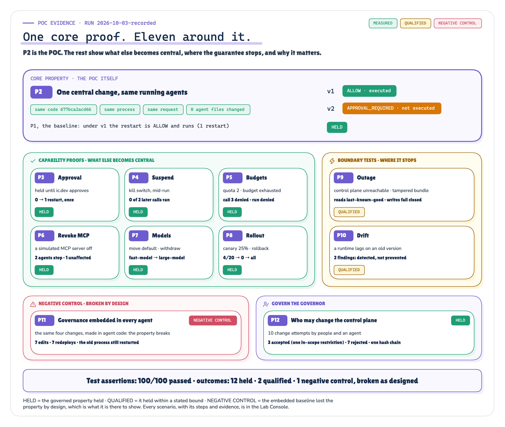

# T4 Evidence Check: AI Control Plane

*Each claim in the two editions, traced from claim to proof to raw evidence, with a status: supported, qualified, negative control, not supported, argued or not tested.*

Production AI Engineering · T4 · Evidence · Evidence Check · 2026-10-03

## 01 · The question we tested

When governance is defined in a control plane instead of inside each agent, **does one central change govern the runtime behaviour of several agents, without editing, restarting or redeploying any of them, and does that hold through approval, suspension, budgets, revocation, model changes, rollout, outage, drift and misuse of the control plane itself?**

The thesis under test: *agents should contain business reasoning, not enterprise governance.* Runtime executes. Control Plane governs. Enforcement points enforce. Observability proves.

## 02 · What ran

`MEASURED` `QUALIFIED` `NEGATIVE CONTROL` *Figure 1. The recorded run: twelve proofs, every scenario, with outcomes.* · Measured: every proof · run 2026-10-03-recorded

15 scenarios across 12 proofs, in a proof hierarchy: P1 baseline and P2 the core proof; P3–P8 capability; P9–P10 boundaries (qualified by design); P11 the negative control; P12 governs the governor. 16 separate long-lived runtime processes, 0 restarted; 34 signed bundle versions; 595 hash-chained runtime audit events. Agents follow fixed plans (no model); enterprise systems, MCP servers and models are simulated systems of record. The split is in [Real vs simulated](ai-control-plane-real-vs-simulated.html). Every recorded step is in the [Run report](ai-control-plane-report.html); every scenario's contract, steps and data lineage in the [Lab Console](lab-console.html).

Three counts, never merged:

| Count | Result | Where |
|---|---|---|
| Test assertions (each scenario's own checks) | 100 of 100 passed | `control_plane_poc/runs/2026-10-03-recorded/checks.json` |
| Proof checks (pae-proof/v1, comparisons over recorded facts) | 79 in 13 experiments: 73 pass, 2 limitation observed, 4 expected failure | `evidence/runs/2026-10-03-recorded/checks.jsonl` |
| Claims | 21: 12 supported, 2 qualified, 1 negative control, 2 not supported, 2 argued, 2 not tested | `proof/claims.toml` |

A *limitation observed* is a proof check that states the ideal and records that the run did not meet it: it is how the two qualified claims and the two not-supported claims below are measured, not a broken proof. An *expected failure* is the negative control breaking as designed.

## 03 · Integrity of the evidence

| Check | Result |
|---|---|
| rerun from source in a fresh copy (`make verify`) | EXACT: 240 files byte-identical, 15 equal once raw process ids are masked (the one declared normalization), 0 different |
| agent source hash, every scenario | `677bca2acd66`, one hash across the run, identical before, at import and after |
| runtime audit and control-plane change logs | 14 and 14 hash chains, every row recomputed |
| bundle signatures | 34 bundles, every HMAC-SHA256 signature verified; 0 plaintext credentials |
| request hashes | 93 of 93 recomputed from the recorded requests |
| side effects | read from the simulated systems of record, never from agent output |
| the whole package | `evidence/runs/2026-10-03-recorded/SHA256SUMS` (a checksum list, not a signature); `make evidence` prints PROOF VERIFICATION |

## 04 · Claims

<!-- claims:begin -->
Status: **Supported**, the recorded evidence shows it; **Qualified**, shown within a stated bound that a proof check measures; **Negative control**, the property broke by design when its safeguard was removed; **Not supported**, a stronger claim the evidence contradicts; *Argued*, reasoned in the editions but not tested; *Not tested*, outside this POC. Every status is tested against its checks by `make evidence`; prose is never the source of a status.

| # | Claim (either edition) | Proof | Proof checks | Observed | Raw evidence | Status |
|---|---|---|---|---|---|---|
| `T4-C01` | One central change altered an agent's governed behaviour with the same agent code, the same runtime process and the same request; no agent edit, no redeploy. | P2 | 10 PASS (T4-R2-C01…) | ALLOW under `v1` → APPROVAL_REQUIRED under `v2`; agent sha256 `677bca2acd66` → `677bca2acd66`; process `rt-a/pid-1` → `rt-a/pid-1`; request `cb0531217710` → `cb0531217710`; edits 0, redeploys 0; restarts 1 → 1 | `scenarios/P2-C-central-change/scenario.json` | Supported |
| `T4-C02` | Before any change the governed path allows the action, executes it once and attributes it to the version and rule that allowed it. | P1 | 4 PASS (T4-R1-C01…) | ALLOW under `v1` by `agents.incident-agent.tools.restart_service[1]`; 1 restart in the deploy system | `scenarios/P1-C-baseline/scenario.json` | Supported |
| `T4-C03` | A held action does not execute before an eligible human approves, executes exactly once after, and the agent cannot approve its own action. | P3 | 5 PASS (T4-R3-C01…) | 0 restarts before approval, 1 after; duplicate resume `ALREADY_EXECUTED`; 2 approvers refused, the agent among them | `scenarios/P3-C-approval/scenario.json` | Supported |
| `T4-C04` | A central suspension stops a run in flight at its next enforcement point, stops new runs, leaves other agents alone, and restoring needs a second person. | P4 | 5 PASS (T4-R4-C01…) | 0 of 2 later calls executed; new run `denied AGENT_SUSPENDED`; 4 calls of another agent executed; restore alone `rejected` | `scenarios/P4-C-suspend/scenario.json` | Supported |
| `T4-C05` | Central quotas and budgets are hard limits, enforced per call and per run. | P5 | 3 PASS (T4-R5-C01…) | call 3 `denied TOOL_CALL_BUDGET_EXCEEDED`; next run `denied DAILY_BUDGET_EXHAUSTED` | `scenarios/P5-C-budgets/scenario.json` | Supported |
| `T4-C06` | Disabling one MCP server centrally stops every agent that uses it, and no other. | P6 | 4 PASS (T4-R6-C01…) | 0 server calls after the revocation; 3 calls denied; 2 agents affected, 1 unaffected | `scenarios/P6-C-revoke-mcp/scenario.json` | Supported |
| `T4-C07` | Agents name no model; the default moves centrally, and confidential data fails closed rather than falling back to an uncleared model. | P7 | 4 PASS (T4-R7-C01…) | `fast-model` → `large-model`; confidential under v3: `DENIED NO_ALLOWED_MODEL_FOR_DATA_CLASS`; 0 model names in agent code | `scenarios/P7-C-models/scenario.json` | Supported |
| `T4-C08` | A governance change can be canaried, rolled back and promoted without touching agents. | P8 | 4 PASS (T4-R8-C01…) | canary 4/20 runs on the new version; after rollback 0; after promotion 10 | `scenarios/P8-C-canary/scenario.json` | Supported |
| `T4-C09` | Without its control plane, the runtime serves reads from last-known-good within a staleness bound and fails mutations closed; a suspension cannot reach a partitioned runtime, so exposure is bounded, not removed. | P9 | 4 PASS (T4-R9-C01…); bound: T4-R9-C08 LIMITATION OBSERVED | reads on `v1`; mutation `CONTROL_PLANE_UNREACHABLE`; past the bound `POLICY_STALE`; bound: 3 calls ran after the suspension was published | `scenarios/P9-C-outage/scenario.json` | **Qualified** (held within the stated bound: read and model calls kept running on last-known-good after the suspension was published, until the staleness bound) |
| `T4-C10` | A bundle altered in transit is rejected and never applied; with the credential broker down, no call is made, even one policy would allow. | P9 | 3 PASS (T4-R9-C05…) | 5 rejections, applied `v1`; broker down: 2 calls denied | `scenarios/P9-C-broker-down/scenario.json`, `scenarios/P9-C-tampered-bundle/scenario.json` | Supported |
| `T4-C11` | A silently stale runtime enforces the old rules; comparing desired and observed state detects it and the action it took. Detected, not prevented. | P10 | 4 PASS (T4-R10-C01…); bound: T4-R10-C05 LIMITATION OBSERVED | rt-b observed `v1` while `v2` was desired; 2 findings; 1 action under a superseded version; 0 stale after reconcile | `scenarios/P10-C-drift/scenario.json` | **Qualified** (detected, not prevented: the stale runtime executed an action under the superseded version before reconcile) |
| `T4-C12` | With governance embedded in each agent, a change is a code edit that a running process does not see until it is redeployed: the property P2 shows breaks, by design. | P11 | 1 PASS · 4 EXPECTED FAILURE (T4-R11-C04…) | 7 file edits, 7 redeploys; the running process after the edit: `executed`; 8 static credentials in agent code | `scenarios/P11-E-embedded/scenario.json` | **Negative control** |
| `T4-C13` | The same four changes through the control plane needed no agent edit and no redeploy. | P11 | 3 PASS (T4-R11-C01…) | 4 versions; 0 edits; 0 redeploys | `scenarios/P11-C-control-plane/scenario.json` | Supported |
| `T4-C14` | Agents cannot change the control plane; a team admin may restrict its own scope alone; widening needs a second person; break-glass only restricts; a plaintext credential never becomes a version; every attempt is on a tamper-evident local log under POC assumptions. | P12 | 11 PASS (T4-R12-C01…) | 10 attempts: 3 accepted (own-scope restriction `accepted`), 7 rejected (plaintext credential `rejected`); 11 rows verifying; one edited row verifies: `no` | `scenarios/P12-C-governing-the-control-plane/scenario.json` | Supported |
| `T4-C15` | The evidence holds together: every hash chain and bundle signature verifies, no bundle holds a plaintext credential, no runtime restarted, one agent source hash throughout, and a rerun from source is identical except for masked process ids. | evidence | 7 PASS (T4-R13-C01…) | 14 audit and 14 change-log chains verify; 34 bundle signatures verify; 0 runtime restarts; rerun EXACT: 0 files differ | `replay.json`, `scenarios/*/scenario.json` +5 | Supported |
| `T4-C16` | A central kill switch stops every runtime instantly. | P9 | 1 LIMITATION OBSERVED (T4-R9-C08) | 3 calls executed on a partitioned runtime after the suspension was published | `scenarios/P9-C-outage/scenario.json` | **Not supported** |
| `T4-C17` | Comparing desired and observed state prevents a stale runtime from acting. | P10 | 1 LIMITATION OBSERVED (T4-R10-C05) | 1 action executed under a superseded version before drift was reconciled | `scenarios/P10-C-drift/scenario.json` | **Not supported** |
| `T4-C18` | At 50 or 500 agents, embedded governance costs grow with every agent that embeds a rule, while a control plane change stays one version. | — | — | measured at three agents only | an extrapolation from P11, which measured three agents only | *Argued* |
| `T4-C19` | The control plane need not be in the path of every call; most decisions can be local against a cached, signed bundle. | — | — | not measured: no latency or availability figures | the design: the POC decides locally against a cached bundle, but no latency or availability was measured | *Argued* |
| `T4-C20` | Real MCP protocol interoperability. | — | — | no MCP protocol traffic | the MCP servers are simulated in-process boundaries; no MCP protocol traffic was exchanged | *Not tested* |
| `T4-C21` | Environment and tenant isolation, admin MFA, HA, backup and real key management of the control plane. | — | — | not exercised | not exercised: one machine, a POC signing key file, simulated principals | *Not tested* |
<!-- claims:end -->

## 05 · What this evidence does not show

- It does not show that any model will behave well. The agents follow fixed plans on purpose. The optional live mode (`make live`, L1–L3) puts a local LLM in the loop; it is **not exercised** in this evidence and its runs are illustrative.
- It does not measure latency, throughput or availability.
- It does not validate MCP protocol interoperability: the MCP servers are simulated boundaries, so P6 shows central revocation, not a real MCP deployment.
- The hash-chained logs are a tamper-evident local log under POC assumptions: one machine, a signing key in a file. They are not an immutable external audit store, and SHA256SUMS is not a signature.
- A kill switch is not instantaneous: a partitioned runtime kept serving reads on last-known-good until its staleness bound (T4-C16). Drift was detected, not prevented (T4-C17).
- The live L3 result (a local model proposing a forbidden delete that the runtime refused) is damage containment, not prompt-injection prevention.
- It does not test real network distribution, key management, tenant isolation, admin MFA, HA or backup.
- The embedded baseline is three agents; the edit and redeploy counts are for that estate.

## 06 · Raw artifacts

| Artifact | Where |
|---|---|
| Proof cards (printed output) | `control_plane_poc/runs/2026-10-03-recorded/proof.txt` |
| Test assertions | `…/checks.json` |
| All published numbers | `…/facts.json` |
| Proof hierarchy (role, property per proof) | `…/scenarios.json` |
| Per scenario: record, transcript, raw process ids, full state | `…/scenarios/<id>/scenario.json`, `transcript.jsonl`, `volatile.json`, `state/` (control plane bundles and change log, runtime audit and cache, approvals, spend, systems of record) |
| Proof pack (pae-proof/v1) | `evidence/runs/2026-10-03-recorded/{manifest.json, results.json, checks.jsonl, ledger.jsonl, summary.md, negative-control/results.json, replay.json, SHA256SUMS}` |
| Published run and its lineage | `evidence/published.json` (supersedes `2026-09-30-recorded`, whose raw evidence is kept unchanged) |
| Proof verification | `evidence/verification/verification.txt` (`make evidence`); final gate `verification/final_verification.md` (`make verify-all`) |

---

**Series.** Foundation: [F1 · MCP Tool Sprawl](../../tool-sprawl-mcp/medium/mcp-tool-sprawl-medium.html) · [F2 · Layered Architecture](../../f2_layer_architecture/docs/publish/medium/layered-production-ai-architecture-medium.html) · [F3 · Headless AI](../../headless_ai/medium/headless-ai-medium.html) · Trust: [T1 · Agent Identity](../../agent_identity/medium/agent-identity-medium.html) · [T2 · Authorization & Policy](../../auth_and_policy/medium/authorization-and-policy-for-ai-agents-medium.html) · Previous: [T3 · Human-in-the-Loop](../../human_in_the_loop/medium/human-in-the-loop-medium.html) · Current: T4 · AI Control Plane · Next: [T5 · Observability & Governance](../../governance_for_ai_agents/medium/observability-governance-medium.html). Companions: [Medium edition](../medium/ai-control-plane-medium.md) · [Technical deep dive](../technical/ai-control-plane-technical.md). Every measured number is substituted from `control_plane_poc/runs/2026-10-03-recorded/facts.json`.
