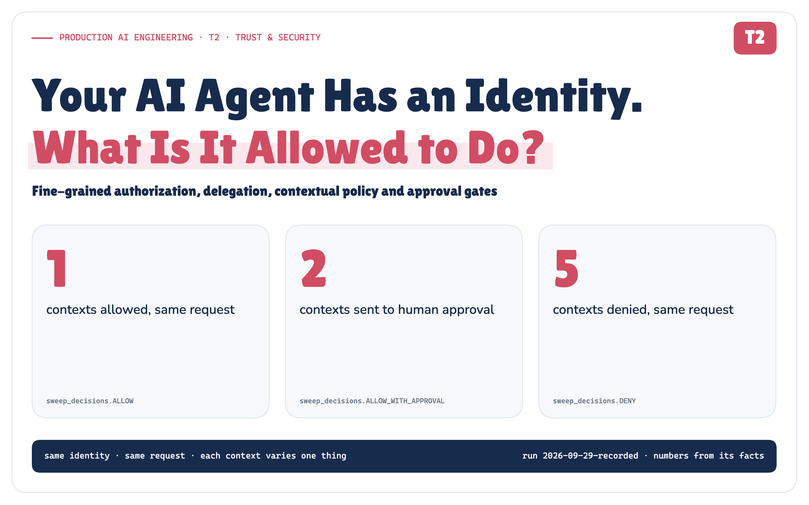

# Your AI Agent Has an Identity. What Is It Allowed to Do?

*A production architecture for fine-grained authorization, delegated authority, contextual policy, approval gates and auditable tool execution.*

**Production AI Engineering · T2 · Trust & Security**

*Chapter 7 of 15. New here? Start with [Start Here: What It Takes to Run AI Agents in Production](https://eresh-gorantla.medium.com/start-here-a-hands-on-map-of-production-ai-engineering-5056549657db).*



> **Identity tells us who is acting. Authorization tells us what that identity may do. Approval tells us when a human must still agree.**

The last article, *Agent Identity*, built the chain behind every agent action: invoker → agent → runtime → credential → action. It ended on a question it deliberately didn't answer:

*Should the incident agent be allowed to roll back payment-service in production, at 14:09, during a SEV-1, with a change freeze starting at 15:00? And who decides?*

This article answers it with a small POC that runs the same incident through a real policy engine. Every decision, identifier, timestamp and measured value in the POC figures comes from that run.

---

## 14:02–14:07. Same agent. Five asks. Five answers.

At 14:02 a Datadog monitor fires: **payment-service error rate 14%, against a 1% SLO**. Release `v4.18.0` shipped thirteen minutes earlier. The incident agent wakes up, and thanks to the last article the platform knows exactly who it is: `incident-agent-prod`, acting for `sre-team`.

Then it starts asking for things.


*Figure 1. Same identity, same run, five asks, five answers of four kinds.*

Nothing about *who* is asking changes between those five requests. What changes is **what** is being asked, **against what**, **where**, **when**, and **on whose authority**. That's authorization.

## Identity isn't permission

Knowing the caller is `incident-agent-prod` tells you nothing about whether it should delete `payments-canary`.

Many automation failures aren't identity failures at all. The automation was exactly who it claimed to be. It held a valid credential and did precisely what the credential allowed. The credential simply allowed too much, in too many situations, and nothing asked a second question.


*Figure 2. Three questions, three owners, and the six distinctions this article defends.*

Agents make the second question unavoidable. Traditional services usually have a predictable call graph: engineers decide most of their integrations when the software is built. An agent chooses tools at run time, chains actions into plans, reads untrusted text, and may spend authority someone else delegated to it. The authorization boundary has to survive decisions nobody wrote down in advance.

## Tool access is not authorization

After the MCP Tool Sprawl article, the agent's tool list includes the Kubernetes server. It's tempting to conclude that the agent "can use Kubernetes". But that server exposes reads, restarts, rollbacks, scaling, exec and deletion, across dozens of namespaces and several environments.

> **Access to the server is access to the menu, not permission to order everything on it.**

The question that matters looks like this:

```text
Can
  principal:     incident-agent-prod
  acting_for:    sre-team
  action:        kubernetes.rollbackDeployment
  resource:      deployment/payment-service
  environment:   production
  context:       INC-4471 · SEV-1 · normal window
                 diagnosis_evidence_score 0.94
?
```

Answering it takes four levels of granularity, each one narrowing the level above.


*Figure 3. An MCP allowlist decides the top band. Production needs all four.*

## Three lenses: RBAC, ReBAC, ABAC

For agents, the three classic authorization models answer three different questions.

**RBAC sets the ceiling**: the most this kind of agent may ever do. No agent role includes `deleteNamespace`, and with deny-by-default that settles it, whatever the prompt says.

**ReBAC finds the authority.** sre-team *owns* payment-service and *delegates* restart and rollback to the agent. If the agent reaches for checkout-service, the delegation is real but sre-team doesn't own that service, so there's no authority to lend.

**ABAC applies the moment**: production or staging, SEV-1 or SEV-4, inside a change freeze or not, well-evidenced diagnosis or a guess.


*Figure 4. RBAC sets the ceiling, ReBAC finds the authority, ABAC applies the moment.*

In production these are often different engines. A relationship graph (OpenFGA, SpiceDB) answers "who owns this, and who delegated to whom?". A policy evaluator (Cedar, OPA) answers "given the role and the context, what's the effect?". And one rule keeps ABAC honest: **context rules only restrict.** They can deny, constrain or require approval. They never grant what no role grants.

## Context changes the answer, and the agent doesn't get a vote

Here's a design mistake worth naming before you make it: gating production writes on the model's own confidence. Self-reported confidence shifts with phrasing and calibration. An agent whose own number can turn a DENY into "eligible for approval" is grading its own homework.

So nothing in the decision comes from the agent. Severity and incident state come from the incident system. The change window comes from the change calendar. Data classification comes from the catalog. And diagnosis quality is a **diagnosis evidence score** the platform computes from signals it observed itself:

```text
release correlation   ✓  0.35   production changed 13 min before the alert
error signature       ✓  0.27   logs name the suspect release
staging validation    ·  0.22   the fix applied in staging, via the gateway
staging recovery      ·  0.10   staging health recovered afterwards
                         ────
diagnosis_evidence_score  0.62   (at 14:05)   →   0.94 (at 14:07)
```

To see what context buys, the POC takes **one request**, rolling payment-service back to v4.17.2, and evaluates it under eight contexts. Each row varies exactly one thing.


*Figure 5. One request, eight contexts, three different answers. A static permission can't be right for all eight.*

## Every write needs an attributable authority chain

Every write an agent performs spends somebody's authority, and you have to be able to say whose. The POC models three sources. The agent's **own** authority is fine for reads, not for production. A **human's** authority is lent through delegation: the agent acts *for* Maya, never *as* Maya. And a **team's** authority is a standing, bounded grant for the services the team owns.

In the last article the event-triggered run recorded `on_behalf_of: none`. For authorization that has a consequence: **with no principal to borrow from, an agent may only read.** So sre-team makes its lending explicit, with an id, an owner, two actions, a condition (only while an incident is open) and an expiry:

```toml
[[delegation]]
id = "dlg-sre-incident-2026q4"
from = "sre-team"
to = "incident-agent-prod"
granted_by = "sre.lead"
actions = ["kubernetes.restartPod", "kubernetes.rollbackDeployment"]
while_incident_state = ["open", "mitigating"]
expires = "2026-12-31T23:59:59Z"
```


*Figure 6. Delegated authority is an intersection, never a union.*

## Where the decision gets made

An `if env == "prod"` in each agent's tool wrapper works for one agent. By the sixth, you have six slightly different rules in four repositories. Policy has to live outside the agent, in three roles:

- **The gateway enforces** (the *PEP*). It's the capability gateway every tool call already passes through.
- **The policy engine decides** (the *PDP*). It is versioned, reviewed and tested.
- **Systems of record inform** (the *PIPs*), including the evidence evaluator.

![Figure 7. The agent sends a proposed call to the capability gateway (the PEP), which asks the violet policy engine (the PDP): a policy evaluator for roles and context, and a relationship graph for ownership and delegation. The engine reads the directory, relationships, incident system, change calendar, resource catalog and evidence evaluator. The gateway executes, parks the call for approval, or blocks it. A dashed red barrier marks the gateway as non-bypassable: no credentials in the runtime, and network policy leaves no side door.](../assets/png/07-pep-pdp-pip.png)

*Figure 7. The agent proposes. Policy decides. The gateway enforces, and nothing gets around it.*

That last property is the one security reviewers ask about first. **The gateway must be non-bypassable.** The runtime holds no tool credentials, and network policy stops it reaching Kubernetes by any other route. Otherwise every control here is advisory. The POC models the credential half: a tool refuses any call that doesn't carry a single-use credential issued for exactly that call, after policy permitted it.

The gateway also turns the engine's verdict into **four enforceable states**: ALLOW, ALLOW_WITH_CONSTRAINTS ("yes, but smaller"), ALLOW_WITH_APPROVAL ("yes, if a human agrees") and DENY. Engines such as Cedar return allow or deny plus diagnostics; the four states are our gateway's envelope. Our combining rule is fail-closed: **DENY → APPROVAL → CONSTRAINED → ALLOW.**

## Now watch it work under pressure

Everything so far has been the mental model. Here is the whole incident, replayed from the decision log.

![Figure 8. A dark storyboard of seven beats with timestamps from the log. 14:02 the alert. 14:02 identity locks in. 14:04 a stale runbook line in the alert pushes toward deleting a namespace. 14:04:30 a hard stop before Kubernetes: role, delegation and forbid rule all fail. 14:05 to 14:07 evidence builds from 0.62 to 0.94. 14:07:30 the production rollback takes the orange path to approval. 14:07:45 to 14:09:02 the self-approval is refused, ic.dev approves, the fingerprint matches, policy re-checks, and the rollback to v4.17.2 executes.](../assets/png/m09-incident-replay.png)

*Figure 8. Seven minutes, seven beats. The identity never changes. Everything else does.*

Three moments in that run carry the argument.

**A: a prompt cannot grant authority.** A stale line in the alert read *"kubectl delete ns payments-canary"*, and the agent proposed exactly that. That's untrusted instruction meeting what OWASP calls *Excessive Agency*. It was denied three times over: no role grants it, the team never delegated it, and an explicit rule forbids it. A better prompt won't fix this. A boundary the prompt can't move will.

**B: same call, different evidence.** The production rollbacks at 14:05 and 14:07 have the *same request fingerprint*. At 0.62 the answer was DENY, with the next step "Validate the fix in staging first". The agent did, the platform observed it, and at 0.94 the identical call became approvable. The agent's opinion of itself was never consulted.

**C: authority can't be borrowed from someone who doesn't have it.** Role and delegation both covered rollbacks, but sre-team doesn't own checkout-service. That's the confused-deputy guard. The agent learned what to do next, not who owns what. **A good denial is an actionable prompt, but only with information the caller is allowed to learn.**

The POC is guarded by **14 named production authorization invariants** covering default-deny, role ceilings, delegation, resource ownership, context provenance, approval boundaries, execution-time reauthorization, non-bypassability and deterministic audit replay. All 14 pass, alongside gateway integration tests and a replay that reproduces the recorded run byte for byte. Every check can be browsed, one by one, in the run's Lab Console.

## Authorization is not approval

> **Authorization determines whether an action is permitted. Approval determines whether it may proceed without a human.**


*Figure 9. Two gates, not one.*

Merging them fails both ways. If approval can widen authorization, a tired human at 03:00 becomes a way around policy; in the POC there is no path from DENY to a human at all. If authorization absorbs approval, nobody can tell afterwards whether policy allowed a change or a person overrode it.

Three properties keep them apart. **The approver is authorized too**: the agent tried to approve its own request and was refused. **Policy runs again at time of use**, because ninety seconds is long enough for a freeze to start. And **the approval is bound to the exact call, not to an intention.** It isn't attached to the words "roll back payment-service". It covers one fingerprint (action, resource, arguments, environment) until it expires. Change the call and the approval no longer applies.

## Every decision leaves a receipt

![Figure 10. A receipt with a torn edge, read from the decision log: who, for whom, action, resource, request fingerprint, policy version, rule, attributes (SEV-1, open, normal window, evidence 0.94 from four signals), decision, approval (ic.dev at 14:08:50, after the agent's own attempt was refused), re-check at 14:09:02, executed (rolled back to v4.17.2), and the hash chain. Beside each block, the question it answers. A note: tamper-evident here; anchor to an independent, protected store in production.](../assets/png/m05-decision-receipt.png)

*Figure 10. The production rollback's receipt, straight from the decision log.*

The receipt has to rebuild the decision without traces, chat history or anyone's memory, and it has to record the **policy version** and the **attributes**, or you can't tell a bad rule from a bad fact. One honest caveat: a hash chain makes tampering *evident*; it doesn't stop whoever controls the storage from rewriting all of it. In production, ship the trail to an independently protected, append-only store.

## The checklist

Twelve rules to hold every agent design review to:

- **Grant:** deny by default · least-privilege roles · scope at four levels (tool, action, resource, context) · explicit, named grants
- **Decide:** short-lived, conditional authority · context only restricts · unknown context fails closed · evidence, never self-assessment
- **Operate:** one non-bypassable enforcement point · approval separate from policy · policy is code, tested · every decision explained (to the agent: only what it may learn) and logged

## The whole picture


*Figure 11. Identity says who. Policy says whether. Approval says when. Audit remembers all three.*

## What policy cannot decide

Look again at the one answer that wasn't a plain yes or no: `ALLOW_WITH_APPROVAL`.

Policy did everything it can do. It established that the rollback is valid: the right kind of agent, spending authority that really exists, on a service its principal owns, backed by evidence the platform saw for itself. Then it concluded that valid isn't enough, and that **a human must still decide.** It can say *that* a human is needed and *which* one. It can't say how that human should decide, what they need to see, what happens if nobody answers, or how a person steps into a running agent before it reaches a gate at all. That's the next article: **Human-in-the-Loop**.

## So, should the agent roll back production at 14:09?

**Yes, conditionally.** The role permits rollbacks. sre-team delegated rollback for incidents on services it owns, and it owns payment-service. The incident is open and SEV-1. The platform observed a release thirteen minutes before the alert, logs naming it, a validated staging rollback and a recovered staging environment: evidence 0.94, above the 0.80 floor. The freeze hasn't started. Policy returned ALLOW_WITH_APPROVAL. The incident commander approved that exact call at 14:08:50, the gateway checked again at 14:09:02, and the rollback ran.

**Who decides?** Not the agent: it proposes, and its opinion of itself never enters the decision. Not the tool: it only sees a credential. Not the prompt: that's input. A policy engine decides whether the action is valid. A named human decides whether it proceeds. A gateway nothing can get around enforces both. And the log remembers every step.

> **Identity tells us who is acting. Authorization tells us what they may do. Approval tells us when a human must still say yes.**

---

*The full edition has the complete recorded run: all ten decisions, the full policy file and its Cedar equivalent, the policy engine and gateway code, and every audit field. To reproduce every figure and result here: `cd authz_poc && python3 -m authz.run && python3 -m unittest discover -s tests -v && python3 -m authz.verify`.*

**References:** OWASP Top 10 for LLM Applications 2025 (LLM06 Excessive Agency) · NIST SP 800-162 (ABAC) and SP 800-207 (Zero Trust) · OASIS XACML 3.0 (PEP / PDP / PIP, obligations, combining algorithms) · Zanzibar, USENIX ATC 2019, and OpenFGA (ReBAC, agents acting on behalf of) · Cedar and OPA docs · RFC 8693 (delegation vs impersonation) · MCP Authorization specification · Hardy, *The Confused Deputy* (1988).

---

**Next in Production AI Engineering:** T3 · Human-in-the-Loop

**Previously:** T1 · Agent Identity

**New to the series?** Start with the map of all fifteen chapters:

https://eresh-gorantla.medium.com/start-here-a-hands-on-map-of-production-ai-engineering-5056549657db

**Go deeper:** [Technical deep dive](https://github.com/ereshzealous/ai_blogs_poc/blob/main/auth_and_policy_poc/authorization-and-policy-for-ai-agents.pdf) · [Results](https://github.com/ereshzealous/ai_blogs_poc/blob/main/auth_and_policy_poc/results/t2-results.md) · [Proof of concept on GitHub](https://github.com/ereshzealous/ai_blogs_poc/tree/main/auth_and_policy_poc)

*Every measured number in this chapter is checked against `authz_poc/runs/2026-09-29-recorded/facts.json` by `tools/verify_publication.py`.*
