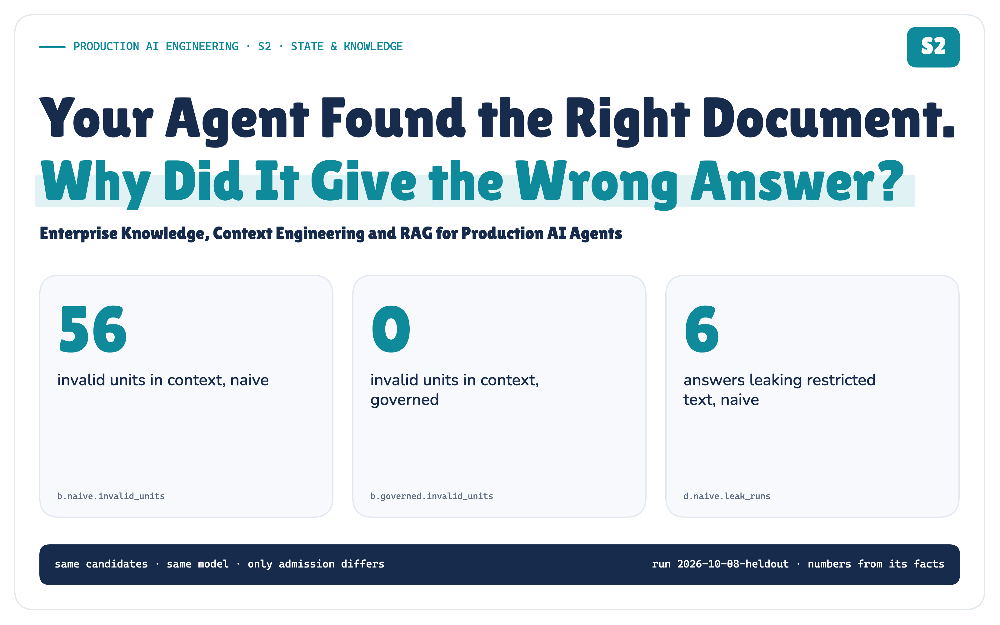
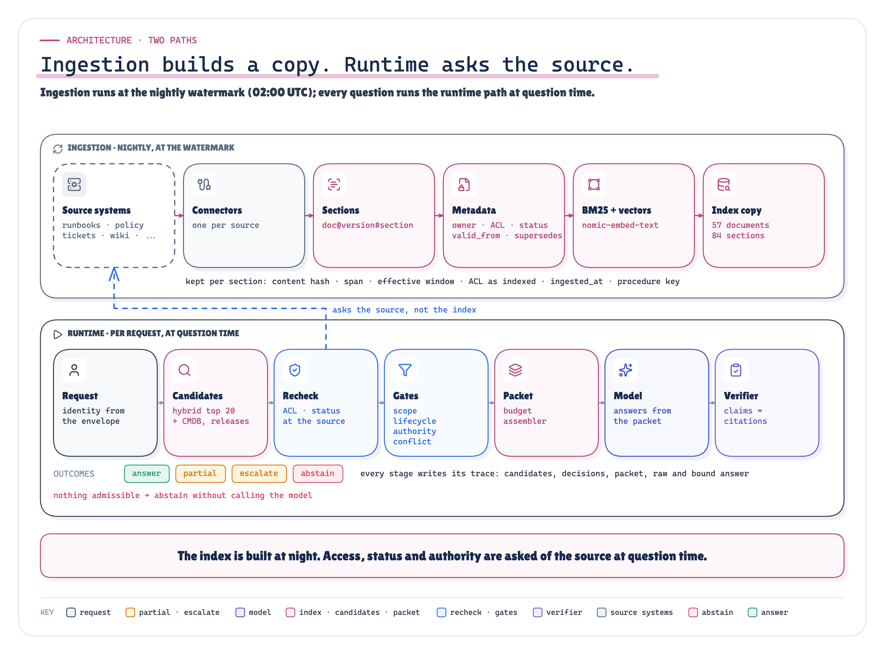
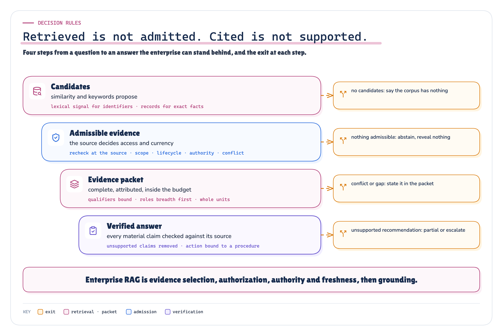

# Your Agent Found the Right Document. Why Did It Give the Wrong Answer?

*Enterprise Knowledge, Context Engineering and RAG for Production AI Agents*

**Production AI Engineering · S2 · State & Knowledge**

*Chapter 5 of 15. New here? Start with [Start Here: What It Takes to Run AI Agents in Production](https://eresh-gorantla.medium.com/start-here-a-hands-on-map-of-production-ai-engineering-5056549657db).*

**It is 10:30. checkout-api's p95 latency has tripled since this morning's deploy. The on-call engineer asks the agent: what should I do?**

The agent finds eight passages about checkout latency after a deploy and answers. Every passage was relevant. The answer was wrong.

Nothing failed the way retrieval is usually judged. The right runbook was in the index, similar text came back, the model followed its sources. Relevant text just isn't the same thing as evidence an enterprise can act on.

> **Retrieving relevant information is not the same as retrieving valid enterprise evidence.**

*The knowledge chapter of the Production AI Engineering series. S1 decided what an agent may remember; F2 put context in the platform; T2 and T3 decided who may act and when a person approves; R1 + R2 made recovery provable. This one asks what an agent may believe from the company's own documents.*

`MEASURED` *Figure 1. Measured in the POC on 22 held-out questions: clean context, more correct answers and no leaks, paid for in refusals.* · Measured: invalid units from experiment B (shared candidates); correct, leaked and refused from experiment D end to end, bound answers, naive vs governed · run 2026-10-08-heldout

**What failed:** 4 of my 17 preregistered predictions, including the packer, which lost to plain truncation on the text that matters most. Both stories are below.

## The Most Similar Text Was the Wrong Authority

To find where it breaks, I built Meridian Commerce: a synthetic company with two tenants, runbooks, change policies, tickets, a wiki, a release system, a CMDB, and an index rebuilt every night at 02:00. I asked it the question above, INC-4917, and forty more like it, each with a failure planted on purpose.

The sources support a specific answer. The 10:02 deploy of checkout-api 4.17.0 cut the database pool from 50 connections to 10. The runbook of record says roll back to 4.16.2 through the release pipeline; the change policy says a production rollback needs the incident commander's approval. The agent only recommends. A person decides.

A typical RAG pipeline gave the model the eight most similar chunks, cut at the budget:

`RECORDED` `MEASURED` *Figure 2. Same question, same model: relevant passages are not the evidence the answer needs, and the right evidence still isn’t the right answer. INC-4917, first seed.* · Recorded: INC-4917 (H-K9), first seed, what each pipeline put in context and answered · run 2026-10-08-heldout

All eight were about checkout latency after a deploy. None was among the 4 units the answer needed: no remediation step, no approval rule, no deployment record, no owner. Instead, tickets about past incidents and the symptoms of a superseded runbook. It recommended restarting the pods.

The governed pipeline I built read every needed unit and no invalid one. It also refused more answerable questions, and the part I was surest of lost a test I'd predicted it would win.

## Four Questions Retrieval Doesn’t Ask

Similarity answers one question: *is this text about the same thing?* Before text becomes evidence, an enterprise needs four more:

- **May this person read it, now?** Not when the index was built: now.
- **Is it current?** Not superseded, withdrawn, or a draft not yet in effect.
- **Does it apply?** This tenant, this environment, this service.
- **May it decide this?** A runbook of record decides procedure. A ticket records what someone did once. A wiki tip is advice.

None of these live in the text. They depend on the person, the moment and the decision, and they're owned outside the index: by the identity provider, the document store's permissions, the CMDB, the change process.

**Relevant is not authorized. Relevant is not authoritative. Retrieved is not current. Cited is not supported.**

## Your Index Is a Copy With a Timestamp

The index is a copy of every source as it was at 02:00. By 10:30, the sources had moved.

`ARCHITECTURE` `SIMULATED` *Figure 3. The index copied every source at 02:00; by 10:30, four things had changed at the sources. The governed recheck asks the source, and systems of record are never copied.* · Architecture: the watermark and the source events of the simulated enterprise

Two runbooks shipped new versions, one was withdrawn after an audit, and a vendor contact sheet was narrowed to one team. The index still says otherwise. That's not a quirk of my simulation: Microsoft warns that if permissions change without an update, “the index serves stale ACL data for previously ingested files” [5], and Amazon Q Business tells you to “re-sync your data source regularly” [8]. Between syncs, the index answers a question about yesterday.

So the governed pipeline uses the index only to *propose*. Before anything reaches the model, it asks each source whether this person may read the document now and what its status is; if the source can't answer, the unit is out. Systems of record are never copied: the deploy that changed the pool is looked up live.

The rule underneath is narrower than “recheck everything”: **the source's access decision must hold at question time.** Rechecking each candidate, as my POC does, is one way. Another is to query the source with the user's identity and let it return only what they may read; Microsoft documents this for SharePoint, in preview [27]. Both put the source on the request path, and both must fail closed.

`ARCHITECTURE` *Figure 4. None of this is agent code. The runtime asks; the knowledge capability in F2’s Context & Memory layer decides; the systems of record stay the owners.* · Architecture: where S2 sits in F2's layers and what stays cross-cutting

`ARCHITECTURE` *Figure 5. Ingestion builds a copy at the watermark; the runtime path asks the source at question time, and every stage writes its decisions to the trace.* · Architecture: the ingestion and runtime paths as implemented

## Similarity Proposes. It Cannot Grant Access.

Better retrieval helps; it isn't the fix. On the 18 questions with needed evidence, hybrid search (BM25 plus vectors, fused by rank [17]) ranked the first needed unit higher than vectors alone (MRR 0.61 against 0.49) and found more of it by rank 20 (87.5% against 77.8%). Yet in 19 of the 22 trap questions, the top five held a unit invalid for that asker, and hybrid did no better (19). Ranking doesn't know what's superseded, and a page carrying an instruction for the model ranks like any other; OWASP says RAG doesn't fully mitigate that injection [23].

One prediction failed here. I expected keyword search to win on exact identifiers, `RB-SRCH-040` next to `RB-SRCH-004`. Every method tied (1 of 2): the identifier is in the indexed text, and the embedding matched it too.

Exact facts are worse. A release note says the pool was “tuned”; only the deployment record says `maxPoolSize 50 -> 10`. A lookup by identifier returned 9 of the 9 records the questions needed. Ranked prose returned 0.

`ARCHITECTURE` `PROPOSED` *Figure 6. Four retrieval paths in the POC and one proposed: what each is good at and blind to. None decides who may read what.* · Architecture: the retrieval paths and their parameters; graph retrieval proposed, not built

So I held the candidates fixed and changed only what came next. Both pipelines got the same twenty per question. Naive admitted them all; governed ran five deterministic gates, outside the model:

`ARCHITECTURE` `MEASURED` *Figure 7. Same candidates, different admission: the gates excluded what similarity let in and kept what the answers needed. Experiment B: twenty shared candidates per question across 22 questions; “needed” counts the 32 needed units among them.* · Architecture + measured: the gates, and what each excluded in experiment B · run 2026-10-08-heldout

Naive put 56 invalid units in front of the model: 15 the asker couldn't read, 16 from the other tenant, 11 superseded. Governed put in **0**, and it didn't get there by refusing everything. It kept 32 of 32 needed units against naive's 24, and three positive controls (a responder allowed to read the restricted postmortem, the second tenant's engineer, a staging question) kept their evidence too.

> **Scores reorder candidates. Only gates outside the model can exclude them.**

## Which Document Is Allowed to Decide?

Authority is the hardest gate. The runbook of record, an owner's older runbook, a guild guide, a wiki tip and last month's ticket can all be relevant, readable and in disagreement. The model doesn't pick. The CMDB names a runbook of record per service and procedure, and that runbook decides procedure. History is admitted only when asked for; advice only when the authority is silent.

And sometimes the honest answer is “we don't know”.

`ARCHITECTURE` *Figure 8. When sources disagree or the authority is silent, code decides, and the packet says so.* · Architecture: conflict handling and abstention as implemented

Owners disagree and the CMDB names neither: both stay in the packet under UNRESOLVED CONFLICT, and any action resting on either becomes an escalation. The runbook of record was withdrawn this morning: the packet says so, and nothing may rest on it. Nothing survives the gates: the model isn't called, and a restricted document's existence isn't mentioned. Where the evidence couldn't answer, governed abstained or escalated correctly in 15 of 15 runs; naive in 8.

## More Context Is Not More Evidence

Admission decides what *may* go in; the budget decides what *does*. Truncating ranked chunks at the budget often drops the sentence that says *only with approval*. Barnett et al. call it “not in context”: retrieved, then lost in consolidation [15]. Longer isn't the cure either; models use the middle of a long context less well [16].

`ARCHITECTURE` *Figure 9. The model gets a packet with provenance, inside a fixed budget, never a pile of chunks.* · Architecture: the evidence packet schema and the assembler

The governed pipeline builds an **evidence packet**. Each item carries its source, version, role, authority tier, access-check time and hash; a short prelude states conflicts, gaps and what was left out. An assembler fills the budget: qualifiers travel with their procedure, duplicates go in once, each role's best item goes in before any role's second, and nothing is cut mid-sentence.

> **The metric that failed**
>
> On the same evidence, the assembler kept more needed units whole than truncation at every budget but the largest (36 against 34 at 600 tokens), yet kept the approval and caution text in *fewer* cases at 450 and 600 (8 against 9 at 600). I'd predicted it would match or beat truncation everywhere. It didn't.

Two rules caused it. A qualifier bound itself to whichever section ranked first, so the approval rule sometimes rode with *Symptoms* while *Remediation* lost the budget race; and “each role's best first” put generic policy ahead of history the question asked for. Two fixes after the run didn't beat truncation on both measures. So treat “qualifiers travel with their procedure” as the invariant a packer must hold, and test for it. Mine doesn't hold it consistently yet.

## A Citation That Exists Is Not a Citation That Supports

Answers come back as structured claims, each citing evidence with an exact quote. Every material claim is checked against its source: the item was in the packet; the quote, numbers and identifiers appear in it; an action keeps its polarity (*do not restart* doesn't support *restart*); and the source may decide that kind of claim. A ticket saying engineers restarted the pods is history, not procedure. The gap is common: on ALCE's ELI5 dataset, “even the best models lack complete citation support 50% of the time” [12].

`ARCHITECTURE` `MEASURED` *Figure 10. One claim through the verifier’s five checks, and how often the verifier and a model judge agreed with labels written blind to them.* · Architecture + measured: the verifier's checks and D2 agreement on held-out pairs · run 2026-10-08-heldout

Then the system, not the model, decides what survives. Unsupported claims are removed; a recommendation stays only if a supported claim cites a runbook that prescribes it; a required approval can be added, never dropped. Governed answers never rested a supporting claim on invalid evidence. Naive ones did 49 times.

> **What the verifier covers, and what it doesn’t**
>
> It checks the claims, the recommended action, its approval and the status. Not the free-text summary beside them, and not whether a field is complete enough to execute. Both gaps show up below. Regenerate the summary from the claims that survived, or don't show it.

> **The verifier is a floor, not a guarantee**
>
> On 40 claim–citation pairs written blind to its code, it rejected every fabricated quote and every source without authority, but agreed with the labels on 30 of 40, under the 80% I'd preregistered. It can't see that relevant text doesn't entail a claim, or that a condition was dropped. A model judge, qwen3:8b, agreed on 33 but accepted fabricated quotes. They fail in opposite places, so run both.

## I Ran It on Questions It Had Never Seen

I built everything on eighteen development questions. Then I froze the code, corpus, labels and seventeen preregistered hypotheses, and ran 22 held-out questions (never seen while building) once, three seeds each, with gpt-oss:20b running locally. Every model exchange is recorded; replay reproduces every result byte for byte, with no model. The rig has one rule: the system under test never sees the answers.

![Three columns. Left, grey: the simulated enterprise, with the identity provider, source permission APIs, the release system and CMDB, the corpus and the nightly index. Centre, the system under test: query analysis, retrieval, recheck and gates, the evidence packet, the model through Ollama, the verifier and binding, producing an answer. Right, separated by an isolation wall: the evaluator, with cases, hand-written labels read only by the scorer, experiments A to E, analysis into facts.json, preregistered hypotheses, freeze and replay. Underneath, the evidence band: model tape, rows, facts, SHA256 sums, replay identical.](../diagrams/premium/png/poc-arch.png)

`ARCHITECTURE` *Figure 11. The POC: a simulated enterprise, the system under test, and an evaluator it can’t see. Every model call is taped; every number comes from the recorded rows.* · Architecture: the POC's simulated enterprise, system under test and isolated evaluator

The scoreboard at the top comes from this run: invalid units from experiment B, the answers end to end from experiment D, same model, prompt and budget. One more: governed recommended a forbidden action (a restart, another tenant's fix, a manual config change) 0 times; naive did 14 times.

Two cautions. Experiment D compares whole systems that differ in several ways at once: it says which answered better, not why. Experiments B, C and E isolate the parts. And 66 runs are 22 questions × 3, not 66 independent incidents: a comparison on one test set, not an accuracy estimate for your production.

The refusals are where governance lost. Three came from a positive control: a security responder allowed to read the postmortem. The gates admitted it; then the assembler's “each role's best first” rule dropped its root-cause section at 600 tokens, and the model, given remediation steps but no cause, said it couldn't tell. The control caught over-filtering, one stage later than I expected.

## Each Control Closes a Different Failure

Which parts earn their place? I removed each control from the governed pipeline, and added each one alone to the naive pipeline.

![Five rows, each a variant with what came back: governed with every control (no invalid units); without the access recheck and scope (invalid and unreadable units return); without lifecycle and authority (superseded and advisory units return); without the structured record lookups (fewer needed units, yet more correct answers on one seed); the negative control without the source recheck (revoked and withdrawn content returns). A side note: naive plus the access recheck alone still lets invalid units through.](../diagrams/premium/png/ablations-key.png)

`MEASURED` *Figure 12. Remove a control and its failure returns; add one to naive and the others stay. Key rows of experiment E; the full matrix is in the technical edition. Each variant retrieves and packs for itself, so totals differ from experiment B: naive is vector top 8, and “needed” counts all 46 needed units.* · Measured: experiment E, the most revealing rows, evidence level and one live seed · run 2026-10-08-heldout

Without the access recheck and scope gates, 12 invalid units came back, 4 of them unreadable by the asker. Without lifecycle and authority, 5 superseded, draft and advisory units came back. Without the conflict gate, the one real disagreement between owners went unsaid; vector-only retrieval and dropping the record lookups each cost needed evidence.

The other direction teaches more: no single control is enough. Access and scope alone still let 25 invalid units through, because a superseded runbook is readable and in scope. Lifecycle and authority alone let 17 through, because a document you may not read can be current and authoritative. And with only the source recheck removed, documents narrowed or withdrawn after 02:00 came straight back. Nothing else was doing that job.

End to end, on one seed, it was less tidy. Dropping the record lookups *raised* correct answers (18 against 16): without the records, the runbook's remediation section fit the budget. That's the packing defect, from the other side. Dropping the verifier kept correctness at 16 but let 2 forbidden recommendations through. Adding only the verifier to naive stopped every forbidden action, refused 7 answerable questions, and still leaked 2 times, through the summary that binding doesn't rewrite.

> **Each control fixes its own failure. None of them fixes the others.**

## What the Run Showed, and What It Didn’t

Of 17 preregistered predictions, 13 held and 4 didn't (H2, H7, H10, H14): the identifier trap, the packer, over-refusal and the verifier. Each is reported where it happened.

> **Right reasoning, unusable contract**
>
> INC-4917 itself wasn't a win. The governed packet held all 4 needed units and no invalid one. On the first seed the model recommended the rollback, with the approval and the right cause, and its summary even said “rolling back to 4.16.2”. But the structured target, the field a workflow would execute from, said only `checkout-api`. Governed was correct in 0 of 3 runs of that case; naive in 0.
> 
> It's the lesson F1 and F2 teach about tools: a correct intention isn't a valid call. Fix the contract, not the prompt. A schema that requires a version for a rollback turns this into a validation error instead of an executable-looking recommendation.

Before binding, the raw model also proposed a forbidden action in 6 governed runs, each time when a needed unit hadn't made the packet. Binding removed every one. A clean context doesn't make the model trustworthy.

> **What didn’t work**
>
> My scorer missed the non-breaking hyphen gpt-oss:20b writes in “incident‑commander”. Folding those characters changed no correctness or leakage result, but raised completeness in both pipelines alike (21 to 29 of 60 for governed). The technical edition reports both.

## What This POC Does Not Prove

- **How often this happens to you.** One synthetic company that I wrote, forty questions with failures planted on purpose: the mechanisms, not their frequency.
- **That it holds for every model.** One primary model, gpt-oss:20b, three seeds; qwen3:8b on one seed pointed the same way (17 against 10 correct). Hosted models may abstain, cite and fill fields differently.
- **That your systems behave like mine.** The identity provider, permission APIs, release system and CMDB are simulated, and they always answer. Retrieval, the gates, the model calls and the verifier are real.
- **Anything I didn't build.** Graph retrieval, rerankers, query rewriting and long-context models are discussed, not tested. So is an injection that arrives through a source the gates trust.

## Retrieved Is Not Admitted. Cited Is Not Supported.

`ARCHITECTURE` *Figure 13. Four steps from a question to an answer the enterprise can stand behind, and the exit at each.* · Architecture: the decision rules the run supports

The rules I'd keep:

1. **Let similarity propose, never decide.** Hybrid ranking for recall, lookups for exact facts; neither grants access.
2. **Ask the source at question time.** The index is a copy with a timestamp. Recheck access and status where they're owned, and fail closed when the source can't answer.
3. **Decide authority in code.** Name a runbook of record. Admit history only when asked. Escalate disagreements; say when the authority is silent.
4. **Pack evidence, not chunks.** Provenance per item, a stated budget, a stated gap. Test that qualifiers stay with their procedure at every budget; mine didn't always.
5. **Check every claim against its source, and let the system decide what survives.** Then cover the rest of the output: regenerate or withhold the summary, and validate every field a workflow will execute.

**Want to inspect the evidence?** [Evidence Check](https://github.com/ereshzealous/ai_blogs_poc/blob/main/context_eng_rag_poc/results/enterprise-knowledge-rag-evidence.md) (Claim → proof) · [Run report](https://github.com/ereshzealous/ai_blogs_poc/blob/main/context_eng_rag_poc/results/enterprise-knowledge-rag-report.md) (Every case, every experiment) · [Real vs simulated](https://github.com/ereshzealous/ai_blogs_poc/blob/main/context_eng_rag_poc/results/enterprise-knowledge-rag-real-vs-simulated.md) (What was actually run) · [Technical deep dive](https://github.com/ereshzealous/ai_blogs_poc/blob/main/context_eng_rag_poc/technical/enterprise-knowledge-rag-technical.pdf) (The full architecture)

> **Your agent found the right document. Whether it gave the right answer depended on everything after retrieval.**

*Every gate here trusts the runbook of record. Next question: what happens when the content itself is hostile, and an injection arrives through a source the gates admit?*

## Sources

Every source is listed in `research/sources.md` with what it supports in this article and what it does *not* support.

**[1]** Microsoft Learn, "RAG and generative AI - Azure AI Search". [learn.microsoft.com/en-us/azure/search/retrieval-augmented-generation-overview](https://learn.microsoft.com/en-us/azure/search/retrieval-augmented-generation-overview)

**[2]** Microsoft Learn, "Agentic retrieval overview - Azure AI Search". [learn.microsoft.com/en-us/azure/search/agentic-retrieval-overview](https://learn.microsoft.com/en-us/azure/search/agentic-retrieval-overview)

**[3]** Microsoft Learn, "Document-level access control - Azure AI Search". [learn.microsoft.com/en-us/azure/search/search-document-level-access-overview](https://learn.microsoft.com/en-us/azure/search/search-document-level-access-overview)

**[4]** Microsoft Learn, "Security filter pattern - Azure AI Search". [learn.microsoft.com/en-us/azure/search/search-security-trimming-for-azure-search](https://learn.microsoft.com/en-us/azure/search/search-security-trimming-for-azure-search)

**[5]** Microsoft Learn, "Use a SharePoint indexer to ingest permission metadata" (preview). [learn.microsoft.com/en-us/azure/search/search-indexer-sharepoint-access-control-lists](https://learn.microsoft.com/en-us/azure/search/search-indexer-sharepoint-access-control-lists)

**[6]** Microsoft Learn, "Hybrid search scoring (RRF) - Azure AI Search". [learn.microsoft.com/en-us/azure/search/hybrid-search-ranking](https://learn.microsoft.com/en-us/azure/search/hybrid-search-ranking)

**[7]** Microsoft Learn, "Semantic ranking overview - Azure AI Search". [learn.microsoft.com/en-us/azure/search/semantic-search-overview](https://learn.microsoft.com/en-us/azure/search/semantic-search-overview)

**[8]** AWS, "Data source connector concepts - Amazon Q Business". [docs.aws.amazon.com/amazonq/latest/qbusiness-ug/connector-concepts.html](https://docs.aws.amazon.com/amazonq/latest/qbusiness-ug/connector-concepts.html)

**[9]** Elastic, "How DLS works" (search connectors). [www.elastic.co/docs/reference/search-connectors/es-dls-overview](https://www.elastic.co/docs/reference/search-connectors/es-dls-overview)

**[10]** Microsoft Learn, "Retrieval-augmented generation (RAG) evaluators - Microsoft Foundry". [learn.microsoft.com/en-us/azure/foundry/concepts/evaluation-evaluators/rag-evaluators](https://learn.microsoft.com/en-us/azure/foundry/concepts/evaluation-evaluators/rag-evaluators)

**[11]** AWS, "Use metrics to understand RAG system performance - Amazon Bedrock". [docs.aws.amazon.com/bedrock/latest/userguide/knowledge-base-evaluation-metrics.html](https://docs.aws.amazon.com/bedrock/latest/userguide/knowledge-base-evaluation-metrics.html) · [docs.aws.amazon.com/bedrock/latest/userguide/knowledge-base-eval-llm-results.html](https://docs.aws.amazon.com/bedrock/latest/userguide/knowledge-base-eval-llm-results.html)

**[12]** T. Gao, H. Yen, J. Yu, D. Chen, "Enabling Large Language Models to Generate Text with Citations", EMNLP 2023. [arxiv.org/abs/2305.14627](https://arxiv.org/abs/2305.14627)

**[13]** S. Es, J. James, L. Espinosa-Anke, S. Schockaert, "Ragas: Automated Evaluation of Retrieval Augmented Generation". [arxiv.org/abs/2309.15217](https://arxiv.org/abs/2309.15217)

**[14]** Google Cloud, "Check grounding with RAG". [docs.cloud.google.com/generative-ai-app-builder/docs/check-grounding](https://docs.cloud.google.com/generative-ai-app-builder/docs/check-grounding)

**[15]** S. Barnett et al., "Seven Failure Points When Engineering a Retrieval Augmented Generation System", CAIN 2024. [arxiv.org/abs/2401.05856](https://arxiv.org/abs/2401.05856)

**[16]** N. F. Liu et al., "Lost in the Middle: How Language Models Use Long Contexts", TACL 12 (2024). [arxiv.org/abs/2307.03172](https://arxiv.org/abs/2307.03172)

**[17]** G. V. Cormack, C. L. A. Clarke, S. Büttcher, "Reciprocal Rank Fusion outperforms Condorcet and individual Rank Learning Methods", SIGIR 2009. [doi.org/10.1145/1571941.1572114](https://doi.org/10.1145/1571941.1572114) · [plg.uwaterloo.ca/~gvcormac/cormacksigir09-rrf.pdf](https://plg.uwaterloo.ca/~gvcormac/cormacksigir09-rrf.pdf)

**[18]** S. Robertson, H. Zaragoza, "The Probabilistic Relevance Framework: BM25 and Beyond", Foundations and Trends in IR (2009). [doi.org/10.1561/1500000019](https://doi.org/10.1561/1500000019) · [staff.city.ac.uk/~sbrp622/papers/foundations_bm25_review.pdf](https://staff.city.ac.uk/~sbrp622/papers/foundations_bm25_review.pdf)

**[19]** N. Thakur et al., "BEIR: A Heterogenous Benchmark for Zero-shot Evaluation of Information Retrieval Models", NeurIPS 2021 Datasets and Benchmarks. [arxiv.org/abs/2104.08663](https://arxiv.org/abs/2104.08663)

**[20]** Anthropic, "Introducing Contextual Retrieval", 2024-09-19. [www.anthropic.com/engineering/contextual-retrieval](https://www.anthropic.com/engineering/contextual-retrieval)

**[21]** Z. Nussbaum, J. X. Morris, B. Duderstadt, A. Mulyar, "Nomic Embed: Training a Reproducible Long Context Text Embedder" (TMLR). [arxiv.org/abs/2402.01613](https://arxiv.org/abs/2402.01613) · [huggingface.co/nomic-ai/nomic-embed-text-v1.5](https://huggingface.co/nomic-ai/nomic-embed-text-v1.5)

**[22]** D. Edge et al., "From Local to Global: A Graph RAG Approach to Query-Focused Summarization". [arxiv.org/abs/2404.16130](https://arxiv.org/abs/2404.16130)

**[23]** OWASP GenAI Security Project, "LLM01:2025 Prompt Injection". [genai.owasp.org/llmrisk/llm01-prompt-injection/](https://genai.owasp.org/llmrisk/llm01-prompt-injection/)

**[24]** OWASP GenAI Security Project, "LLM08:2025 Vector and Embedding Weaknesses". [genai.owasp.org/llmrisk/llm082025-vector-and-embedding-weaknesses/](https://genai.owasp.org/llmrisk/llm082025-vector-and-embedding-weaknesses/)

**[25]** K. Greshake et al., "Not what you've signed up for: Compromising Real-World LLM-Integrated Applications with Indirect Prompt Injection", AISec 2023. [arxiv.org/abs/2302.12173](https://arxiv.org/abs/2302.12173)

**[26]** OpenTelemetry GenAI semantic conventions (moved). [github.com/open-telemetry/semantic-conventions-genai](https://github.com/open-telemetry/semantic-conventions-genai) · [opentelemetry.io/docs/specs/semconv/gen-ai/](https://opentelemetry.io/docs/specs/semconv/gen-ai/)

**[27]** Microsoft Learn, "Create a SharePoint (Remote) Knowledge Source - Azure AI Search" (preview), updated 2026-10-01. [learn.microsoft.com/en-us/azure/search/agentic-knowledge-source-how-to-sharepoint-remote](https://learn.microsoft.com/en-us/azure/search/agentic-knowledge-source-how-to-sharepoint-remote)

## Explore next

Every note stands on its own. Pick the problem you have:

- *My agent sees hundreds of overlapping tools* → F1 MCP Tool Sprawl
- *My agent loop has quietly become my platform* → F2 Layered Agent Platform
- *My agent is trapped inside one chat window* → F3 Headless AI
- *I don't trust what my agent remembers* → S1 Memory, Context & State
- *I can't tell whether a change broke my agent* → R1 Evals & Observability
- *My agent fails in ways I can't predict or recover from* → R2 Agent Reliability
- *My agent needs to act on someone's behalf* → T1 Agent Identity
- *I can't say what my agent is allowed to do* → T2 Authorization & Policy
- *My agent asks "should I continue?" and someone types yes* → T3 Human-in-the-Loop
- *Every governance change means redeploying my agents* → T4 AI Control Plane
- *I can't explain what my agent did in production* → T5 Observability & Governance
- *I'm worried about prompt injection and hostile tools* → T6 Agent & MCP Security
- *I'm not sure whether I need more than one agent* → C1 Multi-Agent & A2A
- *My agent is too slow or too expensive at volume, and every change is a risk* → O1 Operating Agents at Scale
- *I don't know how to ship a prompt or model change safely* → O2 Agent Lifecycle
- *I need the whole production platform, not one boundary* → P1 Production Agentic AI Platform

The full learning map: [Production AI Engineering, Start Here](https://eresh-gorantla.medium.com/start-here-a-hands-on-map-of-production-ai-engineering-5056549657db).

---

**Next in Production AI Engineering:** T1 · Agent Identity

**Previously:** S1 · Memory, Context & State

**New to the series?** Start with the map of all fifteen chapters:

https://eresh-gorantla.medium.com/start-here-a-hands-on-map-of-production-ai-engineering-5056549657db

**Go deeper:** [Technical deep dive](https://github.com/ereshzealous/ai_blogs_poc/blob/main/context_eng_rag_poc/technical/enterprise-knowledge-rag-technical.pdf) · [Results](https://github.com/ereshzealous/ai_blogs_poc/blob/main/context_eng_rag_poc/results/s2-results.md) · [Proof of concept on GitHub](https://github.com/ereshzealous/ai_blogs_poc/tree/main/context_eng_rag_poc)

*Every measured number is substituted from `enterprise_knowledge_rag_poc/runs/2026-10-08-heldout/facts.json`.*
