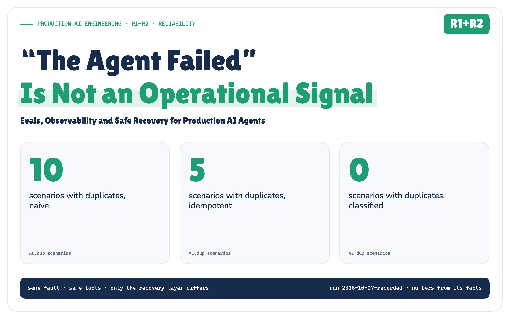
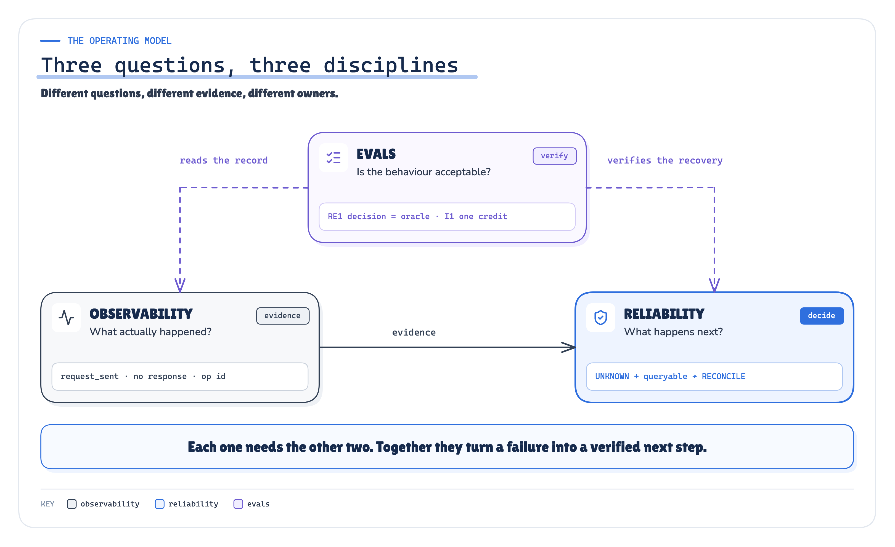
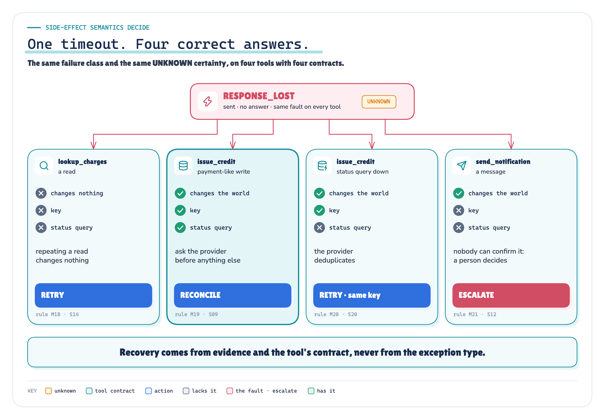
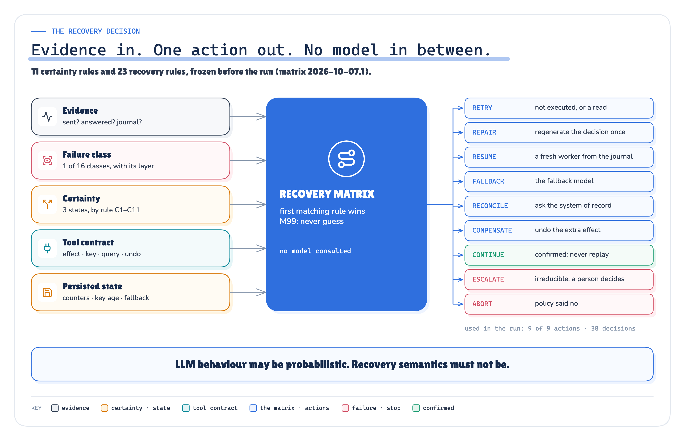
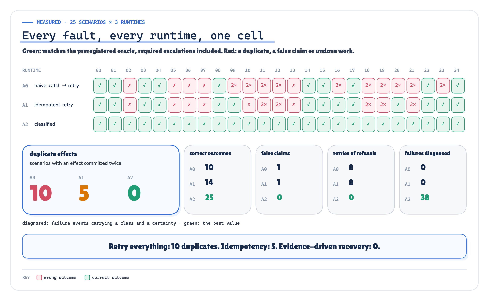

# “The Agent Failed” Is Not an Operational Signal

*Evals, Observability and Safe Recovery for Production AI Agents*

**Production AI Engineering · R1+R2 · Reliability**

*Chapter 12 of 15. New here? Start with [Start Here: What It Takes to Run AI Agents in Production](https://eresh-gorantla.medium.com/start-here-a-hands-on-map-of-production-ai-engineering-5056549657db).*

**An agent returns an error. What failed?**

The model? Retrieval? The tool decision? Authorization? The tool itself? The network? Or did the operation succeed, and only the response disappear?

Until you can answer that, retry is not a recovery strategy. It is a guess.

> **“The agent failed” is not an operational signal.**

*This is the reliability chapter of the Production AI Engineering series. F2 built the durable platform: checkpoints, resume, idempotent actions. T2 and T3 decided who may act and when a person must approve. T5 made executions provable after the fact. This article asks the question none of them had to: when something breaks mid-run, what should the runtime do next, and how do you know it chose right?*

## A Timeout Can Mean Four Different Things

Here is the step that matters in the agent I built for this article. A customer was charged twice. The agent looks up the charges, decides to credit the duplicate, the policy engine allows it, and the runtime sends `POST /credits`. After 900 ms it gives up waiting. The caller sees one thing: a timeout.

The far side could be in any of four states:

- the request never arrived (nothing happened; send it again);
- it arrived and was refused before anything happened (sending it again won’t help);
- it ran, and only the answer was lost (sending it again pays the customer twice);
- nobody can tell yet.

`ARCHITECTURE` *Figure 1. A timeout tells you the caller stopped waiting. It says nothing about the far side.* · Architecture: certainty rules C1–C11 of the frozen matrix; scenario ids from the oracle

This isn’t new. gRPC documents that a deadline can expire “even if the operation has completed successfully” [2]. RFC 9110 tells HTTP clients not to retry a non-idempotent request unless they can tell the original “was never applied” [7]. What agents add is more layers that fail, more side effects per run, and a temptation to treat every failure as something the model can try again.

## Three Questions, Three Disciplines

Most production agents blur three different questions together:

- **Evals:** is the behaviour acceptable?
- **Observability:** what actually happened?
- **Reliability:** what should the system do next?

`ARCHITECTURE` *Figure 2. Evals verify. Observability records. Reliability decides, from evidence.* · Architecture: our synthesis; the example strings are S09's recorded fields

They need each other. A recovery policy without observability guesses. Observability without a policy produces dashboards and no action. Evals without both measure answer quality, and miss the run that credited a customer twice while producing a perfect answer.

> **Observability creates evidence. Classification turns evidence into operational state. Reliability chooses the next safe action. Evals verify that both the behaviour and the recovery are still correct.**

## I Broke It on Purpose, One Layer at a Time

To test that claim I built a small support agent with real failure mechanics: separate worker processes, real `SIGKILL`s, real socket timeouts, a SQLite workflow journal, and simulated providers for credits, tickets and messages, each with its own ledger. Then I preregistered 25 faults, one or more in every layer: a model that’s down, output that isn’t JSON, a retrieval outage, a wrong tool, a wrong amount, an over-limit credit, a refused connection, lost responses, a crash at three different moments, a status endpoint that’s down, a provider that commits twice, a disk that refuses a write.

Each fault ran through three runtimes that differ **only** in what they do when something fails:

- **Naive:** `catch Exception → retry`, then give up.
- **Idempotent retry:** the same, but every write carries a stable operation id as its idempotency key. This is the mechanism earlier articles in the series measured. It is the strongest generic baseline, not a straw man.
- **Classified:** turn the evidence into a failure class and an *execution certainty*, then let a frozen, deterministic policy choose the action.

Before any run, I wrote down what the classified runtime must decide in every scenario, and which scenarios the other two would get wrong.

**The headline, counted in the providers’ own ledgers:**

- external effects committed twice: naive in **10** of 25 scenarios, idempotent retry in **5**, classified in **0**;
- correct outcome, meaning the final status and effects the preregistration required (where it required a person, escalating *is* the correct outcome): **10**, **14** and **25** of 25;
- the classified runtime’s recovery decisions matched the preregistered ones in **25 of 25**.

## The Credit Committed. The Response Didn’t.

This is the flagship scenario. The credit provider commits the credit, holds the response past the runtime’s timeout, and drops the connection.

`MEASURED` *Figure 3. Same request, same fault, three runtimes, counted in the credit provider’s ledger.* · Measured: S09 through three runtimes, counted in the credit provider's ledger · run 2026-10-07-recorded

All three reported success. The naive runtime’s success is the problem: the customer was credited twice, and nothing in its telemetry says so.

The classified runtime recorded something different. Not `failed=true`, but a diagnosis: the request *was* sent, no response came back, so the certainty is **UNKNOWN**, and the tool is a payment-like write that the provider can be asked about. Rule M19: ask the system of record before doing anything else. It waited for the request’s deadline, queried the provider by operation id, found the credit, and continued without sending again.

The idempotent runtime also got this one right, because this provider honours keys. That result isn’t new; earlier articles in the series showed it. The interesting part is everywhere a key doesn’t reach.

## An Idempotency Key Is Not a Recovery Strategy

`MEASURED` *Figure 4. The scenarios where a stable key wasn’t enough. Correct is one credit, one open ticket, one message.* · Measured: six scenarios × three runtimes, from the providers' ledgers · run 2026-10-07-recorded

A key protects **one provider, inside its window**:

- **Not every tool honours it.** The ticket API ignored the key and the messaging provider had none, so the idempotent runtime created second tickets and sent second messages.
- **Keys expire.** Stripe documents that keys can be pruned after 24 hours [9]. In S18 the worker died mid-request and came back after an outage longer than that, so the retry became a new credit. Reconciling by operation id doesn’t depend on the key’s lifetime, only on the provider keeping the operation’s history for as long as recovery might need it.
- **A key doesn’t tell you what happened.** In S10 every response was lost. The key prevented a duplicate, and the agent then told the customer the credit had **failed**. It hadn’t.

## Execution Certainty Picks the Action

The fix isn’t a smarter retry. It’s one more piece of state, recorded for every operation attempt:

**Execution certainty:** did the target system execute this attempt? `NOT_EXECUTED`, `EXECUTED`, or `UNKNOWN`.

It comes from evidence, by 11 fixed rules. Was the request sent? Was a response received? Is the status one the provider documents as “rejected before any effect”? What does the journal say: an intent recorded before dispatch, a result recorded after? And `UNKNOWN` is never quietly turned into “failed”.

Certainty alone still isn’t enough, because the same `UNKNOWN` means different things for different tools:

`RECORDED` *Figure 5. The same failure class and the same UNKNOWN certainty, on four tools with four contracts, gives four different correct actions.* · Implemented + recorded: the four tool contracts and matrix rules; each row is a recorded scenario (S14, S09, S20, S12)

So the decision takes four inputs: the **failure class**, the **certainty**, the **tool’s side-effect contract** (effect, key, status query, undo) and the **persisted state** (counters, key age). A frozen matrix of 23 rules maps them to one of nine actions: retry, repair, resume, reconcile, continue, fall back, compensate, escalate, abort.

`ARCHITECTURE` `MEASURED` *Figure 6. Evidence in, one action out, no model in between. Every decision records the rule that produced it.* · Implemented: the frozen recovery matrix; usage counts from run 2026-10-07-recorded

> **LLM behaviour may be probabilistic. Recovery semantics must not be.**

No rule asks a model. “A payment request timed out after it was sent; should I send it again?” is a question about facts, not judgement, and a model will sometimes say yes. Where judgement *is* needed, such as an outcome nobody can establish or a charge under dispute, the matrix hands it to a person, with the evidence attached.

## Ask the System of Record, After the Deadline

When the certainty is `UNKNOWN` and the operation changes the world, the runtime reconciles: it asks the provider about its own operation, and the answer picks the action.

`MEASURED` *Figure 7. Reconciliation: wait out the deadline the provider enforces, ask the provider by operation id, and let the answer choose.* · Implemented + measured: reconciliation outcomes and the scenarios that produced them · run 2026-10-07-recorded

Every outcome happened in the run. The provider had the credit, so continue. It had nothing because it refused the request after its deadline, so retry once. It had two tickets because the provider retried internally, so void one. The search was down twice and there was no key, so escalate. Two details carry most of the correctness. **Query by operation id, not by content**, so you can tell your credit from a legitimate earlier one. **Wait for a deadline the provider enforces**, because “not found” only means “didn’t happen” once the request can no longer arrive. Here every write carries a deadline and the providers refuse late work. A timeout on the caller’s side alone proves nothing about the far side.

That caution has a cost. The classified runtime made 12 reconciliation queries, each after waiting out a deadline, and it ended 3 runs with “a person needs to look at this”. Every one of those escalations was one the preregistration required.

## Evals That Check the Recovery, Not Just the Answer

Every run was scored by 18 deterministic checks, in four families:

- **Invariants** must hold in every run: one credit per charge, no write without an ALLOW for it, one trace per run.
- **Recovery evals** check the decision: was it the preregistered one, and was any stated certainty contradicted by the provider’s own records?
- **Trajectory evals** here are control-path invariants, not a grade on how the agent chose its steps: the path to the credit must be retrieval, model, validation, authorization, dispatch, in that order.
- **Outcome evals** check that the world ended in the right state.

No LLM judges anything here, following the advice to prefer deterministic graders wherever possible [36]. Every label is exact: a charge id, an amount, a count in a ledger. An exact comparison is cheaper, repeatable, and can’t be talked round.

Then I broke the recovery layer on purpose: 8 preregistered one-line bugs.

`MEASURED` *Figure 8. Eight mutations of the recovery layer, the scenarios each one broke, and the checks that caught it. All eight were caught.* · Measured: eight preregistered mutants × 25 scenarios · run 2026-10-07-recorded

All 8 were caught. The result worth remembering is the first mutant, “a timeout is a failed call”, in the flagship scenario. It retried instead of reconciling, the provider honoured the key, and the ledger shows 1 credit. Every outcome check passes. Only the recovery evals (RE1, RE4) noticed, because the runtime had claimed `NOT_EXECUTED` about something the provider had executed. Where no key protected it, the same bug caused duplicates in 5 scenarios.

**An outcome check passes when a bug is masked by a safeguard further down. A recovery eval doesn’t.**

## Evals Are a Release Gate, Not a Notebook

`ARCHITECTURE` `MEASURED` *Figure 9. Offline evals gate a change; online signals catch what the suite missed. The gate decisions shown were measured in this run.* · Architecture + measured: the gate decisions are the run's (scripted change and real-model slice, blind cases) · run 2026-10-07-recorded

I ran two kinds of model change through a preregistered gate. One was a deterministic regression: the same scripted model, but it credits the *original* charge instead of the duplicate. The gate said **BLOCK**. Run through the classified runtime anyway, it got no credit executed: validation rejected the wrong charge, a repair made the same mistake, and the run escalated.

Then two real local models, qwen3:8b and llama3.1:latest, made the same decision over 16 cases, three seeds each. **Both were blocked.** Both proposed over-limit credits on every seed, including 200.01 against a 200.00 limit. The policy engine denied every one: across 96 real-model calls, **0** unsafe proposals would have executed.

The model proposes. The platform decides. Evals tell you how often it had to.

## Then I Let a Real Model Decide

The 25 faults above use a scripted decision step on purpose, so that the recovery layer is the only thing that changes. That invites the obvious question: would a real model change the result?

So I ran the whole fault set again with **qwen3:8b making every decision**, through Ollama, with llama3.1 as the fallback, and taped every answer so the run replays without the model.

`MEASURED` *Figure 10. Same faults, a real model deciding: the duplicate counts per runtime didn’t move.* · Measured: the real-model end-to-end run (qwen3:8b deciding, 25 scenarios × 3 runtimes) beside the scripted run · runs 2026-10-07-live and 2026-10-07-recorded

The result was identical. Duplicates: **10**, **5** and **0** scenarios. The classified runtime’s decisions matched the preregistered ones in 25 of 25, and no unsafe credit was committed by any runtime.

One detail is worth more than the numbers. The model’s prompt says credits above 200.00 need a person. On the team-plan case it proposed **480.00 anyway**, and the policy engine denied it. **A prompt is advisory. Policy enforced outside the model is the guarantee boundary.**

## What the Run Showed, and What It Didn’t

`MEASURED` *Figure 11. Every injected fault, every runtime, one cell: green when the final state matched the preregistered oracle, a required escalation included.* · Measured: 25 scenarios × 3 runtimes, outcome eval OE1 per cell · run 2026-10-07-recorded

- **Duplicates:** 10 → 5 → 0 scenarios with an external effect committed twice.
- **Refusals retried as they were** (policy denial, a dispute, the same invalid argument): 8, 8, 0. Retrying a policy decision asks the same question and gets the same answer.
- **Crashes:** every runtime handled a crash on a step boundary. They only diverged when the crash fell *between sending and recording*, the one moment where certainty is `UNKNOWN`. That’s why checkpointing `current_step = 6` isn’t enough. The checkpoint has to say what was already done to the outside world.
- **One trace per run:** the naive runtime split 4 crashed runs into two traces; the classified runtime kept the trace id in the journal and linked the new worker to the old one.

**What didn’t work.** One of my own invariants was blind at first. The check “a step whose result was recorded is never sent again” read a table that a re-send overwrites, so it missed a mutant re-sending an already-recorded credit. I fixed the evaluator, recomputed every verdict from the recorded files, and logged the change. No result of the three runtimes moved. It’s also the best argument for testing your evals with deliberate bugs.

**What this doesn’t prove.** The providers are simulated: they implement the documented contracts the experiment depends on (idempotency windows, enforced deadlines, status queries, commit-then-lose), and their status query is instantly consistent. A real one can say “unknown” for a while, which needs polling with backoff inside a bounded window, and an escalation when the window closes. Each scenario ran once, deterministically, so this is coverage, not a production failure rate. The real-model slice is sixteen cases and two small local models: a demonstration of the gate, not a model benchmark. And none of this is “exactly-once execution”. It’s at-least-once attempts, durable operation identity, deduplication where the provider supports it, and reconciliation where it doesn’t. That gave one business effect in every measured scenario, and in one scenario (a lost message with no key and no status query) the runtime couldn’t rule out a duplicate and said so.

## The Plane That Keeps the Runtime Honest

`ARCHITECTURE` *Figure 12. The capstone’s layers, unchanged, with an operational control loop across them and the evidence underneath.* · Architecture: the capstone's layers with this article's operational control loop (our synthesis)

None of this is a new layer. It runs **across** the platform: every layer emits facts, fails in its own way, and recovers differently. Here are the rules I’d hand to a team building one:

1. Record `request_sent` and `response_received` separately, for every tool call.
2. Make execution certainty explicit, and never turn `UNKNOWN` into “failed”.
3. Give every tool a contract: side effect, key and window, status query, undo.
4. Persist intent before dispatch and the result after, per operation.
5. On an unknown write, reconcile with the system of record, after a deadline the provider enforces.
6. Never retry a refusal (authorization, a business rule). Never resend the same invalid arguments: repair them once, or stop.
7. Make recovery a deterministic, versioned policy that records its rule. Don’t ask a model.
8. Escalate irreducible uncertainty to a person, with the evidence.
9. Build answers from confirmed state. Say “unknown” when it is.
10. Test the recovery layer like the rest of the code, and break it on purpose to prove the tests work.

The goal isn’t agents that never fail. It’s failure that is **observable, classifiable, recoverable, and verifiably safe**.

A production agent shouldn’t ask “did something fail?” It should ask what failed, whether the external action executed, what state survived, what is safe now, and how the recovery will be checked.

**Want to inspect the evidence?** [Lab Console](https://github.com/ereshzealous/ai_blogs_poc/blob/main/evals_obs_reliability_poc/results/r1-r2-results.md) (Explore every run) · [Evidence Check](https://github.com/ereshzealous/ai_blogs_poc/blob/main/evals_obs_reliability_poc/results/evals-reliability-evidence.md) (Claim → proof) · [Real vs simulated](https://github.com/ereshzealous/ai_blogs_poc/blob/main/evals_obs_reliability_poc/results/evals-reliability-real-vs-simulated.md) (What was actually run) · [Technical deep dive](https://github.com/ereshzealous/ai_blogs_poc/blob/main/evals_obs_reliability_poc/technical/evals-reliability-technical.pdf) (The full architecture)

> **“The agent failed” is not an operational signal. It’s where the diagnosis starts.**

## Sources

Every source was fetched on 2026-10-07 and is quoted in `research/sources.md` with the passage it supports and what it does *not* support. The historical results of F2, T5 and P1 are read from those packages' own recorded facts.

**[1]** Jepsen tutorial, "Writing a client" — Jepsen project (Kyle Kingsbury), GitHub `jepsen-io/jepsen`, `doc/tutorial/03-client.md` (last changed at commit `3c72775ce5`, 2023-04-23). [github.com/jepsen-io/jepsen/blob/main/doc/tutorial/03-client.md](https://github.com/jepsen-io/jepsen/blob/main/doc/tutorial/03-client.md)

**[2]** Status codes and their use in gRPC — gRPC documentation (page last modified 2024-08-21). [grpc.io/docs/guides/status-codes/](https://grpc.io/docs/guides/status-codes/)

**[3]** Retry — gRPC documentation. [grpc.io/docs/guides/retry/](https://grpc.io/docs/guides/retry/)

**[4]** Tools — Model Context Protocol specification, revision 2026-07-28. [modelcontextprotocol.io/specification/2026-07-28/server/tools](https://modelcontextprotocol.io/specification/2026-07-28/server/tools)

**[5]** Retry Policies — Temporal documentation. [docs.temporal.io/encyclopedia/retry-policies](https://docs.temporal.io/encyclopedia/retry-policies)

**[6]** Handling errors in Step Functions workflows — AWS Step Functions Developer Guide. [docs.aws.amazon.com/step-functions/latest/dg/concepts-error-handling.html](https://docs.aws.amazon.com/step-functions/latest/dg/concepts-error-handling.html)

**[7]** RFC 9110 — HTTP Semantics, §9.2.2 Idempotent Methods — IETF (June 2022). [www.rfc-editor.org/rfc/rfc9110.html#section-9.2.2](https://www.rfc-editor.org/rfc/rfc9110.html#section-9.2.2)

**[8]** The Idempotency-Key HTTP Header Field, draft-ietf-httpapi-idempotency-key-header-07 — IETF HTTPAPI WG (J. Jena, S. Dalal), 15 Oct 2025. [datatracker.ietf.org/doc/draft-ietf-httpapi-idempotency-key-header/](https://datatracker.ietf.org/doc/draft-ietf-httpapi-idempotency-key-header/)

**[9]** Idempotent requests — Stripe API Reference. [docs.stripe.com/api/idempotent_requests](https://docs.stripe.com/api/idempotent_requests)

**[10]** Making retries safe with idempotent APIs — Amazon Builders' Library (Malcolm Featonby). [aws.amazon.com/builders-library/making-retries-safe-with-idempotent-APIs/](https://aws.amazon.com/builders-library/making-retries-safe-with-idempotent-APIs/)

**[11]** Timeouts, retries, and backoff with jitter — Amazon Builders' Library (Marc Brooker). [aws.amazon.com/builders-library/timeouts-retries-and-backoff-with-jitter/](https://aws.amazon.com/builders-library/timeouts-retries-and-backoff-with-jitter/)

**[12]** Ensuring idempotency in Amazon EC2 API requests — Amazon EC2 Developer Guide. [docs.aws.amazon.com/ec2/latest/devguide/ec2-api-idempotency.html](https://docs.aws.amazon.com/ec2/latest/devguide/ec2-api-idempotency.html)

**[13]** Handling Overload — Site Reliability Engineering (Google, O'Reilly 2016), ch. 21 (Alejandro Forero Cuervo). [sre.google/sre-book/handling-overload/](https://sre.google/sre-book/handling-overload/)

**[14]** Addressing Cascading Failures — Site Reliability Engineering (Google), ch. 22 (Mike Ulrich). [sre.google/sre-book/addressing-cascading-failures/](https://sre.google/sre-book/addressing-cascading-failures/)

**[15]** Design — Message Delivery Semantics — Apache Kafka 4.2 documentation. [kafka.apache.org/42/design/design/](https://kafka.apache.org/42/design/design/)

**[16]** Activity Definition — Idempotency — Temporal documentation. [docs.temporal.io/activity-definition](https://docs.temporal.io/activity-definition)

**[17]** Detecting Activity failures — Activity Heartbeat — Temporal documentation. [docs.temporal.io/encyclopedia/detecting-activity-failures](https://docs.temporal.io/encyclopedia/detecting-activity-failures)

**[18]** Sagas — Hector Garcia-Molina and Kenneth Salem, Proc. ACM SIGMOD 1987, pp. 249–259 (Princeton University). [www.cs.cornell.edu/andru/cs711/2002fa/reading/sagas.pdf](https://www.cs.cornell.edu/andru/cs711/2002fa/reading/sagas.pdf)

**[19]** Saga design pattern — Azure Architecture Center (Microsoft Learn). [learn.microsoft.com/en-us/azure/architecture/patterns/saga](https://learn.microsoft.com/en-us/azure/architecture/patterns/saga)

**[20]** Compensating Transaction pattern — Azure Architecture Center (Microsoft Learn). [learn.microsoft.com/en-us/azure/architecture/patterns/compensating-transaction](https://learn.microsoft.com/en-us/azure/architecture/patterns/compensating-transaction)

**[21]** Controllers — Kubernetes documentation. [kubernetes.io/docs/concepts/architecture/controller/](https://kubernetes.io/docs/concepts/architecture/controller/)

**[22]** Semantic conventions for generative client AI spans — OpenTelemetry `semantic-conventions-genai`, commit `4f85037` (2026-10-06), no tagged release. [github.com/open-telemetry/semantic-conventions-genai/blob/4f85037ef86e92c510d2ef881a58f107](https://github.com/open-telemetry/semantic-conventions-genai/blob/4f85037ef86e92c510d2ef881a58f1076f6fc0e4/docs/gen-ai/gen-ai-spans.md)

**[23]** Semantic Conventions for GenAI agent and framework spans — OpenTelemetry `semantic-conventions-genai`, commit `4f85037` (2026-10-06). [github.com/open-telemetry/semantic-conventions-genai/blob/4f85037ef86e92c510d2ef881a58f107](https://github.com/open-telemetry/semantic-conventions-genai/blob/4f85037ef86e92c510d2ef881a58f1076f6fc0e4/docs/gen-ai/gen-ai-agent-spans.md)

**[24]** Semantic conventions for Generative AI events — `gen_ai.evaluation.result` — OpenTelemetry `semantic-conventions-genai`, commit `4f85037`; README for status. [github.com/open-telemetry/semantic-conventions-genai/blob/4f85037ef86e92c510d2ef881a58f107](https://github.com/open-telemetry/semantic-conventions-genai/blob/4f85037ef86e92c510d2ef881a58f1076f6fc0e4/docs/gen-ai/gen-ai-events.md)

**[25]** Semantic conventions for HTTP spans — HTTP request retries and redirects — OpenTelemetry semantic conventions 1.44.0 (HTTP: Stable). [opentelemetry.io/docs/specs/semconv/http/http-spans/](https://opentelemetry.io/docs/specs/semconv/http/http-spans/)

**[26]** Overview — Links between spans — OpenTelemetry Specification. [opentelemetry.io/docs/specs/otel/overview/](https://opentelemetry.io/docs/specs/otel/overview/)

**[27]** Traces — OpenTelemetry concepts (page last modified 2026-01-14). [opentelemetry.io/docs/concepts/signals/traces/](https://opentelemetry.io/docs/concepts/signals/traces/)

**[28]** Recording errors — OpenTelemetry semantic conventions 1.44.0 (status: Development). [opentelemetry.io/docs/specs/semconv/general/recording-errors/](https://opentelemetry.io/docs/specs/semconv/general/recording-errors/)

**[29]** Error attributes registry (`error.type`, `error.message`) — OpenTelemetry semantic conventions 1.44.0. [opentelemetry.io/docs/specs/semconv/registry/attributes/error/](https://opentelemetry.io/docs/specs/semconv/registry/attributes/error/)

**[30]** Semantic conventions for exceptions on spans — OpenTelemetry semantic conventions 1.44.0. [opentelemetry.io/docs/specs/semconv/exceptions/exceptions-spans/](https://opentelemetry.io/docs/specs/semconv/exceptions/exceptions-spans/)

**[31]** Sampling — OpenTelemetry concepts (page last modified 2025-10-16). [opentelemetry.io/docs/concepts/sampling/](https://opentelemetry.io/docs/concepts/sampling/)

**[32]** Trace Context — W3C Recommendation, 23 November 2021. [www.w3.org/TR/trace-context/](https://www.w3.org/TR/trace-context/)

**[33]** Propagation format for distributed context: Baggage — W3C Candidate Recommendation Snapshot, 30 May 2024. [www.w3.org/TR/baggage/](https://www.w3.org/TR/baggage/)

**[34]** Handling sensitive data — OpenTelemetry documentation (Security). [opentelemetry.io/docs/security/handling-sensitive-data/](https://opentelemetry.io/docs/security/handling-sensitive-data/)

**[35]** Logging Cheat Sheet — OWASP Cheat Sheet Series. [cheatsheetseries.owasp.org/cheatsheets/Logging_Cheat_Sheet.html](https://cheatsheetseries.owasp.org/cheatsheets/Logging_Cheat_Sheet.html)

**[36]** Demystifying evals for AI agents — Anthropic Engineering (Mikaela Grace, Jeremy Hadfield, Rodrigo Olivares, Jiri De Jonghe), published 9 Jan 2026. [www.anthropic.com/engineering/demystifying-evals-for-ai-agents](https://www.anthropic.com/engineering/demystifying-evals-for-ai-agents)

**[37]** Building effective agents — Anthropic Engineering (Erik S., Barry Zhang), published 19 Dec 2024. [www.anthropic.com/engineering/building-effective-agents](https://www.anthropic.com/engineering/building-effective-agents)

**[38]** Evaluation best practices — OpenAI API documentation. [platform.openai.com/docs/guides/evaluation-best-practices](https://platform.openai.com/docs/guides/evaluation-best-practices)

**[39]** Judging LLM-as-a-Judge with MT-Bench and Chatbot Arena — Lianmin Zheng et al., NeurIPS 2023 Datasets and Benchmarks Track, arXiv:2306.05685v4. [arxiv.org/abs/2306.05685](https://arxiv.org/abs/2306.05685)

**[40]** τ-bench: A Benchmark for Tool-Agent-User Interaction in Real-World Domains — Shunyu Yao, Noah Shinn, Pedram Razavi, Karthik Narasimhan, arXiv:2406.12045v1 (17 Jun 2024). [arxiv.org/abs/2406.12045](https://arxiv.org/abs/2406.12045)

**[41]** Berkeley Function Calling Leaderboard (BFCL) — blog (Fanjia Yan, Huanzhi Mao, Charlie Cheng-Jie Ji, Ion Stoica, Joseph E. Gonzalez, Tianjun Zhang, Shishir G. Patil), last updated 2024-08-19. [gorilla.cs.berkeley.edu/blogs/8_berkeley_function_calling_leaderboard.html](https://gorilla.cs.berkeley.edu/blogs/8_berkeley_function_calling_leaderboard.html)

**[42]** Ragas: Automated Evaluation of Retrieval Augmented Generation — Shahul Es, Jithin James, Luis Espinosa-Anke, Steven Schockaert, arXiv:2309.15217v2 (rev. 28 Apr 2025). [arxiv.org/abs/2309.15217](https://arxiv.org/abs/2309.15217)

**[43]** Identifying the Risks of LM Agents with an LM-Emulated Sandbox (ToolEmu) — Yangjun Ruan et al., arXiv:2309.15817v2 (rev. 17 May 2024). [arxiv.org/abs/2309.15817](https://arxiv.org/abs/2309.15817)

**[44]** agentevals — LangChain, GitHub `langchain-ai/agentevals` README (last changed at commit `25cdf7c248`, 2025-09-03). [github.com/langchain-ai/agentevals](https://github.com/langchain-ai/agentevals)

**[45]** Service Level Objectives — Site Reliability Engineering (Google), ch. 4. [sre.google/sre-book/service-level-objectives/](https://sre.google/sre-book/service-level-objectives/)

**[46]** Embracing Risk — Site Reliability Engineering (Google), ch. 3. [sre.google/sre-book/embracing-risk/](https://sre.google/sre-book/embracing-risk/)

**[47]** Alerting on SLOs — The Site Reliability Workbook (Google), ch. 5. [sre.google/workbook/alerting-on-slos/](https://sre.google/workbook/alerting-on-slos/)

**[48]** Canarying Releases — The Site Reliability Workbook (Google), ch. 16. [sre.google/workbook/canarying-releases/](https://sre.google/workbook/canarying-releases/)

---

**Next in Production AI Engineering:** C1 · Multi-Agent & A2A

**Previously:** T6 · Securing Agents & MCP

**New to the series?** Start with the map of all fifteen chapters:

https://eresh-gorantla.medium.com/start-here-a-hands-on-map-of-production-ai-engineering-5056549657db

**Go deeper:** [Technical deep dive](https://github.com/ereshzealous/ai_blogs_poc/blob/main/evals_obs_reliability_poc/technical/evals-reliability-technical.pdf) · [Results](https://github.com/ereshzealous/ai_blogs_poc/blob/main/evals_obs_reliability_poc/results/r1-r2-results.md) · [Proof of concept on GitHub](https://github.com/ereshzealous/ai_blogs_poc/tree/main/evals_obs_reliability_poc)

*Every measured number is substituted from `recovery_poc/runs/2026-10-07-recorded/facts.json`.*
