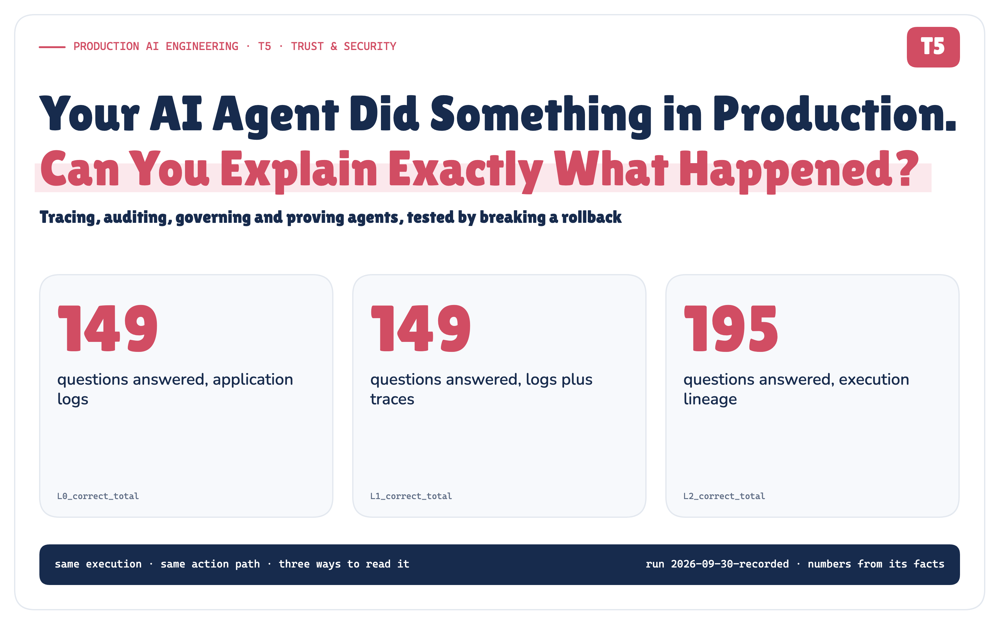

# Your AI Agent Did Something in Production. Can You Explain Exactly What Happened?

*A production architecture for tracing, auditing, governing and proving autonomous agent behaviour, tested by breaking a rollback on purpose.*

**Production AI Engineering · T5 · Trust & Security**

*Chapter 10 of 15. New here? Start with [Start Here: What It Takes to Run AI Agents in Production](https://eresh-gorantla.medium.com/start-here-a-hands-on-map-of-production-ai-engineering-5056549657db).*



## 14:09. The rollback worked.

At 14:02 a monitor fires: payment-service is failing 14.2% of requests, thirteen minutes after release v4.18.0. An incident agent picks it up on behalf of the SRE team, a model proposes rolling back to v4.17.2, policy requires approval, two people approve. At 14:09 production moves from revision 184 to 185. The errors stop.

Everything worked.

## 20:09. Now prove it.

Six hours later, security asks: who started this, and on whose authority? Which model and which configuration proposed it? Which policy version allowed it? Who approved *what*, exactly? Did production change once, or twice? Can you show the answers haven't been edited since?

The platform team says what every platform team says: *we have logs.*


*Figure 1. Everything worked. Six hours later, the story is spread over ten systems, each with its own ids.* · Concept + recorded: the ids are E12's, from each component's own log · run 2026-09-30-recorded

They do. Every component logs accurately, about itself, with its own ids. None of them holds the story.

## We have logs. So I measured them.

I didn't want to argue this from a diagram, so I built a **forensic-reconstruction and failure-injection POC**: real processes, real crashes, a real timeout, one rollback run through 15 scenarios across 12 experiments. Then I asked thirteen questions about each run, three ways.

![One execution with a shared action path: agent runtime (real process), model (qwen3:8b, taped), policy (versioned), approval (scripted people), tool gateway (idempotent retries), deployment API (simulated, HTTP). A dashed note: only in the governed path, the deployment is read back before declaring success and hash-chained evidence is written; everything else is shared. The execution feeds three readers, L0 application logs, L1 logs plus traces, L2 execution lineage, which each answer 13 questions scored against ground truth from the deployment API's and approval service's own databases. Legend: real (processes, SIGKILL, HTTP, SQLite, OpenTelemetry, retries, idempotency, hash chain), simulated (the incident, the deployment system, the people, injected faults), recorded (model responses on tape for replay without a GPU).](../diagrams/premium/png/poc-at-a-glance.png)

*Figure 2. The POC: one execution, read three ways, scored against ground truth. Real, simulated and recorded parts are labelled.* · Implemented: the POC's shared action path, the three readers and the real / simulated / recorded split · run 2026-09-30-recorded

- **L0, logs:** each component's application log, written generously: incident ids, request ids, the policy's bundle version.
- **L1, logs plus traces:** the same logs with trace context, plus every OpenTelemetry span.
- **L2, execution lineage:** a governed record of the execution, keyed so it survives every boundary.

All three read the same execution. The action path is shared: the same policy, approvals, retries and idempotency. The governed path adds one behaviour, a read-back of the deployment before it declares success, and I'll point out where that matters. Ground truth came from the deployment API's and the approval service's own databases, never from the records being scored.

## Logs know what. Governance needs more.

![Five rows by three layers. Operational facts (trigger, agent, policy version, approval, attempts, changes): logs 135 of 135, logs plus traces 135 of 135, lineage 135 of 135. On whose behalf: 0, 0 and 15 of 15. Which configuration: 0, 0 and 15 of 15. Really mitigated: 14, 14 and 15 of 15. Integrity provable: 0, 0 and 15 of 15. Totals across all thirteen questions and fifteen scenarios: 149, 149 and 195 of 195. Banner: good logs were better than expected, traces improved joins, the gap is governance semantics.](../diagrams/premium/png/scorecard-simple.png)

*Figure 3. Scenarios answered correctly, per layer. Coverage test, not a benchmark.* · Measured: 13 questions grouped into operational facts and four governance gaps, 15 scenarios × 3 layers · run 2026-09-30-recorded

The logs were better than I expected: **149 of 195**. Every operational question, in every scenario: what triggered it, which policy version decided, who approved, how many attempts, how often production changed.

They missed four things, and those four are governance: **on whose behalf** the agent acted, **which configuration** proposed the action, **whether the incident was really mitigated**, and **whether the record can be proven unaltered**.

Traces didn't change the answers (149 of 195). They changed the method: the logs needed 15 joins on timestamps, traces needed 0. That's real value, but a span only carries what instrumentation put on it, and standard instrumentation doesn't know about delegation or whether the world changed.

The lineage scored 195 of 195. That's a **coverage test, not a benchmark**: it was designed to hold these facts. The real test is whether it keeps holding them when things break.

## One execution, one thread

The idea is small. Every fact is recorded against keys that survive the boundaries between components:

```text
execution exec-106b857f  →  action act-7b7550b9  →  attempts .a1, .a2  →  txn dtx-886a012833
```

*Retries create new attempts, not new intent.* The action id is the idempotency key the deployment API sees. Each id is recorded on both sides of the boundary it crosses, and each record is written before the step it describes, so a process that dies mid-call still leaves "attempt 1 was in flight" behind.

## The tool said success. Production disagreed.

In one scenario the deployment API answers `200 {"status": "ROLLED_BACK"}`, and its controller never applies the change.


*Figure 4. 200 OK ≠ world-state change. Only a read-back can tell.* · Recorded: E11, fault injected (SIMULATED), real read-back and verdicts · run 2026-09-30-recorded

The logs and the traces both said *mitigated*. The governed path reads the deployment back, finds it still on v4.18.0 at revision 184, records `EFFECT_NOT_OBSERVED` and escalates. It was the only wrong answer the logs gave all run, and it was the one that mattered most.

## The rollback happened. The response didn't.

This is the flagship experiment. The deployment API commits the rollback, then holds its response past the gateway's timeout and closes the connection.

![Attempt 1 posts the rollback with key act-7b7550b9; the deployment API commits revision 184 to 185; the response is lost; the agent sees a 1,503 ms timeout, outcome unknown, and retries. With the key: attempt 2 carries the same action id, the API replays its stored response, 1 production mutation, revision 184 to 185. Without the key: attempt 2 is a new request, the API rolls out again, 2 production mutations, revision 184 to 186. Banner: idempotency made the retry safe; lineage made the retry explainable.](../diagrams/premium/png/lost-response-hero.png)

*Figure 5. One lost response, with and without the key.* · Measured: E12a vs E12b, truth from the deployment API's revisions table · run 2026-09-30-recorded

The agent sees a timeout after 1,503 ms and cannot know whether production changed. So the record says exactly that: attempt 1, **outcome unknown**, not "failed". The retry carries the same key; the API returns its stored response. **2 attempts, 1 change.**

The control run is the same fault without the key: **2 changes**, revision 184 → 186. The running version is v4.17.2 either way, so a version check passes; only the revision counter shows the second rollout. (My verifier still called that run *mitigated*. I'm recording that as a design fix, not quietly patching it.)

Two different mechanisms are at work. The key is a runtime control: it stopped the second rollout. The lineage is the record: it proves afterwards that two attempts were one action and one transaction.

> **Idempotency made the retry safe. Lineage made the retry explainable.**

A SIGKILL between sending the call and recording its answer behaved the same way: the restarted runtime found attempt 1 in flight, asked the API what had happened under that key, and recorded the reconciliation. 1 attempt, 1 change.

## Same events. Two records.


*Figure 6. Operational telemetry is not automatically governance evidence.* · Architecture: the two records and their properties; the measured losses are in the text

The run measured the difference. Two SIGKILLs left 13 orphaned spans and lost 2 processes' metrics, which is how telemetry is built to behave. Every evidence event survived, because each was committed before the next step ran. At 10% sampling, only 1 of the 15 rollbacks would have had a trace at all.

Evidence also has limits of its own. It holds identifiers, decisions and digests, never prompts, reasoning or credentials. A canary planted in a PCI dataset the agent asked for turned up in **0** of the 225 files the run produced.

## Six hours later, the record answers


*Figure 7. The lost-response execution read back from its sixteen evidence events, with the recorded run's offsets.* · Recorded: E12a's evidence events in order, wall-clock offsets · run 2026-09-30-recorded

One query on one key: the payment-service monitor, **for** `group:sre-team`; `qwen3:8b` with prompt template `incident-remediation@17` and configuration `incident-agent-prod@8`; policy `prod-rollback@42`; ic.dev and owner.payments, both approving *this exact action*; two attempts, one change, revision 184 → 185, verified by read-back; a chain that verifies against an anchor held outside the platform.

That's the whole review.

## The architecture

![A dashed control plane (what should be running) feeds the agent runtime. Six steps in order: trigger, agent runtime, governance (identity, policy, approval), action (tool, attempt, idempotency), world changes, verify effect. Below, an execution-lineage band: execution, action, attempt, external transaction, keys recorded on both sides of every boundary. Then two records: telemetry (operate it) and evidence (prove it). A thin cross-cutting line: privacy, redaction, retention, access control, tamper evidence, drift, incident review.](../diagrams/premium/png/architecture-simple.png)

*Figure 8. The control plane defines desired state. Evidence records executed state.* · Architecture: the reference architecture, simplified for the Medium edition; no measured values

The centre of this design isn't a log database. It's the set of keys every step writes. The full five-layer version, with the evidence outbox, is in the technical edition. Nine rules fall out of it:

1. Trace decisions, not just requests.
2. Correlate identities across delegation boundaries.
3. Version the policies and configurations that govern execution.
4. Bind approvals to the exact action they authorize.
5. Give retries and attempts explicit identities.
6. Verify side effects instead of trusting tool responses.
7. Treat audit evidence differently from debugging logs.
8. Collect only the evidence you are allowed to retain.
9. Make the production story reconstructable after the runtime is gone.

## What the experiment proved — and what it didn't

It didn't prove that lineage beats logs. Good logs reconstructed every operational fact, and traces made the joins reliable.

It did show that governance needs facts ordinary logs don't carry (delegation, configuration, action-bound approval, verified effect, integrity), and that those facts can stay reconstructable through crashes, retries, lost responses and a tool that lies.

The controlled pair is the core result: same fault, same retry, 1 change with the key and 2 without it. The whole run replays from recorded model answers with no model present: 60 answers, 0 misses.

> **Limits**
>
> Simulated deployment API, read back once (no eventual consistency). SQLite evidence store with a file as the witness; an attacker who also controls the anchor is not detected. Scripted approvers, one local model, one generous logging baseline.
>
> [Real vs simulated](https://github.com/ereshzealous/ai_blogs_poc/blob/main/governance_for_ai_agents_poc/results/observability-governance-real-vs-simulated.md)

## The close

We now have identity, authorization, approvals, control, tools, state and evidence. The last article asks how they fit into one production agent platform.

> **Runtime controls make autonomous actions safe. Execution lineage makes them explainable.**

> **If an autonomous agent can change production, you should be able to explain that change as clearly as you would explain a human operator's action.**

---

The method, all fifteen scenarios and the fairness rules are in the [Technical edition](https://github.com/ereshzealous/ai_blogs_poc/blob/main/governance_for_ai_agents_poc/technical/observability-governance-technical.pdf). Every claim is traced in the [Evidence Check](https://github.com/ereshzealous/ai_blogs_poc/blob/main/governance_for_ai_agents_poc/results/observability-governance-evidence.md). Every scenario, read through each layer, is in the [Lab Console](https://github.com/ereshzealous/ai_blogs_poc/blob/main/governance_for_ai_agents_poc/results/t5-results.md), which opens on the lost-response case.

## References

**[9]** Semantic conventions for generative AI systems (README) — OpenTelemetry, semantic-conventions v1.41.1 (2026-05-11). [github.com/open-telemetry/semantic-conventions/blob/v1.41.1/docs/ge…](https://github.com/open-telemetry/semantic-conventions/blob/v1.41.1/docs/gen-ai/README.md). The whole GenAI convention set (spans, agent spans, metrics, events) is at Development stability, not Stable. The new repo README at bcc7f9c also says "Development".

**[13]** Trace Context (traceparent header) — W3C, Recommendation 23 November 2021. [www.w3.org/TR/trace-context/](https://www.w3.org/TR/trace-context/). The `traceparent` format is `version-trace-id-parent-id-trace-flags`, e.g. `00-0af7651916cd43dd8448eb211c80319c-b7ad6b7169203331-01`. trace-id is 16 bytes (32 lowercase hex) and parent-id is 8 bytes (16 hex). All zeros are invalid.

**[17]** Tracing SDK: Sampling decision — OpenTelemetry Specification v1.61.0 (2026-09-14). [github.com/open-telemetry/opentelemetry-specification/blob/v1.61.0/…](https://github.com/open-telemetry/opentelemetry-specification/blob/v1.61.0/specification/trace/sdk.md#shouldsample). An unsampled (DROP) span is not recorded at all, so sampled-out traces cannot serve as audit evidence. Audit records must not depend on trace sampling.

**[22]** The Idempotency-Key HTTP Header Field (draft-ietf-httpapi-idempotency-key-header-07) — IETF httpapi WG, Internet-Draft 15 October 2025. Datatracker (2026-09-30) shows "Expired & archived", WG Document, Intended RFC status None. [datatracker.ietf.org/doc/draft-ietf-httpapi-idempotency-key-header/](https://datatracker.ietf.org/doc/draft-ietf-httpapi-idempotency-key-header/). The idempotency-key pattern: a client-generated unique key lets the server recognize retries of the same request. A UUID is recommended. The resource defines key expiry.

**[26]** Deployments: Rolling Back a Deployment — Kubernetes documentation (kubernetes/website main, retrieved 2026-09-30). [kubernetes.io/docs/concepts/workloads/controllers/deployment/#rolli…](https://kubernetes.io/docs/concepts/workloads/controllers/deployment/#rolling-back-a-deployment). `kubectl rollout undo` does not restore the old revision number. A rollback produces a new revision. The docs' worked example rolls back "to revision 2" and the Deployment then shows `deployment.kubernetes.io/revision=4`, with a `DeploymentRollback` event. Revisions are created only when `.spec.template` changes, so scaling does not create one.

**[39]** Regulation (EU) 2016/679 (GDPR), Article 5(1)(c) data minimisation — Official Journal of the EU, L 119, 4.5.2016. [eur-lex.europa.eu/eli/reg/2016/679/oj](https://eur-lex.europa.eu/eli/reg/2016/679/oj). Telemetry that contains personal data (prompts, tool arguments, user IDs) should be limited to what is necessary. This supports default-off content capture and hashing/redaction.

**[43]** Efficient Data Structures for Tamper-Evident Logging (Crosby & Wallach), Section 2.2 — USENIX Security 2009. [www.usenix.org/legacy/event/sec09/tech/full_papers/crosby.pdf](https://www.usenix.org/legacy/event/sec09/tech/full_papers/crosby.pdf). Tamper evidence needs commitments to be distributed to at least one honest external auditor (gossip/witness/publication). This is the "external anchor" requirement for the POC's hash chain.

**[45]** LLM06:2025 Excessive Agency, mitigations (complete mediation and monitoring) — OWASP Top 10 for LLM Applications 2025. [genai.owasp.org/llmrisk/llm062025-excessive-agency/](https://genai.owasp.org/llmrisk/llm062025-excessive-agency/). Policy enforcement outside the model, plus logging/monitoring of downstream actions.

The full list, with the passage each source supports and what it does not, is in `research/sources.md` and the technical edition.

---

**Next in Production AI Engineering:** T6 · Securing Agents & MCP

**Previously:** T4 · AI Control Plane

**New to the series?** Start with the map of all fifteen chapters:

https://eresh-gorantla.medium.com/start-here-a-hands-on-map-of-production-ai-engineering-5056549657db

**Go deeper:** [Technical deep dive](https://github.com/ereshzealous/ai_blogs_poc/blob/main/governance_for_ai_agents_poc/technical/observability-governance-technical.pdf) · [Results](https://github.com/ereshzealous/ai_blogs_poc/blob/main/governance_for_ai_agents_poc/results/t5-results.md) · [Proof of concept on GitHub](https://github.com/ereshzealous/ai_blogs_poc/tree/main/governance_for_ai_agents_poc)

*Every measured number is substituted from `observability_governance_poc/runs/2026-09-30-recorded/facts.json`.*
