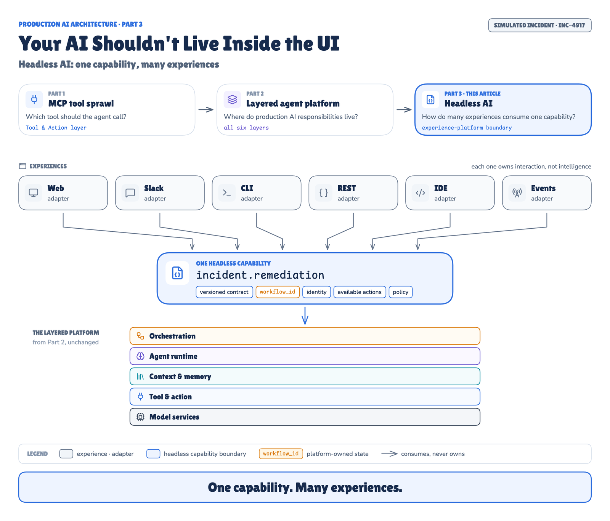

# Headless AI POC: one capability, many experiences

The proof of concept behind **"Your AI Shouldn't Live Inside the UI"**, Part 3 of an AI architecture series.

- **Part 1:** [MCP tool sprawl](../mcp_sprawl_poc).
- **Part 2:** [Layered agent platform](../layered_agent_poc).
- **This POC:** adds a **headless capability boundary** *around* the unmodified Part 2 platform. It runs one simulated production incident, INC-4917, across Slack-shaped chat, a real web console, a CLI, a REST API and an alert webhook.



## What it shows

| Experiment | Question | Result in run `2026-09-17-recorded` |
|---|---|---|
| H1 | Does the channel change what the capability does? | Same status, remediation, policy and approval from CLI, REST and Slack. Model evals 8/8 · 8/8 · 8/8 |
| H2 | Can work started in Slack be approved on the web and read from the CLI? | Yes, across separate OS processes. One `workflow_id`, one trace, 2 processes wrote checkpoints |
| H3 | What does adding a channel, or changing a rule, touch? | Teams adapter: 4 files, 0 core files. Rule change: 2 platform config files, 0 channel files |
| H4 | Can any channel skip or forge approval? | No. The same `REQUIRE_APPROVAL` everywhere, and 5 forgery attempts refused |
| H5 | Is a person's authority the same in every channel? | Yes. Bob is `FORBIDDEN` on Slack, web, CLI and REST; Alice resolves to one principal |
| H6 | Does rendering need reasoning? | No. 0 model, tool, policy or workflow activity across 250 renders per channel |
| H7 | What happens when the Slack adapter dies mid-workflow? | The workflow completes on the web. The Slack update waits in the outbox and arrives after a restart (26.7 s outage) |

7/7 experiments and 52/52 checks pass · 44 tests · 5 import contracts kept.

## Layout

```text
headless_ai_poc/
├── src/headless_ai_platform/
│   ├── contracts/        CapabilityRequest / CapabilityResponse, schema 1.0
│   ├── capabilities/     incident.remediation: contract ↔ platform view, available actions
│   ├── identity/         channel subject → enterprise principal
│   ├── gateway.py        validate · resolve · dispatch · subscriptions · outbox
│   ├── interactions.py   channel-facing state (never workflow state)
│   ├── platform/         layered.py: the ONLY module that imports Part 2 (its facade)
│   ├── channels/         slack.py · web.py · rest.py · cli.py · event.py
│   ├── renderers/        slack · web · cli · api (pure functions of the contract)
│   ├── static/           the web console (HTML/JS/CSS, no build step)
│   └── server.py         hosts any set of channels over one gateway
├── config/               headless.yaml, channel_identities.yaml (synthetic)
├── baseline/             a reasonable channel-coupled implementation, for comparison
├── experiments/          H1–H7, the change-scope patches, the runner
├── tests/                contract, identity, renderers, gateway, platform flows, HTTP adapters, architecture
└── runs/                 recorded runs (results, model traffic, process logs)
```

| Area | Files | Lines | What it holds |
|---|---|---|---|
| Contract | 4 | 144 | request, response, errors, schema version |
| Capability | 1 | 95 | `incident.remediation`: contract ↔ platform view, available actions |
| Gateway and interaction state | 3 | 285 | validation, dispatch, subscriptions, outbox, idempotency |
| Identity resolution | 2 | 70 | channel subject → enterprise principal |
| Platform adapter | 2 | 92 | the only code that imports Part 2 (its facade) |
| Channel adapters | 7 | 355 | Slack, web, REST, CLI, event |
| Web console | 3 | 116 | static HTML/JS/CSS, no build step |
| Renderers | 5 | 115 | Slack blocks, web card, CLI text, API JSON |

## Requirements

- Python 3.12+ and [uv](https://docs.astral.sh/uv/).
- **The whole `ai_blogs_poc` repository.**
  - This POC depends on `../layered_agent_poc` as an editable path dependency. It reuses Part 2's engine, policy, principals, runbooks and simulated enterprise systems; nothing is copied.
  - Copying this folder out on its own is not supported.
- For live runs only: [Ollama](https://ollama.com) with `gpt-oss:20b`, `qwen3:8b` and `nomic-embed-text`.
- For the diagrams and screenshots only: Node 20+ and a local Chrome.

## Run it

```bash
uv sync

# fast checks: no Ollama needed (model answers are replayed from Part 2's recording)
uv run pytest
uv run lint-imports

# every experiment, replaying the recorded model answers of the reference run
uv run hai-exp run --replay

# every experiment, live against Ollama (records its own model traffic)
uv run hai-exp run --run-id my-run
```

### Try the channels yourself

```bash
uv run hai serve --channels slack,web,rest,event --port 8090    # needs Ollama, or LAP_MODEL_TRAFFIC=replay:<dir>

# Slack-shaped @mention
curl -s localhost:8090/slack/events -H 'content-type: application/json' -d '{"type":"event_callback","event_id":"Ev1",
  "event":{"type":"app_mention","user":"U04ALICE","channel":"C1","ts":"1.0","text":"<@UOPS> investigate INC-4917"}}'

# the web console (sign in as Alice or Bob)
open "http://localhost:8090/console?wf=<workflow id>"

# REST
curl -s localhost:8090/v1/capabilities/incident.remediation/workflows/<workflow id> -H 'X-Subject: api|alice'

# CLI (runs the capability in its own process; exit code 10 = waiting for approval, 0 = completed)
uv run hai --as alice@company.example start INC-4917
uv run hai --as alice@company.example approve <workflow id>
uv run hai --as bob@company.example approve <workflow id>     # FORBIDDEN, exit code 3
```

## Design rules, and where they are enforced

| Rule | Enforced by |
|---|---|
| Only `platform/layered.py` imports Part 2, and only its facade, commands and principal directory | `.importlinter`, `tests/test_architecture.py` |
| Channels never import the platform port, a capability, identity or the store | `.importlinter` |
| Renderers see only the contract (no gateway, platform, network or sqlite) | `.importlinter`, `tests/test_renderers.py`, H6 |
| Channel code holds no policy, role names, model names, prompts or workflow steps | `tests/test_architecture.py` |
| A channel cannot state an identity or an approval | `extra="forbid"` on the contract, `tests/test_contract.py`, H4 |
| The workflow belongs to the platform; channel sessions are only references | `tests/test_platform_flows.py`, H2, H7 |

## Limitations

- **Simulated integrations.** Slack and Teams are simulated with correctly shaped payloads. Identity linking is a YAML file.
- **Illustrative experiments.** One live run per channel; the H3 patches were written by hand. None of this is a benchmark.
- **Local outbox.** The outbox is polled from a shared SQLite file. Use a durable queue in production.

MIT licence.
