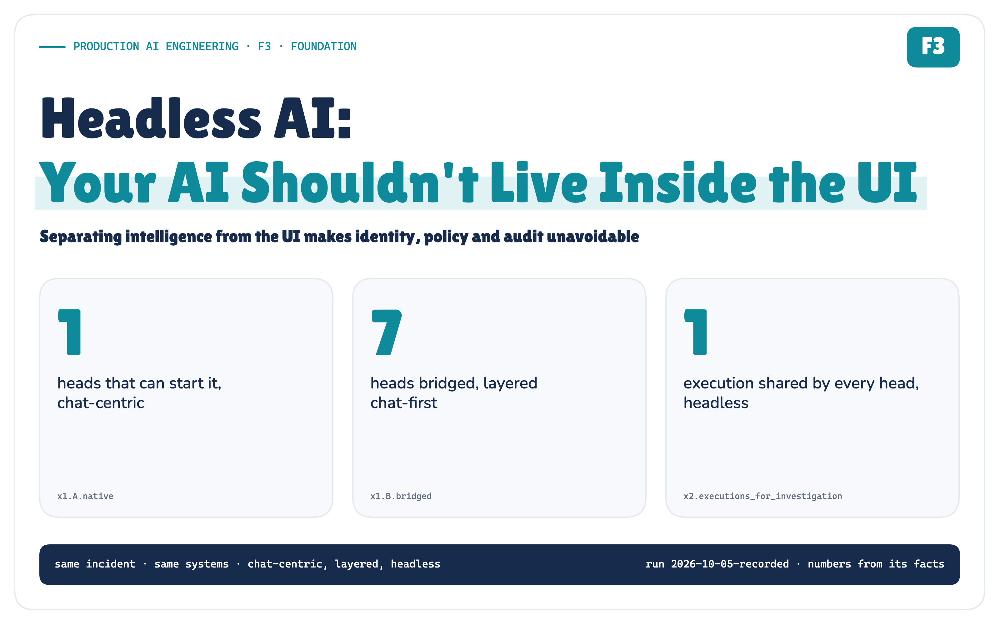

# Headless AI: Your AI Shouldn't Live Inside the UI

*Headless AI separates intelligence from any one interface, so events, apps, workflows and other agents can use it too. It also makes identity, policy and audit unavoidable.*

**Production AI Engineering · F3 · Foundation**

*Chapter 3 of 15. New here? Start with [Start Here: What It Takes to Run AI Agents in Production](https://eresh-gorantla.medium.com/start-here-a-hands-on-map-of-production-ai-engineering-5056549657db).*



Most production AI systems still assume the same shape:

```text
Human → Chat → AI → Action
```

Someone notices a problem, opens a chat window, types a question, and the agent goes to work. It is a good shape for a demo. It is also the shape almost every team ships first.


*Figure 1. The chat assumption. The chat box quietly owns the trigger, the identity, the state, the approval, the audit log and the output format.* · Architecture: concept figure; no measured values

Chat made AI easy to experience. It also quietly became an architectural assumption.

Now change one thing. At 14:02 a monitor fires: **payment-service error rate 14%, against a 1% SLO**. Nobody has typed anything. The same incident is interesting to a status page, a runbook engine, a deployment pipeline that is about to ship the next release, and another agent that guards releases.

They all need the same intelligence. None of them is a person in a chat window.


*Figure 2. When chat disappears, the callers change and five questions appear that the chat window used to answer silently.* · Architecture: concept figure; no measured values

This is the problem Headless AI addresses.


## What Headless AI is

Here is the definition this note uses:

> **Headless AI separates reusable intelligence from any particular user interface or interaction surface.**

"Headless" does not mean *no head*. It means the intelligence does not belong to *one* head. Chat can still exist. So can a web console, a mobile app, a Slack bot. They become consumers of the intelligence, not its container. And in many executions no interface is involved at all: an event arrives, the runtime acts, a human is asked only when it matters.


*Figure 3. Many heads, one intelligence. Chat and web still exist; they stop owning the intelligence.* · Architecture + implemented: the contract names come from hai/contracts.py

A word of honesty about the term. "Headless AI" is an emerging phrase, not a standard. Vendors use it for different things: exposing a platform as APIs and MCP tools for agents, agents triggered without a UI, or simply "autonomous and invisible". This note takes a narrower, architectural position: headless is about **how intelligence is consumed**, not about how autonomous it is.

## The headless CMS analogy

Content management went through this a decade ago. A headless CMS stores content once, serves it through an API, and lets any channel render it: a website, an app, a kiosk, an email.


*Figure 4. Headless CMS separated content from presentation. Headless AI makes the same move for intelligence, and then has to govern what the intelligence can do.* · Analogy: headless CMS (Storyblok, research/sources.md [1]); no measured values

The analogy is useful up to one point. A CMS *returns content*. An AI runtime *decides, and can act*. So the headless boundary for AI needs things a CMS never did: an identity for every execution, authorization for every action, human approval for the risky ones, and an audit trail.

That difference is what the rest of this note is about.

## From chatbot to intelligence platform

The shift is easiest to see as three stages. The model and the tools don't change between them. What changes is who owns the boundary.


*Figure 5. From an AI application to AI infrastructure: the consumers, the trigger, the identity and the governance all move.* · Architecture: concept figure; no measured values

> **Production AI should not be designed as a chatbot with tools. It should be an intelligence platform with many consumers, and humans are only one of them.**

## Headless is not another layer

It would be easy to draw Headless AI as a seventh box on top of a layered architecture (the six layers of the previous note in this series). That would be wrong.


*Figure 6. Layered architecture is how AI is constructed. Headless is how it is consumed. The two questions are orthogonal.* · Architecture: F2's six layers and F3's contract; no measured values

Layered architecture answers *where each responsibility lives*. Headless architecture answers *who may call it, through which contract, and with whose authority*. A layered platform can still be consumed through exactly one chat window. A headless runtime with no layers inside is just a fragile endpoint. You want both.

> **Layered Architecture tells us how AI is built. Headless AI tells us how it becomes reusable.**

## Where this fits in the series

That distinction is also why this note follows the two before it. It is the third note in the Foundation track of *Production AI Engineering*.


*Figure 7. Sprawl, structure, reuse. Each note answers the question the previous one exposed; identity is next.* · Series map: learning-map.yaml (Foundation track); no measured values

- **F1, MCP Tool Sprawl**, was the problem: agents that each own hundreds of tools, credentials and connections.
- **F2, Layered Architecture**, was the structure: experience, orchestration, runtime, context, tools and model services, with control planes across them.
- **F3, Headless AI**, is reuse: how many consumers use that structured intelligence safely.

## One incident, three architectures

To make this concrete I built a small POC around that payment-service alert and ran the same incident through three architectures. The enterprise systems are simulated. The ingress, runtime, capability gateway, policy, approvals, audit chain and traces are real code, and every number below comes from the recorded run.

*Simulated · Implemented: simulated enterprise, clock and identity provider; deterministic reasoner; real boundary code · recorded run 2026-10-05*

**Version A: chat-centric**

The monitor pages an engineer. The engineer opens the chat and asks *"Why is PaymentService failing?"* The assistant holds a credential for every system and acts as whoever typed.


*Figure 8. Version A. The human is the trigger, the session and the identity. The monitor can only page someone.* · Measured: X1, chat-centric baseline · run 2026-10-05-recorded

Of the 8 heads in the experiment, **1** can start an investigation. The assistant process holds **6** system credentials.

**Version B: layered, chat-first**

This is F2's structure: a runtime, a capability layer, policy and audit. It fixes the inside. But chat is still the only door, so every other trigger is *bridged*: an alert bot posts a question into a channel.


*Figure 9. Version B. Layering fixed the structure; chat is still the front door, so every other trigger becomes a bridge and loses its identity.* · Measured: X1, layered chat-first baseline · run 2026-10-05-recorded

The bridge works, and it quietly lies. The investigation's invoker is recorded as `bot.alerts`, not the monitor. The event's source and id are gone. **7 of 8** heads have to be bridged, and the CI gate and the release agent arrive as chat questions instead of release checks.

**Version C: headless**

The monitoring event invokes the runtime directly.


*Figure 10. Version C. The monitor asks, the runtime investigates, and a human approves the one change that matters.* · Recorded + implemented: the headless workflow steps of the published run · run 2026-10-05-recorded

The runtime authenticates the webhook, gives the execution its own identity, gathers evidence through five read capabilities, ranks three hypotheses, opens an incident, and proposes a rollback of `v4.18.0`. Then it stops. A production rollback needs an incident commander, so the execution pauses until one approves that exact call.

No one had to open an AI app first.


*Figure 11. Eight heads during one investigation: one execution, one assessment, one incident, one rollback.* · Measured: X2, eight heads during one investigation · run 2026-10-05-recorded

While the investigation was open, the chat, the web console, the API and the workflow engine all asked about the same incident. None of them started a new investigation. They **joined** the open one: 1 execution, 1 assessment, 1 incident, and 1 rollback after one approval. The CI gate and the release-guard agent read the same finding and blocked the next deploy.

> **Heads consume one shared execution. They don't independently rerun the investigation.**

## What changes in production

The moment intelligence can run without someone opening a chat window, the things chat used to answer silently become architecture.

**Identity**

Who invoked this? Who is it acting for? What is it allowed to do? In version C, each execution receives an identity by token exchange: the invoker (`svc.monitoring-webhook`), the human it acts for (none, here), the agent (`incident-intel@1.3.0`) and the runtime workload. Its scopes are the *intersection* of what the invoker may delegate and what the agent may ever do.


*Figure 12. Invocation is not authorization. The execution's scopes are an intersection, and the rollback scope is in none of them.* · Recorded: X4, the event execution's identity; scopes from config/principals.yaml · run 2026-10-05-recorded

That leads to the single most important rule in this note:

> **Invocation is not authorization. Being able to start the agent grants none of its actions.**

**Approval**

Autonomy is not a property of the agent. It is a decision made per action.


*Figure 13. Reads run, low-risk writes run by policy, high-risk writes wait for the right human, destructive ones never run. Right: every approval attempt the POC made.* · Measured: X4, approval attempts; ladder from config/policies.yaml · run 2026-10-05-recorded

The POC tried to approve the rollback five ways: as the agent, as the monitor, as a responder, as the incident commander with a changed target, and as the commander approving the exact call. **4 were refused.** Only the last one ran, and it ran once.

**Duplicates**

Many event-driven systems use at-least-once delivery, so duplicate events must be expected. In the POC the same alert arrived 3 times and then re-fired with a new id. The result was still **1 execution, 1 incident and 1 rollback**. Duplicates are normal in event systems. Duplicate side effects are a design choice.

**State and contract**

Chat-centric systems let the conversation become both the execution state and the output. A headless system cannot. Execution state belongs to the runtime. Business truth stays in the systems of record: the incident lives in the ticketing system, not in anyone's chat thread. Every head receives the same structured result, an `ExecutionView`. Chat prose becomes one rendering of that result, not the result itself.

```text
Chat-centric                     Headless

Conversation                     Runtime store ─── execution state
 ├── state                       Systems of record ─ business truth
 └── output                      ExecutionView ──── the canonical result
                                        │
                                 ┌──────┼──────┐
                                 Chat   Web    API   (each renders it)
```

That closes the list the chat window started with: trigger, identity, state, approval, audit and output all have an owner that is not a conversation.

**Observability and audit**

When nobody watched it happen, two different records have to explain it.


*Figure 14. Observability explains behaviour. Audit proves authority. A headless system needs both.* · Measured: X5, spans and audit records of the X2 execution · run 2026-10-05-recorded

Observability answers *why is the system behaving this way?* The run left 28 spans on one trace id. Audit answers *what happened, under whose authority, and what changed?* All 7 audit questions were answered from 20 hash-chained records, and editing one of them broke the chain.

## Why MCP sprawl matters again

F1 showed what happens when every agent owns its own tools. Headless AI multiplies the callers. If every head brings its own assistant with its own integrations, it multiplies the sprawl too.


*Figure 15. More heads can mean more sprawl. Where the integrations live decides whether headless multiplies the sprawl too.* · Derived: X7, arithmetic from config/*.yaml; not measured · run 2026-10-05-recorded

With the POC's numbers, 8 heads each holding 6 integrations would be **48** credentialed connections. Through one capability layer it is **6**, all held by the gateway, and the agents hold none. This is arithmetic from the configuration, not a measurement, but it is the arithmetic that decides your blast radius.

The capability layer also changes *what* the agent can ask for. There is no `execute_sql` and no raw `kubectl` in the registry, only business capabilities like `getRecentDeployments()` and a governed `rollbackDeployment()`. When I swapped in a deliberately compromised reasoner that asked for raw tools, a destructive delete and a rollback to an arbitrary version, the gateway denied 4 of its 5 proposals and parked the last one for a human. It executed 0.

## Headless, embedded, agentic

Three words get mixed up constantly. They are different dimensions.


*Figure 16. Who can call it and what it does once called are independent choices.* · Architecture: concept figure; no measured values

- A `POST /summarize-contract` endpoint is **headless but not agentic**: one model call, a schema out, any app can use it.
- An "Ask AI" button inside one product is **embedded**: the app owns the prompt, the session and the result.
- An agent that lives in one chat window is **agentic but UI-coupled**.
- The incident runtime in this POC is **headless and agentic**.

RAG, MCP and tool use are implementation choices. They appear in every quadrant and none of them makes a system headless.

## Design principles


*Figure 17. Ten rules for headless AI, each exercised by an experiment in the POC.* · Reasoned from the experiments named on each rule

If you keep only five:

1. **Separate intelligence from presentation.** Heads translate requests and render results; the investigation runs once, in the runtime.
2. **Separate invocation from authorization.** Starting an execution grants none of its actions.
3. **Expose governed capabilities, not raw access.** The capability layer is the only path to your systems.
4. **Design for duplicates and retries.** Expect duplicates; make business effects idempotent.
5. **Observe every execution, audit every consequence.** They answer different questions.

## Common mistakes

- **"Headless means no UI."** The UIs stay. They stop owning the intelligence.
- **"Headless means a headless browser."** A headless browser hides the browser UI while automating it. Headless AI decouples intelligence from any particular UI.
- **"Headless means agentic."** A single inference endpoint can be headless. An agent can be trapped in a chat window.
- **"Headless is an API around an LLM."** An endpoint is an entry point. Without identity, policy and audit behind it, it is an unguarded door.
- **"The event that invoked it may do anything it asks."** Invocation is not authorization.
- **"The agent's memory can hold the incident."** Business truth belongs in the systems of record, not in model memory.
- **"Traces are enough."** Traces explain behaviour; audit proves authority.

> **Try it yourself**
>
> The POC is `headless_ai_poc` in the series' GitHub repository. `uv run hai demo` runs the incident end to end in a second; `uv run hai experiments` reproduces all 30 checks; `uv run hai verify` checks the published evidence without trusting it. The technical edition covers the runtime, capability, identity, event and failure design in depth.
>
> [Read the technical deep dive](https://github.com/ereshzealous/ai_blogs_poc/blob/main/headless_ai_poc/technical/headless-ai-technical.pdf)

The code and the recorded evidence: [github.com/ereshzealous/ai_blogs_poc/headless_ai_poc](https://github.com/ereshzealous/ai_blogs_poc/tree/main/headless_ai_poc).

## What comes next

Once intelligence can be started by humans, services, events, workflows and other agents, one question dominates everything else.


*Figure 18. Once anything can invoke it, identity is the next architecture problem.* · Series map; no results claimed

> **Who exactly is acting, and whose authority are they using?**

That is the next note: **Agent Identity**. Delegation chains across agents, acting on behalf of a human, workload identity for services, least privilege per execution, revocation, and proof of authority in the audit trail.

The incident in this note also left one action waiting: `rollbackDeployment(payment-service, production, v4.18.0 → v4.17.2)`, policy `APPROVAL_REQUIRED`. Headless AI stops there on purpose. How that exact action is safely approved is the question **Human-in-the-Loop** (T3) answers, further along the same chain.

We started by giving LLMs tools. Tool growth created sprawl. Layering gave production AI structure. Headless AI makes that structure reusable. And once it runs without a chat window, identity, authorization, policy, audit and control stop being features and become the architecture.

> **Headless AI isn't about removing the user interface. It removes the user interface as the boundary of intelligence.**

---

## Sources

- Storyblok, *Headless CMS explained* (the content analogy).
- Anthropic, *Building effective agents* (workflows versus agents).
- Model Context Protocol specification, revision 2026-07-28, and its authorization and security best-practice pages.
- IETF RFC 8693, *OAuth 2.0 Token Exchange* (delegation and the actor claim).
- OWASP, *Top 10 for LLM Applications 2025*: LLM01 Prompt Injection, LLM06 Excessive Agency.
- CloudEvents 1.0.2 (`source` + `id` uniqueness).
- Salesforce, Lyzr and Arion Research on "headless" agents, as examples of how differently the term is used.

The full, annotated source list is in the technical edition.

---

**Next in Production AI Engineering:** S1 · Memory, Context & State

**Previously:** F2 · Layered Agent Platform

**New to the series?** Start with the map of all fifteen chapters:

https://eresh-gorantla.medium.com/start-here-a-hands-on-map-of-production-ai-engineering-5056549657db

**Go deeper:** [Technical deep dive](https://github.com/ereshzealous/ai_blogs_poc/blob/main/headless_ai_poc/technical/headless-ai-technical.pdf) · [Results](https://github.com/ereshzealous/ai_blogs_poc/blob/main/headless_ai_poc/results/f3-results.md) · [Proof of concept on GitHub](https://github.com/ereshzealous/ai_blogs_poc/tree/main/headless_ai_poc)

*Every measured number is substituted from `headless_ai_poc/runs/2026-10-05-recorded/facts.json`.*
