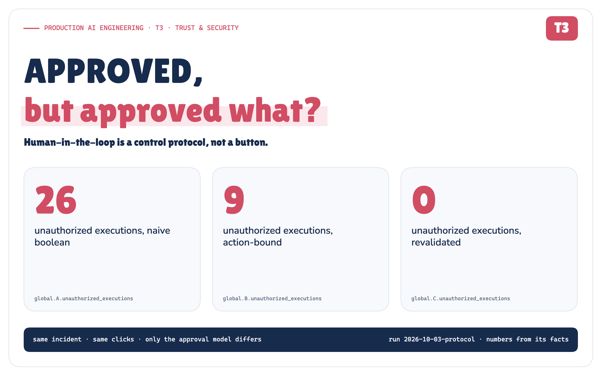
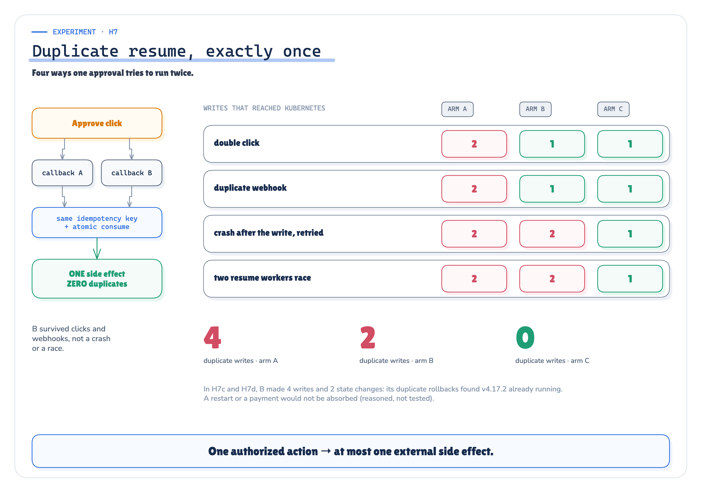
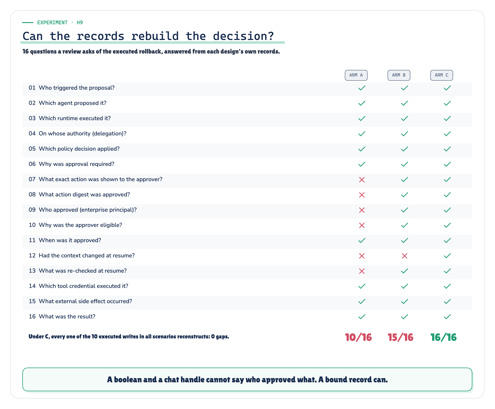

# APPROVED, but approved what?

*Human-in-the-loop is a control protocol, not a button. I built three approval models on the same production incident and tried to break each of them thirty ways.*

**Production AI Engineering · T3 · Trust & Security**

*Chapter 8 of 15. New here? Start with [Start Here: What It Takes to Run AI Agents in Production](https://eresh-gorantla.medium.com/start-here-a-hands-on-map-of-production-ai-engineering-5056549657db).*



It is 14:09.

The incident agent from the last three notes has done its job. payment-service is failing 14% of requests in production, deployment `v4.18.0` shipped just before the errors started, and the agent proposes the obvious fix:

```text
rollbackDeployment  payment-service  production  v4.18.0 → v4.17.2
```

Policy answers `REQUIRE_APPROVAL`. In *Authorization & Policy* the incident commander approved that exact call at 14:08:50. This time the on-call engineer is busy, and the request sits in Slack:

```text
Production rollback requested.
[ APPROVE ]   [ DENY ]
```

**37 minutes pass.** During them, a hotfix `v4.18.1` ships, the incident is raised to SEV1, the agent's workflow loses its runtime and resumes on another one, and the delegation the agent acts under is revoked.

At 14:46 the engineer presses **APPROVE**.


*Figure 1. Thirty-seven minutes in one recorded run. The same clicks at the same minutes, under three approval designs.* · Recorded: story.json (scenario H5c under arms A, B and C) · run 2026-10-03-protocol

Now ask the only question that matters. **What exactly did they approve?** "Roll back production"? "Roll back payment-service"? "Roll back payment-service `v4.18.0 → v4.17.2`, for incident INC-5120, under prod-change-policy v7, on the authority the agent had at 14:09"? Production is not running `v4.18.0` any more. Does the old approval still authorize a rollback?

This note argues that human-in-the-loop is not "send a Slack message and wait". **It is a control protocol: it pauses one specific side effect, shows an authorized human the evidence, binds that human's decision to the exact action, and resumes only if the context is still valid.** Then it tests that claim: three approval designs, the same incident, 30 scenarios, one recorded run.

## The button is not the control

Here is the design most teams start with:

```python
approval = {"approval_request_id": "req-5120", "approved": True}

if approval["approved"]:
    execute(agent.next_action())
```

It looks responsible. It records that somebody clicked. It records nothing about *what* they clicked on, *who* they were, *how long ago*, or *how many times* the result may be used.


*Figure 2. A boolean records a click. Everything a reviewer needs to know is missing.* · Recorded + architecture: arm A's message as the run posted it · run 2026-10-03-protocol

Every failure in this note is one of those four questions going unanswered. A different action runs under the old approval. A guest in the channel clicks. The click arrives after the world has changed. The callback is delivered twice.

> **Approval is evidence used by authorization. It is not authorization by itself.**

## Authorization and approval are different decisions

Human-in-the-loop starts where *Authorization & Policy* ends: the policy engine has already returned `ALLOW`, `DENY` or `REQUIRE_APPROVAL` (the last note called it `ALLOW_WITH_APPROVAL`). Three different questions follow, and collapsing any two of them is how approvals go wrong.


*Figure 3. Seven boundaries, three questions.* · Architecture: concept figure; no measured values

- **Authorization:** is this action valid under policy? A `DENY` never reaches a human.
- **Approval:** does an authorized human consent to *this exact action*?
- **Execution gate:** may this approved action *still* execute, now?

The model may propose an action. Whether approval is required, who may approve, which decision is valid, whether the action still matches, whether the decision has expired or been used, and whether execution may resume are all deterministic system logic. None of it belongs in the prompt, the model, the Slack message or the approval UI.

## Approval must bind to an exact action

A production approval is a record, not a flag. The POC's approval artifact binds the request, the incident, the agent and its delegation, the policy decision, the exact action, the human and the clock into one object. A SHA-256 digest of the canonical action (capability, target, arguments, preconditions, policy version) is what the human approves.


*Figure 4. The approval artifact the POC recorded for the approved rollback. No credential or secret is part of it.* · Recorded: the approval artifact of H9a under arm C (audit.jsonl) · run 2026-10-03-protocol

This is the POC's contract, not an industry standard. The same idea exists in OAuth as rich authorization requests, where the request describes the exact action the user consents to [12]. Change the target version, the service or the environment, and the digest no longer matches. The old approval is void, and the changed action becomes a new request.

The human side matters as much as the digest. A person cannot consent to an action they cannot see.


*Figure 5. What the approver saw: a bare button in arm A, the recorded evidence card in arms B and C.* · Recorded: the messages arms A and C posted in H9a (channel.posted) · run 2026-10-03-protocol

## What must happen after a pause

An approval is a pause in a durable workflow. Approvals take minutes or hours, and while the workflow waits, everything around it keeps moving. When it resumes, `approved = true` is the least interesting fact in the room.

Before the side effect, the resume step has to re-establish everything the approval depended on:

- **identity:** is the agent still enabled, and is the worker that resumed it registered for that agent?
- **delegation:** is the authority it acts under still active?
- **policy:** does the current policy still require exactly this approval, at the version the human saw?
- **resource state:** is the system still in the state the human approved against?
- **approval validity:** enough distinct, still-eligible approvers, and not expired?
- **digest:** is this exactly the approved action?
- **idempotency:** is this the first and only execution under this approval?


*Figure 6. The approval state machine the POC enforces. Entering REVALIDATING consumes the approval, so only one worker can resume it.* · Implemented + measured: TRANSITIONS in hitl/approvals.py; H7 duplicates under C · run 2026-10-03-protocol

## The production architecture

Put together, the protocol is a chain where every link is checkable. The agent proposes. Policy evaluates. An immutable request is stored and sent over a channel. The human sees evidence and decides. The decision is authenticated and bound. The durable workflow resumes and revalidates. The approval is consumed atomically, an idempotent gate mints a narrow tool credential, the side effect happens once, and the whole chain lands in the audit.


*Figure 7. Human-in-the-loop as a control protocol: decide on evidence, bind, revalidate, execute once, prove it.* · Architecture: concept figure; no measured values

## I built three approval models and tried to break them

Arguments about approval designs are cheap. So I extended the incident system from the earlier notes with three interchangeable approval protocols and ran each one through the same scripted failures:

- **A · naive boolean.** `approved = true`. The click is the decision. There is no digest, no expiry and no single use. This is the anti-pattern, and the control: its failures show that the scenarios can detect a bypass.
- **B · action-bound.** The approval artifact: digest, an authenticated and eligible approver, expiry, single use. This is the common first fix. Nothing is re-checked on resume.
- **C · revalidated protocol.** Everything in B, plus revalidation on resume, an atomic consume and an idempotency key.


*Figure 8. The testbed: one incident, three approval models, everything else held constant.* · Implemented + measured: the testbed of hitl_poc; counts from the run · run 2026-10-03-protocol

Everything else was held constant: the incident, the proposed action, the agent and its identity chain, the policy, the simulated Kubernetes, and the humans. The same people click the same buttons at the same minutes in every arm. **Every pass criterion was written down and frozen before the first run**: 30 scenarios, 8 global assertions that arm C must hold at zero, and a prediction for every arm. That makes 90 scenario runs. Three changes made after the freeze (two code fixes and an id rename) are logged with the run; none changed the outcome of a check. The humans, the channel, the cluster and the clock are simulated and deterministic; the control logic is real code. The [Evidence Check](https://github.com/ereshzealous/ai_blogs_poc/blob/main/human_in_the_loop_poc/results/human-in-the-loop-evidence.md) maps every claim below to its recorded evidence.

## Experiment 1: change the action after approval

Alice approves `v4.18.0 → v4.17.2`. On resume, the agent presents something else: a restart, a deeper rollback to `v4.16.0`, the same rollback on orders-service, the same rollback on staging, or a namespace delete.


*Figure 9. Approve one action, run another: what each design let through.* · Measured: H1 and H2 under arms A, B and C · run 2026-10-03-protocol

Under A, **4** changed actions ran on an approval nobody gave them. Under B and C, **0** did. C went further: each mutation became a new request with its own digest (3 reapproval requests in H2), waiting for its own decision. The namespace delete was refused in every arm, A included (0 writes), because policy is enforced on every call. Approval never turns a `DENY` into an `ALLOW`.

## Experiment 2: replay an approval

An approval is used once, legitimately. Then the same approval is presented again: in the same workflow, by a second workflow instance of the same incident, and for a brand-new incident after `v4.18.0` was redeployed. That last case asks for *the identical action*, with the identical digest.


*Figure 10. One approval, presented four times. Only the first use is legitimate.* · Measured: H3 under arms A, B and C · run 2026-10-03-protocol

A replayed **3** times. B and C replayed **0** times. The new-incident case is the instructive one. A matching digest is not enough, because the same action can be legitimately proposed twice. What stops the replay is the binding to one request and one use.

## Experiment 3: let the wrong human approve

Five clicks that should not count: a guest in the incident channel with no enterprise identity, a read-only engineer, the agent approving its own request while claiming to be alice, the author of `v4.18.0` approving the rollback of their own release, and one approver trying to satisfy a two-person rule alone by clicking twice.


*Figure 11. A click is not an approver. The principal behind it is.* · Measured: H4 under arms A, B and C · run 2026-10-03-protocol

A accepted **4** ineligible approvals; B and C accepted **0**. The difference is where identity comes from. A trusts the chat. B and C map the click to an enterprise principal and ask the directory three questions: does this person hold the role, are they outside the request chain, and did they author the change? Separation of duties and dual authorization are long-standing controls [30]. Whether a given action needs two people is a policy decision, not a default.

## Experiment 4: wait 37 minutes

This is the experiment the opening story is about. The request waits 37 minutes, well inside its 60-minute expiry. Meanwhile one thing changes, in seven variants: the hotfix ships; someone rolls back by hand; the delegation is revoked; the agent is disabled; policy moves from v7 to v8, which now wants two approvers; the approver loses the approval role before the workflow resumes; or (the opening story) several of these at once.


*Figure 12. Approved inside its expiry. Wrong anyway.* · Measured: H5 and H6 under arms A, B and C · run 2026-10-03-protocol

This is the result that separates the designs. **B executed all 7 stale resumes.** Its approval was valid by every rule it knows: right digest, eligible approver, not expired, not used. That is exactly the problem. Binding is not revalidation. C executed **0**. It stopped each one with a specific reason (`PRECONDITION_CHANGED`, `DELEGATION_REVOKED`, `AGENT_DISABLED`, `POLICY_CHANGED`, `APPROVER_INELIGIBLE`) and either required a new approval or rejected the request outright.

In the opening story, B rolled production back from `v4.18.1`, the hotfix, to `v4.17.2`. Nobody had reviewed that action. C's revalidation failed 2 of 9 checks and ended in `DELEGATION_REVOKED`, with no rollback.

## Experiment 5: duplicate the resume

One approval tries to run twice, four ways: a double click, a webhook delivered twice, a worker that crashes after the write but before recording it, and two resume workers racing.



*Figure 13. One authorized action, at most one side effect.* · Measured: H7 under arms A, B and C · run 2026-10-03-protocol

A produced **4** duplicate writes, B **2**, C **0**. B is the interesting one. Its "used" flag stopped the double click and the duplicate webhook. It could not survive a crash between the write and the flag, or two workers that both read "unused" before either wrote. C consumes the approval with a compare-and-set before revalidating, and passes the approval's idempotency key to the write. The crashed attempt was reconciled with the same key, not run again.

## Deny, timeout and escalation

The quiet cases matter as much: an explicit deny, no answer at all, an approval that arrives after expiry, an approval used after expiry, and a request nobody answers that escalates to the secondary on-call.

No arm ever turned silence or a deny into an execution (0 under A). But A has no expiry, so a late approval and a stale one both ran (2 expired executions). B and C refused both. Under C the escalation was a recorded state transition (1), and the secondary's approval executed once.

## What the POC actually proved


*Figure 14. Supported findings, and the ones that hold only within a bound.* · Measured + reasoned: global facts of the run and the qualified claims · run 2026-10-03-protocol

**Supported.** Across all 30 scenarios, arm C held every global assertion at zero: unauthorized executions 0, replays 0, duplicates 0, stale resumes 0, ineligible approvals 0. Over the same scenarios, B allowed 9 unauthorized executions and A allowed 26. C still executed every legitimate action (10), so this is not the trivial safety of a gate that blocks everything. Of the run's 79 checks, 70 passed, 9 were arm A's controls breaking as predicted, and 0 failed. None of the preregistered hypotheses was contradicted.

The records matter too. From its own records, C answered all 16 of the 16 questions an incident review asks about the executed rollback: who proposed, on whose authority, what was shown, who approved and why they were eligible, what was re-checked, which credential ran it, and what changed. B answered 15; it cannot say whether the context had changed. A answered 10.



*Figure 15. Sixteen questions about the executed rollback, answered from each design's own records.* · Measured: H9a reconstruction under arms A, B and C · run 2026-10-03-protocol

> **Qualified, not hidden**
>
> - **Revalidation covered the action and the authority, not every fact on the card.** In the opening story the severity went from SEV2 to SEV1 and no check covered it.
> - **Expiry bounds staleness; it does not detect it.** Every stale approval in Experiment 4 arrived inside its 60-minute expiry.
> - **Exactly-once recovery used the simulator's idempotency key.** Real Kubernetes has none, so a production gateway reconciles by reading the rollout.
> - **A human is not a safety guarantee.** Humans approved 7 requests whose context had changed. The protocol caught them, not the people.
>
> [Evidence Check](https://github.com/ereshzealous/ai_blogs_poc/blob/main/human_in_the_loop_poc/results/human-in-the-loop-evidence.md)

What this does not prove: that the window between the last check and the write is closed, or how this behaves with real Slack, a real identity provider and a real cluster, or whether a better card makes people decide better. The [Run Report](https://github.com/ereshzealous/ai_blogs_poc/blob/main/human_in_the_loop_poc/results/human-in-the-loop-report.md) has every number, and [Real vs simulated](https://github.com/ereshzealous/ai_blogs_poc/blob/main/human_in_the_loop_poc/results/human-in-the-loop-real-vs-simulated.md) draws the line.

## Production rules


*Figure 16. Ten rules for an approval-gated action. Each was a scenario in the POC.* · Reasoned from the scenarios named on each rule

For every approval-controlled action, you should be able to answer:

- What exact action, resource and parameters are waiting, and what did the human see?
- Who may approve, who actually approved, and may the requester approve their own action?
- When does the approval expire, and what happens on silence?
- If the action changes after approval, is reapproval required?
- Can the approval be replayed, or executed twice by two callbacks?
- After a long pause, are identity, delegation, policy and resource state re-evaluated?
- Is the tool credential minted only after revalidation?
- Can the complete chain be reconstructed from the records alone?

## The next question

We now know **who** is acting, **what** policy permits, **when** human consent is required, **who** approved, **what exact action** they approved, and **how** to resume without stale authority.


*Figure 17. Four questions, one place to operate the answers.* · Series map: no results claimed

Every agent team now needs identity, policy, approvals, budgets, audit, tool controls, risk rules and observability. Rebuilt inside every agent, they drift, and the gaps in this note reappear one team at a time. **Next: the AI Control Plane. Where should production AI controls live?**

## Sources

- OAuth 2.0 Rich Authorization Requests, RFC 9396 [12], and OpenID Connect CIBA [13]: describing, and decoupling consent for, an exact action.
- NIST SP 800-53 Rev. 5: AC-5 separation of duties, AC-3(2) dual authorization, AU-10 non-repudiation [29] [30].
- NIST AI RMF 1.0 and the Generative AI Profile, on human oversight and automation bias [33] [32].
- EU AI Act, Article 14, human oversight [31].
- MITRE CWE-367, time-of-check time-of-use [18]; the IETF Idempotency-Key draft [22].
- Temporal's approval pattern and human-in-the-loop guide on durable waits [25] [26].
- Parasuraman & Manzey (2010) on complacency and automation bias [34].

The full, annotated list, with what each source does and does not support, is in the technical edition.

---

**Next in Production AI Engineering:** T4 · AI Control Plane

**Previously:** T2 · Authorization & Policy

**New to the series?** Start with the map of all fifteen chapters:

https://eresh-gorantla.medium.com/start-here-a-hands-on-map-of-production-ai-engineering-5056549657db

**Go deeper:** [Technical deep dive](https://github.com/ereshzealous/ai_blogs_poc/blob/main/human_in_the_loop_poc/technical/human-in-the-loop-technical.pdf) · [Results](https://github.com/ereshzealous/ai_blogs_poc/blob/main/human_in_the_loop_poc/results/t3-results.md) · [Proof of concept on GitHub](https://github.com/ereshzealous/ai_blogs_poc/tree/main/human_in_the_loop_poc)

*Every measured number is substituted from `hitl_poc/evidence/runs/2026-10-03-protocol/results.json` (Proof Contract v1).*
