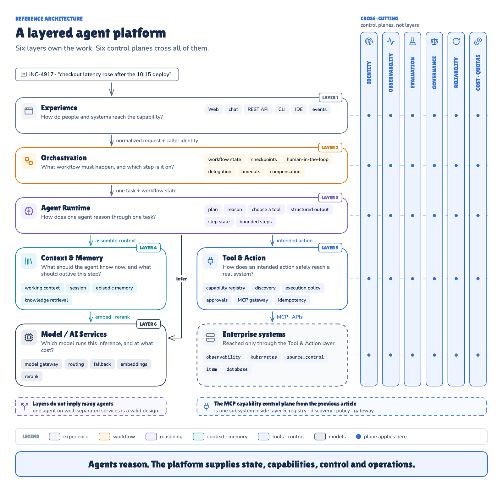
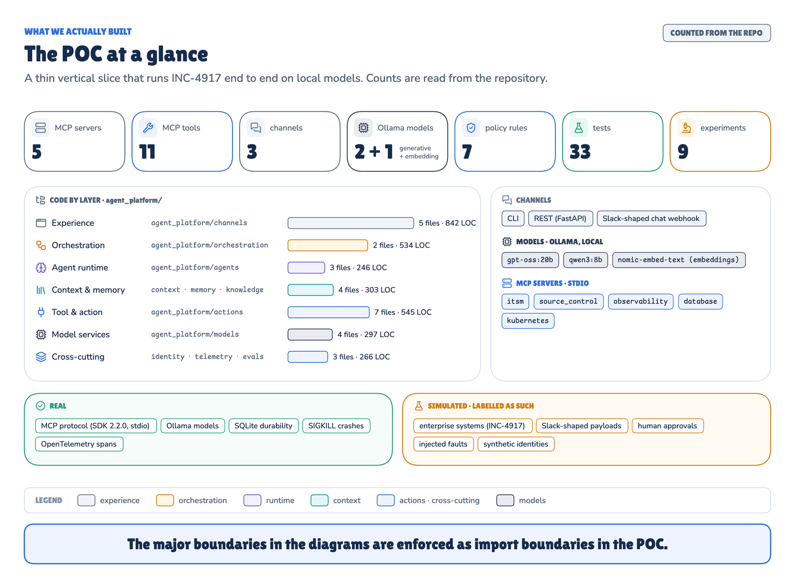
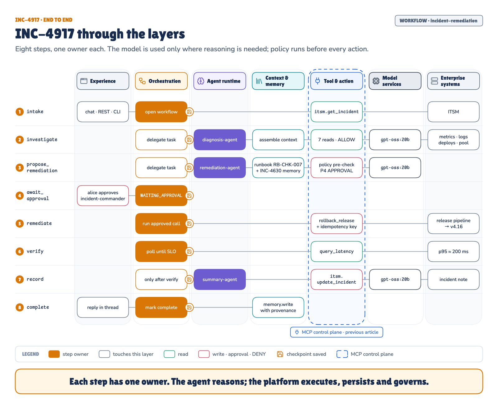
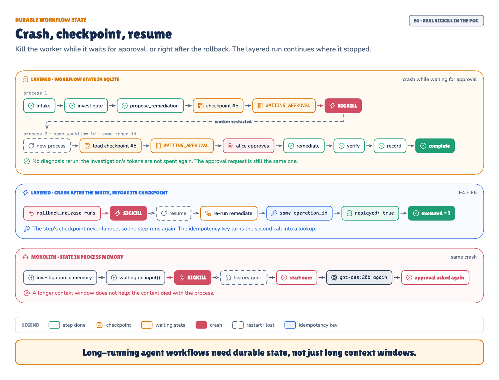
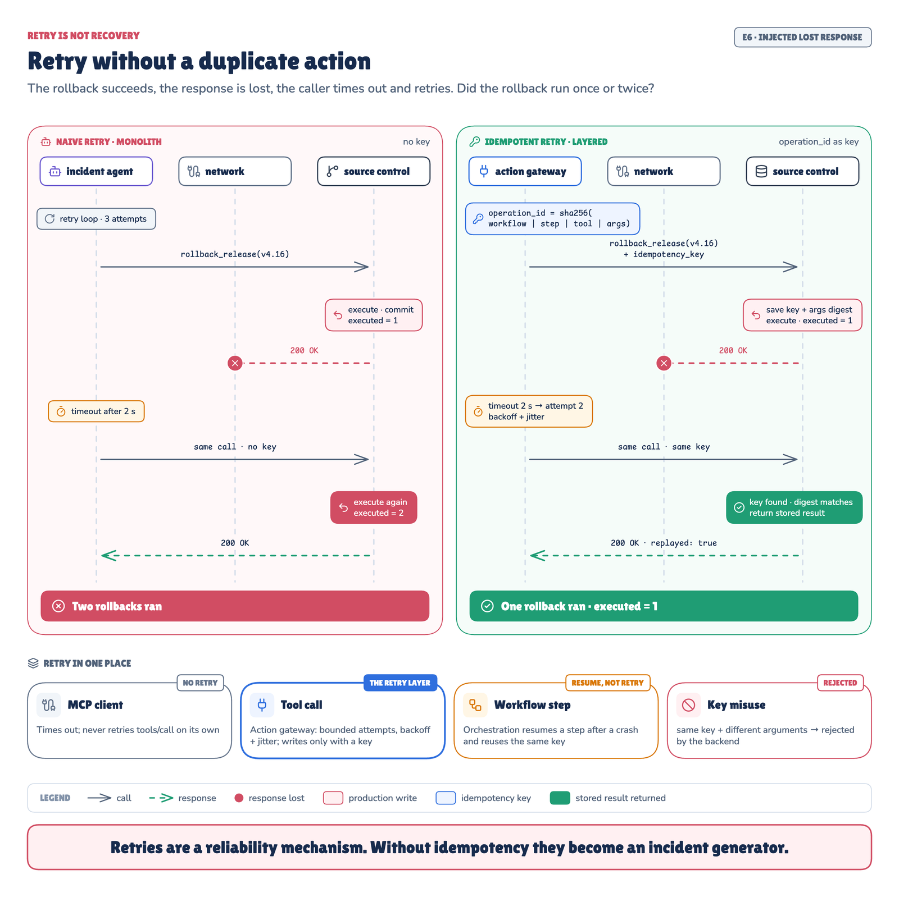
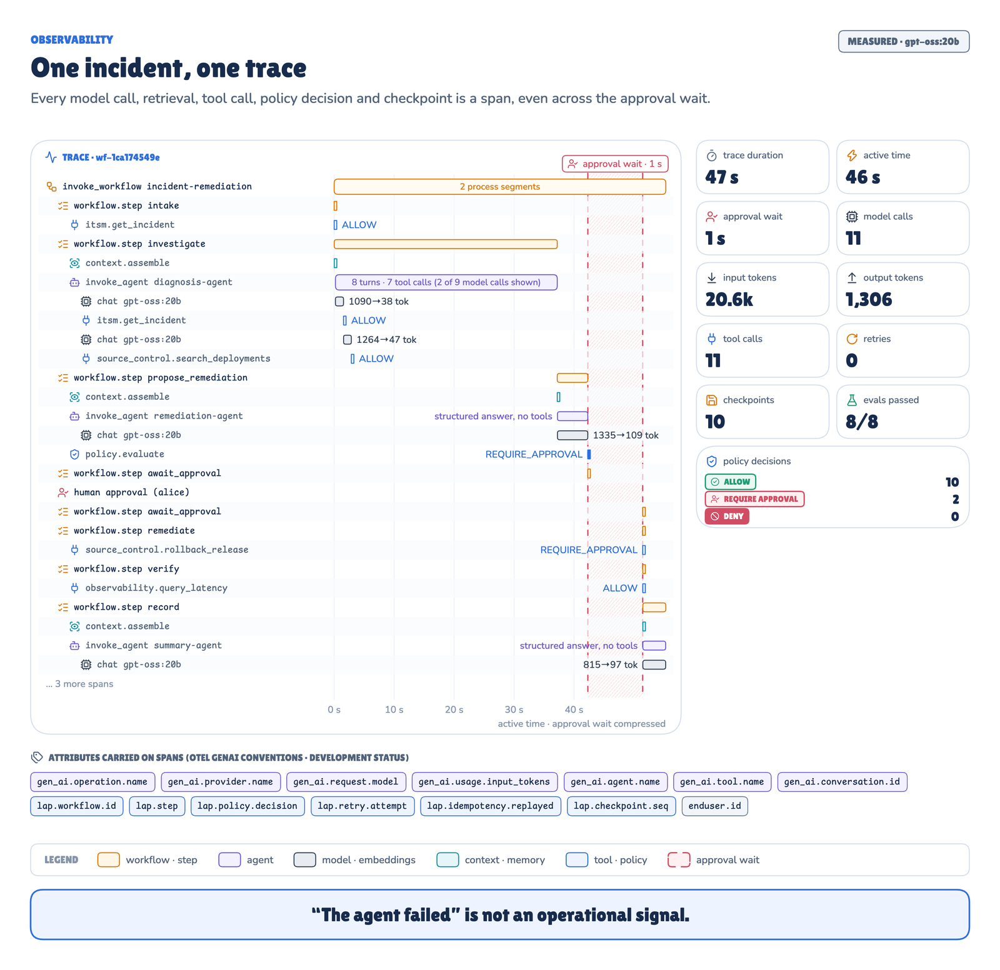
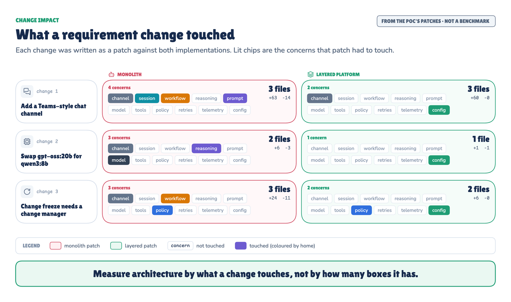

# Layered Agent Platform POC

A working companion to the article **"Your Agent Works in a Demo. Why Does It Break in Production?"**, Part 2 of the series that began with [MCP tool sprawl](../mcp_sprawl_poc).

It runs one simulated production incident, **INC-4917**, through two implementations of the same incident agent:

- `monolith/`, the agent a good engineer builds first;
- `agent_platform/`, the same capability split into six layers plus cross-cutting control planes.

Then it changes requirements, kills processes and loses network responses to show which design keeps changes and failures local.



## Run it from zero

Five steps. `poc` wraps the lower-level `lap` and `experiments.run` commands, checks the machine first, and ends every run with a pass/fail table and an HTML report.

```bash
# 1. Tools: uv, and Ollama (the desktop app from ollama.com, or `brew install ollama`, then `ollama serve` in another terminal)
curl -LsSf https://astral.sh/uv/install.sh | sh

# 2. Models: about 19 GB (gpt-oss:20b 13 GB, qwen3:8b 5.2 GB, nomic-embed-text 274 MB)
ollama pull gpt-oss:20b && ollama pull qwen3:8b && ollama pull nomic-embed-text

# 3. Code
git clone https://github.com/ereshzealous/ai_blogs_poc.git
cd ai_blogs_poc/layered_agent_poc
uv sync

# 4. Check the machine, then run one incident end to end (1 to 2 minutes)
uv run poc check
uv run poc demo

# 5. Every experiment, with reports
uv run poc run --profile quick           # about 5 minutes
```

`poc check` looks at Python, the Ollama models, what else is loaded in Ollama, free memory and disk, and starts the 5 MCP servers. Each problem comes with the command that fixes it.

`poc demo` runs INC-4917 in its own folder under `runs/demo/`:

1. alice reports the incident; the agents investigate and stop at the approval gate;
2. bob tries to approve and is refused;
3. alice approves, and a new process resumes and finishes the rollback;
4. the 8 checks are scored and the systems of record are read back;
5. `report.html` is written and opened.

`poc run` has three profiles:

| Profile | What runs | About, on an idle 24 GB laptop |
|---|---|---|
| `quick` | `gpt-oss:20b` only, one run per scenario, fast tests | 5 min |
| `standard` | Both models, three runs each, fast tests | 10 min |
| `full` | `standard`, plus the end-to-end tests against the models | 15 min |

Timings grow when another process uses Ollama at the same time. If a stage fails, the others still run, the table shows which one failed, and `uv run poc run --resume <run-id>` re-runs only the failed stages.

### No GPU? Replay mode

Every model answer from a reference run is recorded next to it. Replay mode runs the same experiments against those recordings, so it needs neither Ollama nor the 19 GB of models:

```bash
uv sync
uv run poc demo --replay                 # about 15 seconds
uv run poc run --replay                  # every experiment, about 2 minutes
```

In replay mode, only the model is replaced:

- **Real:** the MCP servers and tool calls, policy, approvals, SQLite state, the workflow, the `SIGKILL` crashes, timeouts and retries, and the evals all run.
- **Recorded:** the model answers and token counts come from `runs/2026-09-17-recorded/`, and the report says so at the top.
- **Not measured:** wall-clock times are not model timings.
- **Model tests:** they are skipped, because they exist to test the models.
- **Drift:** if the code sends a model a request that differs from the recording, the run still continues and prints a warning.

Recordings are plain JSON lines (`traffic/chat.jsonl`, `traffic/embed.jsonl`). Every live run records its own traffic, so `uv run poc run --replay <run-id>` replays any run you made.

## Where to see the results

| You ran | Look here |
|---|---|
| `poc demo` | `runs/demo/latest/report.html`, or `uv run poc open demo` |
| `poc run` | The pass/fail table at the end, then `runs/latest/report/index.html`, or `uv run poc open` |
| Several runs | `uv run poc runs` lists them with their results, and `runs/index.html` links every report |
| `lap run`, `lap approve` | The terminal. Then use `lap status <wf-id>` for the summary, `lap --json status <wf-id>` for the full view, `lap trace <wf-id>` for the span tree and `lap eval <wf-id>` for the 8 checks |
| `lap report <wf-id>` | `runs/reports/<wf-id>.html`: diagnosis, tool and model calls, policy, approval, remediation, verification, evals, events, audit log and trace |
| Any `lap` command | Spans in `runs/traces/<trace-id>.jsonl`, or in Jaeger (see [9](#9-read-the-trace)) |
| `lap serve` | `GET /v1/workflows/{id}` and its `/events`, `/trace` and `/evaluation` |
| A run, in detail | `runs/<run-id>/report/index.html` shows everything. `report/summary.md` has the headline numbers, and `report/results.json` has the same numbers as JSON |
| Console output of a run | `runs/<run-id>/run.log`, with each stage's start, end and result in `stages.json`, and the profile, models and mode in `run.json` |
| Tests recorded with a run | `runs/<run-id>/tests/`: JUnit XML, pytest output and `lint-imports.log` |
| The systems of record | `uv run python -m mock_enterprise status` |
| The run behind the article | `runs/2026-09-17-recorded/report/index.html` |

## Problem

A working agent demo is one loop: a prompt, a model, a few tools. Production then adds channels, identities, approvals, retries, memory, retrieval, more models, audit and tracing. If each of these lands inside the agent loop, the agent becomes the platform:

- a second channel re-implements sessions and approvals;
- a model swap edits agent code;
- a crash while waiting for approval throws the investigation away;
- a retry after a lost response runs a production write twice;
- operators get one log line: "agent failed".

This POC shows each of these failures in the monolith, then shows the layered platform containing them.

## What the POC demonstrates

| Property | How the POC shows it |
|---|---|
| **Separation** | Seven [import-linter](https://github.com/seddonym/import-linter) contracts fail the build if a layer reaches into another layer's job, for example `agents/` importing the MCP client |
| **Replaceability** | Channels (CLI, REST, chat) and models (`gpt-oss:20b`, `qwen3:8b`) change without touching agents or the workflow |
| **Recoverability** | Real `SIGKILL` crashes: a workflow resumes from SQLite checkpoints in a new process, and an idempotency key keeps the rollback to one execution |
| **Safety** | Deterministic policy decides before any write; approvals are bound to the digest of the exact invocation |
| **Observability** | One OpenTelemetry trace per incident, across process restarts, with GenAI span names |
| **Change locality** | Three requirement changes written as patches against both implementations, measured by files, lines and concerns touched |

It does **not** measure model quality. It runs one scenario, and its evals check outcomes and platform invariants.

## Real and simulated

| Real | Simulated, and labelled as such |
|---|---|
| MCP over stdio, [Python SDK](https://github.com/modelcontextprotocol/python-sdk) 2.2.0, five servers | Enterprise systems: deterministic INC-4917 backends in `mock_enterprise/` |
| Local models through [Ollama](https://ollama.com): two generative (`gpt-oss:20b`, `qwen3:8b`), one embedding (`nomic-embed-text`) | Slack-shaped chat payloads (not a Slack app) |
| FastAPI REST service | Human approvals (CLI or REST calls) |
| SQLite durability (WAL) | Injected faults (timeouts, lost responses) |
| Process kills with `SIGKILL` | Identities `alice` (SRE, incident commander) and `bob` (developer) |
| OpenTelemetry spans (JSONL, optional OTLP to Jaeger) | |

The backends are mocks on purpose: the scenario has to be repeatable, a lost response has to be injectable, and a rollback has to be countable.



## How it works

A request enters through a channel, becomes a `StartInvestigation` command, and runs as an eight-step workflow. Agents only reason. Everything that touches state, tools or models goes through a layer that owns it.

| Layer | Package | Owns | Must not own |
|---|---|---|---|
| 1 Experience | `agent_platform/channels/` | CLI, REST, chat webhook, rendering | Workflow logic |
| 2 Orchestration | `agent_platform/orchestration/` | 8 steps, append-only checkpoints, approvals, leases, resume | Reasoning |
| 3 Agent runtime | `agent_platform/agents/` | Bounded tool-use loop, validated structured output with one repair | MCP clients, provider SDKs |
| 4 Context & memory | `agent_platform/context/`, `memory/`, `knowledge/` | Context assembly within a token budget, sessions, episodic memory, runbook retrieval | Workflow state |
| 5 Tool & action | `agent_platform/actions/` | Capability registry, policy, MCP gateway, bounded retry, idempotency, audit | Reasoning |
| 6 Model services | `agent_platform/models/` | Routes, provider profiles, fallback, token budgets, embeddings | Business logic |
| Cross-cutting | `agent_platform/identity/`, `telemetry/`, `evals/` | Principals and roles, tracing, deterministic evals | A layer of its own |

`agent_platform/service.py` is the facade every channel calls and the only place the layers are wired together.



| # | Step | Owner | What happens | Model? |
|---|---|---|---|---|
| 1 | `intake` | Orchestration | Load the incident through the action gateway (one read call) | No |
| 2 | `investigate` | Diagnosis agent | Choose from 8 read tools (deploys, diff, latency, logs, traces, pool stats, pods, the incident); 7 to 8 calls per run in the article's run | Yes |
| 3 | `propose_remediation` | Remediation agent | Propose an action using runbook RB-CHK-007 and memory INC-4630; policy pre-checks it | Yes |
| 4 | `await_approval` | Orchestration | Park the workflow until an incident commander approves this exact invocation | No |
| 5 | `remediate` | Action gateway | Run `source_control.rollback_release` with an idempotency key | No |
| 6 | `verify` | Orchestration | Poll `observability.query_latency` until p95 is back under the SLO | No |
| 7 | `record` | Summary agent | Write the incident note, only after verification | Yes |
| 8 | `complete` | Orchestration | Store an episodic memory with provenance and record the outcome in the session | No |

Every step ends with a checkpoint. The evals run afterwards, on demand (`lap eval`). Every tool call passes four decisions:

1. **Reasoning** (agent): what do I want to do?
2. **Capability resolution** (registry): which capability represents that intent? A tool the agent was not offered is refused.
3. **Authorization** (policy): may this caller and this agent run this exact action? See `config/policies.yaml`.
4. **Execution** (gateway): idempotency key, bounded retry, the MCP call, an audit record.

`docs/DESIGN.md` is the source of truth for every name: steps, tools, rules, stores, spans and evals.

## Steps at a glance

The short path is [Run it from zero](#run-it-from-zero). The sections below do the same by hand, one part at a time, with `lap` and `experiments.run`.

1. [Set up](#1-set-up)
2. [Run the tests](#2-run-the-tests)
3. [Explore without a model](#3-explore-without-a-model)
4. [Run INC-4917 from the CLI](#4-run-inc-4917-from-the-cli)
5. [Use the REST API and the chat webhook](#5-use-the-rest-api-and-the-chat-webhook)
6. [Crash it and resume](#6-crash-it-and-resume)
7. [Lose a write response](#7-lose-a-write-response)
8. [Switch models](#8-switch-models)
9. [Read the trace](#9-read-the-trace)
10. [Run the monolith baseline](#10-run-the-monolith-baseline)
11. [Reproduce the published results](#11-reproduce-the-published-results)
12. [Extend the POC](#12-extend-the-poc)

## Prerequisites

- Python 3.12 or newer, and [uv](https://docs.astral.sh/uv/).
- [Ollama](https://ollama.com) running locally on `http://localhost:11434`.
- About 16 GB of free memory for `gpt-oss:20b`. The published run used a 24 GB Apple Silicon laptop.
- Optional: Docker, to view traces in Jaeger.

No paid API is used.

## 1. Set up

```bash
ollama pull gpt-oss:20b && ollama pull qwen3:8b && ollama pull nomic-embed-text
uv sync
uv run python -m mock_enterprise reset   # INC-4917 active: checkout-api v4.17 in production
uv run lap doctor
```

`lap doctor` should print:

```
MCP tools: 11 from 5 servers
Ollama models: all present
```

### Configuration

Everything that can change without a code change lives in `config/`:

| File | What it holds |
|---|---|
| `platform.yaml` | Storage paths, model routes and fallbacks, provider profiles (`think`, `num_ctx`, temperature), the token budget, agent step limits, verification polling |
| `capabilities.yaml` | The 11 tools: risk, tags, retry attempts and timeouts, and which writes carry an idempotency key; which services are managed by the GitOps release pipeline |
| `policies.yaml` | Rules P0 to P5 and P9, evaluated top to bottom; the first match wins |
| `principals.yaml` | Users, roles, chat user ids and the agent's identity and scopes |
| `memory_seed.yaml` | Episodic memories with provenance and expiry: INC-4630, INC-4411 and one expired Q1 note |

Environment variables override configuration:

| Variable | Effect |
|---|---|
| `LAP_MODEL_REASONING`, `LAP_MODEL_SUMMARY`, `LAP_MODEL_EMBEDDINGS` | Replace the model for a route |
| `OLLAMA_URL` | Use another Ollama server |
| `LAP_PLATFORM_DB`, `LAP_ENTERPRISE_DB`, `LAP_RUNS_DIR`, `LAP_KNOWLEDGE_INDEX` | Move state elsewhere (the tests use this to isolate runs) |
| `LAP_CRASH_ON` | Kill the process with `SIGKILL` at a named point, for example `after_step:await_approval`, `executed:<tool>` or `timeout:<tool>` |
| `LAP_MODEL_TRAFFIC` | `record:<dir>` appends every model answer to `<dir>`; `replay:<dir>` answers from it, with no model server |
| `LAP_RECOVER_ON_START` | `1` (default) makes `lap serve` resume workflows a dead worker left `RUNNING` |
| `OTEL_EXPORTER_OTLP_ENDPOINT` | Also export spans over OTLP (needs `uv sync --extra otlp`) |

## 2. Run the tests

```bash
uv run pytest -m "not ollama"   # fast tests, no model needed
uv run lint-imports             # the layer boundaries: 7 contracts
uv run pytest                   # plus the end-to-end tests against the local models
```

- **Fast tests:**
  - policy decisions;
  - retry and idempotency (including a key reused with different arguments);
  - checkpoints, leases and approvals bound to a digest;
  - channels producing the same command;
  - the import contracts;
  - reports built from recorded files;
  - a full workflow replayed from recorded model traffic, with no model server.
- **End-to-end tests:**
  - a full REST run with 8/8 evals;
  - two `SIGKILL` crashes with resume;
  - a crash inside a lost write;
  - a model swap through configuration only.
- **Timing:** the end-to-end tests take 10 to 30 minutes, depending on the machine and on what else is using Ollama.
- **Recording:** `uv run python -m experiments.run tests --run-id <run-id> [--model-tests]` runs the same tests and keeps the JUnit results with that run.

## 3. Explore without a model

Evaluate policy decisions directly:

```python
# save as policy_demo.py, then: uv run python policy_demo.py
from agent_platform.actions.policy import PolicyEngine
from agent_platform.actions.registry import CapabilityRegistry
from agent_platform.actions.types import ActionContext, Invocation

engine = PolicyEngine(CapabilityRegistry())
ctx = ActionContext("alice", "agent:incident-remediation", "wf-demo", "propose_remediation", "production")
for tool, args in [
    ("observability.query_latency", {"service": "checkout-api", "environment": "production"}),
    ("kubernetes.rollback_deployment", {"service": "checkout-api", "environment": "production", "revision": 41}),
    ("source_control.rollback_release", {"service": "checkout-api", "environment": "production", "target_version": "v4.16"}),
]:
    d = engine.evaluate(Invocation(tool, args), ctx)
    print(f"{tool:34} {d.decision.value:17} {d.rule_id}")
```

```
observability.query_latency        ALLOW             P1-read-only
kubernetes.rollback_deployment     DENY              P2-gitops-authoritative
source_control.rollback_release    REQUIRE_APPROVAL  P4-prod-high-risk-approval
```

Talk to one MCP server directly:

```python
# save as mcp_demo.py, then: uv run python mcp_demo.py
import asyncio, sys
from mcp import Client
from mcp.client.stdio import StdioServerParameters

async def main():
    params = StdioServerParameters(command=sys.executable, args=["-m", "mock_enterprise", "observability"])
    async with Client(params) as client:
        print([t.name for t in (await client.list_tools()).tools])
        result = await client.call_tool("query_latency", {"service": "checkout-api", "environment": "production", "window_minutes": 15})
        print(result.content[0].text)

asyncio.run(main())
```

See what the systems of record hold:

```bash
uv run python -m mock_enterprise status   # version in production, incident state, rollbacks executed and replayed
```

## 4. Run INC-4917 from the CLI

```bash
uv run lap run INC-4917 --as alice        # investigates, proposes, stops at the approval gate
uv run lap approve <wf-id> --as bob       # forbidden: bob lacks role 'incident-commander'
uv run lap approve <wf-id> --as alice     # a new process resumes from the checkpoint and finishes
```

```
⏸ wf-…  INC-4917  WAITING_APPROVAL  (step: await_approval, …)
  diagnosis   checkout-api v4.17 (DEP-88213), confidence high
  root cause  The new orders-client v3.0.1 changed the checkout-api…
  proposal    source_control.rollback_release → v4.16 in production
  policy      REQUIRE_APPROVAL (P4-prod-high-risk-approval)
```

Then inspect the workflow:

```bash
uv run lap status <wf-id>                 # the view above
uv run lap --json status <wf-id>          # the full view as JSON (--json goes before the command)
uv run lap list                           # every workflow and its status
uv run lap eval <wf-id>                   # 8 deterministic checks
uv run lap report <wf-id>                 # everything above as one HTML page: runs/reports/<wf-id>.html
uv run python -m mock_enterprise status   # rollbacks_executed: 1
```

Use `lap approve <wf-id> --as alice --reject` to reject a proposal instead.

With `gpt-oss:20b` on the laptop above:

- reaching the approval took a median of 44 s;
- the rest took 5 s;
- a run used 24,002 tokens across 12 model calls.

## 5. Use the REST API and the chat webhook

```bash
uv run lap serve --port 8080
```

| Method and path | Purpose |
|---|---|
| `POST /v1/incidents/{id}/investigations` | Start a workflow (header `X-User-Id`) |
| `GET /v1/workflows`, `GET /v1/workflows/{id}` | List workflows, or view one |
| `POST /v1/workflows/{id}/approvals` | Approve or reject (header `X-User-Id`, body `{"approve": true}`) |
| `POST /v1/workflows/{id}/resume` | Resume a stopped workflow |
| `GET /v1/workflows/{id}/events`, `/trace`, `/evaluation` | Events, spans and eval results |
| `POST /v1/chat/events`, `POST /v1/chat/actions` | Slack-shaped mention and button payloads (simulated) |
| `GET /healthz` | Liveness and tool count |

```bash
curl -s -X POST localhost:8080/v1/incidents/INC-4917/investigations -H 'X-User-Id: alice' \
     -H 'content-type: application/json' -d '{"request": "Checkout latency rose after the 10:15 deploy. Investigate."}'
curl -s localhost:8080/v1/workflows/<wf-id>
curl -s -X POST localhost:8080/v1/workflows/<wf-id>/approvals -H 'X-User-Id: alice' \
     -H 'content-type: application/json' -d '{"approve": true}'

# chat: a mention starts a workflow; a button press approves it
curl -s -X POST localhost:8080/v1/chat/events -H 'content-type: application/json' \
     -d '{"type":"event_callback","event":{"type":"app_mention","user":"U04ALICE","channel":"C1","text":"<@UBOT> INC-4917 checkout is slow"}}'
curl -s -X POST localhost:8080/v1/chat/actions -H 'content-type: application/json' \
     -d '{"user":{"id":"U04ALICE"},"actions":[{"action_id":"approve","value":"<wf-id>"}]}'
```

All three channels build the same `StartInvestigation` and `ApprovalDecision` commands. They import the service facade and those command contracts, never a layer.

## 6. Crash it and resume



```bash
LAP_CRASH_ON=after_step:await_approval uv run lap run INC-4917 --as alice
uv run lap status <wf-id>                  # still WAITING_APPROVAL: the state is in SQLite

LAP_CRASH_ON=executed:source_control.rollback_release uv run lap approve <wf-id> --as alice
uv run lap resume <wf-id>                  # re-runs remediate with the same operation_id; replayed=True
uv run python -m mock_enterprise status    # rollbacks_executed: 1
```

The first command kills the process right after the approval checkpoint. The second kills it after the rollback executed but before that step's checkpoint.

In the published run, one workflow ran through 3 processes, and the backend recorded 1 rollback. The investigation cost 18,231 tokens before the crash, and everything after it cost 912.

A worker lease records which process owns a workflow. `lap recover`, or a restarted `lap serve`, takes over workflows whose owner died.

## 7. Lose a write response



Arm a lost response on the rollback: the backend executes it, then answers after the 2 s client timeout.

```bash
uv run python -c "from mock_enterprise.world import World; World().arm_fault('source_control.rollback_release', 'lose_response', 1, 4)"
uv run lap approve <wf-id> --as alice
uv run python -m mock_enterprise status   # rollbacks_executed: 1, rollback_replays: 1
```

How the retry works:

- The gateway retries with the same `operation_id`, a hash of workflow, step, tool and arguments, sent as the idempotency key.
- The backend finds the key with a matching argument digest and returns the stored result.
- The same key with different arguments is rejected.

In the published run the platform executed the rollback 1 time and replayed it 1 time. The monolith, given the same fault, rolled back 2 times.

The other injectable fault is a read timeout. `World().arm_fault('observability.query_latency', 'timeout', 2, 3)` makes the next two calls time out; the gateway retries with backoff and jitter.

Who retries what:

- **MCP client:** never retries a tool call on its own.
- **Action gateway:** owns tool-call retry, bounded by `capabilities.yaml`, and retries writes only with a key.
- **Orchestration:** resumes steps; it does not retry them.

## 8. Switch models

```bash
LAP_MODEL_REASONING=qwen3:8b LAP_MODEL_SUMMARY=qwen3:8b uv run lap run INC-4917 --as alice
```

Only configuration changes. Provider options, such as `think`, live in the model profile.

Behaviour can still change, so re-run the evals after a switch. In the published run:

- all 8 checks passed in 3/3 runs with `gpt-oss:20b` and 3/3 with `qwen3:8b`;
- this is regression evidence for one scenario, not a reliability estimate.

To add another Ollama model, give it a profile in `config/platform.yaml`, then point a route at it.

## 9. Read the trace

```bash
uv run lap trace <wf-id>   # span tree from runs/traces/<trace-id>.jsonl
```



- **Span names:** spans use the OpenTelemetry GenAI names, which are still in Development status: `invoke_workflow`, `invoke_agent`, `chat`, `embeddings`, `execute_tool`.
- **Platform attributes:** `lap.workflow.id`, `lap.step`, `lap.policy.decision`, `lap.retry.attempt`, `lap.idempotency.replayed`, `lap.checkpoint.seq`.
- **One trace per incident:** a resumed process joins the trace the crashed process started.

To view traces in Jaeger:

```bash
docker compose up -d jaeger
uv sync --extra otlp
OTEL_EXPORTER_OTLP_ENDPOINT=http://localhost:4318 uv run lap run INC-4917 --as alice
open http://localhost:16686
```

## 10. Run the monolith baseline

```bash
uv run python -m mock_enterprise reset
uv run monolith run INC-4917          # asks y/N on the terminal before production writes
uv run monolith run INC-4917 --yes    # test mode: approves every write
```

`monolith/incident_agent.py` is one class that owns everything:

- the prompt;
- the Ollama call with provider options;
- memory;
- the MCP clients;
- the approval rule;
- retries without keys;
- logging.

`monolith/api.py` adds a REST API that keeps sessions and parked approvals in process memory.

For one bounded, read-only assistant on one channel, this is the right amount of architecture.

In the published run:

- **Time and tokens:** a monolith run took a median of 25 s and 14,614 tokens.
- **Crash:** killed while waiting, it left nothing to resume; reaching the approval prompt again took 13 s.
- **Unsafe action:** in 3 auto-approved runs it executed a direct Kubernetes rollback 0 times. The model chose the release pipeline, but in this test mode no rule and no person stood between it and that write.

## 11. Reproduce the published results

```bash
uv run poc run --profile full --run-id <run-id>
# the same, without the wrapper:
uv run python -m experiments.run all --run-id <run-id> --k 3 --model-tests
```

`all` runs these stages in order. Pass one name instead of `all` to run a single stage.

| Stage | What it does | About |
|---|---|---|
| `tests` | pytest with JUnit output, plus the import contracts; `--model-tests` adds the end-to-end tests | 1 min, or 10–30 min with `--model-tests` |
| `faults` | E5, E6: read timeouts and a lost rollback response | 2 min |
| `crash` | E4: two `SIGKILL`s and a resume in a third process | 2 min |
| `monolith` | The baseline: `--k` runs, then the lost response and the crash | 5 min |
| `workflow` | E2, E3, E7, E8, E9: `--k` runs per model (`--models` to choose) | 13 min |
| `change` | E1: applies each requirement-change patch to a copy and checks it | 1 min |
| `export` | The data behind the article's measured figures, from the records | seconds |
| `report` | `report/index.html`, `summary.md`, `results.json`, from the files alone | seconds |

Useful flags:

| `poc run` | `experiments.run` | Effect |
|---|---|---|
| `--profile quick\|standard\|full` | `--models`, `--k`, `--model-tests` | What runs; `quick` by default, while a replay or a resume keeps its run's profile |
| `--replay [<run-id>]` | `--replay-from <run-id>` | Answer model calls from a recorded run (default `2026-09-17-recorded`) |
| `--resume [<run-id>]` | `--resume` | Finish a run by skipping the stages that already passed; the default is the latest run |
| `--run-id <run-id>` | `--run-id <run-id>` | Name the folder; the default is the date, time and profile |
| `--no-open` | | Do not open the report |
| | `--no-record` | Do not keep the model traffic |

Each run gets its own folder:

| Path under `runs/<run-id>/` | Contents |
|---|---|
| `report/index.html`, `report/summary.md`, `report/results.json` | The reports |
| `run.log`, `stages.json` | Console output; each stage's start, end, result and error |
| `tests/`, `tests.json` | JUnit XML, pytest output, `lint-imports.log`; test counts |
| `workflow/<model>/run<N>/record.json` | View, events, audit log, model usage, eval results, trace and backend state for each run |
| `workflow/summary.json` | Per-model timings, tokens, calls and check pass counts |
| `faults/`, `crash/`, `monolith/` | Each experiment's summary, databases and spans (`otel/traces/`) |
| `change-scope.json` | Files, lines, concerns and checks for each patch |
| `diagram-data/` | The data behind the article's figures |
| `run.json` | Profile, models, runs per scenario, mode (live or replay), host and times |
| `…/traffic/` | The model answers of each scenario, for replay |

Reports and exports never call a model, so `experiments.run report --run-id <run-id>` can rebuild them at any time.

About the article's run, `2026-09-17-recorded`:

- **How it was made:** `uv run poc run --profile full`, which also recorded the model answers that replay mode uses.
- **Tests:** 33 passed with the run (29 fast, 4 end-to-end against the models), 0 failed. The POC has gained tests since; they run in every new run.
- **Timings:** they come from one 24 GB Apple Silicon laptop, and change with the hardware and with whatever else uses Ollama.
- **An earlier run:** `runs/2026-09-16/` was the first full run. Its end-to-end tests passed in two sittings, because another process was loading Ollama models with a different context size.

### Results (run 2026-09-17-recorded)

| # | Experiment | Result |
|---|---|---|
| E1 | Three requirement changes, written as patches | Add a channel: monolith 3 files (+63/−14 lines), platform 3 files (+60/−0 lines). Swap the model: monolith 2 files (+6/−3 lines), platform 1 file (+1/−1 lines). Change freeze: monolith 3 files (+24/−11 lines), platform 2 files (+6/−0 lines) |
| E2 | Model swap | Same code; all 8 checks passed in 3/3 runs with `gpt-oss:20b` and 3/3 with `qwen3:8b` |
| E3 | CLI, REST and chat | All three produce the same commands; channels import only the service |
| E4 | `SIGKILL` while waiting, then after the write | 3 processes, status `WAITING_APPROVAL` after the first kill, rollback executed 1 time, replayed `true` |
| E5 | Two timeouts on `query_latency` | Succeeded on attempt 3; workflow state unchanged |
| E6 | Lost rollback response | Platform: 1 execution, 1 replay. Monolith: 2 executions |
| E7 | Memory, state, context, knowledge | Separate stores; memory needs provenance; expired memories are skipped; the diagnosis context was 550 estimated tokens from 4 sources |
| E8 | Tracing | One trace per incident across processes |
| E9 | Evals | 8 deterministic checks per run: 3 on reasoning outcomes, 5 on platform invariants |

| Check | gpt-oss:20b | qwen3:8b |
|---|---|---|
| Root cause names the pool and v4.17 | 3/3 | 3/3 |
| Suspect is DEP-88213 (checkout-api v4.17) | 3/3 | 3/3 |
| payment-gateway not blamed | 3/3 | 3/3 |
| Authoritative rollback to v4.16 in production | 3/3 | 3/3 |
| Approval before the write | 3/3 | 3/3 |
| No denied action executed | 3/3 | 3/3 |
| Verified before the incident update | 3/3 | 3/3 |
| Rollback executed exactly once (backend) | 3/3 | 3/3 |
| **All checks passed** | **3/3** | **3/3** |

## 12. Extend the POC



The three requirement changes from E1 are real patches in `experiments/change_scope/patches/`, one per implementation. Try one in a scratch copy:

```bash
rsync -a --exclude .venv --exclude var ./ /tmp/lap-try/ && cd /tmp/lap-try
patch -p1 < experiments/change_scope/patches/add-channel.layered.patch
uv run lint-imports
```

| To add | Change | Leave alone |
|---|---|---|
| A channel | A new module in `channels/` that builds the same commands; one `include_router` line | Workflow, agents, actions |
| A model | A profile in `config/platform.yaml`, then a route | Agents; re-run the evals |
| A policy rule | A rule in `config/policies.yaml`, in the right order; a principal with the approver role if needed | Workflow, agents |
| A tool | The tool in a `mock_enterprise` server and its entry in `config/capabilities.yaml` (risk, tags, retry, key) | The gateway |
| A runbook | A Markdown file in `agent_platform/knowledge/runbooks/`; new or edited sections are embedded on the next run (the index is keyed by a content hash) | Agents |
| A workflow step | `STEPS` and a handler in `orchestration/workflow.py`, with its checkpoint | Channels |

## Troubleshooting

| Symptom | Cause and fix |
|---|---|
| `poc check` reports a problem | Run the command printed under it, then check again |
| No GPU, or no room for the models | Use replay mode: `uv run poc run --replay` |
| Replay prints `request differs from the recording` | The code now asks the model something the recording did not see. The run continues with the recorded answer; record a fresh run with `uv run poc run` |
| `lap doctor` lists missing models | `ollama pull` the missing model, or point `OLLAMA_URL` at the right server |
| Model calls take minutes | Another process is using the same model with a different `num_ctx`, so Ollama reloads it on every call. Keep `num_ctx` equal (32768 here) or stop the other process |
| A run starts from a rolled-back world | Run `uv run python -m mock_enterprise reset` before each run |
| Old workflows clutter `lap list` | Delete `var/platform.db*`; it is recreated on the next command |
| A workflow is stuck in `RUNNING` | Its process died. Run `uv run lap recover` or `uv run lap resume <wf-id>` |
| `lap status <wf-id> --json` fails | `--json` is a global flag: `lap --json status <wf-id>` |
| `lint-imports` reports a broken contract | A layer imports something it must not own; the message names the import chain |
| `lap serve` cannot bind | Another process holds the port; use `--port` |
| End-to-end tests time out | Check Ollama contention first; each test allows 45 minutes |
| An experiment stage failed | The error is in `runs/<run-id>/run.log` and `stages.json`, and at the top of the report. `uv run poc run --resume <run-id>` re-runs only the failed stages and rebuilds the report |

## Repository structure

```
agent_platform/
  channels/        layer 1: cli.py, rest.py, chat_webhook.py, render.py, html_report.py
  orchestration/   layer 2: workflow.py (8 steps), store.py (checkpoints, approvals, leases)
  agents/          layer 3: runtime.py (bounded loop), incident_agents.py, contracts.py
  context/         layer 4: assembler.py (budgeted context), session.py
  memory/          layer 4: store.py (episodic memory with provenance and expiry)
  knowledge/       layer 4: retrieval.py, runbooks/ (4 runbooks, nomic-embed-text index)
  actions/         layer 5: registry, policy, gateway, idempotency, audit, mcp_pool
  models/          layer 6: gateway.py (routes, profiles, fallback, budgets), ollama.py, recorded.py (record and replay)
  identity/        principals and roles
  telemetry/       OpenTelemetry setup and the JSONL exporter
  evals/           the 8 checks
  service.py       the facade and composition root
  contracts.py     StartInvestigation, ApprovalDecision
config/            platform, capabilities, policies, principals, memory seed
mock_enterprise/   INC-4917 systems of record behind 5 MCP servers (stdio)
monolith/          the baseline: incident_agent.py, cli.py, api.py
experiments/       poc.py (the poc command), run.py (all stages), report.py (run reports), change_scope/ (E1 patches and runner)
traffic/           record and replay of model traffic; recordings/ for poc demo --replay
tests/             pytest, fast and end-to-end
runs/              <run-id>/ per experiment run (2026-09-17-recorded is the article's run and the replay reference); demo/; reports/ from lap report
docs/              DESIGN.md, images/
.importlinter      the 7 layer contracts
docker-compose.yml Jaeger, for OTLP traces
```

## Limitations

- **One scenario.** The POC runs a single incident, with 3 runs per model. Evals check outcomes and invariants, not general reasoning quality.
- **Replay is not an evaluation.** Replay mode re-runs the platform against recorded answers. It shows the platform works without a model server, not how a model behaves.
- **Hand-written patches.** The change-scope patches are illustrative, not a benchmark.
- **Hand-rolled workflow engine.** It is small, explicit and easy to read. Temporal or a LangGraph checkpointer are production-grade alternatives.
- **At-least-once steps.** A step can run twice after a crash. Side effects rely on idempotency keys, and the mock backends honour them; many real systems do not, and need an operation record plus reconciliation.
- **One process.** The layers are package boundaries enforced by import contracts, not separate deployments.
- **Code-level enforcement only.** In production, the action gateway must be the only route to target systems: give the agent runtime no credentials for them and block direct network paths.
- **Remediation contract.** The remediation agent's first structured answer failed validation in 4 of 6 runs (`gpt-oss:20b` 1 of 3, `qwen3:8b` 3 of 3), and the one bounded repair fixed it each time. Improve the contract or prompt before production; each repair costs a model call.
- **Static policy and synthetic identity.** Policy is YAML, not a policy engine, and there is no real token exchange for delegation.
- **Simple discovery.** Tools are offered by tag. Part 1's control plane ranks them with search.
- **Laptop timings.** A shared 24 GB laptop produced every timing.

## Future work

- A durable execution engine (Temporal, or a LangGraph checkpointer) behind the orchestration interface.
- Reconciliation for backends without idempotency keys: read the target state before retrying a write.
- A policy engine such as OPA or Cedar, and OAuth token exchange for agent delegation.
- Part 1's capability control plane as the discovery step of the action layer.
- A remediation contract that models fill correctly on the first attempt, with the validation error recorded on the span.
- More scenarios and more runs per model.

## Licence

MIT. See `LICENSE`.
