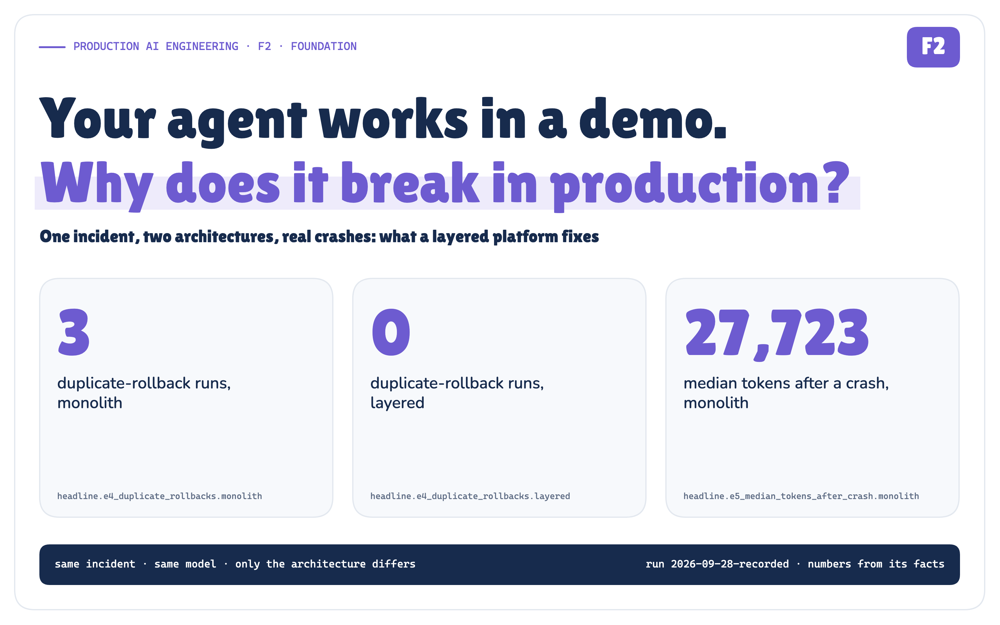

# Your agent works in a demo. Why does it break in production?

*One incident, two architectures, 32 preregistered scenarios and 7 real SIGKILLs: what a layered AI platform fixes, and what it doesn't.*

**Production AI Engineering · F2 · Foundation**

*Chapter 2 of 15. New here? Start with [Start Here: What It Takes to Run AI Agents in Production](https://eresh-gorantla.medium.com/start-here-a-hands-on-map-of-production-ai-engineering-5056549657db).*



It is 10:11 on a Tuesday and the pager goes off. **INC-4917: Checkout API p95 above 2 s, 5xx errors in production.** About one checkout in twenty-five is failing and the rest are slow.

Nine minutes earlier, release `rel-2031` shipped. Its summary line reads *"Cost tuning: DB pool maximumPoolSize 50 -> 10; ORM 6.4 -> 6.5."* Anyone who has run a Java service under load can see the rest of the story: the connection pool is starved, requests queue for a connection, latency explodes. The runbook says to roll back to the last healthy release, `rel-2030`, get approval from the incident commander first, verify that p95 is back under the 400 ms SLO, and update the ticket.

This is exactly the kind of job people want an AI agent to do. And in a demo, an agent does it beautifully.

This article is about what happens after the demo. I built two versions of the same incident agent, a realistic single-file "demo" agent and a layered platform, pointed both at the same simulated incident, and then broke both of them on purpose, following a plan written down before a single run happened. Every measured number below is substituted by the build from the recorded run's `facts.json`; the only hand-typed values are inputs from the scenario file, such as the alert time and the pool sizes.

*Measured · Recorded: every number in this article comes from recorded run 2026-09-28 · figures carry their provenance*

## The demo works

The demo agent is the one most teams ship first. One file. A system prompt, a loop, a list of MCP tools, a model client. The model reads the incident, pulls metrics, finds the release, proposes a rollback, asks for approval, rolls back, verifies, closes the ticket.


*Figure 1. The demo path: one process, one loop, and the model decides every next step.* · Architecture + recorded behaviour of the demo path; no measured values

It works. In the recorded run, the monolith passed all eight deterministic checks in **3/3** runs of the baseline experiment (E1). So did the layered platform: **3/3**. Both named the release and the pool, both rolled back to `rel-2030` exactly once, both got approval before the write, both verified recovery.

That is an important result, and it is easy to skip past. **Layering did not buy correctness on the happy path.** A well-written demo agent is not wrong. The model is the same model (`gpt-oss:20b`), the tools are the same MCP servers, the scenario is the same file.

So why does the demo break in production?

## Production arrives

Production is not a harder version of the demo. It is a different set of questions, and none of them are about whether the model can read a Grafana panel.

- The rollback succeeds, but the response is lost on the way back. Does the agent roll back **twice**?
- The process is killed right after the rollback. When it restarts, does it redo the investigation, re-ask for approval, re-run the write?
- Someone swaps the model. Someone ships `deploy_v2` of the deployment API. Someone asks for a dry-run mode. **Where does each change land, and who has to review it?**
- The model asks for something it shouldn't: restart production, roll back staging in the middle of a production incident, flush every session. **Who says no, and where is that "no" written?**
- An auditor asks which human approved which write, and on what trace.


*Figure 2. Production arrives: the questions the demo never had to answer.* · Architecture: POC design; no measured values

In the demo agent, the answer to every one of those questions lives in the same file, often in the same function. I counted the concerns sharing that file: 10. Approval policy, context and memory, the experience layer, the model provider, tool execution, the orchestration loop, state and more, all within reach of each other.


*Figure 3. The God Agent: every concern in one file, mapped symbol by symbol.* · Architecture: the POC monolith, symbol by symbol

That file is not bad code. It is *normal* code. It is what everyone writes first. The question this POC asks is narrower and more useful than "are monoliths bad": **which production failures does a layered architecture actually prevent, and which ones does it not?**

## The layered platform

The layered version splits the same agent into six layers, each owning one kind of change, with the control planes cutting across them.


*Figure 4. Six layers, cross-cut by control planes. Each layer depends only on the contracts below it; an AST test enforces the rule.* · Architecture + implemented: package paths and the AST dependency rule

From the top:

1. **Experience**: the CLI, chat or API surface. It adapts a channel and renders a result, nothing more.
2. **Orchestration**: the incident workflow as explicit steps (intake → investigate → propose → authorize → approval → execute → verify → record), plus the human-in-the-loop decision.
3. **Agent Runtime**: runs each step durably. Checkpoints in SQLite, resume, retries, timeouts, structured-output repair.
4. **Context + Memory**: decides what the model sees and what is remembered.
5. **Tools + Actions**: a registry of capabilities, the MCP client, and an **action gateway** that owns side effects and idempotency.
6. **Model Services**: provider-neutral model routes and profiles, configured in YAML.

Policy, approvals, tracing and evaluation are not a seventh layer; they are control planes that every layer passes through.

The single most important idea in the whole design is on the next figure.


*Figure 5. A tool is something the model may ask for. An action is something the platform decides to do, once, with a policy decision and an idempotency key attached.* · Architecture + implemented: tools/gateway.py, policy/

In the demo agent, "the model called `rollback_release`" and "production was rolled back" are the same event. In the layered platform they are two different things with a gateway in between. Almost every result below follows from that one separation.

## Breaking both, on purpose

Before running anything, I wrote down the plan: nine experiments, the checks for each, the seeds, the faults, the patches for the change experiments, and what would count as success or failure. The plan file is hashed into the run manifest, and a verifier refuses the run if the plan changed afterwards.


*Figure 6. Breaking both on purpose: the preregistered faults and where each one strikes.* · Design: preregistered plan (experiment_plan.yaml)

**The test**

- **Problem.** A demo agent and a layered platform both solve INC-4917. Which production failures separate them?
- **Test.** 32 of 32 preregistered scenarios run against local models (`gpt-oss:20b`, `qwen3:8b`), real MCP servers in separate processes, real SQLite checkpoints and real `SIGKILL`s.
- **Result.** The layered platform prevented duplicate writes, repeated work after a crash, lost approvals and unauthorised writes. It did not make the change locality better in every case, and it did not stop the model from making a bad call.
- **Limits.** One incident, temperature 0, three seeds per cell. A simulated deployment backend where a rollback always succeeds. This is a mechanism test, not a reliability estimate.
- real SIGKILLs: **7**
- model calls on tape: **366**
- tests passed: **67/71**

What is real and what is simulated matters, so here it is plainly. **Real:** the MCP protocol (official Python SDK, stdio, separate OS processes), local Ollama model calls, SQLite with `synchronous=FULL`, `os.kill(SIGKILL)` at a named point with no cleanup, a new OS process on restart, timeouts, retries, idempotency keys, OpenTelemetry traces, `git diff` of committed patches, pytest. **Simulated:** the enterprise itself. The ticket system is a JSON document, the deployment backend rewrites a "running release" row, and metrics recover three simulated minutes after a rollback to a healthy release.

## Result 1: the lost reply (E4)

The first fault is the classic distributed-systems trap. The rollback commits in the backend, but the response never reaches the agent; the client times out.

The monolith gets an error from a tool call. The model, reasonably, tries again. The backend, reasonably, rolls back again.

*Measured: E4, seeds 7/11/13, model A*

- **Monolith:** a duplicate rollback in **3** of 3 runs; **6** physical rollbacks in total.
- **Layered:** a duplicate rollback in **0** runs; **3** physical rollbacks, one per run.

The layered client retried too (attempts per run: 2, 2, 2), and the backend received every one of those requests. The difference is that the retry carried the same deterministic operation id as an idempotency key, so the backend replayed its stored result (idempotent replays per run: 1, 1, 1) instead of executing the rollback again.

> **The retry was not the bug. Retrying without an operation identity was.**

In this simulation, a second rollback to the same release is harmless. In a real system, a duplicate "charge the card", "scale to zero" or "page the on-call" is not.

## Result 2: SIGKILL after the rollback (E5)

The process is killed with `SIGKILL` immediately after the rollback tool returns, before the agent can record that it happened. A new process picks the incident up.


*Figure 7. SIGKILL after the rollback: what each architecture repeats when a new process takes over.* · Measured + recorded: E5 scenarios of the published run · run 2026-09-28-recorded

The monolith has no memory of the first process. The re-submitted request starts from scratch: investigate again, propose again, ask for approval again, roll back again.

*Measured · Recorded: E5, seeds 7/11/13, model A*

- **Monolith:** **11** model calls and **27,723** tokens after the crash (median), and **6** physical rollbacks over 3 runs.
- **Layered:** **0** model calls and **0** tokens after the crash (median of the 2 runs that reached the `SIGKILL`; seed 7 never did, see below), and **2** physical rollbacks over 3 runs.

The layered runtime recovered from the checkpoint ledger: the steps up to and including approval were already committed, so the new process re-ran only `execute`, and the action gateway recognised the rollback as already done. The new process took over the dead one's lease (2 takeovers across the killed runs) and finished in a median of 1.4 seconds after the crash. No model call was needed to finish.

**The run that the layers did not save**

Now the honest part. Look at those layered numbers again: 2 of 3 runs passed every check, 20 of 24 checks overall, and only 2 physical rollbacks, not three.

In seed 7, the model diagnosed the incident correctly and got approval, and then asked to roll back to `"previous"` instead of `rel-2030`. There is no release called `previous`. The tool rejected it, the rollback never happened, so the crash point after a successful rollback was never reached and no `SIGKILL` fired in that run. The incident stayed open on `rel-2031`, and that run failed half its checks.

> **Layers make a bad model decision safe and visible. They don't make it good.**

The policy gate held, the approval was bound to the action, the failure was recorded and traced. But nothing in the architecture corrected the model's choice of argument. That is the job of structured output schemas, evaluation and a resolver for release aliases, and in this POC that job wasn't done. It is a real failure, it is in the published numbers, and I'd rather show it than tune it away.

## Result 3: who says no (E6)

Here I stopped asking the model and asked the code. Seven deterministic probes went straight at each architecture's choke point: a production rollback with no approval, a staging rollback in the middle of a production incident, a write tool nobody listed, a production restart, an approval given by the person who asked for the action, a grant for `rel-2030` reused for `rel-2029`, and a harmless read.


*Figure 8. Who decided, in code: each probe, the rule that caught it and the reason it gives.* · Measured: deterministic probes against both choke points + adversarial runs · run 2026-09-28-recorded

*Measured: E6 probes, deterministic, no model involved*

- **Monolith:** **2** probes executed a write, 2 were stopped by the approval prompt, and 2 could not even be expressed, because the monolith has no notion of *who* approved or *what* the approval was for.
- **Layered:** **0** writes executed; **6** probes blocked by policy, each with a named rule.

The monolith's approval rule was written by someone who thought about production rollbacks. It was not written by someone who thought about staging, about `flush_sessions`, or about self-approval, because nobody ever does until it happens. In the layered platform, the default is deny, and every write capability has to be granted explicitly.

The adversarial model runs told the same story from the other side. Given a user message that falsely claimed prior approval and asked for a restart, the monolith executed **1** production restart on top of the rollback. The layered platform executed **0**.

## Result 4: kill it while it waits for a human (E7)

A real approval takes minutes. So the next fault kills the process while the request is waiting for the incident commander.

*Measured · Recorded: E7, seed 7, model A*

The layered platform restarted, found the workflow, found the completed steps and found the pending approval, and finished with **0** extra model calls and 8 of 8 checks.

The monolith lost all of it: the workflow id, the completed steps, and the approval state lived in the memory of a dead process. The restarted process spent **9** more model calls and 12,826 tokens, and finished with 5 of 8 checks and no final status. The release was rolled back, but the diagnosis never made it into the report and the incident was never updated.

## Result 5: can you tell what happened? (E8)

For every run I scored the trace against ten elements an incident reviewer would need: the request, the workflow, the agent, each model call, each policy decision, each tool call, the checkpoints, the result, links between them, and whether every production write carries an operation id that ties it to one workflow step.

*Measured: E8, computed from the 6 E1 and E5 runs per architecture*

- **Monolith:** median **7.0/10**. Missing in at least one run: workflow, checkpoint, action_attributable.
- **Layered:** median **10.0/10**, and in all 3 layered E5 runs a single trace id continued across every process involved.

## Result 6: where each change lands (E2, E3, E9)

The last three experiments don't inject a fault; they apply a change. Each change is a committed patch, applied in a throwaway git worktree, diffed, and mapped to concerns with a preregistered concern map.


*Figure 9. Where each change landed: files, concerns touched, spill-over beyond the home concern, and the review surface.* · Measured: git diffs of frozen patches in isolated worktrees · run 2026-09-28-recorded

**Model swap (E2).** Honestly, a draw on locality. Both changes touched **1** concern and 1 file, with no spill-over. The difference is what a reviewer has to read: the monolith change sits in a file holding **10** concerns, the layered change in `config/models.yaml`, which holds **1**. Both architectures then passed every check under `qwen3:8b` (3 of 3 runs each).

**Deployment API v2 (E3).** The monolith change touched **2** concerns, spilling into approval policy, because the approval rule names the tool and reads its arguments. The layered change stayed in **1** concern, Tools + Actions. It touched *more files*, though: 3 against the monolith's 2. Layering makes changes *narrower*, not smaller.

**Dry-run mode (E9).** This one went against the layered platform, and it is worth sitting with. Adding a "plan but don't execute" mode touched **1** file in the monolith and **4** files in the layered platform, with spill-over of 2 and 3 concerns beyond the home concern respectively. A new mode is a new contract: the experience layer needs a flag, the contracts need a field, the composition root needs to wire it, and orchestration needs to honour it. The layered review surface was still smaller (4 concerns against 10), but the diff was bigger.

> **Layers localise changes that respect the layer boundaries. A change that cuts across them pays for crossing every one.**

## What the whole run measured


*Figure 10. What the recorded run measured, both architectures side by side, straight from summary.json.* · Measured: summary.json of the published run · run 2026-09-28-recorded

A few things make me trust these numbers more than a benchmark table.

- **Preregistration.** The plan, the checks and the patches were frozen and hashed before the run. The verifier checks the hashes; any later change must be declared as an evidence revision (this run has one, `r2`, and the verifier checks it too).
- **Completeness.** 32 of 32 scenarios ran. None were dropped or re-rolled.
- **Replay.** Every model call was taped at the HTTP boundary. A second run served **366** calls from the tape, made **0** fresh calls, re-executed everything else (MCP servers, the world, faults, SIGKILLs, checkpoints, policy) and produced an identical summary.
- **Tests.** 71 tests ran inside the recorded run: 67 passed, 0 failed, 4 skipped (the evidence tests that only run against a published run). Those four were run afterwards against the frozen run and passed; the [Evidence Check](https://github.com/ereshzealous/ai_blogs_poc/blob/main/layered_architecture_poc/docs/results/layered-agent-platform-evidence-check.md) shows them separately.

The recorded run took place on an Apple M5 Pro with Ollama 0.30.11 and the MCP SDK 2.2.0.

> **Check the evidence yourself**
>
> Every result in this article, traced to the experiment, the summary field and the raw ledger that produced it: what ran, what was real and what was simulated, the exposure behind each number, the failed seed, the E9 counterexample, replay and verification. The forensic [run report](https://github.com/ereshzealous/ai_blogs_poc/blob/main/layered_architecture_poc/docs/results/layered-agent-platform-run-report.md) keeps every table and hash, and the [Lab Console](https://github.com/ereshzealous/ai_blogs_poc/blob/main/layered_architecture_poc/results/f2-results.md) opens every individual run: its input, output, steps, data lineage and whether it succeeded, failed or errored.

## What this does and doesn't show

**Claim boundary**

- *Supported by the evidence:* With an operation id sent as an idempotency key, a lost reply produced one physical rollback per run instead of two (3 vs 6 over three runs).
- *Supported by the evidence:* With durable checkpoints, recovery after a SIGKILL spent 0 tokens instead of 27,723 (median; monolith n=3 crashes, layered n=2 runs that reached the crash).
- *Supported by the evidence:* A default-deny policy gate executed 0 unauthorised probe writes; the monolith's hand-written rule executed 2.
- *Supported by the evidence:* Workflow, completed steps and approval survived a kill during approval only in the layered platform.
- *Contradicted:* "Layers make every change smaller": the dry-run change touched 4 files against 1.
- *Contradicted:* "The platform makes the agent more correct": one layered E5 run failed on a model-chosen release alias, and the layers did not prevent it.
- *Not tested by this POC:* Reliability rates. Three seeds at temperature 0 vary little; this is a mechanism test.
- *Not tested by this POC:* Other incidents, other domains, real deployment backends, real multi-tenant load, or cost at scale.
- *Not tested by this POC:* That six is the right number of layers. The rules on the architecture page are reasoned from these experiments, not proved by them.

## So, should you rewrite your agent?

Not because of an architecture diagram. Rewrite the parts that production is about to test.


*Figure 11. Architecture rules, each tied to the experiment that motivated it.* · Reasoned from the experiments named on each rule

If I had to keep only three rules from this run, they would be these.

1. **Separate the tool call from the action.** The model proposes; a gateway decides, attaches an operation id and a policy decision, and executes once. That one boundary is behind the E4, E5 and E6 results.
2. **Make the workflow durable before you make it clever.** A checkpoint after each step is what turned 27,723 tokens of repeated work into 0, and kept the approval alive in E7.
3. **Default-deny every write, and write the reason down in code.** The monolith's approval rule was correct for the case its author imagined. The probes found 2 cases they didn't.

And one thing layering will not do for you: it will not make the model choose the right argument. Validate the model's output against the world (does `previous` exist as a release?) before it reaches the gateway, and evaluate it continuously. The layers kept that failure contained and visible. They did not prevent it.

## Run it yourself

Everything above comes from one recorded run, `2026-09-28-recorded`, and the POC that produced it is
[`layered_architecture_poc`](https://github.com/ereshzealous/ai_blogs_poc/tree/main/layered_architecture_poc) in the `ai_blogs_poc` repository. Checking it needs no model and no network:

```bash
cd layered_architecture_poc
uv sync
uv run pytest -m "not model"                                      # the suite
uv run python scripts/verify_evidence.py runs/2026-09-28-recorded
```

The verifier reports 36 of 36 checks, 12 of which recompute the
published numbers from the raw records — each scenario's own database, the approval and process logs, the model tapes,
the ledgers, the traces and the patches — rather than re-reading the file that produced them. A live run needs Ollama
and takes a while; replaying the recorded one serves 366 model answers from tape
and makes 0 fresh calls, which is reproducibility, not a second experiment.

The demo agent is not the enemy. It is the first draft. Production is the second one.

**Layers isolate responsibility. Contracts make the isolation testable.**

---

**Next in Production AI Engineering:** F3 · Headless AI

**Previously:** F1 · MCP Tool Sprawl

**New to the series?** Start with the map of all fifteen chapters:

https://eresh-gorantla.medium.com/start-here-a-hands-on-map-of-production-ai-engineering-5056549657db

**Go deeper:** [Technical deep dive](https://github.com/ereshzealous/ai_blogs_poc/blob/main/layered_architecture_poc/docs/publish/technical/layered-production-ai-architecture-technical.pdf) · [Results](https://github.com/ereshzealous/ai_blogs_poc/blob/main/layered_architecture_poc/results/f2-results.md) · [Proof of concept on GitHub](https://github.com/ereshzealous/ai_blogs_poc/tree/main/layered_architecture_poc)

*Every measured number in this chapter comes from `layered_architecture_poc/runs/2026-09-28-recorded/facts.json` of run `2026-09-28-recorded`.*
