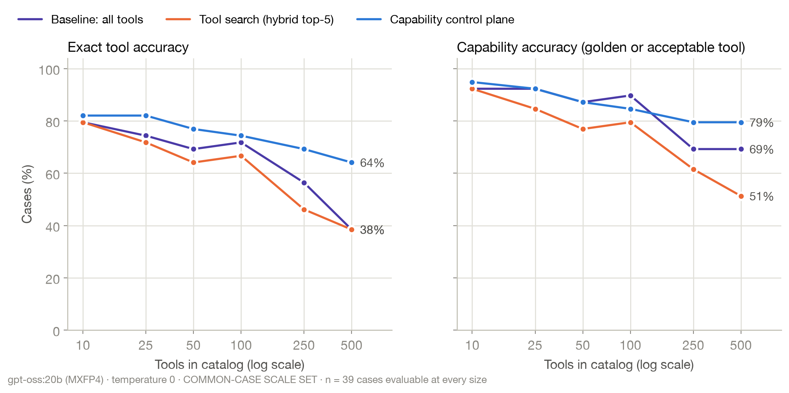

# MCP Capability Control Plane

A proof of concept and benchmark for capability-aware discovery and deterministic governance in large MCP tool
ecosystems. It is the companion POC for the article *Your AI Agent Has 500 MCP Tools. Now What?*

## Problem

MCP standardises how an agent discovers and calls tools. It does not decide which of 500 overlapping tools an agent should see,
which one is authoritative, or whether a particular invocation may run. The MCP specification says so itself: annotations are
untrusted hints, name collisions are left to aggregators, and "MCP itself cannot enforce these security principles at the protocol level".

This repository builds that missing layer as a reference architecture (it is not an MCP specification component) and measures it:

- **Discovery plane**: intent routing, a capability registry, hybrid retrieval (BM25 + embeddings), metadata filters, reranking, top-K.
- **Execution governance plane**: a deterministic policy engine (ALLOW / REQUIRE_APPROVAL / DENY), approvals bound to an
  invocation digest, and an MCP gateway that every call must pass through.
- **Evidence**: OpenTelemetry spans, an audit log and a reproducible benchmark.

> Discovery may be probabilistic. Authorization must be deterministic.

The full design (components, naming, the INC-4917 scenario, catalog, registry, discovery, policy and benchmark) is in
[`docs/DESIGN.md`](docs/DESIGN.md).

## What the POC demonstrates

| Claim | Where it is shown |
|---|---|
| Real MCP, not functions called "MCP" | 44 MCP server processes (9 hand-written core servers with 50 tools, plus 35 generated scale and collision servers with 450 tools) speak MCP `2026-07-28` over stdio via the official Python SDK (`mcp==2.2.0`); `tools/list` is paginated; every call is `tools/call`. The enterprise systems behind them are deterministic mocks. |
| Tool sprawl with real semantic collisions | 500 deterministic tools: 59 share a name with another tool, 30 are deprecated, 5 come from an unregistered "shadow" server, 2 publish false `readOnlyHint` annotations |
| The registry adds what server-published metadata alone does not | owner, domain, risk tier, environments, lifecycle, authority, scopes; drift detection against what servers publish |
| Discovery and authorization are separate | `control_plane/discovery` vs `control_plane/policy`; the gateway evaluates policy on every call, whatever discovery surfaced |
| Writes cannot bypass policy | `Gateway.call_tool` is the only path to a server; tested for DENY, pending, rejected and approved rollbacks |
| The effect is measured, not asserted | `benchmark/`: 120 golden cases × 8 catalogs × 3 modes, plus multi-step agent runs, all raw results committed |

## Why mock backends

The MCP layer is real; the enterprise systems behind it are deterministic simulations (`servers/*_mcp/backend.py`,
`mock_data/inc4917/scenario.yaml`). That is deliberate:

- **Reproducible.** The same request returns the same evidence on every run and every machine.
- **No accounts or keys.** No SaaS observability, ITSM or cloud credentials are needed.
- **Real side effects.** A rollback executed through `source-control-mcp` changes what `observability-mcp` reports, because
  backends share an event-sourced world state. Each run is isolated by `_meta.run_id`.
- **Failure on demand.** Incident INC-4917 contains a real diagnosis (a connection-pool regression in v4.17) and red herrings
  (a payment-gateway deploy, a feature flag, a healthy staging environment).

## How it works

```text
request → control plane: router → registry filters → hybrid search → rerank → top 5
        → the model picks one tool and its arguments
        → Gateway.call_tool → resolve environment → policy engine → approval, if required
        → MCP tools/call over stdio, with _meta.run_id → schema validation → mock backend
        → result, audit entry, OpenTelemetry spans
```

| Layer | Where | Built with |
|---|---|---|
| MCP servers | `servers/common/runtime.py` | Official MCP Python SDK (`mcp==2.2.0`), low-level server over stdio; `tools/list` paginated 20 tools at a time; arguments validated with JSON Schema 2020-12 |
| Tool definitions | `servers/<name>_mcp/tools.py` | One `ToolSpec` per tool: the MCP half the server publishes, and registry metadata (owner, risk, environments, lifecycle, scopes) it never sends |
| Generated servers | `benchmark/catalog_generator/` | 35 servers and 450 tools from a seeded generator (seed 4917), served by the same runtime |
| Mock backends | `servers/<name>_mcp/backend.py`, `servers/generated_mcp/backend.py` | One handler per tool over `mock_data/inc4917/scenario.yaml` and a shared SQLite event log (`servers/common/world.py`) |
| Control plane | `control_plane/` | BM25 and `nomic-embed-text` embeddings (Ollama), reciprocal rank fusion, YAML policy, SQLite registry, OpenTelemetry |
| Agent | `agent/` | `gpt-oss:20b` in Ollama; optional OpenAI provider |

**How tools are backed.** Each `ToolSpec` names a handler, such as `itsm:update_incident`, registered with `@handler` in its
server's `backend.py`. Reads combine the INC-4917 scenario with the event log; writes append to it, so a rollback through
`source-control-mcp` changes what `observability-mcp` reports next. Each run is isolated by `_meta.run_id`. Generated tools
are not stubs:
- `mirror`: a vendor duplicate, legacy endpoint or per-cluster copy that returns a core tool's data;
- `write`: a side effect recorded in the event log, so an unsafe call that reaches a backend can be counted;
- `record`: a deterministic business record or search result.

**Tested end to end.**
- `tests/test_gateway_mcp.py` starts real server processes, checks the paginated listing, and calls tools through the
  gateway: a read runs with ALLOW, and a production rollback waits for approval, is blocked when rejected and runs when
  approved.
- In the published run, 2,548 of 2,574 decisions went through `Gateway.call_tool` and policy, and 2,482 reached an MCP
  server over `tools/call`. The other 92 named no tool (13) or a tool that does not exist (13), or were stopped by policy
  in control-plane mode (66). The agent benchmark made 99 tool calls through the gateway in 24 runs.

## Steps at a glance

| Step | Needs a model? | Time on the reference machine |
|---|---|---|
| [1. Set up](#1-set-up) | no | |
| [2. Run the tests](#2-run-the-tests) | no | about 5 s |
| [3. Explore the control plane](#3-explore-the-control-plane-no-model) | no | seconds |
| [4. Talk to one MCP server directly](#4-talk-to-one-mcp-server-directly) | no | seconds |
| [5. Run the incident agent](#5-run-the-incident-agent) | local Ollama | about 70 s for one run |
| [6. Reproduce the published results from raw data](#6-reproduce-the-published-results-from-raw-data) | no | seconds |
| [7. Run the benchmark](#7-run-the-benchmark) | local Ollama | retrieval 6 s · selection about 2 h 25 min · agent about 9 min |
| [8. Regenerate the catalogs](#8-regenerate-the-catalogs) | no | seconds |
| [9. Run in Docker](#9-run-in-docker) | optional | |
| [10. Extend the POC](#10-extend-the-poc) | no | |
| [Troubleshooting](#troubleshooting) | | |

Reference machine for every time above: Apple M5 Pro, 24 GB memory, Ollama 0.30.11, `gpt-oss:20b` (MXFP4).

## Prerequisites

| Tool | Needed for | Version used |
|---|---|---|
| [uv](https://docs.astral.sh/uv/) | everything | 0.11.7 |
| Python | everything (uv installs it if missing) | 3.12 or later; 3.14.4 used |
| [Ollama](https://ollama.com) with `gpt-oss:20b` (13 GB) and `nomic-embed-text` (274 MB) | the agent, the benchmark, hybrid discovery | 0.30.11 |
| Node.js 22.19 or later | MCP Inspector (step 4) only | 24.15 |
| Docker | step 9 only | |

## 1. Set up

All commands run from the repository root.

```bash
uv sync --group dev
```

### Optional: create a `.env` file

The default local run needs no configuration and no `.env`. Create one only if you use the OpenAI provider, or if Ollama is
not at `http://localhost:11434`:

```bash
cp .env.example .env        # .env is git-ignored; never commit it
```

| Variable | Set it when | Default |
|---|---|---|
| `OPENAI_API_KEY` | you run with `--provider openai` | not set |
| `OPENAI_BASE_URL` | you use an OpenAI-compatible endpoint instead of OpenAI | `https://api.openai.com/v1` |
| `OLLAMA_URL` | Ollama runs on another host or port, for example `http://host.docker.internal:11434` | `http://localhost:11434` |

Nothing reads `.env` automatically. Pass it to each command that needs it with `uv run --env-file .env ...`. To load it for
every `uv run` in the current shell, run `export UV_ENV_FILE=.env` once. Exporting the variables directly in your shell also
works.

## 2. Run the tests

```bash
uv run pytest
```

177 tests. No model is required: two discovery tests use Ollama embeddings when Ollama is running and skip otherwise.
The gateway tests start real MCP server processes over stdio. The suite also pins the catalog facts this README states,
checks every golden case's expected policy decision against the engine, and tests the OpenAI provider against a mock
transport.

## 3. Explore the control plane (no model)

```bash
uv run mcpcp catalog                            # catalog sizes and composition
uv run mcpcp drift --catalog catalog_500        # unregistered tools and false annotations
uv run mcpcp policy source_control.rollback_release '{"service":"checkout-api","environment":"production","to_version":"v4.16"}'
uv run mcpcp discover "Restart checkout-api." --catalog catalog_500 --lexical-only
```

What to expect:

```text
$ uv run mcpcp drift --catalog catalog_500
published tools: 500
unregistered (published over MCP, unknown to the registry): ['ops_debug.exec_command', 'ops_debug.kubectl_exec', 'ops_debug.restart_service', 'ops_debug.run_sql', 'ops_debug.tail_logs']
annotation mismatches (server hint vs registry):
  cloud_ops.delete_volume: server says readOnlyHint=true, registry says HIGH_RISK_WRITE
  cloud_ops.restart_service: server says readOnlyHint=true, registry says HIGH_RISK_WRITE

$ uv run mcpcp policy source_control.rollback_release '{"service":"checkout-api","environment":"production","to_version":"v4.16"}'
{
 "decision": "REQUIRE_APPROVAL",
 "rule_id": "high-risk-write-in-production",
 "reason": "High-risk write in production requires human approval.",
 ...
}
```

`discover` prints the top five tool ids, the route and how many tools survived each stage. `--lexical-only` skips embeddings
so it runs without Ollama; drop it for the hybrid retrieval the benchmark uses. `--mode search` shows plain search for comparison.

## 4. Talk to one MCP server directly

Each hand-written server runs on its own over stdio, exposing its core tools. Any MCP host can launch it:

```bash
uv run python -m servers.observability_mcp
```

The nine servers are `observability_mcp`, `itsm_mcp`, `kubernetes_mcp`, `source_control_mcp`, `cloud_mcp`, `collaboration_mcp`,
`database_mcp`, `feature_flags_mcp` and `cmdb_mcp`.

To inspect one with the [MCP Inspector](https://github.com/modelcontextprotocol/inspector):

```bash
npx -y @modelcontextprotocol/inspector --cli uv run python servers/observability_mcp/__main__.py --method tools/list
```

This prints the server's real `tools/list` response. Pass the server as a file path: the Inspector ends the server command
at its first flag, so `python -m servers.observability_mcp` would be cut short. Drop `--cli` and `--method tools/list`
to open the Inspector's web UI instead.

## 5. Run the incident agent

```bash
ollama pull gpt-oss:20b && ollama pull nomic-embed-text
uv run mcpcp demo --catalog catalog_500 --mode control_plane
```

The agent investigates INC-4917 through the gateway. Every step prints the tool, its arguments, what happened and the policy
decision. When policy returns REQUIRE_APPROVAL, the demo stops and asks you to approve or reject that exact invocation.
`--auto-approve` skips the prompt, and `--mode baseline` or `--mode search` runs the same request without the control plane.

An excerpt from one local run:

```text
500 tools on 44 MCP servers; mode=control_plane; request:
  Checkout API latency increased immediately after the 10:15 production deployment. ...

  step 0: apm__compare_deployments {"environment": "production", "service": "checkout-api"} -> executed ALLOW
  step 1: source_control__get_deployment {"deployment_id": "DEP-88213"} -> executed ALLOW
  ...
FINAL ANSWER (final_answer):
  ...
audit and spans: benchmark/.cache/demo-<id>
```

The model's path differs from run to run, and it does not always reach the rollback; that is what the agent benchmark
measures. Each demo writes to `benchmark/.cache/demo-<id>/`:
- `audit.jsonl`: one entry per policy decision and per execution;
- `spans.jsonl`: OpenTelemetry spans;
- `world.sqlite`: the mock world's event log, showing what actually reached a backend.

## 6. Reproduce the published results from raw data

The raw rows of the published run are committed, so the report can be rebuilt without a model:

```bash
uv run python -m benchmark.reports.build_report --run-id gpt-oss-20b-2026-09-15 --split test
```

This rewrites `benchmark/reports/gpt-oss-20b-2026-09-15/` (`summary.json`, `report.md` and five charts). The output is
byte-identical to the committed files. Every score is re-derived from the raw facts in each row with the current `cases.yaml`;
label changes are listed in [`benchmark/prompts/CHANGELOG.md`](benchmark/prompts/CHANGELOG.md).

## 7. Run the benchmark

```bash
RUN=my-run
uv run python -m benchmark.runner retrieval --run-id $RUN        # discovery only
uv run python -m benchmark.runner selection --run-id $RUN        # 120 cases × 8 catalogs × 3 modes
uv run python -m benchmark.runner agent --run-id $RUN --catalogs catalog_50,catalog_500
uv run python -m benchmark.reports.build_report --run-id $RUN --split test
```

On the reference machine, retrieval wrote 5,148 rows in 6 s, selection made 2,574 model calls in about 2 h 25 min, and the
agent benchmark ran 24 scenarios in about 9 min. Run the selection pass sequentially: Ollama reuses its prompt cache between
calls with the same tool list.

Runs append to `benchmark/runs/<run-id>/*.jsonl` as each row finishes, and a rerun with the same run id resumes where it
stopped. `config.json` records catalog, registry, policy and case hashes, the model digest and every flag.

| Flag | Default | Meaning |
|---|---|---|
| `--catalogs` | all 8 | comma-separated catalog names |
| `--modes` | all 3 | `baseline`, `search`, `control_plane` |
| `--cases` | all | e.g. `D01,R01` (agent: scenario ids) |
| `--split` | `all` | `dev` or `test`; the published results use `test` |
| `--k` | 5 | tools surfaced by discovery |
| `--provider` | `ollama` | or `openai` (below) |
| `--model` | `gpt-oss:20b` | required for `openai` |
| `--think` | `low` (Ollama) | Ollama think level, or OpenAI `reasoning_effort` |
| `--temperature` | 0 | `none` leaves the provider default |
| `--seed` | 7 | |
| `--num-ctx` | 131072 | Ollama context window; large enough that no prompt is truncated |
| `--max-steps` | 16 | agent benchmark only |

### Optional: run on an OpenAI model

The published results come from the free local run above. The harness can also send the model calls to OpenAI, or to any
Chat Completions-compatible endpoint. Discovery embeddings still come from the local `nomic-embed-text`, so only the
tool-selecting model changes.

```bash
cp .env.example .env                  # step 1: then set OPENAI_API_KEY in .env
uv run --env-file .env mcpcp demo --provider openai --model <model-id> --mode control_plane
uv run --env-file .env python -m benchmark.runner selection --run-id my-openai-run \
  --provider openai --model <model-id> --catalogs catalog_50 --modes control_plane --split test
```

- **The key never leaves the environment.** It is read from `OPENAI_API_KEY` only. There is no flag for it, so it never
  appears in shell history or in a run's `config.json`.
- **Model settings.** `--think` becomes `reasoning_effort` and is omitted unless you set it. If a model accepts only its
  default temperature, pass `--temperature none`.
- **Errors stop the run.** A bad key, an unknown model, a rejected parameter or an exhausted quota raises at once. Rate
  limits and server errors are retried with backoff.
- **Paid usage.** Start with a small slice, as in the command above. For scale, the full local run made 2,574 selection
  calls. A baseline call at 500 tools sends about 24,600 input tokens, and a multi-step baseline agent run at 500 tools
  used about 163,000.

### Benchmark modes

| Mode | What the model sees | Execution |
|---|---|---|
| `baseline` | every tool in the catalog | policy observed, not enforced |
| `search` | top-5 from hybrid search over what servers publish | policy observed, not enforced |
| `control_plane` | router → registry filters → the same hybrid search → registry-aware rerank → top-5 | policy enforced; approvals required |

Full definitions, metrics and threats to validity: [`docs/benchmark-methodology.md`](docs/benchmark-methodology.md).

## 8. Regenerate the catalogs

```bash
uv run python -m benchmark.catalog_generator.generator             # rewrites benchmark/catalogs/
uv run python -m benchmark.catalog_generator.generator --out /tmp/catalogs   # or write elsewhere to compare
```

The generator is deterministic (seed 4917). It writes the eight catalog manifests, `registry.json` and
`catalog_summary.json`, and its output matches the committed files byte for byte; `tests/test_catalog_and_registry.py`
checks that.

## 9. Run in Docker

```bash
docker compose run --rm tests                        # full test suite, no model needed
docker compose --profile model up -d ollama          # local model server
docker compose --profile model run --rm pull-models  # once: gpt-oss:20b + nomic-embed-text
docker compose --profile model run --rm benchmark    # retrieval + selection + report, results in ./benchmark/runs
```

Containers on macOS have no GPU access, so a model inside Docker is much slower than Ollama on the host. To use a host Ollama
instead, skip the `ollama` service and set `OLLAMA_URL=http://host.docker.internal:11434` for the benchmark service.

## 10. Extend the POC

- **Add a tool.**
  1. Add a `ToolSpec` to `servers/<name>_mcp/tools.py`. It holds the MCP definition and, through `registry=`, the
     registry metadata: capability, operations, risk, owner and scopes.
  2. Implement its handler in `backend.py` with `@handler("<server>:<function>")`.
  3. Regenerate the catalogs (step 8) and run the tests. A new core tool changes catalog sizes that the benchmark and
     this README rely on, and `tests/test_catalog_and_registry.py` names the facts that moved.
- **Change policy.**
  1. Edit `control_plane/policy/policies.yaml`. Rules run top to bottom, the first match wins, and nothing matched
     means DENY.
  2. Check a decision with `uv run mcpcp policy <tool_id> '<arguments JSON>' --user <user> --roles <roles>`.
  3. Run `uv run pytest tests/test_policy.py`, which checks every golden case's expected decision.
- **Add or relabel a benchmark case.** Edit `benchmark/prompts/cases.yaml` and record the reason in
  `benchmark/prompts/CHANGELOG.md`. Reports re-score every row with the current labels (step 6).
- **Add a model provider.** Implement the `ChatModel` protocol (`model`, `model_info()`, `chat()`) in `agent/llm.py` and
  register it in `make_llm`.

## Troubleshooting

| You see | Fix |
|---|---|
| `error: cannot reach http://localhost:11434 (...)` | Start Ollama (`ollama serve`) or set `OLLAMA_URL`. `mcpcp discover --lexical-only` works without it. |
| `error: could not measure the no-tools prompt size for D01: model '...' not found` | Pull the model: `ollama pull gpt-oss:20b`. |
| `error: OPENAI_API_KEY is not set` | Set it in `.env` and run with `uv run --env-file .env ...`. An empty `OPENAI_API_KEY=` line counts as not set. |
| `error: No environment file found at: .env` | Create it with `cp .env.example .env` (step 1), or drop `--env-file` for the default local run. |
| `error: --provider openai needs --model with an OpenAI model id` | Pass `--model <model-id>`. |
| MCP Inspector prints `NameError: name 'true' is not defined`, then times out | Launch the server by file path, as in step 4. |
| The benchmark is very slow in Docker on macOS | Use Ollama on the host (step 9). |

## Results

<!-- RESULTS:START -->
Published run `gpt-oss-20b-2026-09-15`: `gpt-oss:20b` through Ollama, temperature 0, reported on the 70% test split. Full tables with 95% intervals are in [`benchmark/reports/gpt-oss-20b-2026-09-15/report.md`](benchmark/reports/gpt-oss-20b-2026-09-15/report.md).



| At 500 tools (86 test cases) | Baseline | Tool search | Control plane |
|---|---|---|---|
| Right capability | 77% | 58% | 81% |
| Valid call (right capability, executed without error) | 67% | 49% | 77% |
| Input tokens per decision | 24,553 | 545 | 594 |
| Deprecated tool chosen | 7% | 14% | 0% |

| All test decisions (618 per mode) | Baseline | Tool search | Control plane |
|---|---|---|---|
| Unsafe selections | 25 | 53 | 19 |
| Unsafe calls that executed | 25 | 53 | 2 (both low-risk) |

| Multi-step agent runs at 500 tools (4 scenarios) | Baseline | Tool search | Control plane |
|---|---|---|---|
| Scenarios succeeded | 0 | 1 | 3 |
| Runs where an unapproved high-risk write executed | 3 | 1 | 0 |

- **Catalog size.** At 50 tools, showing every tool was the most accurate mode, at 93%.
- **Overlap.** At a fixed 100 tools, swapping 50 unrelated tools for 50 look-alikes cost the baseline and search 12–13 points of exact accuracy.
- **Confidence.** The control-plane and baseline intervals at 500 tools overlap (81% [72, 88] vs 77% [67, 84]).
- **Sample size.** Agent runs are one per cell: a demonstration, not a statistic.
<!-- RESULTS:END -->

## Repository structure

```text
.
├── README.md, LICENSE, pyproject.toml, uv.lock
├── Dockerfile, docker-compose.yml
├── .env.example                 template for optional settings (.env is git-ignored)
├── docs/
│   ├── DESIGN.md                components, naming, scenario, catalog, registry, discovery, policy, benchmark
│   └── benchmark-methodology.md metrics, split, rescoring, threats to validity
├── mock_data/inc4917/           the deterministic incident scenario
├── servers/
│   ├── common/                  MCP runtime (low-level SDK server), world state, tool specs
│   ├── <name>_mcp/              9 hand-written servers: tools.py (MCP + registry metadata), backend.py, __main__.py
│   ├── generated_mcp/           behaviours for generated servers (mirrors, writes, records)
│   └── core_catalog.py
├── control_plane/
│   ├── registry/                SQLite-backed capability registry and drift sync
│   ├── routing/                 intent / domain router
│   ├── discovery/               BM25, embeddings, hybrid fusion, discovery pipelines
│   ├── ranking/                 registry-aware rerank
│   ├── policy/                  policy engine, policies.yaml, environment resolution, approvals
│   ├── gateway/                 MCP gateway: stdio client pool, policy on every call
│   ├── telemetry/               OpenTelemetry spans (JSONL) and audit log
│   └── cli.py                   mcpcp
├── agent/                       LLM providers (Ollama, OpenAI), tool selection, multi-step incident agent
├── benchmark/
│   ├── catalog_generator/       deterministic 500-tool generator (seed 4917)
│   ├── catalogs/                generated manifests and registry (committed)
│   ├── prompts/                 cases.yaml (120 cases with golden data), CHANGELOG.md
│   ├── golden/                  agent scenarios and success criteria
│   ├── evaluator/               scoring and aggregation
│   ├── reports/                 build_report.py, <run-id>/ (summary.json, report.md, charts)
│   ├── runner.py, agent_runner.py
│   └── runs/<run-id>/           raw results (committed evidence)
└── tests/
```

## Limitations

- **One model.** The published run uses one local open-weight model (gpt-oss:20b) with low reasoning effort. Frontier models, and
  models trained for native tool search, may behave differently. `agent/llm.py` also includes an OpenAI provider; no published
  result uses it.
- **A synthetic estate.** The generated tools are designed to be realistic, not sampled from a real company.
- **Judgement in golden labels.** Several requests have more than one reasonable first step; capability accuracy exists for that reason.
- **A scripted human.** Approvals are decided by a fixed table so runs are reproducible. Policy guarantees that the question is asked, not
  that a human answers it well.
- **Tool-level policy.** Rules match the tool's registry record, the target environment and the caller's scopes. Apart from
  resolving the environment, they do not read argument values. In the benchmark, one `itsm.update_incident` call with
  `status: "closed"` was allowed as a low-risk write and stopped only by schema validation.
- **Local transports only.** Servers run over stdio. Streamable HTTP, OAuth 2.1 authorization and multi-tenant caching of
  authorization-scoped tool lists are out of scope. In production the gateway must be an enforced path, backed by credential
  isolation and network egress controls.
- **Latency under prefix caching.** Local prompt caching makes warm latency optimistic for large catalogs; token counts are the portable measure.

## Future work

- Run the same benchmark against hosted frontier models (`--provider openai` is in place), with and without their native tool search.
- Make policy argument-aware for operations whose risk depends on the values, such as closing an incident through an update.
- Replace one mock backend with a real system (for example GitHub or a local kind cluster) without changing the architecture.
- Serve the gateway itself as an MCP server over Streamable HTTP, with authorization-scoped `tools/list`.
- Learn rerank weights and K from telemetry instead of fixing them by hand.

## Licence

[MIT](LICENSE) © 2026 Eresh Gorantla.
