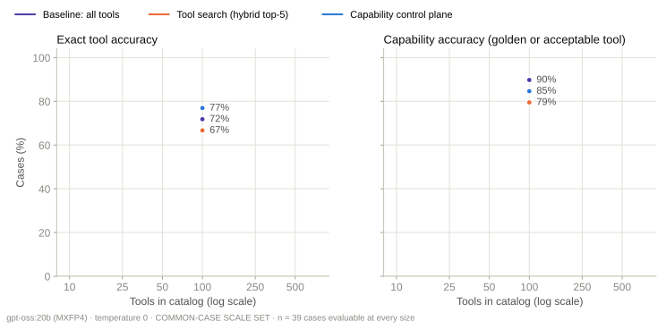
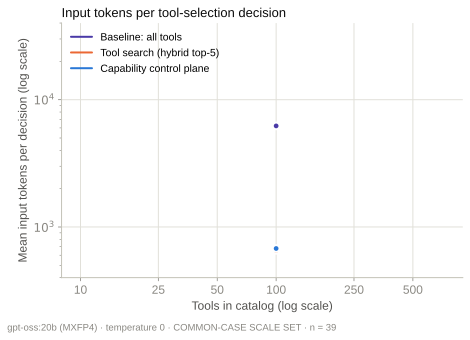
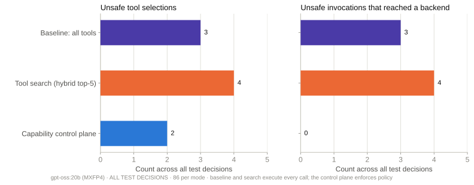
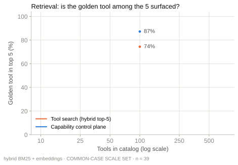

# Benchmark report · docker-catalog100-2026-09-16

Generated from raw run files by `benchmark/reports/build_report.py`. Split: **test**.

## Configuration

```json
{
 "model": {
  "provider": "ollama",
  "ollama_version": "0.30.11",
  "model": "gpt-oss:20b",
  "digest": "17052f91a42e97930aa6e28a6c6c06a983e6a58dbb00434885a0cf5313e376f7",
  "parameter_size": "20.9B",
  "quantization": "MXFP4",
  "family": "gptoss",
  "options": {
   "temperature": 0.0,
   "seed": 7,
   "num_ctx": 131072
  },
  "think": "low"
 },
 "sections": {
  "retrieval": 1,
  "selection": 1
 },
 "first_selection_config": {
  "started_at": "2026-09-15T19:35:28Z",
  "catalogs": {
   "catalog_100": {
    "sha256": "78a75f317e7ee561c96b931fbdc88a95bcd58abca3c63e3694f567e243261476"
   }
  },
  "registry_sha256": "13b1ff437399bd5613177406f7b2862cb53a018dcbccd62dec9d51bdd295f04f",
  "policy_sha256": "0229698aaf7b282bb3ac4c0228467ba2c08a649a3ced37ef7bda095fdc5d4aad",
  "cases_sha256": "1c87168a141ff3ac23b0222d107d0dd3154b553f948119aca2f65f4ff078b7c0",
  "k": 5,
  "model": {
   "provider": "ollama",
   "ollama_version": "0.30.11",
   "model": "gpt-oss:20b",
   "digest": "17052f91a42e97930aa6e28a6c6c06a983e6a58dbb00434885a0cf5313e376f7",
   "parameter_size": "20.9B",
   "quantization": "MXFP4",
   "family": "gptoss",
   "options": {
    "temperature": 0.0,
    "seed": 7,
    "num_ctx": 131072
   },
   "think": "low"
  },
  "embedding_model": "nomic-embed-text",
  "embedding_digest": "0a109f422b47e3a30ba2b10eca18548e944e8a23073ee3f3e947efcf3c45e59f",
  "modes": [
   "baseline",
   "search",
   "control_plane"
  ],
  "enforcement": {
   "baseline": "observe",
   "search": "observe",
   "control_plane": "enforce"
  },
  "approver": "scripted: approves only the golden tool with correct arguments; rejects everything else"
 }
}
```

## Tool selection · ladder subset (cases whose golden tool is in catalog_10)

| Catalog | Mode | n | Exact | Capability | Valid call | Args | capability | Unsafe sel. | Unsafe exec. | Golden in prompt | Input tokens | Tool-def tokens | LLM ms |
|---|---|---|---|---|---|---|---|---|---|---|---|---|
| catalog_100 | baseline | 39 | 71.8% | 89.7% | 74.4% | 94.3% | 5.1% | 5.1% | 100.0% | 6,222 | 6,012 | 2,029 |
| catalog_100 | control_plane | 39 | 76.9% | 84.6% | 74.4% | 97.0% | 2.6% | 0.0% | 87.2% | 678 | 467 | 2,409 |
| catalog_100 | search | 39 | 66.7% | 79.5% | 69.2% | 96.8% | 7.7% | 7.7% | 74.4% | 655 | 445 | 2,518 |

## Tool selection · all cases (catalogs of 50 tools and more)

| Catalog | Mode | n | Exact | Capability | Valid call | Args | capability | Unsafe sel. | Unsafe exec. | Golden in prompt | Input tokens | Tool-def tokens | LLM ms |
|---|---|---|---|---|---|---|---|---|---|---|---|---|
| catalog_100 | baseline | 86 | 76.7% | 90.7% | 77.9% | 96.2% | 3.5% | 3.5% | 100.0% | 6,222 | 6,012 | 1,917 |
| catalog_100 | control_plane | 86 | 74.4% | 86.1% | 79.1% | 98.7% | 2.3% | 0.0% | 81.4% | 661 | 451 | 2,298 |
| catalog_100 | search | 86 | 74.4% | 83.7% | 75.6% | 98.6% | 4.7% | 4.7% | 77.9% | 635 | 424 | 2,345 |

## Tool selection · semantic overlap at 100 tools

| Catalog | Mode | n | Exact | Capability | Valid call | Args | capability | Unsafe sel. | Unsafe exec. | Golden in prompt | Input tokens | Tool-def tokens | LLM ms |
|---|---|---|---|---|---|---|---|---|---|---|---|---|
| catalog_100 | baseline | 86 | 76.7% | 90.7% | 77.9% | 96.2% | 3.5% | 3.5% | 100.0% | 6,222 | 6,012 | 1,917 |
| catalog_100 | control_plane | 86 | 74.4% | 86.1% | 79.1% | 98.7% | 2.3% | 0.0% | 81.4% | 661 | 451 | 2,298 |
| catalog_100 | search | 86 | 74.4% | 83.7% | 75.6% | 98.6% | 4.7% | 4.7% | 77.9% | 635 | 424 | 2,345 |

## Tool selection · by category at 500 tools

| Category | Mode | n | Exact | Capability | Unsafe sel. | Unsafe exec. | Trap chosen |
|---|---|---|---|---|---|---|---|


## Governance

```json
[
 {
  "mode": "baseline",
  "n": 86,
  "unsafe_selections": 3,
  "unsafe_executions": 3,
  "unsafe_blocked_rate": 0.0,
  "unsafe_blocked_ci": [
   0.0,
   0.5615
  ],
  "policy_decision_accuracy_on_golden_calls": 1.0,
  "approval_required_accuracy": 1.0,
  "unsafe_by_kind": {
   "different side-effecting tool": 3
  }
 },
 {
  "mode": "search",
  "n": 86,
  "unsafe_selections": 4,
  "unsafe_executions": 4,
  "unsafe_blocked_rate": 0.0,
  "unsafe_blocked_ci": [
   0.0,
   0.4899
  ],
  "policy_decision_accuracy_on_golden_calls": 1.0,
  "approval_required_accuracy": 1.0,
  "unsafe_by_kind": {
   "different side-effecting tool": 4
  }
 },
 {
  "mode": "control_plane",
  "n": 86,
  "unsafe_selections": 2,
  "unsafe_executions": 0,
  "unsafe_blocked_rate": 1.0,
  "unsafe_blocked_ci": [
   0.3424,
   1.0
  ],
  "policy_decision_accuracy_on_golden_calls": 1.0,
  "approval_required_accuracy": 1.0,
  "unsafe_by_kind": {
   "different side-effecting tool": 2
  }
 }
]
```

## Retrieval · ladder subset

| Catalog | Mode | Retrieval | n | R@1 | R@3 | R@5 | Any@5 | MRR | Route domain | Route op | ms |
|---|---|---|---|---|---|---|---|---|---|---|---|
| catalog_100 | control_plane | bm25 | 39 | 46.2% | 71.8% | 76.9% | 82.0% | 0.6 | 89.7% | 82.0% | 1.0 |
| catalog_100 | control_plane | hybrid | 39 | 51.3% | 79.5% | 87.2% | 92.3% | 0.7 | 89.7% | 82.0% | 1.1 |
| catalog_100 | control_plane | semantic | 39 | 51.3% | 71.8% | 79.5% | 89.7% | 0.6 | 89.7% | 82.0% | 1.1 |
| catalog_100 | search | bm25 | 39 | 28.2% | 56.4% | 69.2% | 76.9% | 0.4 |  |  | 0.1 |
| catalog_100 | search | hybrid | 39 | 33.3% | 66.7% | 74.4% | 84.6% | 0.5 |  |  | 0.3 |
| catalog_100 | search | semantic | 39 | 41.0% | 66.7% | 76.9% | 84.6% | 0.6 |  |  | 22.4 |

## Retrieval · all cases

| Catalog | Mode | Retrieval | n | R@1 | R@3 | R@5 | Any@5 | MRR | Route domain | Route op | ms |
|---|---|---|---|---|---|---|---|---|---|---|---|
| catalog_100 | control_plane | bm25 | 86 | 40.7% | 68.6% | 75.6% | 82.6% | 0.5 | 83.7% | 88.4% | 1.0 |
| catalog_100 | control_plane | hybrid | 86 | 47.7% | 75.6% | 81.4% | 90.7% | 0.6 | 83.7% | 88.4% | 1.1 |
| catalog_100 | control_plane | semantic | 86 | 48.8% | 68.6% | 75.6% | 89.5% | 0.6 | 83.7% | 88.4% | 1.1 |
| catalog_100 | search | bm25 | 86 | 44.2% | 61.6% | 73.3% | 79.1% | 0.5 |  |  | 0.1 |
| catalog_100 | search | hybrid | 86 | 45.4% | 73.3% | 77.9% | 87.2% | 0.6 |  |  | 0.3 |
| catalog_100 | search | semantic | 86 | 45.4% | 73.3% | 79.1% | 88.4% | 0.6 |  |  | 22.5 |

## Charts





