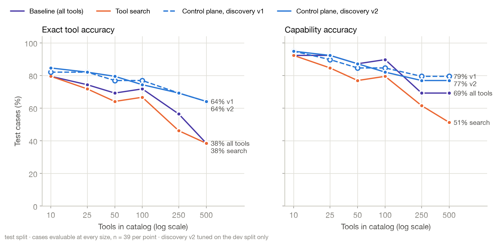

# Evidence guard, agent scoring v2 and discovery v2

This document records three changes made after the published run `gpt-oss-20b-2026-09-15`. For each one it gives the
reason, the change itself and what it measured. The published run and its report are unchanged. Every number below
comes from the run files named with it, and the commands at the end rebuild the reports from those files.

| Change | Where | Default |
|---|---|---|
| Evidence guard for the incident agent | `agent/evidence.py`, `agent/incident_agent.py` | on in control-plane mode (`--agent-guard auto`) |
| Agent scoring version 2 | `benchmark/agent_runner.py` | every new agent run |
| Discovery v2 | `control_plane/ranking/reranker.py`, `control_plane/discovery/pipeline.py` | opt-in (`--discovery v2`) |

## 1. Why

**The published agent runs were scored too leniently.** Scoring version 1 counted a cause as found when the final
answer contained the right words, and a fix as verified when any latency read followed the rollback. Run again and
scored with version 2, the same legacy agent failed for reasons version 1 could not see:
- an incident root cause its own tool results did not support;
- a rollback with no recovery measurement after it;
- a fix request that ended without any fix.

**Selection misses at 100 tools and above were mostly discovery misses.** In the Docker rerun on catalog_100, 9 of the
12 control-plane errors on the test split had the right tool missing from the five tools shown to the model. These were
read as counts only; no test-split case was used to shape the changes below.

## 2. The evidence guard

The model still chooses every tool call. The guard decides what counts as evidence, what may be written and what the
final answer says.

- **Receipts.** Every successful structured tool result becomes a numbered receipt (E1, E2, …). Failed calls, text
  results and `find_tools` never count as evidence.
- **Diagnosis.** A cause exists only when receipts in the same service and environment join four facts:
  - the deployment that was live when the incident started;
  - that deployment's commit;
  - that commit's diff reducing `max_connections`;
  - a saturated pool whose observed limit matches the diff.
- **Recovery.** A fix counts as verified only when a p95 latency or health reading, taken after the latest remediation,
  is within the SLO.
- **Next requirement.** Before each model turn, the guard asks discovery for the next missing piece, in this order:
  deployment, diff, pool, remediation, verification, incident update. The model sees at most 12 tools plus `find_tools`.
- **Pushback.** If the model answers before the request is satisfied, it is sent back with what is still missing. After
  three pushbacks in a row without a tool call, the run ends with an incomplete report.
- **Write gates.**
  - A read-only request cannot write, and an unregistered tool counts as a write.
  - A request that does not ask for a fix cannot run a remediation (a rollback, restart, redeploy, revert or scale);
    the report recommends it instead.
  - An incident cannot be closed before a verified recovery.
  - Incident fields are written from receipts: status, root cause, summary and resolution notes; the model's prose is
    dropped.
  - An incident updated before the cause, fix or verification was established must be updated again.
  - A rollback's target version must come from a deployment receipt. Before any evidence of the release history, a
    rollback is blocked; a version the evidence does not support is blocked with the supported one named.
- **Report.** The final answer is built from receipts: the cause with receipt ids, the fix performed or recommended, the
  recovery check with measured values, the incident update, the evidence list, the number of failed calls, and the
  actions that did not run (blocked by the guard, denied by policy, rejected at approval, or an unknown tool). If the
  run ends early, the report says `Incomplete` and lists what is missing.

**Found in live runs, and fixed:**
- **A stale incident record.** In S1 the model updated INC-4917 before the diff and pool evidence existed. The update
  was accurate when it was written ("cause under investigation"), and nothing checked it again, so the incident still
  said that after the cause was proven. The guard now requires a fresh update, and scoring version 2 requires the
  incident record to carry the supported cause.
- **A guessed rollback target.** In S4 the model asked to roll back to v4.15 without looking at the release history; the
  release before v4.17 is v4.16. The approver rejected it, and the guard then sent the model back 13 times with "roll
  back to the previous release" without saying which one; the run used 28,052 input tokens and fixed nothing. The guard
  now asks for the release history first, names the target from it ("from v4.17 to v4.16"), blocks unsupported
  versions before they reach the approver, and stops after three pushbacks without progress.
- **An unrequested rollback that erased the evidence.** S1 asks for a *recommended* remediation. With discovery v2 at
  catalog_500, the model rolled production back on its own; the scripted approver approves that exact rollback in every
  scenario. The pool then read as healthy, so the cause could no longer be proven, and the guard's report said
  `Incomplete, missing evidence: diagnosis`. The guard now blocks remediation when the request does not ask for a fix.

**These fixes were made while watching the four agent scenarios.** There is no held-out agent scenario, so the agent
results below show that the guard does what it was built to do on these scenarios; they are not an estimate for new
incidents.

## 3. Agent scoring version 2

A run passes only when all of these hold:
- **Supported diagnosis.** It is joined from the run's own successful tool results, and it matches the scenario data:
  v4.17, DEP-88213, and a pool limit reduced from 50 to 10.
- **Cause stated.** The final answer states the cause, and, when the scenario requires an incident update, the incident
  record carries it (in `root_cause` at the end of the run, or in a comment).
- **Fix requests.** For `action_request` scenarios (S3, S4), a remediation ran and recovery was verified after it.
- **No unsupported claims.** Neither incident fields nor the final answer claim a rollback, a recovery or a root cause
  the evidence does not show.
- **Earlier rules.** Everything version 1 required: no unsafe execution, and no writes where they are not allowed.

The diagnosis and recovery checks reuse `agent/evidence.py`, so version 2 is not an independent semantic audit of the
guard. The ground truth, however, comes from `mock_data/inc4917/scenario.yaml`, not from the guard. Published rows stay
version 1. They cannot be rescored, because version-1 rows did not record full tool results.

## 4. Discovery v2

Discovery v2 adds four signals to the control-plane rerank. The signals were chosen from **dev-split** misses only (34
cases), and v1 stays the default.

| Signal | Weight | Dev misses it addressed |
|---|---|---|
| Drop tools the caller's scopes cannot run, unless the request names their domain; then penalise them | 0.3 | tools the caller cannot run took top-5 slots in 35 of 136 dev retrievals (for example payroll tools for A05, "Did anyone change anything on checkout in the last hour?"); with v2, 14 remain, all in a domain the router matched to the request |
| On write requests, boost tools with side effects | 0.2 | "Create an incident channel", "Post in #inc-4917-…" ranked read tools first |
| On write requests, boost tools whose registry operation verb is in the request | 0.25 | same |
| Boost tools whose published schema requires the parameter a named identifier fills (pod, instance, incident, channel, commit) | 0.25 | "Get the logs for pod checkout-api-7d9f8c6b5-2kq8x" ranked log-search tools first |

A request that names an out-of-scope domain still surfaces the tool, so policy denies it visibly instead of discovery
hiding it.

### Dev-split evidence (the tuning data)

**Retrieval.** Hybrid control-plane retrieval, 34 dev cases. Runs: `retrieval-dev-v1-2026-09-16`, `retrieval-dev-v2-2026-09-16`.

| Catalog | Golden tool in top 5, v1 → v2 | Golden or acceptable tool in top 5, v1 → v2 | v1 with top 8 |
|---|---|---|---|
| catalog_50 | 31 → 32 | 33 → 34 | 34 |
| catalog_100 | 30 → 32 | 32 → 34 | 34 |
| catalog_250 | 27 → 31 | 30 → 34 | 33 |
| catalog_500 | 26 → 29 | 29 → 33 | 32 |

Showing 8 tools instead of 5 was also considered. On capability recall, v2 with 5 tools matched or beat v1 with 8, and v2
with 8 tools found nothing more, so v2 keeps K = 5 and its token cost.

**Model selection.** Control plane only, 34 dev cases, `gpt-oss:20b`, same settings as the published run. Report:
[`benchmark/reports/selection-dev-v2-2026-09-16/comparison.md`](../benchmark/reports/selection-dev-v2-2026-09-16/comparison.md).

| Catalog | Right capability, v1 → v2 | Exact tool, v1 → v2 | Paired: fixed · broke | Mean input tokens, v1 → v2 |
|---|---|---|---|---|
| catalog_50 | 91.2% → 94.1% | 73.5% → 76.5% | 1 · 0 | 650 → 653 |
| catalog_100 | 91.2% → 97.1% | 73.5% → 76.5% | 2 · 0 | 647 → 652 |
| catalog_250 | 82.3% → 91.2% | 64.7% → 76.5% | 4 · 1 | 604 → 612 |
| catalog_500 | 70.6% → 82.3% | 50.0% → 64.7% | 4 · 0 | 572 → 579 |

- **The one dev regression, R01 at catalog_250** ("Roll back checkout-api to the previous production release").
  Both profiles rank the golden `source_control.rollback_release` first. The write boost moved the non-authoritative
  `cicd.rollback_pipeline` from fifth to second, and the model chose it. It was left as a known trade-off; changing
  weights for one case would be fitting to it.
- **Run-to-run noise.** The fresh v1 run chose the same tool as the published run in 30–33 of 34 dev cases per catalog.
  That is why v2 is compared with a v1 run from the same session, not with the published numbers.

## 5. Results

### How the final runs were made

- **Model and settings.** `gpt-oss:20b` in local Ollama, temperature 0, seed 7, think `low`, as in the published run.
- **Context window.** The final runs used a 32,768-token context window instead of 131,072. At 131,072 the reference
  machine (24 GB) ran low on memory while the 44 MCP server processes of catalog_500 were up, and the runs were stopped.
  The largest single prompt in these runs is far below the limit: 3,955 tokens for an agent call and under 800 for a
  control-plane selection. The legacy agent's mean token counts at the two window sizes agree within 0.2% (8,110
  against 8,126 at catalog_100, 3,598 against 3,598 at catalog_500), which is within run-to-run variation.
- **Provenance.** Every run's `config.json` records its flags (including `discovery` and `num_ctx`), the model digest,
  and the catalog, registry, policy and case hashes. Agent runs also record the guard, the scoring version, and hashes
  of the scenario file and the agent code.

### Agent: legacy agent against the evidence guard

Control-plane mode, discovery v1 in both arms, scoring version 2, one run per scenario. Runs:
`agent-v2-legacy-2026-09-16` and `agent-v2-evidence-2026-09-16`. Report:
[`benchmark/reports/agent-v2-evidence-2026-09-16/comparison.md`](../benchmark/reports/agent-v2-evidence-2026-09-16/comparison.md).

| | catalog_100, legacy | catalog_100, evidence guard | catalog_500, legacy | catalog_500, evidence guard |
|---|---:|---:|---:|---:|
| Strict passes | 0/4 | 4/4 | 1/4 | 4/4 |
| Supported diagnoses (S1, S2) | 0/2 | 2/2 | 0/2 | 2/2 |
| Fixes performed and verified (S3, S4) | 0/2 | 2/2 | 1/2 | 2/2 |
| Unsupported claims | 1 | 0 | 1 | 0 |
| Unsafe backend writes | 0 | 0 | 0 | 0 |
| Invalid tool calls | 1 | 1 | 1 | 2 |
| Calls blocked by the guard | 0 | 1 | 0 | 1 |
| Mean input tokens per run | 8,126 | 24,210 | 3,598 | 17,333 |
| Mean wall time per run | 17.8 s | 37.9 s | 14.4 s | 35.3 s |

- **Why the legacy agent fails.**
  - S1: it wrote a root cause into INC-4917 that its own tool results did not support.
  - S2: it answered after two calls, without the diff or the pool evidence.
  - S3: at catalog_100 it rolled back and never measured recovery. At catalog_500 its restart was rejected at approval,
    and it then blamed a slow `orders` query.
  - S4: at catalog_100 it asked to roll back to v4.15 (a guess), was rejected at approval, and stopped.
- **What the guard did.**
  - Both blocked calls were S4 rollbacks to `"previous"`, stopped before the approver; the model then looked up the
    release history and rolled back to v4.16.
  - In S1 the model updated the incident before the cause was proven, and updated it again with the root cause once it
    was.
- **What it costs.** 3.0× the input tokens at catalog_100 and 4.8× at catalog_500, and about 2.1× and 2.5× the wall
  time. The legacy agent's low token counts come partly from stopping before the evidence existed.

### Agent: evidence guard with discovery v2

Same scenarios and settings, compared with the same legacy run. Run: `agent-v2-evidence-discovery-v2-2026-09-16`.
Report:
[`benchmark/reports/agent-v2-evidence-discovery-v2-2026-09-16/comparison.md`](../benchmark/reports/agent-v2-evidence-discovery-v2-2026-09-16/comparison.md).

- **Results.** 4/4 strict passes at both sizes, no unsupported claims and no unsafe writes.
- **Tokens.** Mean input tokens were 18,425 at catalog_100 and 14,052 at catalog_500, against 24,210 and 17,333 with
  discovery v1. Four scenarios run once each are not evidence that v2 is cheaper.
- **The new gate fired.** In S1 at catalog_500 the model asked to roll production back to v4.16. The guard blocked the
  rollback because the request only asked for a recommendation, so the saturated pool was still there to read and the
  diagnosis held. Before this gate, the same run ended `Incomplete, missing evidence: diagnosis`.

### Discovery v2 on the test split: no improvement

Control plane only, 618 test decisions per profile, run once after v2 was fixed. v1 and v2 ran in the same session. Runs:
`selection-test-v1-2026-09-16`, `selection-test-v2-2026-09-16`. Report:
[`benchmark/reports/selection-test-v2-2026-09-16/comparison.md`](../benchmark/reports/selection-test-v2-2026-09-16/comparison.md).



| Catalog | Test cases | Baseline (all tools) | Tool search | Control plane v1 | Control plane v2 | v2 against v1: fixed · broke |
|---|---:|---:|---:|---:|---:|---|
| catalog_10 | 39 | 92.3% | 92.3% | 94.9% | 94.9% | 0 · 0 |
| catalog_25 | 63 | 93.7% | 85.7% | 87.3% | 90.5% | 2 · 0 |
| catalog_50 | 86 | 93.0% | 84.9% | 86.1% | 88.4% | 3 · 1 |
| catalog_100 | 86 | 90.7% | 83.7% | 86.1% | 86.1% | 1 · 1 |
| catalog_250 | 86 | 79.1% | 70.9% | 81.4% | 81.4% | 1 · 1 |
| catalog_500 | 86 | 76.7% | 58.1% | 80.2% | 77.9% | 0 · 2 |
| low_overlap_100 | 86 | 91.9% | 84.9% | 86.1% | 86.1% | 1 · 1 |
| high_overlap_100 | 86 | 87.2% | 76.7% | 84.9% | 83.7% | 3 · 4 |

The table shows right-capability rates. Baseline and tool search come from the published run.

- **The dev gains did not carry over.** On dev, v2 added 3 to 12 points at every size. On test it moved capability
  accuracy by −2.3 to +3.2 points, and the paired changes are balanced (11 cases fixed, 10 broken, summed over catalogs
  that share cases). No per-catalog difference is close to significant. The dev/test split exists to catch exactly this.
- **Why.** Most dev gains came from request types that are rare in the test split (a named pod, a named channel, an
  explicit "create" or "post"). On test, the write boost hurt:
  - it lifted non-authoritative write tools (`db_admin.kill_query`, `db_admin.set_pool_size`) above the authoritative
    ones, pushing the golden tool out of the top 5 in R14 and R15;
  - on multi-step requests that end with "update the incident" (M02, M12), it ranked writes first when the first step
    should be a read.

  The dev split had shown the same trade-off once (R01).
- **What is left at 100 tools.** With either profile, the control plane misses 12 of 86 test cases at catalog_100. In 9
  of them the golden tool was not among the five shown, and most of those are ambiguous or multi-step requests where the
  golden first step is a judgement call. The baseline, which shows all 100 tools, gets 90.7%. The published finding
  stands: up to about 100 tools, showing everything is as accurate or more so, and the control plane's advantage is
  tokens and governance.
- **Reproducibility.** The fresh v1 run chose the same tool as the published run in 79–85 of 86 test cases per catalog.
  Its accuracy is within 2.3 points of the published control plane at every size.
- **Decision.** v1 stays the default. v2 stays in the code as an opt-in profile with this result recorded. Its write
  boost should be limited to authoritative tools and to single-step write requests before it is tried again, on a fresh
  case set.

## 6. Rebuild the reports

Every report below is rebuilt from the committed run files, without a model.

```bash
uv run python -m benchmark.reports.compare_agent_evidence --before agent-v2-legacy-2026-09-16 --after agent-v2-evidence-2026-09-16
uv run python -m benchmark.reports.compare_agent_evidence --before agent-v2-legacy-2026-09-16 --after agent-v2-evidence-discovery-v2-2026-09-16
uv run python -m benchmark.reports.compare_discovery --published gpt-oss-20b-2026-09-15 --v1 selection-dev-v1-2026-09-16 --v2 selection-dev-v2-2026-09-16 --split dev
uv run python -m benchmark.reports.compare_discovery --published gpt-oss-20b-2026-09-15 --v1 selection-test-v1-2026-09-16 --v2 selection-test-v2-2026-09-16 --split test
```

Rerun the benchmarks themselves (local Ollama; on the reference machine, about 26 minutes per selection run and 12
minutes for the three agent arms):

```bash
ALL=catalog_10,catalog_25,catalog_50,catalog_100,catalog_250,catalog_500,low_overlap_100,high_overlap_100
AG="--modes control_plane --catalogs catalog_100,catalog_500 --num-ctx 32768"
uv run python -m benchmark.runner selection --run-id my-test-v1 --discovery v1 --modes control_plane --split test --catalogs $ALL --num-ctx 32768
uv run python -m benchmark.runner selection --run-id my-test-v2 --discovery v2 --modes control_plane --split test --catalogs $ALL --num-ctx 32768
uv run python -m benchmark.runner agent --run-id my-legacy $AG --agent-guard legacy
uv run python -m benchmark.runner agent --run-id my-evidence $AG --agent-guard evidence
uv run python -m benchmark.runner agent --run-id my-evidence-v2 $AG --agent-guard evidence --discovery v2
```
