# Do You Actually Need Multiple Agents?

*When Does Splitting One Reasoning Component Into Several Autonomous Agents Make a Production System Better, and When Does an Agent Deserve A2A?*

**Production AI Engineering · C1 · Coordination**

*Chapter 13 of 15. New here? Start with [Start Here: What It Takes to Run AI Agents in Production](https://eresh-gorantla.medium.com/start-here-a-hands-on-map-of-production-ai-engineering-5056549657db).*

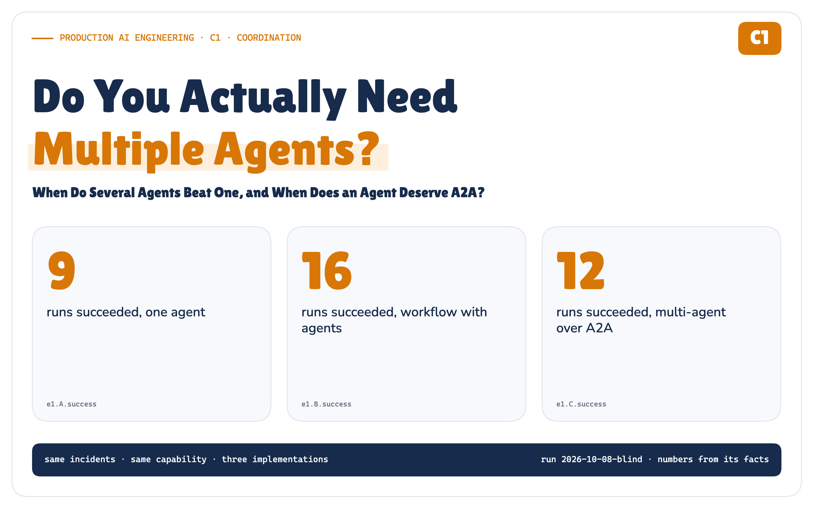

**Here is a diagram you have probably drawn.**

A coordinator agent in the middle. Around it, a triage agent, a logs agent, a metrics agent, a fixer and a reviewer, arrows in both directions. It looks like a well-run team, and that is why it is persuasive.

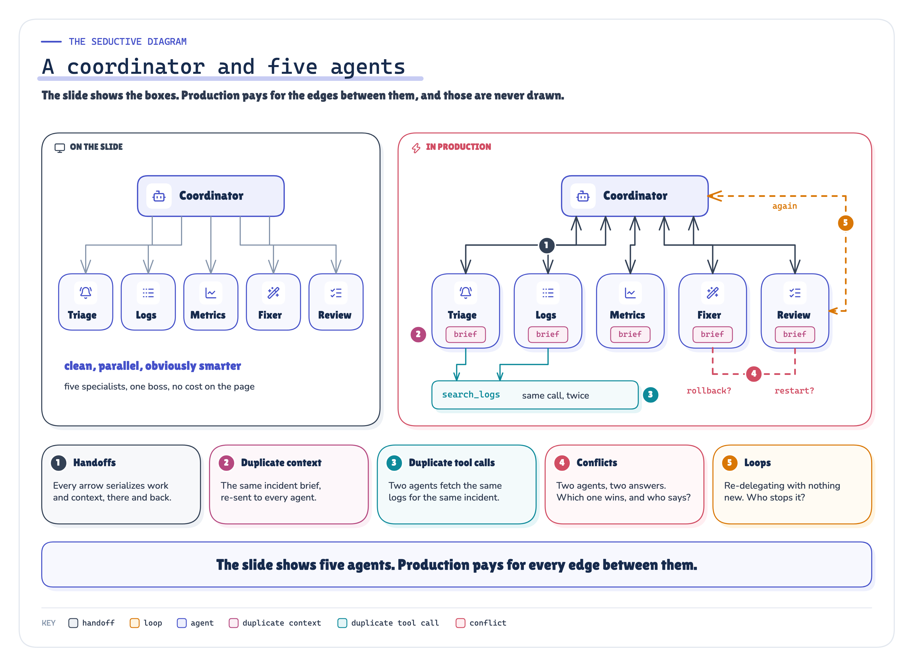

`ARCHITECTURE` *Figure 1. The usual multi-agent drawing, and what it leaves out: every arrow is a handoff, every box re-reads context, every pair can disagree, and someone has to decide when they stop.* · Concept: the usual coordinator-and-five-agents slide and the edges it leaves out (our synthesis)

I drew it for a production incident, then asked a question the drawing does not answer: **what exactly did we gain by turning five responsibilities into five autonomous reasoning components?** So I built it, built two simpler alternatives for the same job, and ran all three on the same eight incidents.

> **Make coordination deterministic. Spend intelligence where uncertainty exists.**

*This is the coordination note of the Production AI Engineering series. F2 put the agent inside a layered platform; F3 hid it behind a headless capability; T1–T6 made identity, authorization, approval and evidence explicit. This note asks what happens to all of that when one agent becomes several, and when an agent deserves an interoperability protocol (A2A).*

## The Diagram Looks Like a Team. That Is the Problem.

Specialised teams beat generalists, so specialised agents should beat one agent. That is the intuition. What the intuition skips is the organisational overhead every boundary brings: someone must decide whom to ask next, hand over the context, wait, check what comes back, and own the disagreement when two specialists see different causes. In a company that overhead is meetings. In an agent system it is model calls.

The measured version of that sentence, from the blind run behind this article:

**MEASURED IN THE POC · 72 BLIND RUNS**

- **Success:** one agent 9 of 24, a workflow with agents 16 of 24, multi-agent over A2A 12 of 24.
- **Cost:** the multi-agent system used 12× the workflow's tokens and 12.5× its latency (medians), with 849 model calls across the run against 44.
- **The A2A boundary, in this local deployment:** 19 ms per delegation on average, 0.07% of the multi-agent system's time.

## Multiple LLM Calls Are Not Multiple Agents

Before comparing anything, the word *agent* needs an engineering definition. A function returns a value; its caller decides what happens next. A workflow step with an LLM call returns a judgement; the workflow's code decides what happens next. An **agent** decides its own next step, inside a loop, with tools. An agent **behind a boundary** does that in its own process, with its own context and its own failures. An **independent** agent has its own owner, lifecycle and consumers.

So a workflow that calls a model three times is not a multi-agent system: its code decides every step. What makes a system multi-agent is that *control* is delegated too: a model decides which agent to call next, with what, and when to stop.

**An agent boundary has to be earned.** The signals that earn it: a distinct capability, independent context, independently scoped authority, independent failure and retry, a different owner or release cycle, independent consumers. None is free, and having one does not make the boundary worth its cost.

## The Capability Doesn't Change. Only What's Behind It Does.

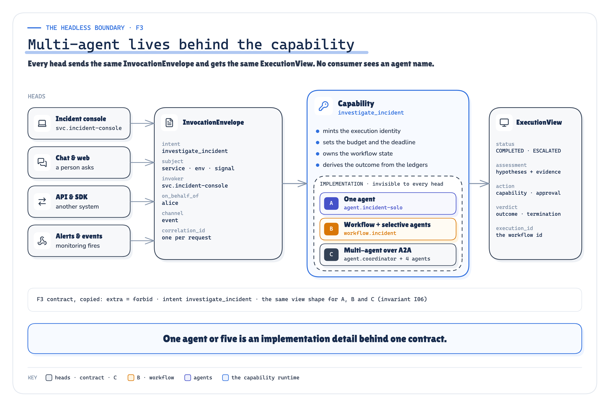

`ARCHITECTURE` *Figure 2. Multi-agent lives behind the capability boundary. The consumer sends the same envelope and receives the same view, whichever implementation runs.* · Implemented: the F3 contract (InvocationEnvelope → ExecutionView) and the capability runtime

F3 put the agent behind a headless capability: every consumer sends an `InvocationEnvelope` and receives an `ExecutionView`. I kept that contract byte for byte, and a test runs the same envelope through all three implementations and checks that the views have the same shape. No consumer ever sees `diagnosisAgent()`. Whether a capability is one agent, a workflow or five agents is an implementation decision you should be able to change without touching a single consumer.

## Three Architectures, One Incident, the Same Rules

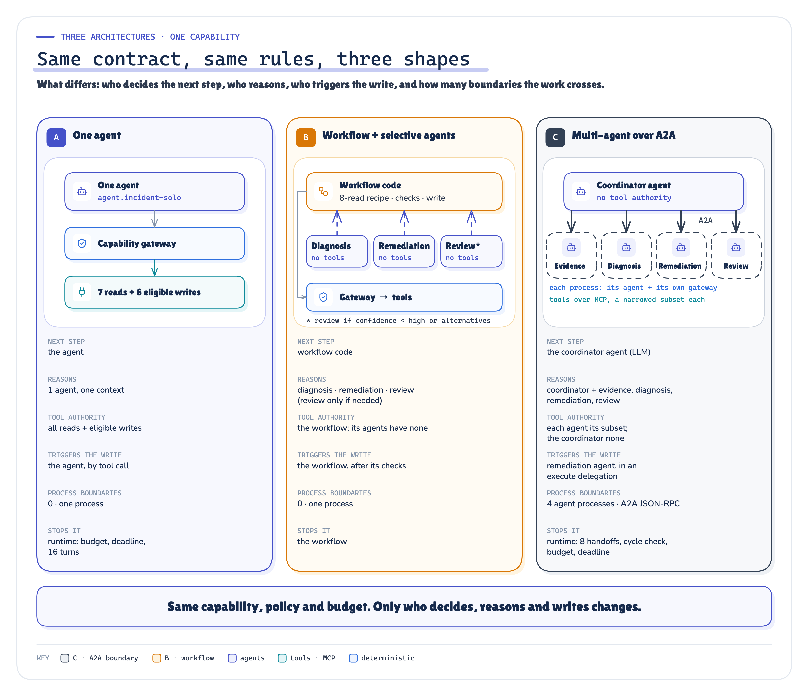

`ARCHITECTURE` *Figure 3. Same contract, same rules, three shapes: what differs is who decides the next step, who reasons, who triggers the production write, and how many boundaries the work crosses.* · Implemented: architectures A, B, C as coded; limits and tool sets from the config

- **A · One agent.** One model loop with every tool: it investigates, decides and, if it chooses to, makes the production change itself.
- **B · A deterministic workflow with agents where judgement is needed.** Code collects the same eight reads for every incident, calls a tool-less diagnosis agent (which may ask for up to four more reads), a tool-less remediation planner and, when the diagnosis is uncertain, a reviewer. Code checks the proposal, routes it through policy and approval, executes exactly one change, and decides when to stop.
- **C · A coordinator and four independent agents over A2A.** The coordinator is a model with no tool authority at all; it can only delegate and finish. Evidence, diagnosis, remediation and review each run in their own OS process behind an A2A server, with their own context, their own MCP sessions and a token narrowed to the delegation.

**Everything else was held identical:** one local model (`gpt-oss:20b`) for every component, the same thirteen MCP tools over the same simulated enterprise, one capability gateway, one policy file, one approval rule, one token budget, one deterministic evaluator.

The eight blind incidents span the easy and the hard: INC-4917 (the series' checkout regression), a memory leak, a degraded card network, a config change hidden behind a harmless release, a failure caused one service away, two plausible causes with an irreversible migration (the right answer is to escalate), a tempting "just flush all sessions" note, and an alert that had already recovered. Every label was written by hand before anything ran, reviewed by an independent agent, and frozen with the prompts, code and limits.

## What the Run Actually Showed

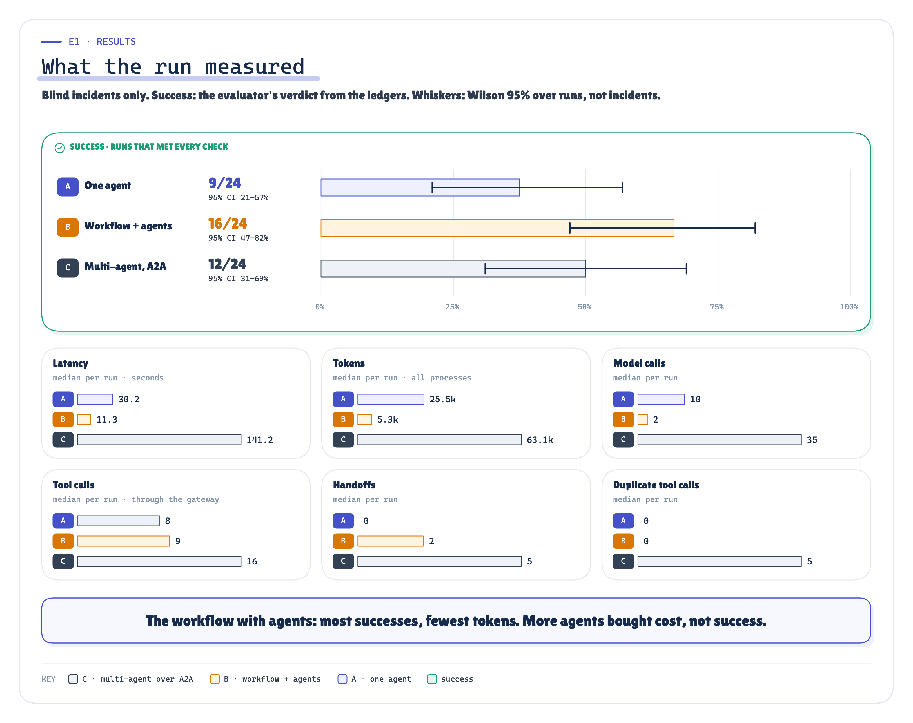

`MEASURED` *Figure 4. What the blind run measured: success out of 24 with a 95% interval, latency, tokens, tool calls, handoffs and duplicate work, per architecture.* · Measured: E1 blind runs per architecture, success with Wilson 95% intervals and per-run medians · run 2026-10-08-blind

**The workflow with agents had the most successes, at the lowest cost.** 16 of 24 runs passed every check, at a median of 11.3 s and 5,253 tokens. Its code guaranteed the baseline evidence and allowed exactly one checked change; its agents only had to be right about the cause and the fix. Its success interval overlaps the multi-agent system's; the cost gap is the large difference.

**The multi-agent system did not earn its cost where it was supposed to.** I preregistered the case for it: on the three complex incidents, independent reasoning should succeed at least two more times out of nine than the workflow. It succeeded 4 times; the workflow 6. That hypothesis failed, and so did the idea that more reasoners would follow a cause one service away: in that incident, no architecture was reliable.

**One agent was enough until the incident got hard.** On simple incidents it matched the workflow (6 of 9 against 5). On complex ones it passed 0 of 9, and the reason is the instructive part: in 7 of those 9 runs it reached the right outcome without reading the evidence that justified it. Across all its runs that happened 10 times, and it made more than one production change in 4. A single loop with every tool decides for itself how much to look before it acts.

**The coordinator brought a failure mode of its own.** 4 multi-agent runs ended because the coordinator emitted a `delegate` call whose arguments the model server could not parse (prose or markdown where JSON belonged): 4 of its 206 calls, against 1 of the specialists' 643 and none of the one agent's 245. Not a protocol problem: a new role, with a new way to fail.

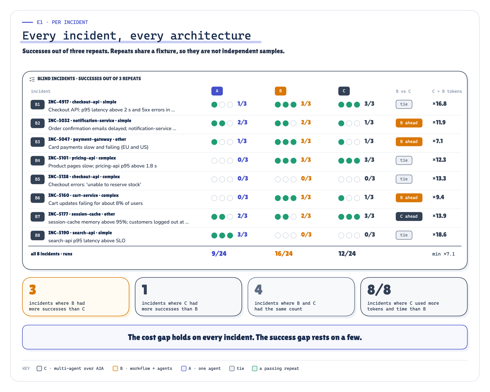

`MEASURED` *Figure 5. Every blind incident, every architecture: successes out of three repeats. The cost gap holds on every incident; the success gap comes from a few.* · Measured: E1 per blind incident, successes out of three repeats per architecture and C's median tokens over B's; incident-level comparisons added after publication (descriptive, not preregistered) · run 2026-10-08-blind

**Read the success counts incident by incident, too.** The intervals treat each of the 24 runs as an independent sample. They are not: the three repeats of an incident share the same fixture and differ only in the seed, so the honest sample is closer to eight incidents than 24 runs, and the real uncertainty about *new* incidents is wider than the intervals show. Incident by incident, the workflow had more successes than the multi-agent system on 3 of 8, fewer on 1, and tied on 4. That is a thin margin, and I treat it as one. The cost gap is not thin: the multi-agent system used more tokens than the workflow on 8 of 8 incidents and more time on 8, never less than 7.1× its tokens.

**Nine preregistered hypotheses, scored as written before the run:**

- H1 · on simple incidents the multi-agent system costs more than the workflow without more successes: **SUPPORTED**
- H2 · on complex incidents it succeeds at least two more times out of nine: **NOT SUPPORTED**
- H3 · on simple incidents one agent succeeds about as often as the workflow: **SUPPORTED**
- H4 · the multi-agent system duplicates more work than the other two: **SUPPORTED**
- H5 · the workflow's overall success is at least the other two's: **SUPPORTED**
- H6 · workflow-owned idempotency survives an agent crash; without it the write runs twice: **SUPPORTED**
- H7 · the A2A task does not survive its agent's process (with the SDK's in-memory task store used here); the workflow does: **SUPPORTED**
- H8 · the A2A boundary costs under 5% of a live delegation: **SUPPORTED**
- H9 · without an owner of termination, at least one run fails to stop: **NOT SUPPORTED**

## The Coordination Tax Dominated. The A2A Boundary Was Cheap Here.

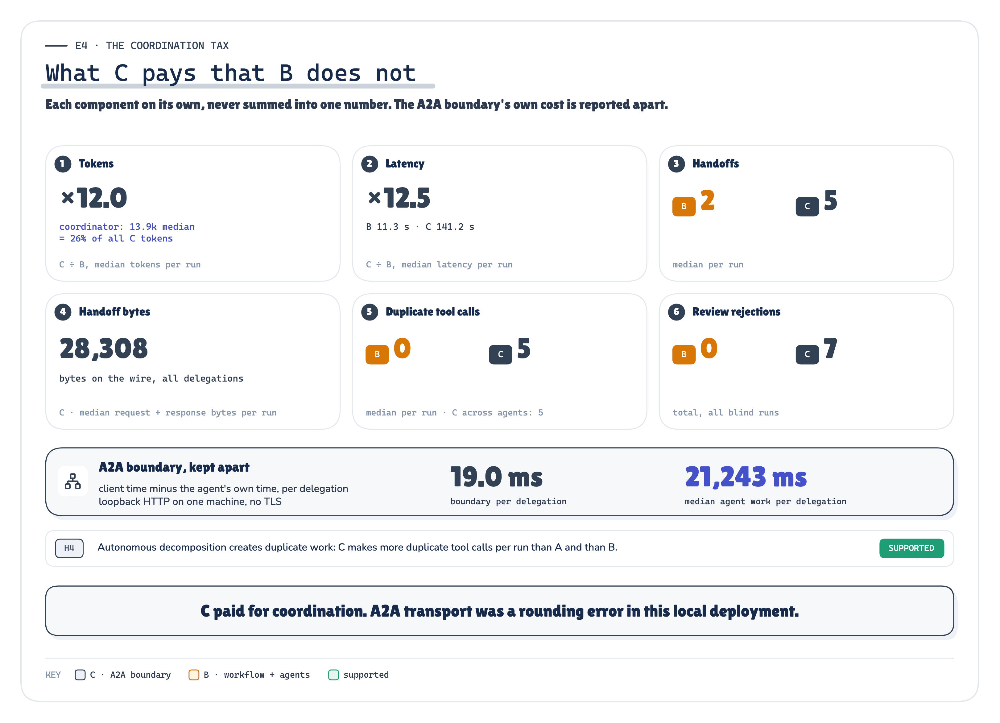

`MEASURED` *Figure 6. Where the multi-agent system's extra cost went: coordinator reasoning, re-read context, duplicate tool calls and review rounds. In this local deployment, A2A transport was a rounding error next to them.* · Measured: E4 coordination components of C against B, never summed; the A2A boundary apart · run 2026-10-08-blind

Almost none of the observed latency difference came from A2A transport in this local deployment. The boundary averaged 19 ms per delegation, 0.07% of the multi-agent system's time. When I ran the same agent code as a function call and then across an A2A boundary with the reasoning held constant, the boundary added 5.4 ms per call. Those are loopback numbers: every agent process on one laptop, no network, no TLS. A remote agent across a real network will cost more per hop, so measure it in your own deployment; what this run shows is that, here, A2A transport was not where the multi-agent system's cost came from.

The cost went to coordination. The coordinator alone spent 26% of all the multi-agent system's tokens deciding whom to ask next. Each specialist rebuilt context the previous one already had: a median of 5 reads per incident repeated work another agent had just done. Part of that is by design. I told the diagnosis and review agents to verify in their own context before trusting the last one, which is what independent review means, and verification costs reads. Review rejected 7 proposals and sent work back around.

> **Every autonomous boundary must earn its coordination cost.**

## I Killed an Agent in the Middle of a Task

The tax is visible on a good day. Distributed systems are judged on a bad one. So I ran INC-4917 through the multi-agent system again and SIGKILLed one agent's process at the worst moments: the diagnosis agent mid-reasoning, and the remediation agent right after its rollback executed but before it reported back.

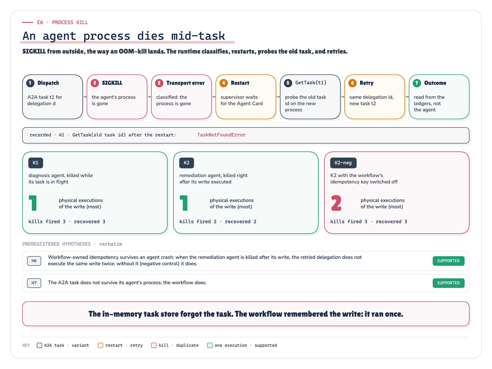

`RECORDED` `MEASURED` *Figure 7. One agent process dies mid-task. Its in-memory A2A task record dies with it; the workflow does not.* · Implemented + recorded: the recovery path (coord/arch_c.py) and E6 K1, K2, K2-neg counted from the ledgers · run 2026-10-08-e6

The coordinator's runtime saw a broken stream, restarted the agent and retried the same delegation. The restarted agent had no record of the old task (`GetTask` on its id: TaskNotFoundError). The A2A task in this implementation did not survive the agent process because the POC used the SDK's in-memory `TaskStore`; a durable store would have kept the record. The workflow store still knew which delegation was in flight, what it was for, and that the rollback had already happened. The restarted remediation agent did what a fresh agent does: it rolled back again. Physical rollbacks in the system of record: **1** when the workflow owned the idempotency key, **2** when I switched it off.

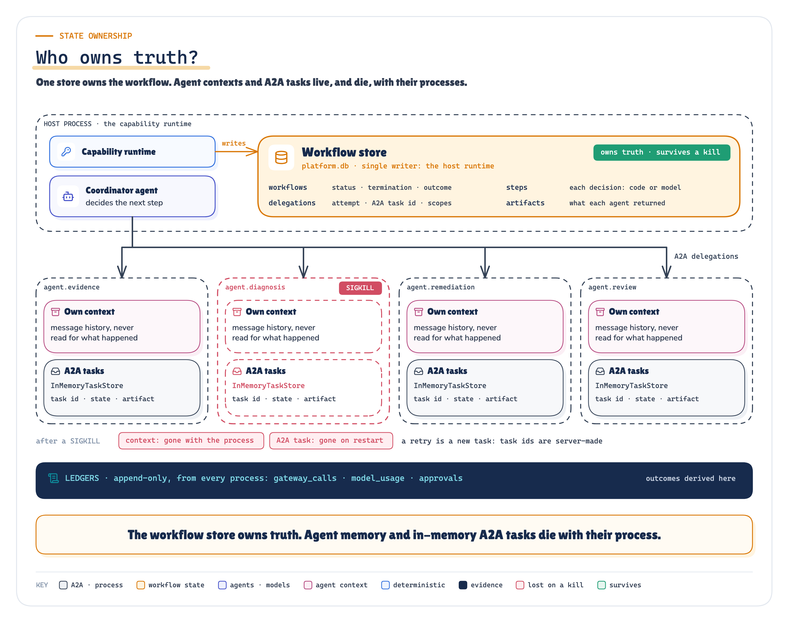

`ARCHITECTURE` *Figure 8. Three kinds of state, three owners. Only one of them is workflow truth.* · Implemented: the workflow store (single writer), each agent's own context and in-memory A2A task store; the recorded GetTask result (TaskNotFoundError after a restart) is drawn in the process-kill figure

A2A defines the task lifecycle, but does not guarantee application-level crash durability for you: its specification says nothing normative about durable tasks, crash resumption or application-level idempotency, which in practice leaves them to the implementation [1]. That is the right scope for a protocol. And even a durable A2A task should not automatically become the source of truth for your business workflow. A task records one delegation; it does not know what else was decided, approved, executed or spent, or when the whole job should stop. The thing that owns your workflow cannot be an agent's context, and should not be the protocol's task store.

> **Agent memory is not workflow truth.**

## Autonomy Can Be Distributed. Accountability Cannot.

Who decides when a multi-agent system stops? In C1 the coordinator decides to finish, and the runtime owns the ceiling: a hop limit, a cycle check, a token budget and a deadline. I preregistered that removing the hop limit and the cycle check (and tripling the budget) would let at least one of eight runs fail to stop on its own. It did not happen: all 8 coordinators finished by themselves, so that hypothesis failed too, though the most persistent made 10 handoffs, more than the limit allows. The limits are insurance against the run you have not seen yet, and eight runs did not contain one.

That is the point of owning termination rather than hoping for it. State, deadline, retry, budget, permissions, termination and the final outcome each need exactly one owner, and in a multi-agent system none of them can be "the agents, collectively".

## A2A Is for When the Agent Becomes an Integration Boundary

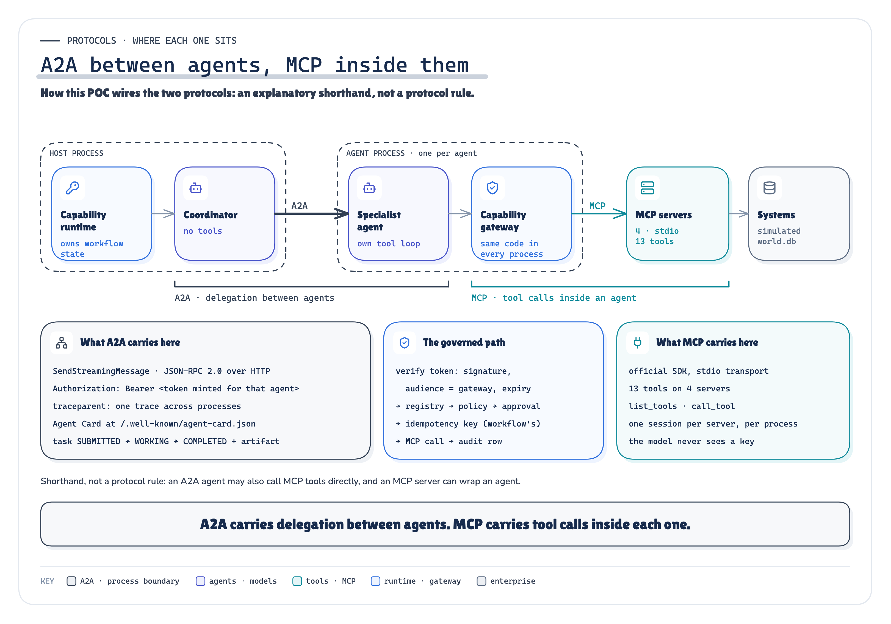

`ARCHITECTURE` *Figure 9. A2A carries delegated work between agents; MCP carries tool calls inside each agent. Both pass through the same capability gateway.* · Implemented: how this POC wires A2A (between processes) and MCP (inside each); an explanatory shorthand, not a protocol rule

A2A gave this experiment real things: agent discovery by Agent Card, a task lifecycle visible on the wire (`SUBMITTED → WORKING → COMPLETED` on 119 of 120 delegations), authentication on every delegation (I left the task-status and cancel calls unauthenticated, short of what the specification requires), and failures that arrive as classified transport errors instead of stack traces in someone else's process [1]. It is not a competitor to MCP; the project's own shorthand is "MCP inside agents, A2A between agents" [4], and in C1 that layering is literal: every agent's tool calls go through the same gateway, policy and audit as everything else.

A2A cannot tell you *whether* you need another agent, and it does not carry delegated authority for you: the specification leaves authorization to each agent [1]. C1 carried the series' own narrowing tokens across the boundary. The coordinator holds no tool authority; a proposal is delegated with read scopes; an authorized execution gets the one write scope of the proposal it is handed. The blind run found a fail-open fallback: when the coordinator authorized execution without handing over a proposal, my runtime granted every eligible write scope (1 of 16 execute delegations). Policy and approval still applied, and the rollback that run executed was the right one, but the token was wider than the design allowed. The post-run correction changed it to fail closed: an execution without a proposal is now refused before any token is minted, and a regression test holds it there. The numbers in this article come from the code as it ran; under the fix, that run (one of the multi-agent system's successes) would have been refused at that step, and what the coordinator would have done next was not measured.

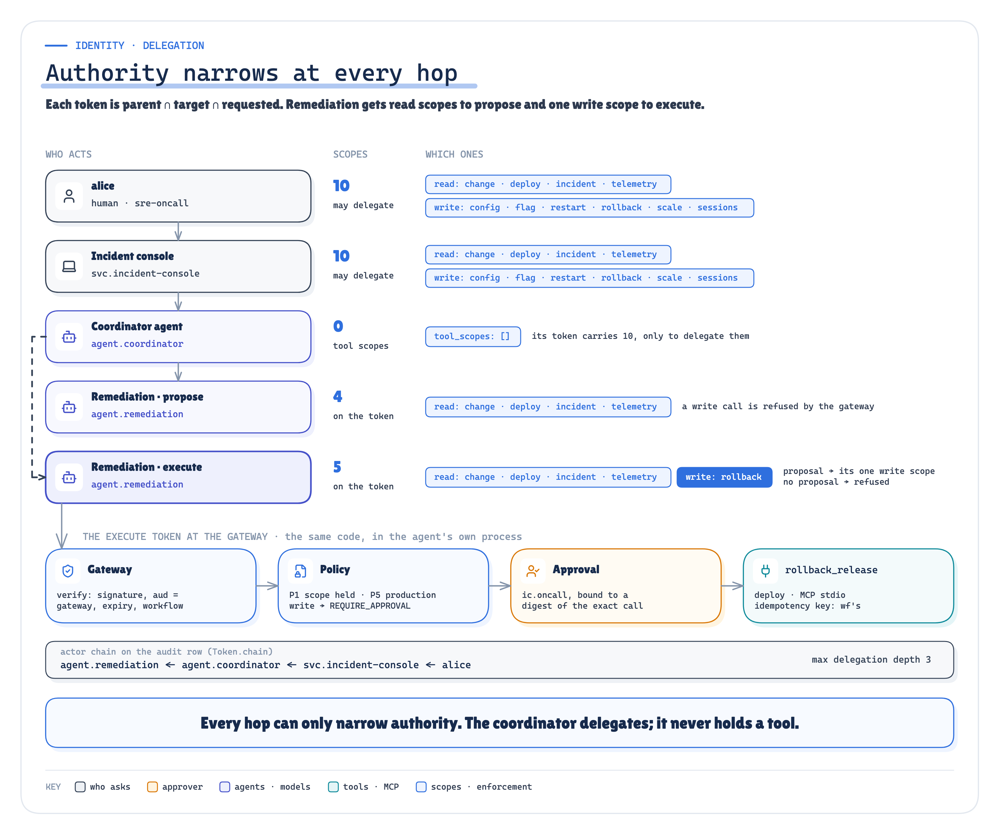

`ARCHITECTURE` *Figure 10. Authority narrows at every hop: the coordinator delegates, it never holds a tool.* · Implemented: the token chain alice → console → coordinator → remediation (propose / execute) → gateway → policy → approval, scopes computed from the config; the same actor chain is recorded on every gateway audit row of the run

If your two "agents" are two objects in one service, owned by one team and released together, a function call gives you the same reasoning at a fraction of the operational surface. A2A earns its place when the agent is a product of its own: another team's diagnosis service, a vendor's fraud agent, a capability other systems call, something with its own release and its own on-call.

> **A2A becomes useful when the agent itself becomes an integration boundary.**

## Do You Need Another Agent?

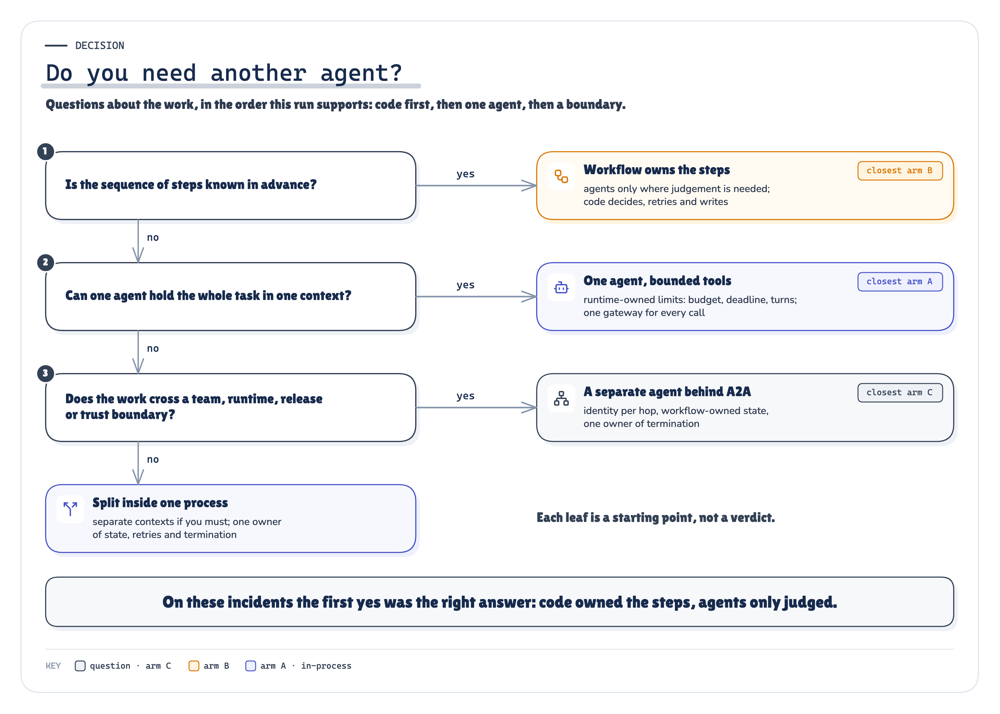

`ARCHITECTURE` *Figure 11. The decision the run supports: start with code, add one agent for uncertainty, add agents only when a boundary is justified, add A2A only when that boundary is an integration boundary.* · Reasoned from the recorded runs: the question path and the leaf this workload supported (E1-E8)

- **Can deterministic code do the step?** Then code does it: sequencing, evidence collection, checks, retries, termination.
- **Is there real uncertainty?** Put one agent there, with structured output and no more authority than the step needs.
- **Does the problem decompose into genuinely independent reasoning** (parallel, breadth-first work, separate contexts that would not fit one window, separate owners or authority)? Then several agents may earn their cost. Published cases where they do look like that [13]; these eight incidents did not.
- **Is that agent an integration boundary**, discoverable and owned on its own? Then A2A.

## What This POC Does Not Prove

- One local model (`gpt-oss:20b`), eight incidents, three repeats: 24 runs per architecture. Intervals are wide, and they are computed over runs: the three repeats of an incident share its fixture, so they are not independent incident samples, and the uncertainty about new incidents is wider still. The cost differences hold on every incident; the success differences are smaller, rest on a few incidents, and the workflow's and the multi-agent system's intervals overlap.
- A supervisor topology, not every multi-agent design. A peer mesh or a stronger coordinator might do better, or worse.
- The incidents are bounded and sequential, and their context fit one window comfortably. Breadth-first, parallelisable work is the regime multi-agent systems are built for, and it is not tested here.
- Latency is comparative, on one laptop, serially, and the A2A boundary ran over loopback without TLS: its measured cost is a floor, not a production figure. The enterprise systems, the token service and the approver are simulated; the model calls, MCP servers, A2A processes, process kills and traces are real.

## Start With One Capability, Not Many Agents

Keep coordination deterministic wherever you can. Introduce an agent where uncertainty needs reasoning. Split into several agents only when independent reasoning, context, authority, ownership or lifecycle justifies a separate boundary, and introduce A2A when that boundary becomes an interoperability boundary.

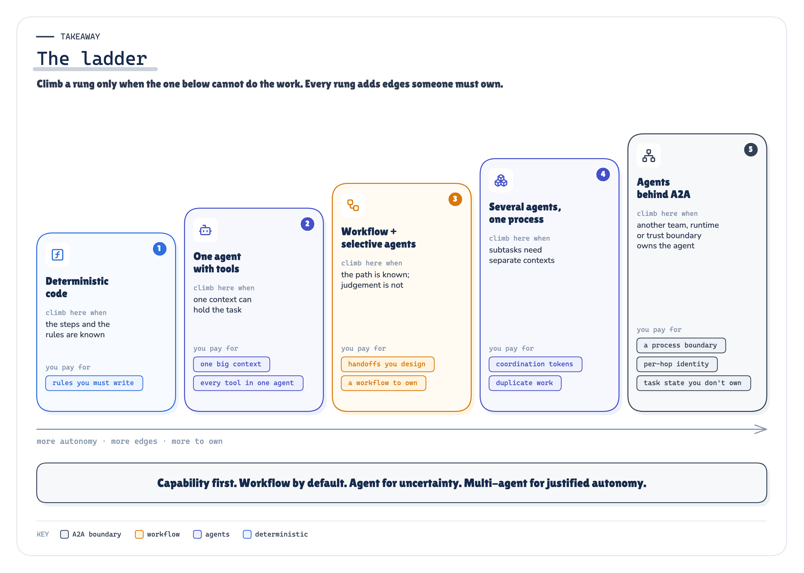

`ARCHITECTURE` *Figure 12. Capability first. Workflow by default. Agent for uncertainty. Multi-agent for justified autonomy. A2A for interoperability.* · Reasoned from the recorded runs: the ladder, each rung's cost as measured in E1, E4 and E7

[Run the evidence: the POC, every recorded run and the replay](https://github.com/ereshzealous/ai_blogs_poc/tree/main/multi_agent_a2a_poc) · [Read the methodology: the technical edition](https://github.com/ereshzealous/ai_blogs_poc/blob/main/multi_agent_a2a_poc/technical/multi-agent-a2a-technical.pdf)

*Next question: what does any of this cost at production volume, when the incidents arrive at once and the model has a queue?*

## Sources

Every source is listed in `research/sources.md` with what it supports in this article and what it does *not* support.

**[1]** A2A Protocol Specification v1.0.1 (text: github.com/a2aproject/A2A/blob/v1.0.1/docs/specification.md, commit 3303592). [a2a-protocol.org/v1.0.1/specification/](https://a2a-protocol.org/v1.0.1/specification/)

**[2]** `specification/a2a.proto` at tag v1.0.1 (normative per spec §1.4). [github.com/a2aproject/A2A/blob/v1.0.1/specification/a2a.proto](https://github.com/a2aproject/A2A/blob/v1.0.1/specification/a2a.proto)

**[3]** "A2A and MCP". [a2a-protocol.org/latest/topics/a2a-and-mcp/](https://a2a-protocol.org/latest/topics/a2a-and-mcp/)

**[4]** "Announcing A2A 1.0". [github.com/a2aproject/A2A/blob/main/docs/blog/posts/announcing-1.0.md](https://github.com/a2aproject/A2A/blob/main/docs/blog/posts/announcing-1.0.md)

**[5]** a2a-python 1.2.2. [pypi.org/project/a2a-sdk/1.2.2/](https://pypi.org/project/a2a-sdk/1.2.2/) · [github.com/a2aproject/a2a-python](https://github.com/a2aproject/a2a-python)

**[6]** Linux Foundation press release, 2025-06-23. [www.linuxfoundation.org/press/linux-foundation-launches-the-agent2agent-protocol-project-t](https://www.linuxfoundation.org/press/linux-foundation-launches-the-agent2agent-protocol-project-to-enable-secure-intelligent-communication-between-ai-agents)

**[7]** "A2A joins AAIF" (2026-08-27). [github.com/a2aproject/A2A/blob/main/docs/blog/posts/a2a-joins-aaif.md](https://github.com/a2aproject/A2A/blob/main/docs/blog/posts/a2a-joins-aaif.md)

**[8]** Model Context Protocol specification; Python SDK `mcp==2.2.0`. [modelcontextprotocol.io/specification/latest](https://modelcontextprotocol.io/specification/latest)

**[9]** OAuth 2.0 Token Exchange, RFC 8693. [www.rfc-editor.org/rfc/rfc8693](https://www.rfc-editor.org/rfc/rfc8693)

**[10]** W3C Trace Context. [www.w3.org/TR/trace-context/](https://www.w3.org/TR/trace-context/)

**[11]** OpenTelemetry GenAI semantic conventions. [opentelemetry.io/docs/specs/semconv/gen-ai/](https://opentelemetry.io/docs/specs/semconv/gen-ai/)

**[12]** Anthropic, "Building effective agents", 2024-12-19. [www.anthropic.com/engineering/building-effective-agents](https://www.anthropic.com/engineering/building-effective-agents)

**[13]** Anthropic, "How we built our multi-agent research system", 2025-06-13. [www.anthropic.com/engineering/multi-agent-research-system](https://www.anthropic.com/engineering/multi-agent-research-system)

**[14]** Walden Yan (Cognition), "Don't Build Multi-Agents", 2025-06-12. [cognition.com/blog/dont-build-multi-agents](https://cognition.com/blog/dont-build-multi-agents)

**[15]** M. Cemri et al., "Why Do Multi-Agent LLM Systems Fail?", arXiv:2503.13657 (first submitted 2025-03-17). [arxiv.org/abs/2503.13657](https://arxiv.org/abs/2503.13657)

## Explore next

Every note stands on its own. Pick the problem you have:

- *My agent sees hundreds of overlapping tools* → F1 MCP Tool Sprawl
- *My agent loop has quietly become my platform* → F2 Layered Agent Platform
- *My agent is trapped inside one chat window* → F3 Headless AI
- *I don't trust what my agent remembers* → S1 Memory, Context & State
- *My agent retrieves the wrong evidence, or too much of it* → S2 Enterprise Knowledge & RAG
- *I can't tell whether a change broke my agent* → R1 Evals & Observability
- *My agent fails in ways I can't predict or recover from* → R2 Agent Reliability
- *My agent needs to act on someone's behalf* → T1 Agent Identity
- *I can't say what my agent is allowed to do* → T2 Authorization & Policy
- *My agent asks "should I continue?" and someone types yes* → T3 Human-in-the-Loop
- *Every governance change means redeploying my agents* → T4 AI Control Plane
- *I can't explain what my agent did in production* → T5 Observability & Governance
- *I'm worried about prompt injection and hostile tools* → T6 Agent & MCP Security
- *My agent is too slow or too expensive at volume, and every change is a risk* → O1 Operating Agents at Scale
- *I don't know how to ship a prompt or model change safely* → O2 Agent Lifecycle
- *I need the whole production platform, not one boundary* → P1 Production Agentic AI Platform

The full learning map: [Production AI Engineering, Start Here](https://eresh-gorantla.medium.com/start-here-a-hands-on-map-of-production-ai-engineering-5056549657db).

---

**Next in Production AI Engineering:** O1+O2 · Operating at Scale

**Previously:** R1+R2 · Evals & Reliability

**New to the series?** Start with the map of all fifteen chapters:

https://eresh-gorantla.medium.com/start-here-a-hands-on-map-of-production-ai-engineering-5056549657db

**Go deeper:** [Technical deep dive](https://github.com/ereshzealous/ai_blogs_poc/blob/main/multi_agent_a2a_poc/technical/multi-agent-a2a-technical.pdf) · [Results](https://github.com/ereshzealous/ai_blogs_poc/blob/main/multi_agent_a2a_poc/results/c1-results.md) · [Proof of concept on GitHub](https://github.com/ereshzealous/ai_blogs_poc/tree/main/multi_agent_a2a_poc)

*Every measured number is substituted from `coordination_poc/runs/2026-10-08-blind/facts.json`.*
