# Operating AI Agents at Scale — Cost, Latency, Scale & Lifecycle

*Your agent survived Black Friday. Then someone changed the prompt. Why production agent operations need two control loops, one for demand and one for change.*

**Production AI Engineering · O1+O2 · Scale & Operations**

*Chapter 14 of 15. New here? Start with [Start Here: What It Takes to Run AI Agents in Production](https://eresh-gorantla.medium.com/start-here-a-hands-on-map-of-production-ai-engineering-5056549657db).*

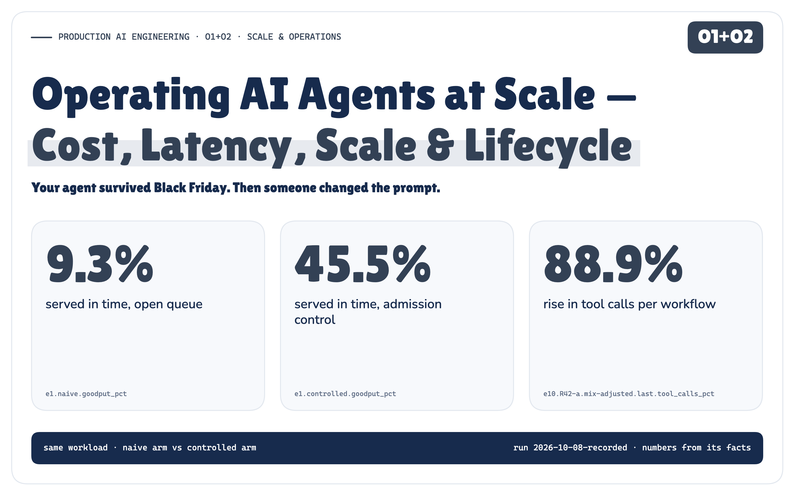

**The agent worked.**

Then people started using it. Requests turned into workflows. Each workflow made model calls, and the model calls
burned tokens, which cost money. The tool calls landed on systems that had never seen this much traffic. The queues
grew, and latency grew with them.

We added controls and the platform held. The following Monday someone changed one sentence in a tool description.
There was no deploy and no code change, and the agent's behaviour changed anyway.

> **At production scale, cost and latency become architectural constraints, and every agent change becomes an operational event.**

*This is the operations chapter of the Production AI Engineering series. The earlier notes built the platform (F1–F3),
separated what an agent knows (S1), decided whose authority it acts on and what happens when its inputs are hostile
(T1–T6), and taught it to observe and recover (R1 + R2). The capstone (P1) assembled all of it and left scale and
operational maturity as future work. This is that work, on P1's architecture, unchanged.*

## One Request Is Not One Unit of Work

Black Friday at Northwind Goods, the series' fictional store. One shared agent platform serves several internal
tenants. **Support** answers customers: where is my order, can I get it by Friday, I was charged twice. **Finance**
reconciles payments in batches. Support traffic surges to several times a normal day, and in the same hour Finance
starts a reconciliation run of thousands of checks on the same platform.

The first thing I looked at in the simulator was what a single request turns into.

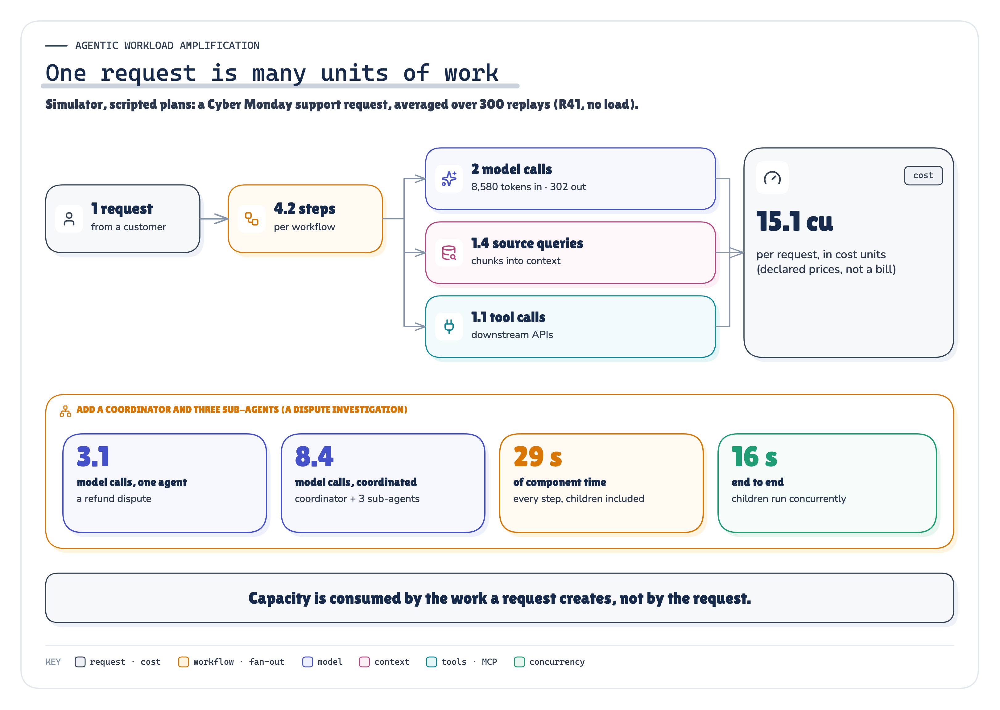

`MEASURED` *Figure 1. A request is a workflow, and a workflow is many units of work. Add a coordinator and sub-agents and it multiplies again.* · Measured: 300 Cyber Monday requests replayed under R41 (E8) and the coordinators of E4 · run 2026-10-08-recorded

In the simulator's scripted plans, an ordinary support request made 2 model calls carrying
8,580 input tokens, 1.4 retrieval queries and 1.1 tool calls. A
dispute investigation run by a coordinator and three sub-agents made 8.4 model calls, against
3.1 for the same job done by one agent. Those shapes are mine. Anthropic has reported the real-world
direction for its own research product, where multi-agent systems “use about 15× more tokens than chats”
[45]. That is one product's data, not a law.

**Scaling an agent is not scaling an HTTP service.** Request rate alone doesn't describe the load. Load is external
demand times the work each request creates, and the agent decides the second factor at run time.


`ARCHITECTURE` *Figure 2. Every layer of the platform has its own capacity, and each one owns a different control. Autoscaling one of them raises none of the others.* · Architecture: the capstone's layers (P1) with the control each owns; scenario tags point to the experiments

That load lands on all eight layers of the capstone's architecture, and each has its own limit. Autoscaling the
runtime adds pods, not provider quota, payment-processor connections or fairness between tenants. In a dependency
outage, an autoscaler “will scale up the jobs, causing more and more traffic to get stuck” [3].

**Measured in the POC.** I built a deterministic simulator of this platform and ran ten scenarios, each with a naive and
a controlled arm on the same workload. Under the Black Friday surge, an open queue served 9.3 % of
customers in time and admission control served 45.5 %. On Cyber Monday, a release that changed
one tool description kept its error rate exactly where it was. The canary rolled it back anyway, because tool calls per
workflow had risen 88.9 %.

## A Queue Is Not Capacity

The instinct under load is to accept everything and let the queue absorb it. That works until the queue grows faster
than it drains. Then work waits longer than its client will wait, the client times out and retries, and the retry is
more work.

```text
accept everything → unbounded queue → queue delay explodes → clients time out → clients retry → more load ↺
```

With an open queue, the simulator's customers sent 2.8 attempts per request, and
97.4 % of the money went to work that finished after its customer had given up. Plenty of work
completed. **Goodput**, the work “handled without errors and with low enough latency for the client to make use of the
response” [4], did not.

**Admission comes before execution.** The controlled arm bounds the work in the system and, above the bound, returns an
explicit capacity error with a `Retry-After`. It refused 53.2 % of requests. That is the cost,
and it is the right one: the platform couldn't serve them in time either way, so it told them early.

## The Noisy Neighbour Is Your Own Finance Team

A global limit protects the platform from overload. It doesn't protect one tenant from another.

When Finance dropped 3,000 checks into one shared first-come-first-served queue, support customers
waited behind them. Only 3.6 % were served in time, while every global dashboard looked busy
and healthy. With weighted fair scheduling and a finance bulkhead, support was served in time
100 % of the time. All 3,000 finance items still
completed; the batch took 2.2 times as long, inside its deadline.

**The orchestrator owns this.** Behind the request boundary, which resolves the tenant and enforces its rate limit,
orchestration owns admission against capacity, bounded concurrency and queues, per-tenant caps, priority, deadlines and
cancellation. When I removed the concurrency bound, running workflows peaked at 1,227, everything
slowed down together, and goodput fell to 44.2 %. With bounded concurrency and deadline-aware queues
it was 84.4 %. Work that could no longer finish in time was dropped at dequeue, not run late. The
control plane (T4) defines these limits, and the platform enforces them on every request.

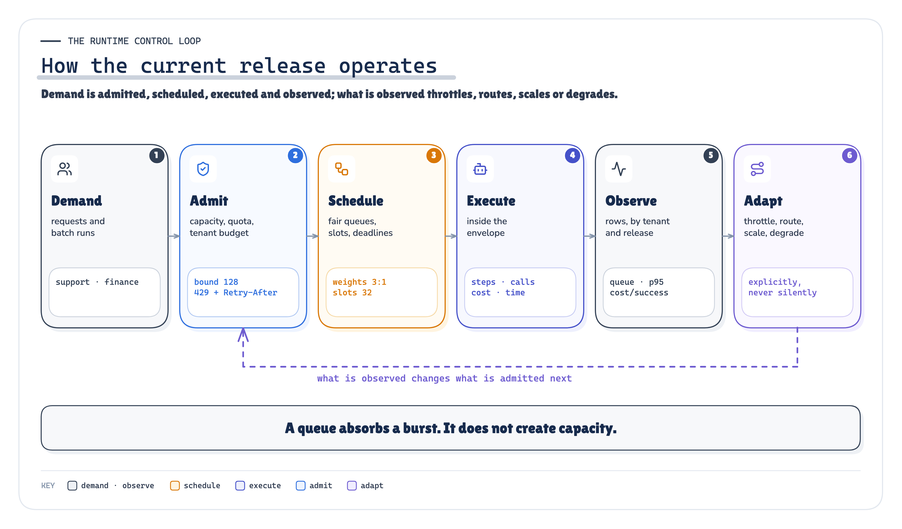

`ARCHITECTURE` *Figure 3. The runtime control loop: admit, schedule, execute inside the envelope, observe, then throttle, route, scale or degrade the next admission.* · Architecture: our synthesis; the stage values are the POC's declared configuration

## Unlimited Reasoning Is Not an Architecture

An agent decides at run time how many steps a request takes. That is what makes it an agent, and it is also how one
refund dispute turns into hundreds of tool calls.

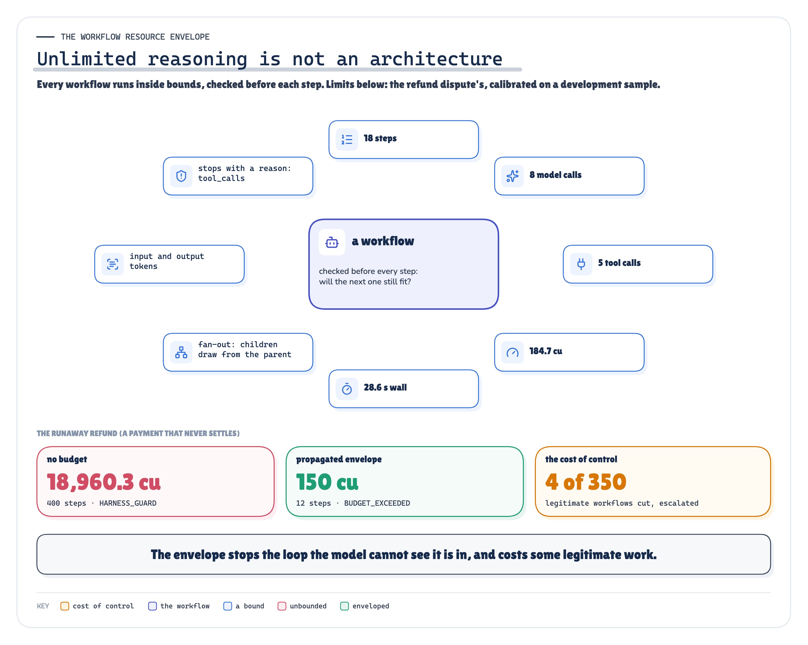

`ARCHITECTURE` `MEASURED` *Figure 4. Every workflow runs inside an envelope checked before each step. Without one, a stuck loop runs until something else stops it.* · Architecture + measured: the refund dispute's calibrated envelope and the runaway outcomes (E4) · run 2026-10-08-recorded

I gave one refund a payment that never settles. The agent re-checks it, re-assesses, re-checks. Without a budget it
ran until the simulator's own guard stopped it, at 18,960.3 cost units. With a **workflow resource
envelope** (steps, model calls, tool calls, tokens, cost, wall time and fan-out), checked before every step, it stopped
at 150 cost units, with `BUDGET_EXCEEDED` and a reason.

**Five limits, five owners.** A *tenant budget* protects other tenants and the business. A *workflow envelope* protects
the platform from one runaway. A *request budget* is the caller's own expectation. A *provider quota* is a limit imposed
from outside: you operate within it, never treat it as elastic capacity. A *downstream quota* protects the system of record. The control plane defines
the first three, and the runtime enforces them before each step. The last two are someone else's limits, and you can
only respect them.

**Budgets must follow the children.** With a coordinator and three sub-agents, per-agent budgets bounded each agent but
not the request: 11 model calls against an envelope of
10. With the children drawing from the parent's envelope, the request stayed
at 9. Multi-agent decomposition can multiply aggregate work, tokens, cost and downstream
pressure; wall-clock latency depends on the critical path and on how much runs in parallel. Either way, the envelope
and the telemetry have to propagate down the tree. C1 measured where a multi-agent system's extra work went in
its run: coordination, re-read context and review rounds, not the A2A transport.

## The Cheapest Model Is Not Always an Eligible One

Most cost advice starts with “use a smaller model”. The rule I'd defend is narrower: **use the least expensive
execution path that still satisfies the required quality and safety contract.** Routing between strong and weak models
is a real cost and quality trade-off [24]. The question is what you're allowed to trade.

In the simulator the contract is explicit. Each task has a minimum capability tier, and payment data may only go to the
EU private deployments. The success rates are declared assumptions; in production they come from your evals, so this
says nothing about any real model. Within the contract, routing cost 59.9 % less per successful
workflow than sending everything to the large models, with no violation.

**Optimising cost alone found two ways out.** Sending everything to the small models was cheapest per request. Under my
declared table it was even cheapest per success, and it ran 516 model calls on models
not eligible for the task. When the EU deployment was throttled, a fallback allowed to pick *any* capable model sent
payment data to a global model 18 times. It had the best availability of all
four arms. Policy-aware fallback stayed inside the eligible set and **deferred explicitly** instead
(7 times).

**When the provider throttles, retry less, not more.** Honour the 429's retry-after, and “disable SDK retries or
account for them in those limits so nested retry loops don’t multiply requests” [18]. In an agent,
the SDK, the framework and the model's own re-plan are three nested retry loops unless the model gateway owns retries.

**Measure cost per successful outcome, not cost per token.** A cheap call that fails, retries or ends with a person
isn't cheap. Even so, the simulation's validator catches every wrong answer and real ones don't, and a wrong refund that
reaches a customer costs far more than its tokens. That is why the contract decides which cheap models you may
consider in the first place, and why **degradation stays inside it**. Use a smaller *eligible* model, trim optional
enrichment, defer non-critical work, shed the lowest priority. Never skip an approval because the approver queue is
long, or fall back to a model that isn't allowed the data.

## Context and Tools Have Their Own Limits

**Context isn't free because it's already stored.** Every chunk is retrieval work, index load, and input tokens on every
call that carries it, and past a point it makes answers worse: context is “a finite resource with diminishing marginal
returns” [46]. Bounded retrieval cut context by 82.8 % and kept all
15 evidence ids the fixture declared the answers need.

**Cache with a scope, or don't cache.** “Where is my order?” is the same text for every customer and a different answer
for each. A cache keyed by query text served 5 personal answers to the wrong
customer and 5 stale ones after a knowledge update. A key carrying tenant, principal scope,
knowledge version and policy version served neither, and still hit on shared questions.

**Tool systems have their own limits, often far below the runtime's.** The payment processor's status API serves 8
concurrent calls; the runtime has 64 slots. Calling it directly and retrying every refusal, the agents
drew 237 503s at 2.8 attempts per logical call.

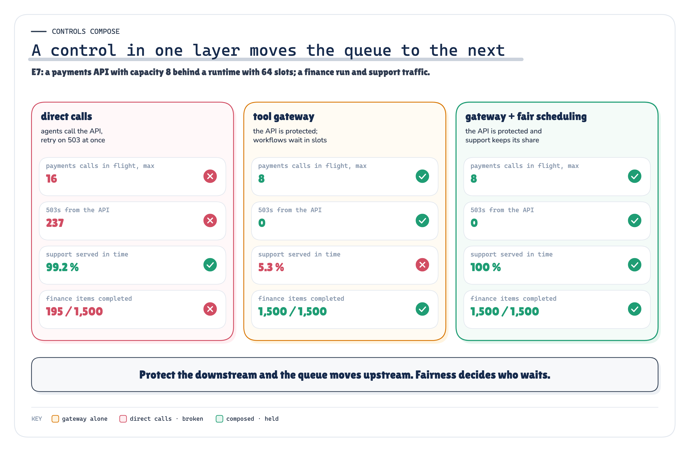

`MEASURED` *Figure 5. Protect the downstream and the queue moves upstream. Fairness decides who waits.* · Measured: E7's three arms, from the payments API's counters and the requests · run 2026-10-08-recorded

**A tool gateway fixed the API and broke support.** With per-tool concurrency, a rate limit, a bounded wait and a circuit
breaker, the API returned 0 503s, and support was served in time
5.3 % of the time: finance workflows waiting at the gateway held every runtime slot. I
found that in a development run and added a third arm before freezing. Composed with fair scheduling, the API stayed
protected and support was served 100 % of the time. No single control is sufficient on its own.

## Cost and Latency Have to Be Taken Apart

A workflow pays for inference, retrieval, tools, orchestration, state, observability and the people who handle what the
agent couldn't. Total spend tells you little; **attributed** spend tells you where to act: cost by tenant, capability,
model, tool and **release**.

Latency needs the same treatment. End-to-end latency is queue delay plus orchestration plus the critical path, not the
sum of every step: the coordinated investigation spent 29 s in its components and took
16 s end to end. Under the surge, 70.6 % of a successful request's time was spent
queued, not in the model, and “a simple average can obscure these tail latencies” [14].

The dimensions matter as much as the metrics. Global throughput looked healthy while support customers were being
failed; only a cut by tenant showed it. The canary's error rate looked healthy while tool calls climbed; only a cut by
release showed it.

## Then Someone Changed the Prompt

Strictly, they changed a tool description, not the prompt. Both are configuration that shapes behaviour: tool
definitions deserve “just as much prompt engineering attention as your overall prompts” [44]. The current version runs safely
under load now. It just doesn't stay current for long, and most of what changes an agent's behaviour isn't code: the
prompt, the model, the routing table, tool descriptions and schemas, retrieval settings, the knowledge index, memory,
policies, operational configuration, the eval suite.

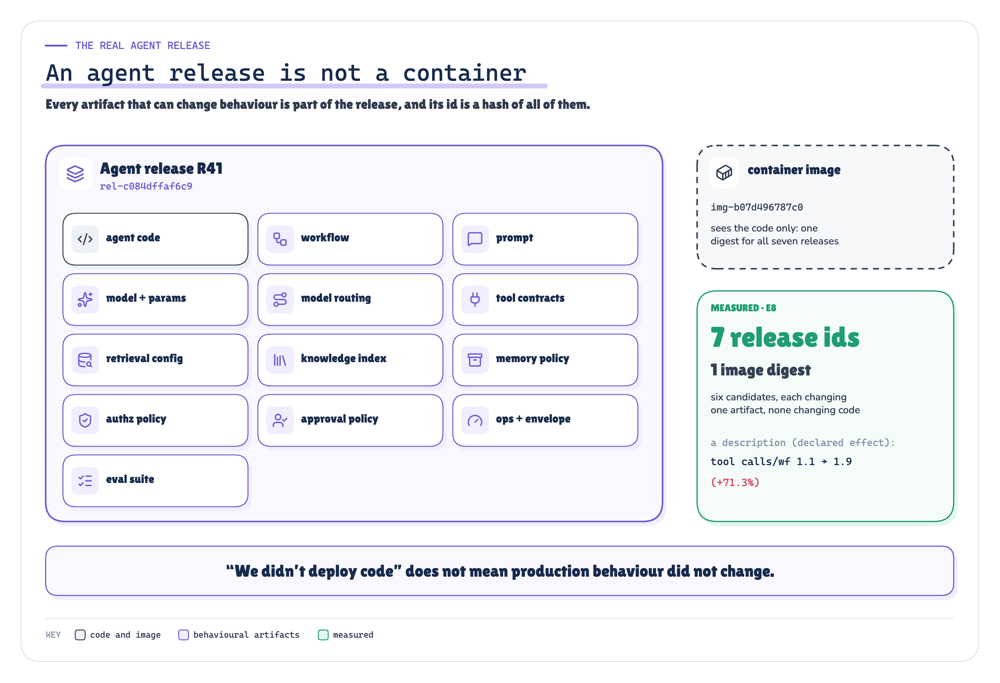

`ARCHITECTURE` `MEASURED` *Figure 6. An agent release is every artifact that can change behaviour, and its id is a hash of all of them. The container image only sees the code.* · Architecture + measured: the release manifest (agentops/release.py) and E8's seven releases · run 2026-10-08-recorded

**“We didn't deploy code” doesn't mean production behaviour didn't change.** I built R41, Black Friday's release, and six
candidates, each changing exactly one artifact and none changing code. All seven had one image digest and
7 release ids. One candidate, R42-a, changed a tool description to “Call this before every
answer, once per shipment”.

**One caveat.** My scripted agent follows tool descriptions literally, so how much R42-a changes behaviour is a modelling
assumption, not a measurement. The size of the jump also depends on traffic: tool calls per workflow rose
32.7 % on the quiet-week offline cases, 71.3 % on replayed
Cyber Monday traffic and 88.9 % in the canary's first window. What the run
tests is everything downstream of the change: whether the release identity changes, whether the gate notices, and
whether the canary does. Sculley and colleagues had a name for this in 2015: “Changing Anything Changes Everything”
[38].

**If an artifact can change behaviour, its version belongs to the release.** Then telemetry can answer *which
behavioural release handled this request?*, not just *which container?* It's also why “we version prompts, so we have
LLMOps” is true and too small. You're operating an agent system, and its lifecycle is the lifecycle of the whole
manifest.

## Gates Are Binary. Averages Aren't.

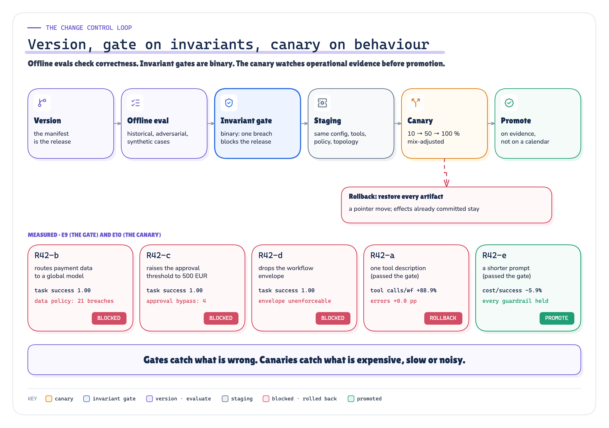

`ARCHITECTURE` `MEASURED` *Figure 7. The change control loop. Three candidates were stopped by invariant gates before any traffic, one was rolled back by the canary, one was promoted.* · Architecture + measured: E9's gate decisions and E10's canary decisions · run 2026-10-08-recorded

The offline gate saw five candidates: two from the six above, R42-a (the tool description) and R42-e (a shorter
prompt), and three new ones. One new candidate
routed refund disputes to a cheaper global model. Its task success was 100 %, it was cheaper,
and it sent payment data to a model not allowed to see it 21 times. Another raised the
approval threshold, so 4 refunds would have skipped a required approval. A third dropped
the envelope. **An average can't outvote an invariant.** All three were blocked, and the registry refused each any
traffic.

R42-a passed. The gate checked that the right tools were called, not how many times, and that's an operational
property the canary owns. In between sits staging (the same configuration, tool contracts and policy, but not
production's traffic) and, where it's safe, shadow runs. Mirroring discards the response, not the side effects: it is
only for requests “capable of being processed twice” [35]. An agent shadow run that calls real tools
acts twice, so shadows use read-only tools, recorded fixtures or a sandbox.

## HTTP 200 Is Not Health

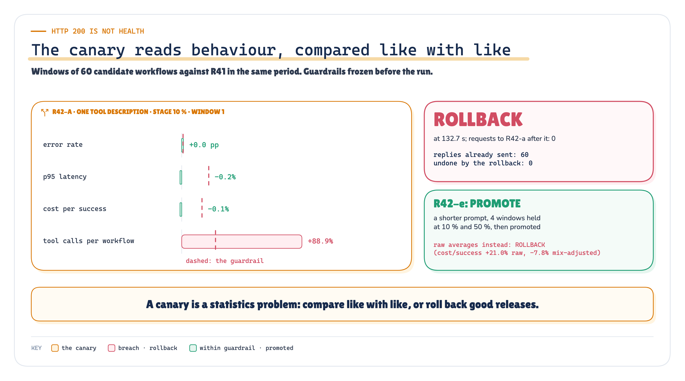

`MEASURED` `RECORDED` *Figure 8. The canary reads behaviour, compared like with like. Error rate and cost didn't move; tool calls did.* · Measured + recorded: R42-a's first analysis window and the rollback record; R42-e under both comparisons (E10) · run 2026-10-08-recorded

On Cyber Monday R42-a got 10 % of traffic. In its first window its error rate differed from production by
0 percentage points, so by status code it was perfectly healthy. Its cost per
success barely moved (-0.1 %), because the extra calls ran on a cheap
model. But tool calls per workflow crossed their guardrail of 25 %, and that is
load on an orders API another team pays for. **Rolled back.** R42-e, the shorter prompt, held every
guardrail for 4 windows and was promoted.

**A canary is a statistics problem.** A refund dispute costs many times what an order-status check does, and a small
window can easily hold more disputes than the baseline. My first controller compared raw averages and rolled back the
clean release. The recorded one compares like with like, per workflow type. I kept the raw controller as a recorded arm,
and it still rolls the good release back.

**Rollback isn't `kubectl rollout undo`.** Behaviour lives in the whole manifest, so a rollback restores a compatible set
of artifacts, by release **id**. And it is a pointer move. It doesn't undo what the release already did. R42-a's canary
sent 60 replies before the decision, and the rollback undid
0. Write-capable canaries need scoped traffic, a sandbox, or reconciliation.
Some changes don't roll back at all: “After the new version writes some compressed data, rolling back isn’t an
option” [33].

## Two Control Loops, One Evidence Plane

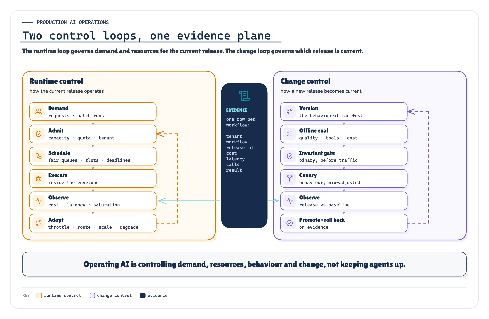

`ARCHITECTURE` *Figure 9. The runtime loop governs demand and resources for the current release. The change loop governs which release is current. Both read the same rows.* · Architecture: our synthesis (the two control loops and the shared evidence plane)

This is what the note has been building to. **Runtime control** governs how the current release operates: admit,
schedule, execute inside an envelope, observe, adapt. **Change control** governs how a new behavioural release becomes
the current one: version, evaluate, gate, canary, promote or roll back. Both read the same telemetry row, which carries
the tenant for fairness, the cost for budgets and the release id for the canary.

Picture two axes: usage to the right, and complexity (models, tools, policies, tenants, releases) upward. At low scale
teams get away with expensive models, big context windows, weak budgets, manual release checks and coarse dashboards.
Usage breaks the runtime-side habits and complexity breaks the change-side ones. A production platform ends up in the
top-right corner and needs both loops. “Just use the cheapest model”, “retry harder”, “one global queue” and “the canary
returned 200” are each contradicted by a result above. “Just autoscale it” is argued from the sources, not tested here.

## We Built the Overload on Purpose

The POC is a deterministic simulator: virtual clock, scripted agents, simulated providers, tools and clients. The
controls themselves are real code on every simulated request. Each of the ten scenarios runs a naive arm against a
controlled arm on the same seed, arrivals and clients. Hypotheses were preregistered and frozen. One run was recorded,
every number was aggregated from its raw rows, and a rerun reproduces it byte for byte (99 of
99 files). A negative control removes admission, and its check fails, as it must.

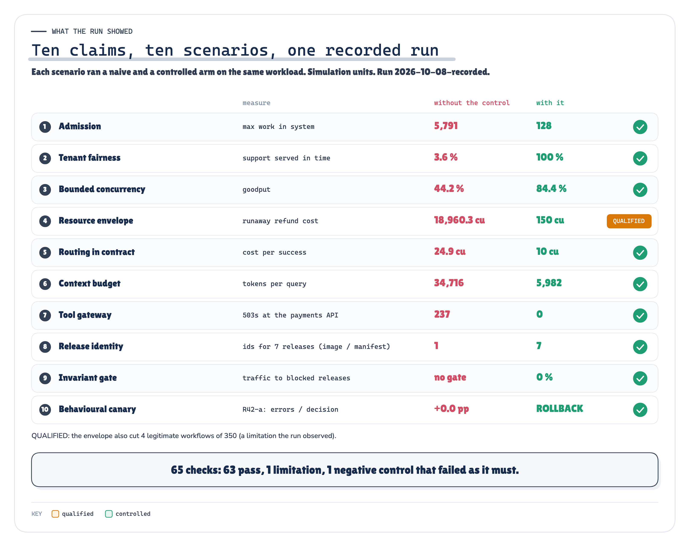

`MEASURED` *Figure 10. Ten claims, one recorded run: the value without the control against the value with it, in simulation units.* · Measured: one line per claim, naive and controlled arms; check counts from the proof pack · run 2026-10-08-recorded

All 10 scenario tests passed, which says each mechanism behaved as specified, not that each claim
won: of the 10 claims tested, 1 was qualified and the others were supported. Of
65 preregistered checks, 63 held,
1 was the negative control failing on purpose, and 1 didn't hold.

**The metric that failed.** I predicted the envelope, calibrated on a development sample, would stop no legitimate work.
It stopped 4 of 350, and 4 of those had
legitimately re-run once after a wrong answer, which doubles consumption. An envelope calibrated on first attempts
doesn't allow for retries, so that claim is qualified, not supported.

**Control has a cost.** Admission refused requests, fairness slowed the batch, deadlines shed work, routing deferred
work, and gates and canaries cost evaluation time. Controls aren't free. Uncontrolled amplification and uncontrolled
change cost far more.

## What This POC Does Not Prove

- It's a simulation in simulated milliseconds and cost units. It says nothing about how much any real platform will save.
- Model quality is a declared table, and the validator catches every wrong answer. Real ones don't.
- The agents are scripted. How much a description or prompt change moves a real model's behaviour isn't measured; the run tests release identity, gates and canaries.
- Approval capacity, shadow traffic, autoscaling and stateful rollback are argued from sources, not tested.
- Each scenario ran once, deterministically. That is coverage of named mechanisms, not a measure of production variance.

## Not a Model Wrapped in an API

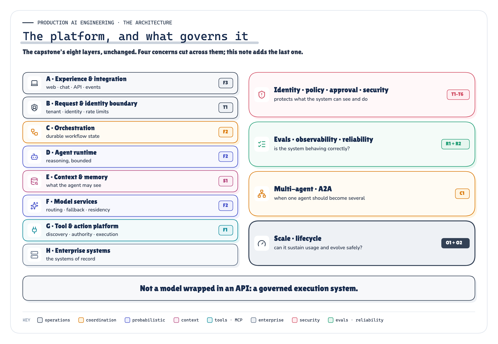

`ARCHITECTURE` *Figure 11. The capstone's eight layers, unchanged, and the four concerns that govern them. Operations is the last of them.* · Architecture: the capstone's runtime path with the series' cross-cutting concerns

The series started with an agent that had five hundred tools and no idea which one should run. Since then it has built
what has to exist around the reasoning: the foundation, state and memory, authority and trust, reliability,
coordination between agents, and now operations. This note didn't add a layer to P1's architecture. It said which existing layer and plane own each
operational control, and tested whether the controls hold.

> **A production agent platform is not a model wrapped in an API. It is a governed execution system that must control what agents know, what they can do, how they fail, how they coordinate, how much work they consume, and how their behaviour changes over time.**

[Run the evidence: the POC and its recorded run](https://github.com/ereshzealous/ai_blogs_poc/blob/main/operating_ai_agents_poc/ops_poc/README.md) · [Read the methodology: the technical edition (PDF)](https://github.com/ereshzealous/ai_blogs_poc/blob/main/operating_ai_agents_poc/technical/operating-ai-agents-technical.pdf)

*That completes the architecture the series set out to build: what the platform is, what governs it, when its agents
should be several, and how it stays inside its operating envelope while demand and behaviour keep changing.*

## Sources

Every source was fetched on 2026-10-08 and is quoted in `research/sources.md` with the passage it supports and what it does *not* support. Model prices were deliberately not collected. Terms marked as our synthesis in the text (the workflow resource envelope, the behavioural release manifest, the two control loops, cost per successful outcome) are not defined by any source.

**[3]** Managing Load — The Site Reliability Workbook (Google, O'Reilly 2018), ch. 11 (Cooper Bethea, Gráinne Sheerin, Jennifer Mace, Ruth King, with Gary Luo and Gary O’Connor). [sre.google/workbook/managing-load/](https://sre.google/workbook/managing-load/)

**[4]** Using load shedding to avoid overload — Amazon Builders' Library (byline shown as "David", Sr. Principal Engineer; Builder Center republication 2026-06-12). [aws.amazon.com/builders-library/using-load-shedding-to-avoid-overload/](https://aws.amazon.com/builders-library/using-load-shedding-to-avoid-overload/)

**[14]** Service Level Objectives — Site Reliability Engineering (Google), ch. 4 (Chris Jones, John Wilkes, Niall Murphy, with Cody Smith). [sre.google/sre-book/service-level-objectives/](https://sre.google/sre-book/service-level-objectives/)

**[18]** Rate limits — OpenAI API documentation. [platform.openai.com/docs/guides/rate-limits](https://platform.openai.com/docs/guides/rate-limits)

**[24]** RouteLLM: Learning to Route LLMs with Preference Data — Isaac Ong, Amjad Almahairi, Vincent Wu, Wei-Lin Chiang, Tianhao Wu, Joseph E. Gonzalez, M Waleed Kadous, Ion Stoica, arXiv:2406.18665v4 (rev. 23 Feb 2025). [arxiv.org/abs/2406.18665](https://arxiv.org/abs/2406.18665)

**[33]** Ensuring rollback safety during deployments — Amazon Builders' Library (Sandeep Pokkunuri; Builder Center republication 2026-06-12). [aws.amazon.com/builders-library/ensuring-rollback-safety-during-deployments/](https://aws.amazon.com/builders-library/ensuring-rollback-safety-during-deployments/)

**[35]** Deployment Strategies — Flagger documentation. [docs.flagger.app/usage/deployment-strategies](https://docs.flagger.app/usage/deployment-strategies)

**[38]** Hidden Technical Debt in Machine Learning Systems — D. Sculley, Gary Holt, Daniel Golovin, Eugene Davydov, Todd Phillips, Dietmar Ebner, Vinay Chaudhary, Michael Young, Jean-François Crespo, Dan Dennison (Google), NeurIPS 2015. [proceedings.neurips.cc/paper_files/paper/2015/file/86df7dcfd896fcaf2674f757a2463eba-Paper.](https://proceedings.neurips.cc/paper_files/paper/2015/file/86df7dcfd896fcaf2674f757a2463eba-Paper.pdf)

**[44]** Building effective agents — Anthropic Engineering (Erik S., Barry Zhang), published 19 Dec 2024. [www.anthropic.com/engineering/building-effective-agents](https://www.anthropic.com/engineering/building-effective-agents)

**[45]** How we built our multi-agent research system — Anthropic Engineering (Jeremy Hadfield, Barry Zhang, Kenneth Lien, Florian Scholz, Jeremy Fox, Daniel Ford), published 13 Jun 2025. [www.anthropic.com/engineering/multi-agent-research-system](https://www.anthropic.com/engineering/multi-agent-research-system)

**[46]** Effective context engineering for AI agents — Anthropic Engineering (Applied AI team: Prithvi Rajasekaran, Ethan Dixon, Carly Ryan, Jeremy Hadfield), published 29 Sep 2025. [www.anthropic.com/engineering/effective-context-engineering-for-ai-agents](https://www.anthropic.com/engineering/effective-context-engineering-for-ai-agents)

---

**Next in Production AI Engineering:** P1 · The Reference Architecture

**Previously:** C1 · Multi-Agent & A2A

**New to the series?** Start with the map of all fifteen chapters:

https://eresh-gorantla.medium.com/start-here-a-hands-on-map-of-production-ai-engineering-5056549657db

**Go deeper:** [Technical deep dive](https://github.com/ereshzealous/ai_blogs_poc/blob/main/operating_ai_agents_poc/technical/operating-ai-agents-technical.pdf) · [Results](https://github.com/ereshzealous/ai_blogs_poc/blob/main/operating_ai_agents_poc/results/o1-o2-results.md) · [Proof of concept on GitHub](https://github.com/ereshzealous/ai_blogs_poc/tree/main/operating_ai_agents_poc)

*Every measured number is substituted from `ops_poc/runs/2026-10-08-recorded/facts.json`.*
