# The Agent Is Not the Architecture

*The final note in the Production AI Engineering series. One production rollback, followed through every boundary a real agent platform needs, thirteen experiments that try to break it, and a negative control that shows the proof can fail.*

**Production AI Engineering · P1 · Capstone**

*Chapter 15 of 15. New here? Start with [Start Here: What It Takes to Run AI Agents in Production](https://eresh-gorantla.medium.com/start-here-a-hands-on-map-of-production-ai-engineering-5056549657db).*

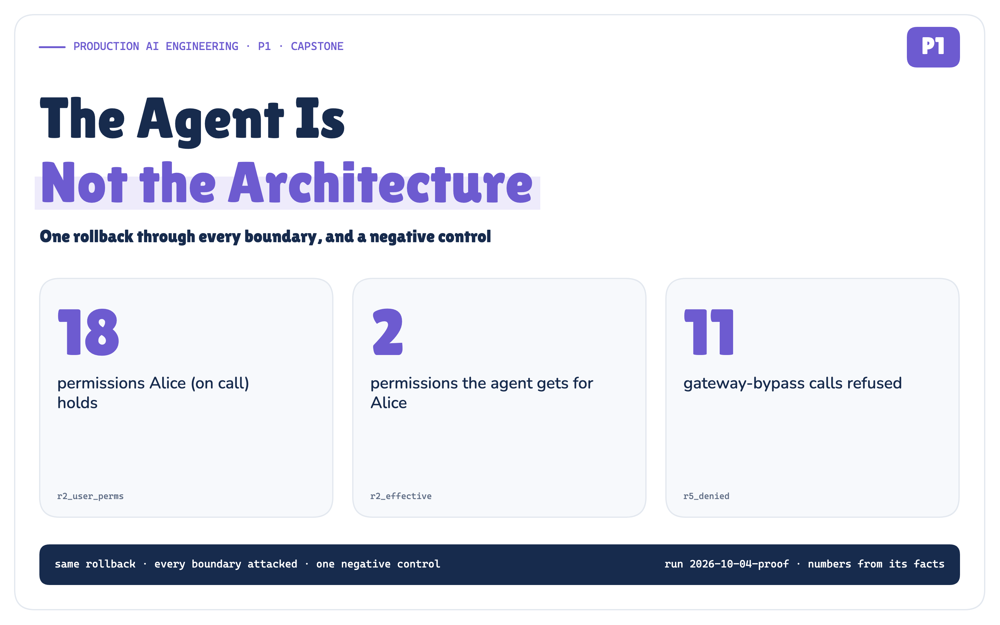

An AI agent is a loop around a model. It reads, reasons and proposes the next step. That loop is what every demo shows, and it is the smallest part of a production system.

This is the last note in a series about everything else. I assembled the pieces from the nine earlier notes into one platform, followed one real-shaped production action through it, and then ran thirteen experiments to break it.

> **An agent never gains authority because a model decided to act.**

## The seductive four-box architecture

Almost every agent starts like this.

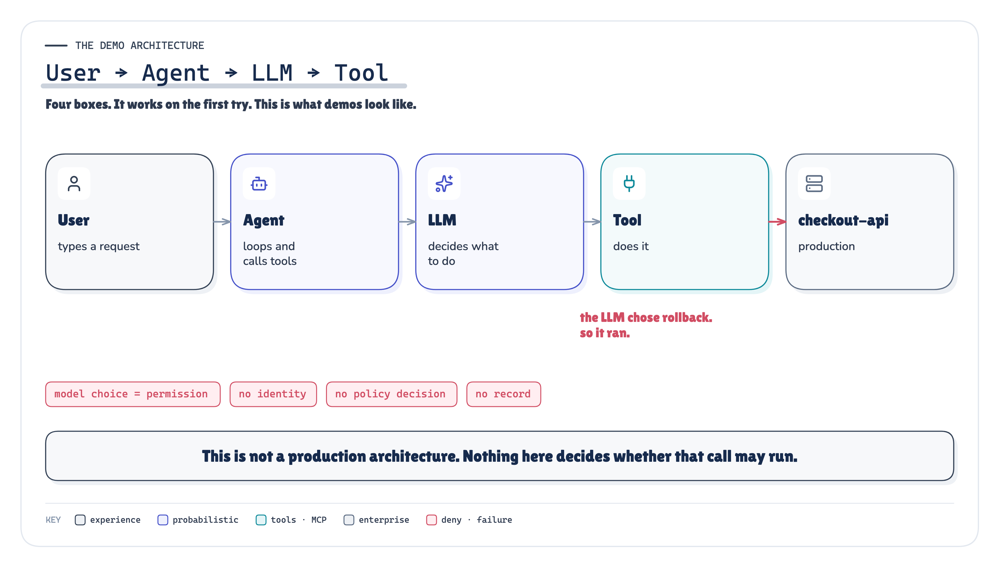

`ARCHITECTURE` *Figure 1. The demo architecture. It works on the first try, and nothing in it decides whether a call may run.* · the demo architecture · no run result claimed

User → Agent → LLM → Tool. The model picks a tool, the agent calls it, the tool changes production.

In a demo, that is fine. In production it hides one dangerous fact: **the model's choice and the permission to act are the same event.** The LLM picks `execute_rollback`, so the rollback runs, with whatever credentials the agent process happens to hold. OWASP calls the resulting risk *excessive agency* [13].

## What production adds

Put those four boxes in front of a real incident, and questions appear that none of them can answer.

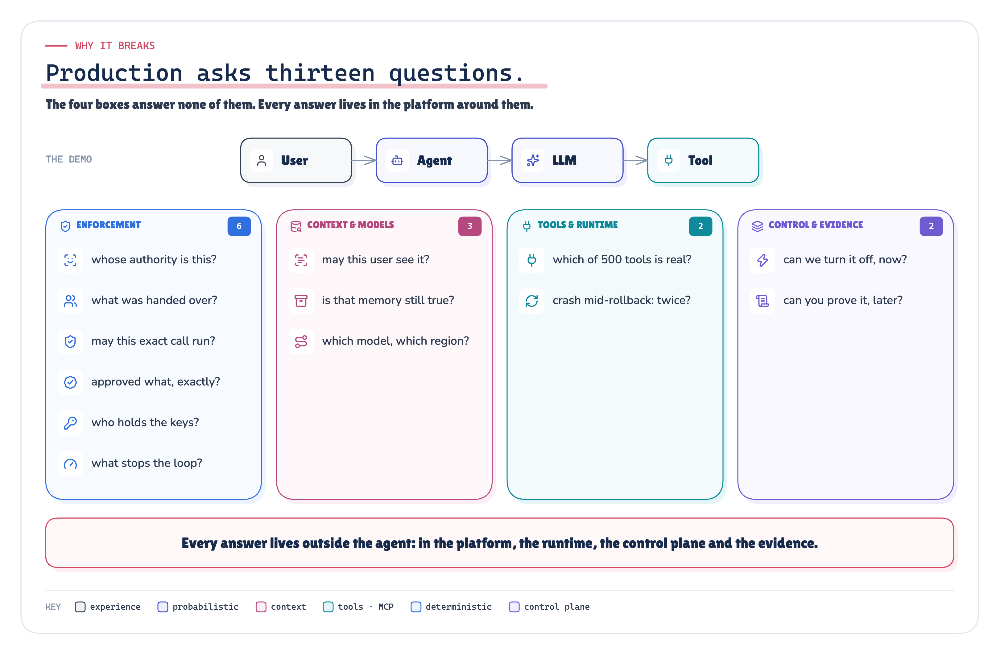

`ARCHITECTURE` *Figure 2. Production asks thirteen questions. Every answer lives outside the agent.* · the thirteen production questions (our synthesis) · no run result claimed

Whose authority is this? May this user see that document? Which of the 500 tools is real? May *this exact* call run? What did the human actually approve? What stops the loop? If the process crashes mid-rollback, does it roll back twice? Can we switch it off, now? And afterwards: can we prove what happened?

Every one of these failures has the same root cause: **a decision that must be deterministic is being made, or skipped, inside a probabilistic loop.** No prompt fixes that. Architecture does.

## The final platform

Here is the whole platform on one page.

![A wide poster of the whole platform. Across the top, a purple dashed AI control plane: agent registry, model registry, tool registry and trust, policy bundles, budgets, kill switches, evaluations, release and rollback. Six access patterns on the left (chat and web, API and SDK, events and alerts, schedules, IDE and CLI, agent to agent) join into one request boundary (authN, tenant, user, agent and workload identity, delegation, trace start, rate limits). Durable orchestration runs an agent runtime marked probabilistic, proposes only: a supervisor agent delegating to triage, diagnosis, remediation and comms agents, each with its own identity, scope and budget. Below it, context and memory and a model gateway with three providers. The agents' proposals go to a blue runtime-enforcement column (identity and delegation, policy decision, risk, budget, capability and secrets, human approval, with human approvers attached), then one call to the tool and action platform (registry and trust, discovery, MCP gateway, MCP servers, idempotent execution, verification), then once to enterprise systems (release pipeline, Git, databases, services, tickets, cloud APIs). A navy evidence plane underneath records one causal trace across every box.](../diagrams/premium/png/platform.png)

`ARCHITECTURE` *Figure 3. The whole platform: every access path, many agents, one governed way to act. The proof exercises one agent and one access path end to end.* · the whole platform, end to end (our synthesis) · no run result claimed; the proof exercises one agent and one access path

And the same platform as layers:

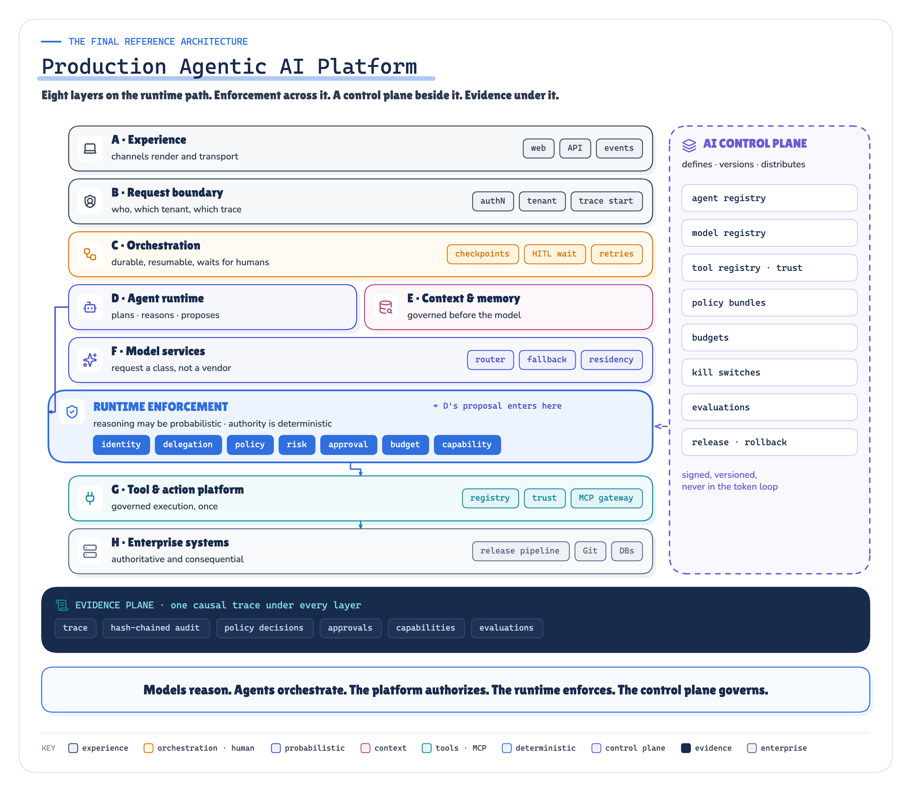

`ARCHITECTURE` *Figure 4. The final reference architecture: eight layers on the runtime path, a deterministic enforcement plane across it, an AI control plane beside it, and an evidence plane under all of it.* · the reference architecture (our synthesis, vendor-neutral) · no run result claimed

![A legend. Eleven colour cards: experience and boundary (slate), orchestration and humans (orange), probabilistic agent reasoning and model services (indigo), context and memory (magenta), tools and MCP (teal), deterministic enforcement (blue), the AI control plane (dashed purple), evidence (navy), enterprise systems (grey), deny, attack or failure (red), and executed or verified (green). Below them, the line styles, the marks for passed, denied and never reached, the chips for a decision, a recorded value and an exposed but never offered tool, the reading-order dots, the type scale and the shared icon library.](../diagrams/premium/png/semantics.png)

 *Figure 5. How to read the figures: colour is meaning, shape is role, and every number comes from the proof run.* · the visual grammar used by every figure; icons are Lucide (ISC)

Badges under each figure: `ARCHITECTURE` our design, no run result claimed · `MEASURED` run · experiment · checks · source · `IMPLEMENTATION` the POC's runtime topology.

Read it as three rules:

- **Down the middle**, a request becomes a *proposal*, and a proposal becomes, at most, one *execution*.
- **Across the blue band**, every consequential decision is made by deterministic code, never by the model.
- **Nothing** draws an arrow from an agent to an enterprise system.

Put more simply:

> **Models reason. Agents orchestrate. The platform authorizes. The runtime enforces. The control plane governs.**

## Follow one production action

A real-shaped incident runs through the whole note.

**INC-4917.** Release v4.17 of `checkout-api` cut the database connection pool from 50 to 10. Checkout latency went from about 200 ms to more than 2 seconds. Alice, the on-call engineer, gets paged. The incident agent investigates and does exactly what a good model should do: it proposes rolling back to v4.16.

Rolling back is reversible, but it is still a production change. So what happens next?

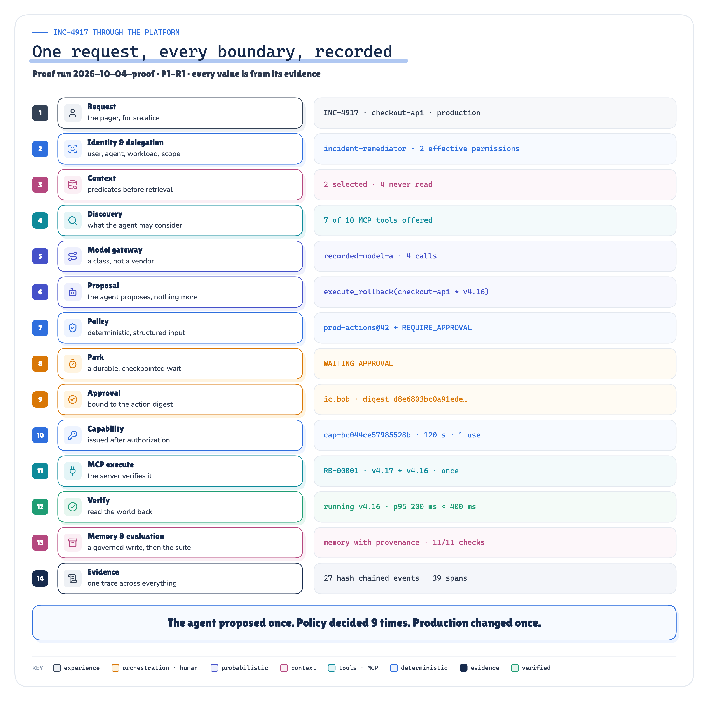

`MEASURED` *Figure 6. One request, every boundary, recorded. Every value is from the proof run.* · run 2026-10-04-proof · P1-R1 · checks P1-R1-C01…C18 · results.json

Fourteen steps. The rest of this note zooms into the six that matter most.

## 1 · The model proposes

The agent reads the incident, the metrics, the logs and the deployment history. It calls a model 4 times through a model gateway, and it produces this, and only this: a structured proposal.

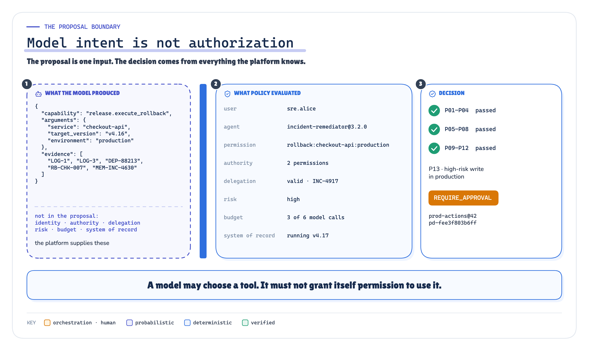

`MEASURED` *Figure 7. Model intent is not authorization. The proposal is one input; the decision comes from everything else.* · run 2026-10-04-proof · P1-R1 · checks P1-R1-C01…C18 · results.json

The agent's reasoning component holds no execution credentials and no execution capability. (The agent *workload* still has its own identity; that is how policy knows who is asking.) Its code imports no tool client. Its proposal names a capability and arguments, and cites its evidence. Everything it says, including its reasons, is **untrusted input** to the next step.

> **A model may choose a tool. It must not grant itself permission to use it.**

## 2 · Policy decides

A deterministic policy engine evaluates thirteen ordered rules. Is the tool registered, trusted, active and enabled? May this agent use it? Is the operation allowed in production? Is the delegation valid? Is the permission inside the agent's *effective authority*? Is there budget left? Is `v4.16` really an earlier release, according to the pipeline itself rather than the model?

The effective-authority rule is the one people get wrong. Alice can roll back 6 service–environment pairs. The agent acting for her gets the **intersection**, never the union: what Alice may do, what the agent may ever do, what she delegated for this incident, what the workload is attested for, and what production allows. The tool's own permission and runtime limits such as budgets narrow it further.

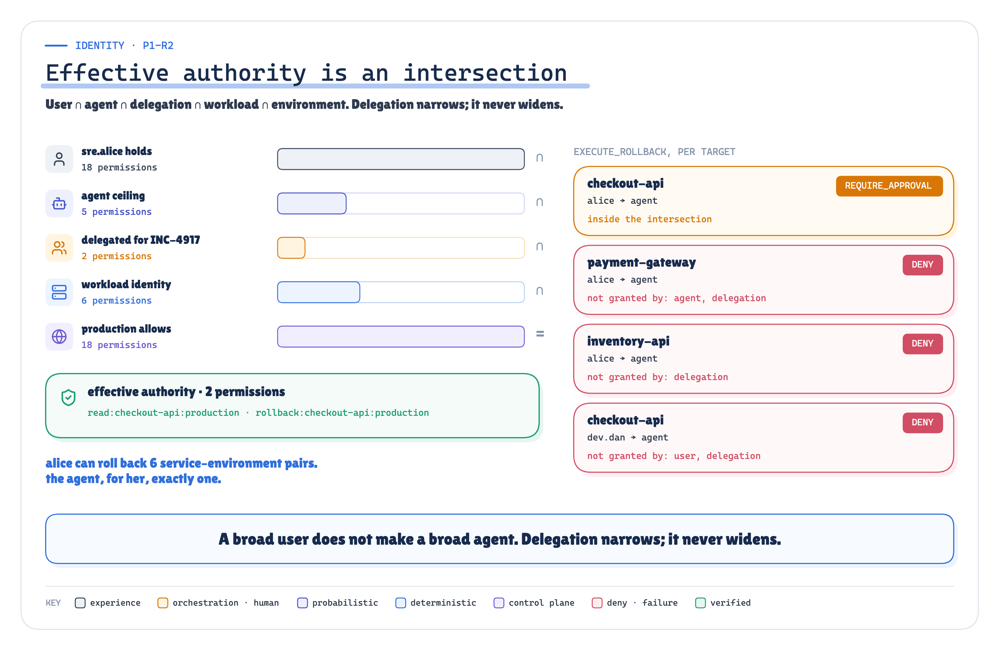

`MEASURED` *Figure 8. Effective authority is an intersection. A broad user does not make a broad agent.* · run 2026-10-04-proof · P1-R2 · checks P1-R2-C01…C09 · results.json

Alice holds 18 permissions. The agent, for her, gets 2. For the rollback, policy returned `REQUIRE_APPROVAL`: a high-risk write in production needs a human.

## 3 · The human approves an exact action

What does the approver approve? Not a chat thread. Not a session. Not "the agent's plan".

They approve **one invocation**, identified by the SHA-256 of its canonical JSON: the tool, the version, every argument, the environment, the tenant, the incident, the workflow, the agent and the user.

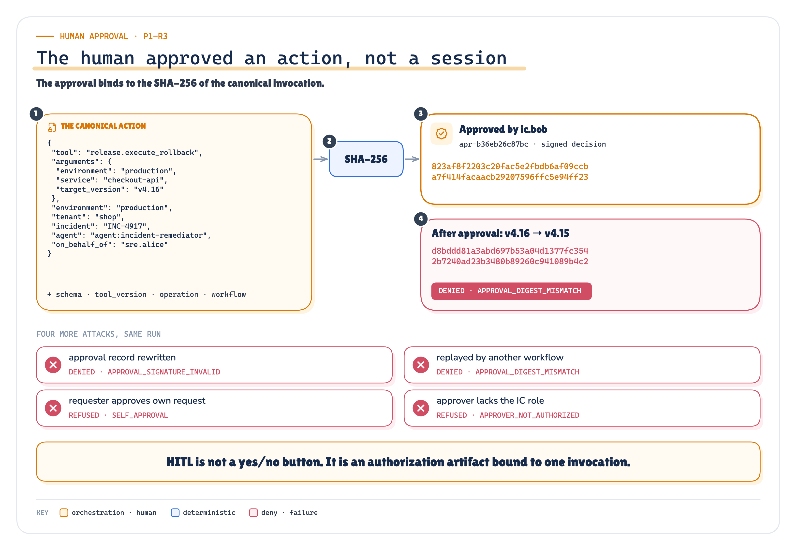

`MEASURED` *Figure 9. The human approved an action, not a session. Change one field after approval and the digest changes, so the approval no longer covers it.* · run 2026-10-04-proof · P1-R3 · checks P1-R3-C01…C09 · results.json

In the proof, changing `v4.16` to `v4.15` after approval was denied (`APPROVAL_DIGEST_MISMATCH`). So were a rewritten approval record, the same approval replayed by another workflow, self-approval, and an approver without the incident-commander role. No capability was issued during any of them.

> **HITL is not a yes/no button. It is an authorization artifact bound to one invocation.**

## 4 · A capability executes, once

Only after policy and approval does anything receive execution authority, and what it receives is narrow:

- **one** server (the release pipeline),
- **one** operation, with **these** arguments and **this** digest,
- **120** seconds,
- **one** use.


`MEASURED` *Figure 10. Capabilities, not credentials. The release server verifies the token itself; presented directly with the gateway bypassed, 11 of 12 variants were refused.* · run 2026-10-04-proof · P1-R1 · checks P1-R1-C01…C18 · P1-R5 · checks P1-R5-C01…C14 · results.json

The capability travels inside the MCP request's `_meta` field [3], under the platform's own key. The model and the agent's reasoning loop never receive it; the gateway attaches it at execution time. The release server checks it on its own, so an attacker who skips the gateway gains nothing.

MCP is the connector here, not the governor. It standardises how tools are discovered and called [2]. Which agent may call which tool, and whether this call may run now, is the platform's job.

**Once, even across a crash**

Production processes die. The interesting moments are the two where dying is dangerous.


`MEASURED` *Figure 11. Crash anywhere, change production once. Real SIGKILLs of separate processes, at the two most dangerous moments.* · run 2026-10-04-proof · P1-R9 · checks P1-R9-C01…C09 · P1-R10 · checks P1-R10-C01…C05 · results.json; real SIGKILLs

Killed right after the approval was recorded, a new process restored the exact pending invocation from its checkpoint, re-checked the approval digest and executed once. Nobody was asked to approve again. Killed after the pipeline had committed but before the runtime wrote it down, the restart looked the idempotency key up instead of guessing, and production changed once. The control, a fresh key per attempt, rolled back 2 times.

> **Retry is not recovery. Durable state and an idempotency key bound to the action are.**

## 5 · The control plane can kill it centrally

Now suppose you need to stop every rollback, right now, across every agent.

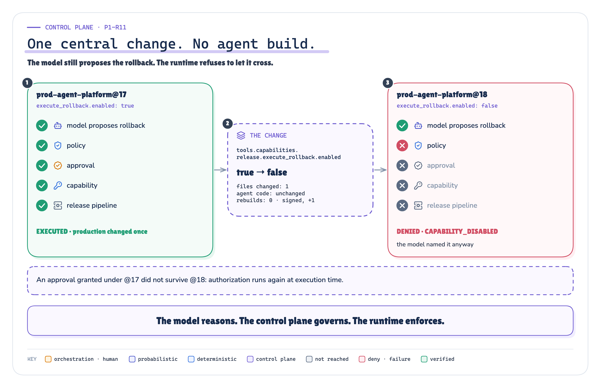

`MEASURED` *Figure 12. One central change, no agent build. The model still proposes the rollback; policy refuses it.* · run 2026-10-04-proof · P1-R11 · checks P1-R11-C01…C07 · results.json

One field in the signed control-plane bundle changed. The bundle went from `prod-agent-platform@17` to `prod-agent-platform@18`. The agent's code did not change: no agent rebuild or redeployment was required.

Two details matter:

- **The model still proposed the rollback.** The switch works because policy enforces it, not because the tool is hidden from the model.
- **An approval granted before the switch did not survive it.** Authorization runs again at execution time.

## 6 · One trace proves what happened

A week later someone asks: who rolled back checkout, why, and on whose authority?

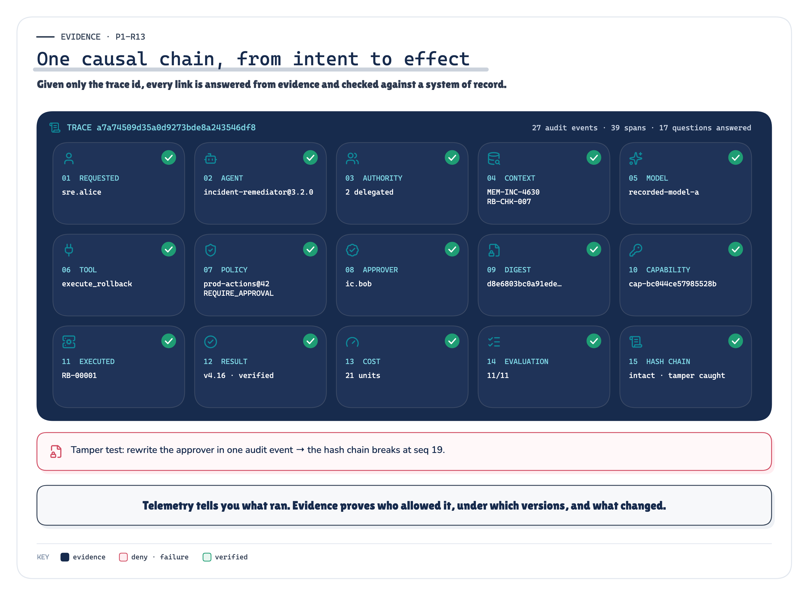

`MEASURED` *Figure 13. One causal chain from intent to effect, reconstructed from one trace id and checked against the systems of record.* · run 2026-10-04-proof · P1-R13 · checks P1-R13-C01…C21 · results.json

Given only the trace id, the evidence answered 17 questions: who asked, what the model saw, which model, what it proposed, which policy version decided, who approved which digest, which scoped capability authorized execution, whether production really changed, and at what cost. Each answer was checked against the release pipeline, the approval store, the budget ledger or the signed bundle.

The audit trail is hash-chained. Rewrite the approver in one event, and verification points at the exact event where the chain breaks.

## What it takes to break it

The same platform then went through thirteen experiments, P1-R1 to P1-R13, each attacking one boundary on purpose, and a negative control, P1-R14.


`MEASURED` *Figure 14. Every experiment of the published run: each guarantee held, and each control broke the way it should.* · run 2026-10-04-proof · P1-R1…P1-R14 · every check · results.json

An *expected failure* is a control doing its job: the same scenario without one safeguard (a direct call that bypasses the gateway, relevance-only retrieval, a fresh retry key, a guard that misses), whose invariant breaks exactly as intended. Nothing failed.

A few more of the results, in plain words:

- **A capability signed for another operation**, same tool and arguments, was refused by the release server itself. The new case found that the server had not compared the operation; it does now.
- **A prompt injection** in a log line told the agent to roll back payments. With the injection guard deliberately switched off, the model obeyed, and policy still said no. Payments were never inside its authority. OWASP notes it is unclear whether any fool-proof prevention for prompt injection exists [12]; the authority boundary does not depend on one.
- **A planner that never stops** was cut off at 6 model calls by the runtime. No prompt mentions a budget.
- **Another tenant's runbook** was the most *relevant* document, and it never reached the model, because the tenant filter runs inside the retrieval query.

## What actually ran

![Five bands. Real: MCP over stdio with the official Python SDK, the release server verifying each capability itself, a deterministic fail-closed policy engine, and SHA-256 invocation digests bound to approvals. Simulated: the enterprise systems in SQLite, and the identity provider and attestation in YAML. Recorded: both model providers replay scripted tapes; no live model was called. Injected: approval tampering, capability variants, a planner that never stops, and provider outages. Described but not built: other experience channels and multi-agent supervision.](../diagrams/premium/png/what-ran.png)

`IMPLEMENTATION` *Figure 15. What actually ran: real where the boundaries are tested, simulated where the enterprise would be, and injected on purpose.* · the execution profile of run 2026-10-04-proof (results.json → profile) · no run result claimed


`MEASURED` *Figure 16. The published proof in one picture. Every number on it is read from the published run.* · run 2026-10-04-proof · results.json · replay.json · negative-control/results.json

> **Evidence refresh · 2026-10-04.** The proof was standardized under the series' Proof Contract v1 and run again on 2026-10-04: the published run changed from `2026-09-30-proof-2` to `2026-10-04-proof`. The 8 cases the standardization added (two authority layers, three tool-governance cases, two capability variants, one human decision) found one gap, now fixed: the release server did not compare a capability's operation. Checks are now counted by the contract: 140 checks, 131 pass, 9 expected failure (controls), 0 fail. The 125 harness assertions both runs share are identical. [The proof-refresh delta](https://github.com/ereshzealous/ai_blogs_poc/blob/main/production_agentic_ai_platform/docs/proof-standardization/proof-refresh-delta.md)

A second run of the same code reproduced all 133 harness assertions and every content-derived identifier. Then a negative control removed one control, the approval requirement, from policy. 28 of those 133 assertions failed, in the 7 experiments that depend on it, each as an explicit expected-versus-actual result: policy said `ALLOW` instead of `REQUIRE_APPROVAL`, the workflow completed instead of waiting for a human, the tampered `v4.15` rollback executed. No experiment crashed, and the other 6 still passed. The proof can fail, and it fails where the missing control matters, which is what makes it a proof.

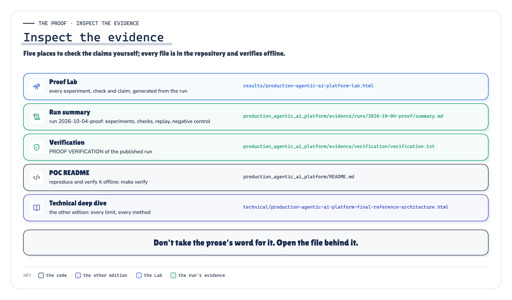

`IMPLEMENTATION` *Figure 17. Inspect the evidence: five places to check the claims yourself. The links are right below.* · where the evidence of run 2026-10-04-proof lives in the repository · no run result claimed

**Inspect the evidence:** [Proof Lab](https://github.com/ereshzealous/ai_blogs_poc/blob/main/production_agentic_ai_platform/results/p1-results.md) (Every experiment, check and claim) · [Run summary](https://github.com/ereshzealous/ai_blogs_poc/blob/main/production_agentic_ai_platform/production_agentic_ai_platform/evidence/runs/2026-10-04-proof/summary.md) (Run 2026-10-04-proof) · [Verification](https://github.com/ereshzealous/ai_blogs_poc/blob/main/production_agentic_ai_platform/production_agentic_ai_platform/evidence/verification/verification.txt) (PROOF VERIFICATION of the run) · [POC README](https://github.com/ereshzealous/ai_blogs_poc/blob/main/production_agentic_ai_platform/README.md) (Reproduce and verify it offline) · [Technical deep dive](https://github.com/ereshzealous/ai_blogs_poc/blob/main/production_agentic_ai_platform/technical/production-agentic-ai-platform-final-reference-architecture.pdf) (The other edition)

> **What this proves, and what it does not**
>
> **Proves:** architectural properties, in one deterministic vertical slice. These boundaries hold under thirteen deliberate attacks, fail closed, leave evidence that reconstructs the action, and the proof fails when one is removed.
> 
> **Does not prove:** hyperscale throughput, superior model quality, global cloud resilience, enterprise IAM completeness, production credential infrastructure, a production SIEM or SOC, or multi-region availability. One service, one incident, recorded model responses and simulated enterprise systems.
>
> [Every limit, in the technical edition](https://github.com/ereshzealous/ai_blogs_poc/blob/main/production_agentic_ai_platform/technical/production-agentic-ai-platform-final-reference-architecture.pdf)

## What the series taught us

Each earlier note drew one boundary. Together they are this platform.


`ARCHITECTURE` *Figure 18. Nine notes, one system. Each note drew one boundary; this is where each one sits in the final platform. Reading order is not system order.* · where each earlier note sits in the final platform (our synthesis) · no run result claimed

- **MCP tool sprawl:** dynamic discovery is useful; execution authority still has to be deterministic.
- **The layered agent platform:** orchestration, models, context, actions and durability need explicit owners.
- **Headless AI:** channels consume a versioned AI capability instead of embedding reasoning.
- **Memory and context:** memory is scoped state, and context is filtered before inference.
- **Agent identity:** effective authority is an intersection.
- **Authorization and policy:** model intent is not permission.
- **Human in the loop:** approval binds to an exact action.
- **The AI control plane:** one place defines which agents, models, tools and policies may exist and run.
- **Observability and governance:** production AI needs one causal evidence chain, and policy, versions and evaluations that outlive a run.

This capstone adds what the notes left implicit, and its proof tests each one: model routing is a platform concern (P1-R7), a guardrail is not authority (P1-R12), a budget is a runtime control (P1-R6), and agents receive scoped capabilities, not permanent secrets (P1-R5; F3 and T4 already kept credentials out of the agent). The pattern repeats in every note: find the decision that must not be probabilistic, move it to a component that makes it deterministically, and record that it did.

Ten rules the series leaves behind:

1. **Models reason; infrastructure grants authority.**
2. **Agents propose; policy authorizes.**
3. **Humans approve exact actions, not sessions.**
4. **Agents receive scoped capabilities, not permanent secrets.**
5. **Context is governed before it reaches the model.**
6. **Tools may be discovered probabilistically; execution is governed deterministically.**
7. **Budgets are runtime controls.**
8. **Crashes and retries never duplicate a consequential action.**
9. **The control plane changes what is allowed without changing agent code.**
10. **Every production action leaves a reconstructable causal evidence chain.**

## Where this series ends

We began with a working agent and kept moving the production responsibilities out of the reasoning loop.

Tool discovery became a capability platform. Persistence became durable orchestration. Channels became a headless boundary. Permissions became effective authority. Human review became exact authorization. Secrets became scoped capabilities. Logs became causal evidence. Configuration became a control plane.

The agent became smaller. The system around it became explicit.

This closes the current Production AI Engineering architecture arc. There is more to go deeper into: scale, domain-specific systems, multi-agent coordination, model evolution, operational maturity. But the foundational production boundaries are now explicit.

## The agent is not the architecture

```
DEMO           User → Agent → Model → Tool

PRODUCTION     Experience → Identity and request boundary → Orchestration ↔ Context and memory
               → Model services → Action proposal → Runtime enforcement → Tool and action platform → Enterprise systems

               AI control plane above it all · evidence, observability and governance under it all
```

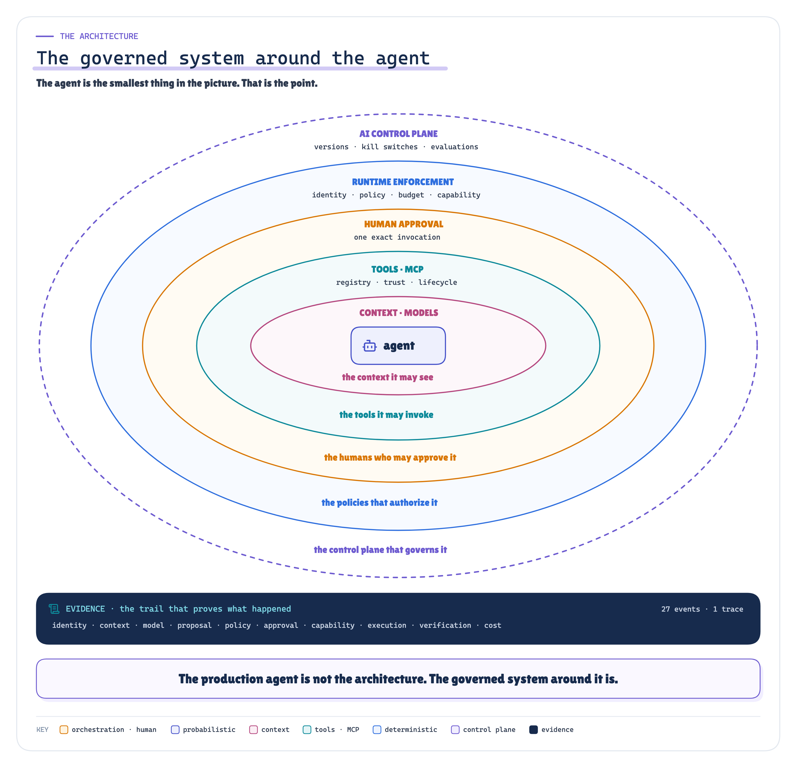

`ARCHITECTURE` `MEASURED` *Figure 19. The governed system around the agent. The agent is the smallest thing in the picture.* · the rings are our synthesis (no run result claimed); the evidence strip is run 2026-10-04-proof · P1-R1 · checks P1-R1-C01…C18 · results.json

The production agent is not the architecture.

The architecture is the governed system around the agent: the identity that constrains it, the context it is permitted to see, the models it may use, the tools it may invoke, the policies that authorize it, the humans who can intervene, the scoped capability issued for the exact action, the runtime that safely executes its actions, the control plane that governs all of it, and the evidence trail that proves what happened.

## Sources

**[2]** Tools — Model Context Protocol specification, revision 2026-07-28. [https://modelcontextprotocol.io/specification/2026-07-28/server/tools](https://modelcontextprotocol.io/specification/2026-07-28/server/tools) · accessed 2026-09-30 · SPEC

**[3]** Overview (Base Protocol), General fields: _meta — Model Context Protocol specification, revision 2026-07-28. [https://modelcontextprotocol.io/specification/2026-07-28/basic](https://modelcontextprotocol.io/specification/2026-07-28/basic) · accessed 2026-09-30 · SPEC

**[12]** LLM01:2025 Prompt Injection — OWASP Gen AI Security Project, Top 10 for LLM Applications 2025. [https://genai.owasp.org/llmrisk/llm01-prompt-injection/](https://genai.owasp.org/llmrisk/llm01-prompt-injection/) · accessed 2026-09-30 · STANDARD (community)

**[13]** LLM06:2025 Excessive Agency — OWASP Gen AI Security Project, Top 10 for LLM Applications 2025 (published 10 Apr 2024, modified 5 May 2025). [https://genai.owasp.org/llmrisk/llm062025-excessive-agency/](https://genai.owasp.org/llmrisk/llm062025-excessive-agency/) · accessed 2026-09-30 · STANDARD (community)

These are the primary references this edition cites. The [technical edition](https://github.com/ereshzealous/ai_blogs_poc/blob/main/production_agentic_ai_platform/technical/production-agentic-ai-platform-final-reference-architecture.pdf) lists all 27 sources (18 external, each with the quotes it supports, and the 9 earlier notes of the series).

---

**This is the final chapter.** It assembles everything before it.

**Previously:** O1+O2 · Operating at Scale

**New to the series?** Start with the map of all fifteen chapters:

https://eresh-gorantla.medium.com/start-here-a-hands-on-map-of-production-ai-engineering-5056549657db

**Go deeper:** [Technical deep dive](https://github.com/ereshzealous/ai_blogs_poc/blob/main/production_agentic_ai_platform/technical/production-agentic-ai-platform-final-reference-architecture.pdf) · [Results](https://github.com/ereshzealous/ai_blogs_poc/blob/main/production_agentic_ai_platform/results/p1-results.md) · [Proof of concept on GitHub](https://github.com/ereshzealous/ai_blogs_poc/tree/main/production_agentic_ai_platform)

*Every measured number is substituted from `docs/facts.json`, derived from `production_agentic_ai_platform/evidence/runs/2026-10-04-proof/results.json`.*
